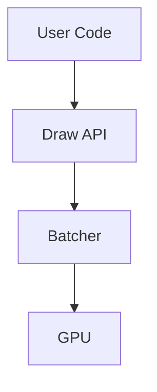

# Reading Guide

How to effectively read and learn from this documentation, based on cognitive science principles from [The Programmer's Brain](https://www.manning.com/books/the-programmers-brain) by Dr. Felienne Hermans.

## Why Code Reading is Hard

When reading unfamiliar code, your brain juggles three memory systems:

| System | Capacity | Role | Overload Symptom |
|--------|----------|------|------------------|
| **Long-Term Memory (LTM)** | Unlimited | Stores patterns, syntax, concepts | "I don't know this language" |
| **Short-Term Memory (STM)** | ~4-6 items | Holds current context | "What was that variable for?" |
| **Working Memory** | Very limited | Processes and connects information | "This is too complex to follow" |

Understanding which system is struggling helps you apply the right fix.

## Techniques for This Documentation

### 1. Chunking — Read in Layers

Each document is structured in layers of increasing detail:

```
README.md          → High-level "what and why" (5 min read)
architecture.md    → Module structure, key abstractions (15 min)
rendering-pipeline.md → Deep dive with code traces (30+ min)
```

**Start with READMEs.** They provide chunks you can use as scaffolding when diving deeper. If you jump straight to code traces without the overview, your STM will overflow.

### 2. Beacons — Look for Signposts

We use consistent patterns throughout:

| Beacon | Meaning |
|--------|---------|
| `> Blockquote at top` | Document status (complete, partial, planned) |
| `## Key Insight` | The main takeaway for a section |
| `file.rs:123` | Clickable source location |
| `⚠️ Warning` | Common pitfall or gotcha |
| Tables | Quick-reference comparisons |
| `├── tree` | Directory structure visualization |

When scanning a document, these beacons help you quickly locate relevant sections.

### 3. State Tables — Externalize Complexity

When a document describes state changes or data flow, we provide tables:

```
| Step | Input | Transform | Output |
|------|-------|-----------|--------|
| 1    | Path  | Tessellate| Vertices |
| 2    | Vertices | Batch | Draw call |
```

**Use paper.** When reading complex sections, sketch your own state tables or dependency graphs. This offloads working memory and reveals patterns you'd miss while scrolling.

### 4. Dependency Graphs — See Relationships

Architecture documents include Mermaid diagrams showing module dependencies:



Before reading code traces, study these graphs. They provide the mental scaffolding for understanding call flows.

### 5. Flashcard-Ready Facts

Key facts are formatted for easy extraction:

> **Mixbox uses a 7-channel latent space** to represent pigments, converting RGB → latent → mixed → RGB.

If you're learning a framework seriously, copy these into flashcards (Anki, etc.) for spaced repetition.

## Reading Strategies by Goal

### "I need to understand this framework quickly"

1. Read the README (5 min)
2. Skim FRAMEWORK_COMPARISON.md for context (5 min)
3. Read architecture.md section headers only (2 min)
4. Deep-read one section relevant to your task

### "I'm designing a similar system"

1. Read all READMEs in the category
2. Read the relevant theme document (e.g., `themes/rendering/`)
3. Compare approaches in FRAMEWORK_COMPARISON.md
4. Deep-dive into the framework closest to your design

### "I'm onboarding to this study repo"

1. Read this guide
2. Read one complete framework (p5.js or cables recommended)
3. Read one theme document
4. You now have the patterns to read anything else

## When You're Confused

| Symptom | Likely Cause | Fix |
|---------|--------------|-----|
| "I don't know what X means" | Knowledge gap (LTM) | Look up the concept, make a flashcard |
| "I lost track of the context" | Information overload (STM) | Re-read the section intro, take notes |
| "This is too complex" | Processing overload | Draw a diagram, break into smaller pieces |
| "I don't see why this matters" | Missing domain context | Read the README first |

## Contributing Better Documentation

When writing or improving docs, apply these principles:

1. **Layer information** — Overview → Details → Deep dive
2. **Create beacons** — Use consistent headers, tables, formatting
3. **Externalize state** — Add diagrams and tables for complex flows
4. **Chunk aggressively** — One concept per section
5. **Name things well** — Section headers should be scannable

See [STYLE_GUIDE.md](../STYLE_GUIDE.md) for specific formatting conventions.

## Sources

- [The Programmer's Brain](https://www.manning.com/books/the-programmers-brain) — Felienne Hermans (Manning, 2021)
- [Key Points Summary](https://understandlegacycode.com/blog/key-points-of-programmer-brain/) — Nicolas Carlo
- [Detailed Summary](https://skarlso.github.io/2021/11/27/summary-of-programmers-brain/) — Gergely Brautigam
