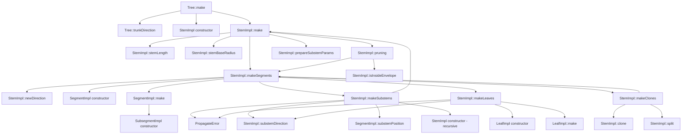
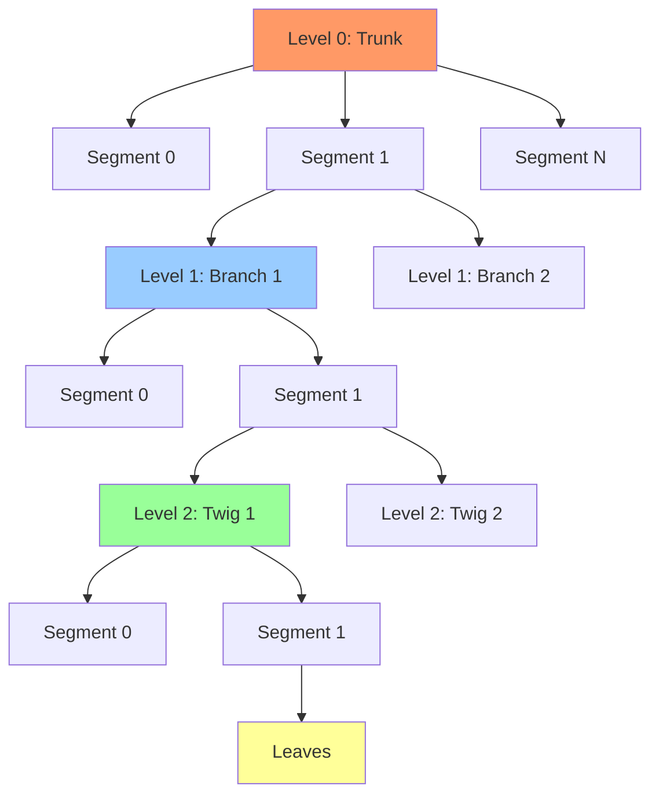

# Arbaro Generation Algorithm

The generation algorithm is recursive descent at its heart: from a single seed point, branches spawn branches spawn branches until the tree stands complete. This document traces how that transformation happens, from abstract tree parameters down to concrete 3D geometry.

At the highest level, tree generation follows a simple hierarchy. A `Tree` creates trunks. Each trunk is a `StemImpl` at level 0. Stems create segments, and segments spawn child stems at the next level. This continues until we reach the maximum level, where leaves replace branches. The entire algorithm executes in a single pass—no backtracking, no iterative refinement. Parameters flow down the hierarchy, and geometry flows back up.

The elegance lies in how local rules produce global structure. Each stem only knows about its parent and its parameters. It doesn't know how it fits into the larger tree. Yet emergent patterns arise: S-curved branches that reach for light, trunk clear zones where branches don't grow, spiral phyllotaxis that spaces leaves evenly. The algorithm embeds botanical principles without explicit simulation.

## The Problem: Procedural Botany

Creating realistic trees procedurally is surprisingly difficult. Trees exhibit complex patterns: branches taper, curve, split, and vary at multiple scales. Their growth responds to environmental factors like gravity and light. Manual modeling is tedious; pure randomness looks chaotic.

The Weber/Penn parametric tree model (1995) solved this by defining tree structure through parameters that control branch distribution, curvature, tapering, and more. Rather than describing every branch, you specify rules like "branches emerge at 45° angles" or "trunks flare at the base." The Arbaro algorithm implements this model, using parameters like `nDownAngle`, `nCurve`, and `nTaper` to generate varied tree species from oak to pine.

The key challenge is managing the cascade of constraints. Trunk radius determines branch radius. Parent length affects child length. Segment curvature depends on level. The generation algorithm must respect these dependencies while maintaining clean, non-tangled geometry.

## Mental Model: Growth as Transformation

Think of tree generation like drawing with a turtle graphics system, but in 3D. You start at the base with a transformation matrix that encodes position and orientation. To grow a segment, you advance the turtle forward, rotating slightly to create curvature. To spawn a branch, you clone the turtle, rotate it by the branch angle, and recurse. Each stem carries its own transformation, modified from its parent.

This explains why the code uses `Transformation` objects everywhere. They're not just position vectors—they're complete coordinate frames. When a branch needs to know "which way is up?", it queries `trf.getZ()`. When it curves, it rotates the transformation. When it spawns a child, it calculates a new transformation relative to the current one. The tree is really a hierarchy of transformations, where geometry is computed as a side effect.

```cpp
// Arbaro.h:108-126
struct Transformation
{
  D3DXMATRIX Rotation;
  D3DXVECTOR3 Position;

  D3DXVECTOR3 apply( D3DXVECTOR3& p );
  D3DXVECTOR3 getZ();
  void rotx( float angle );
  Transformation translate( D3DXVECTOR3& v );
  void rotaxisz( float delta, float rho );
  void rotaxis( float angle, D3DXVECTOR3& axis );
  Transformation rotxz( float delta, float rho );
};
```

## Tree::make() — The Entry Point

Tree generation starts with `Tree::make()`, which creates the initial trunk stems. The tree doesn't have a single trunk—it can have multiple trunks emerging from the base, each at a random angle and position.

```cpp
// Arbaro.cpp:1083-1100
void Tree::make()
{
  trunk_rotangle = 0;

  Transformation transf;
  Transformation trf;

  LevelParams& lpar = params.getLevelParams( 0 );
  for ( int i = 0; i < lpar.nBranches; i++ )
  {
    float angle = var( 360 );
    float dist = var( lpar.nBranchDist );
    trf = trunkDirection( transf, lpar ).translate( D3DXVECTOR3( (float)( dist*sin( angle ) ), (float)( dist*cos( angle ) ), 0 ) );
    StemImpl* trunk = new StemImpl( this, nullptr, 0, trf, 0 );
    trunks.Add( trunk );
    trunk->make();
  }
}
```

For each trunk, the algorithm calls `trunkDirection()` to determine its initial orientation, then translates it randomly within a small radius. The trunk is created as a `StemImpl` at level 0, with no parent (`nullptr`), at the calculated transformation, with offset 0. Then `trunk->make()` triggers recursive generation.

The `trunkDirection()` function handles trunk rotation, supporting both incremental rotation (for spiral patterns) and alternating rotation (for opposite pairs). The rotation angle includes a base value plus random variation.

```cpp
// Arbaro.cpp:1048-1070
Transformation Tree::trunkDirection( Transformation& trf, LevelParams lpar )
{
  float rotangle;
  if ( lpar.nRotate >= 0 )
  {
    trunk_rotangle = fmod( ( trunk_rotangle + lpar.nRotate + var( lpar.nRotateV ) + 360 ), 360 );
    rotangle = trunk_rotangle;
  }
  else
  {
    if ( fabs( trunk_rotangle ) != 1 )
      trunk_rotangle = 1;
    trunk_rotangle = -trunk_rotangle;
    rotangle = trunk_rotangle * ( 180 + lpar.nRotate + var( lpar.nRotateV ) );
  }

  float downangle = lpar.nDownAngle + var( lpar.nDownAngleV );
  return trf.rotxz( downangle, rotangle );
}
```

The `rotangle` accumulates when `nRotate >= 0`, creating a spiral. When negative, it alternates between +1 and -1, creating opposite pairs. The `downangle` tilts the trunk away from vertical, allowing leaning trees.

## StemImpl::make() — Branch Generation

Once a stem is created, `make()` calculates its properties and triggers subdivision into segments. This is where the stem transitions from an abstract concept to concrete geometry.

```cpp
// Arbaro.cpp:464-484
bool StemImpl::make()
{
  stemdata.segmentCount = lpar.nCurveRes;
  stemdata.length = stemLength();
  stemdata.segmentLength = stemdata.length / lpar.nCurveRes;
  stemdata.baseRadius = stemBaseRadius();

#ifdef PHX_ARBARO_HAVE_PRUNING
  if ( stemlevel > 0 && par.PruneRatio > 0 )
    pruning();
#endif

  if ( stemdata.length > MIN_STEM_LEN && stemdata.baseRadius > MIN_STEM_RADIUS )
  {
    prepareSubstemParams();
    makeSegments( 0, stemdata.segmentCount );
    return true;
  }

  return false;
}
```

The segment count comes directly from `nCurveRes`, which controls branch smoothness. Length and radius are computed by helper functions. If pruning is enabled (for creating tree silhouettes), the stem may be shortened. The minimum checks prevent infinitesimal branches that would contribute nothing visually.

If the stem is valid, `prepareSubstemParams()` calculates parameters for child stems, then `makeSegments()` creates the actual geometry. The function returns true if the stem was generated, false if it was too small.

## Stem Length Calculation

Stem length depends on the tree level and follows different rules at each level. Level 0 (trunks) uses absolute parameters. Level 1 scales relative to the parent and the tree shape envelope. Level 2+ scales linearly with parent length and offset.

```cpp
// Arbaro.cpp:486-495
__forceinline float StemImpl::stemLength()
{
  if ( stemlevel == 0 )
    return ( lpar.nLength + var( lpar.nLengthV ) ) * par.scale_tree;

  if ( stemlevel == 1 )
    return parent->stemdata.length * parent->stemdata.lengthChildMax * getShapeRatio( ( parent->stemdata.length - offset ) / ( parent->stemdata.length - par.BaseSize*par.scale_tree ), par.Shape );

  return parent->stemdata.lengthChildMax*( parent->stemdata.length - 0.6f*offset );
}
```

At level 0, length is the parameter value plus random variation, scaled by the tree's overall scale. The `var()` function returns a value between `-variation` and `+variation`.

At level 1, length depends on where the branch emerges on the trunk. Branches near the top are longer, creating the tree's characteristic shape (conical, spherical, etc.). The `getShapeRatio()` function maps the 0-1 ratio through a shape curve, producing values between 0.2 and 1.0.

At level 2+, the formula is simpler: base length times a factor that decreases with offset along the parent. Branches near the base are longer than those at the tip.

The `lengthChildMax` parameter is calculated in `prepareSubstemParams()` and represents the maximum possible child length, which then gets modulated by position and shape.

## Stem Radius Calculation

Radius calculation is more complex than length, supporting multiple tapering modes and special cases like trunk flare. The base radius is calculated first, then radius at any height is computed on demand.

```cpp
// Arbaro.cpp:497-505
float StemImpl::stemBaseRadius()
{
  if ( stemlevel == 0 )
    return stemdata.length * par.Ratio;

  float max_radius = parent->stemRadius( offset );
  float radius = parent->stemdata.baseRadius * pow( stemdata.length / parent->stemdata.length, par.RatioPower );
  return min( radius, max_radius );
}
```

Trunk base radius is simply length times the ratio parameter. For branches, radius scales with the length ratio raised to `RatioPower`, but clamped to the parent's radius at the connection point. This prevents branches from being thicker than their parents, which would look unnatural.

The `stemRadius()` function computes radius at any distance from the base, implementing three tapering modes based on the `nTaper` parameter.

```cpp
// Arbaro.cpp:507-550
float StemImpl::stemRadius( float h )
{
  float Z = min( h / stemdata.length, 1.0f );

  float unit_taper = 0;

  if ( lpar.nTaper <= 1 )
  {
    unit_taper = lpar.nTaper;
  }
  else if ( lpar.nTaper <= 2 )
  {
    unit_taper = 2 - lpar.nTaper;
  }

  float radius = stemdata.baseRadius * ( 1 - unit_taper * Z );

  if ( lpar.nTaper > 1 )
  {
    float depth;
    float Z2 = ( 1 - Z )*stemdata.length;

    if ( lpar.nTaper < 2 || Z2 < radius )
      depth = 1;
    else
      depth = lpar.nTaper - 2;

    float Z3;

    if ( lpar.nTaper < 2 )
      Z3 = Z2;
    else
      Z3 = fabs( Z2 - 2 * radius*(int)( Z2 / 2 / radius + 0.5f ) );

    if ( lpar.nTaper > 2 || Z3 < radius )
      radius = ( 1 - depth )*radius + depth*sqrt( radius*radius - ( Z3 - radius )*( Z3 - radius ) );
  }

  //flare
  if ( stemlevel == 0 )
    radius *= par._0Scale*( 1 + par.Flare * ( pow( 100, max( 0, 1 - 8 * Z ) ) - 1 ) / 100.0f );

  return radius;
}
```

For `nTaper <= 1`, taper is linear. Radius decreases proportionally with distance from base. This creates smooth cones.

For `1 < nTaper <= 2`, the taper transitions from linear to spherical. The `unit_taper` calculation inverts the parameter so 1.0 produces no taper and 2.0 produces full spherical taper.

For `nTaper > 2`, the algorithm creates periodic bumps, like bamboo segments. The radius follows a circular arc pattern, with `depth` controlling bump prominence. The formula calculates distance from the nearest bump center and uses the circular arc equation to determine radius.

At level 0, trunk flare is applied near the base. The exponential term creates a rapid increase in radius as Z approaches 0, simulating buttress roots. The flare effect dominates in roughly the first 10% of trunk height.

## Segment Creation and Curvature

With stem properties calculated, `makeSegments()` creates the individual segments that make up the stem. Each segment represents a straight section; curvature emerges from rotating the transformation between segments.

```cpp
// Arbaro.cpp:636-675
int StemImpl::makeSegments( int start_seg, int end_seg )
{
  Transformation trf = transf;

  for ( int s = start_seg; s < end_seg; s++ )
  {
    if ( s != 0 )
      trf = newDirection( trf, s );

    SegmentImpl* segment = new SegmentImpl( this, s, trf, stemRadius( s*stemdata.segmentLength ), stemRadius( ( s + 1 )*stemdata.segmentLength ) );
    segment->make();
    segments.Add( segment );

    if ( !stemdata.pruneTest )
    {
      if ( lpar.level < par.Levels - 1 )
        makeSubstems( segment );
      else
        makeLeaves( segment );
    }

    trf = trf.translate( trf.getZ()*stemdata.segmentLength );

    if ( stemdata.pruneTest && !isInsideEnvelope( trf.Position ) )
      return s;

    if ( s < end_seg - 1 )
    {
      int segm = makeClones( trf, s );
      if ( segm >= 0 )
        return segm;
    }
  }

  return -1;
}
```

The loop iterates through segments. For segments after the first, `newDirection()` rotates the transformation to create curvature. Then a `SegmentImpl` is created with the current transformation and radius at both ends.

After creating the segment, the algorithm either spawns child stems (via `makeSubstems()`) or leaves (via `makeLeaves()`), depending on whether we're at the maximum tree level. Then the transformation advances by the segment length.

The pruning check (if enabled) tests whether the segment tip is inside the tree envelope, potentially truncating the stem early. The clone check handles stem splitting, where one stem divides into multiple branches.

The function returns -1 normally, or a segment index if pruning or splitting terminates the stem early.

## newDirection() — Implementing Curvature

The `newDirection()` function rotates the transformation to create branch curvature, S-curves, and phototropism (growth toward light).

```cpp
// Arbaro.cpp:677-713
__forceinline Transformation StemImpl::newDirection( Transformation trf, int nsegm )
{
  float delta;
  if ( lpar.nCurveBack == 0 )
  {
    delta = lpar.nCurve;
  }
  else
  {
    if ( nsegm < ( lpar.nCurveRes + 1 ) / 2 )
    {
      delta = lpar.nCurve * 2;
    }
    else
    {
      delta = lpar.nCurveBack * 2;
    }
  }
  delta = delta / lpar.nCurveRes + stemdata.splitCorrection;

  trf.rotx( delta );

  if ( lpar.nCurveV > 0 )
  {
    delta = var( lpar.nCurveV ) / lpar.nCurveRes;
    trf.rotaxisz( delta, 180 + var( 180 ) );
  }

  if ( par.AttractionUp != 0 && stemlevel >= 2 )
  {
    D3DXVECTOR3 z = trf.getZ();
    float declination = acos( z.z );
    float curve_up = par.AttractionUp * fabs( declination * sinf( declination ) ) / lpar.nCurveRes;
    trf.rotaxis( -curve_up * 180 / PI, D3DXVECTOR3( -z.y, z.x, 0 ) );
  }
  return trf;
}
```

The main curvature is `nCurve`, divided by segment count to get the per-segment rotation. If `nCurveBack` is non-zero, the stem creates an S-curve: curving strongly in one direction for the first half, then curving back for the second half. This creates natural-looking branches that initially grow away from the parent, then curve upward.

The `splitCorrection` adjusts curvature after stem splitting, ensuring the split branches don't diverge too wildly.

Random curvature variation (`nCurveV > 0`) adds per-segment wobble. The rotation axis is random (`180 + var(180)` gives a uniform random angle), so each segment twists in a slightly different direction. This prevents unnaturally straight branches.

Phototropism (`AttractionUp != 0`) curves branches upward, simulating growth toward light. The effect is proportional to the angle from vertical and applied at levels 2+. The formula uses `declination * sin(declination)` so the effect is strongest at 45° and zero at 0° and 90°. The rotation axis is perpendicular to both the current direction and the Z-axis, pulling the branch upward.

Helix support (negative `nCurveV`) is handled separately in `SegmentImpl::make()`, creating spiral geometry.

## makeSubstems() — Branch Distribution

Child stem creation uses error diffusion to handle fractional branch counts. If a parameter says "1.5 branches per segment," error diffusion ensures segments alternate between 1 and 2 branches, averaging to 1.5.

```cpp
// Arbaro.cpp:715-762
__forceinline void StemImpl::makeSubstems( SegmentImpl* segment )
{
  LevelParams& lpar_1 = par.getLevelParams( stemlevel + 1 );

  float subst_per_segm;
  float offs = 0;

  if ( stemlevel > 0 )
  {
    subst_per_segm = stemdata.substemsPerSegment;

    if ( segment->index == 0 )
      offs = parent->stemRadius( offset ) / stemdata.segmentLength;
  }
  else if ( segment->index*stemdata.segmentLength > par.BaseSize*stemdata.length )
  {
    subst_per_segm = stemdata.substemsPerSegment;
  }
  else if ( ( segment->index + 1 )*stemdata.segmentLength <= par.BaseSize*stemdata.length )
  {
    return;
  }
  else
  {
    offs = ( par.BaseSize*stemdata.length - segment->index*stemdata.segmentLength ) / stemdata.segmentLength;
    subst_per_segm = stemdata.substemsPerSegment*( 1 - offs );
  }

  int substems_eff = PropagateError( lpar.substemErrorValue, subst_per_segm );
  if ( substems_eff <= 0 ) return;

  float dist = ( 1.0f - offs ) / substems_eff*lpar_1.nBranchDist;

  for ( int s = 0; s < substems_eff; s++ )
  {
    float where = offs + dist / 2 + s*dist + var( dist*0.25f );
    float offset = ( segment->index + where ) * stemdata.segmentLength;

    Transformation trf = substemDirection( segment->transf, offset );
    trf = segment->substemPosition( trf, where );

    StemImpl* substem = new StemImpl( tree, this, stemlevel + 1, trf, offset );
    substem->stemdata.index = substems.NumItems();

    if ( substem->make() )
      substems.Add( substem );
  }
}
```

The function first determines `subst_per_segm`, the number of branches this segment should produce. At level 0, there's a trunk clear zone (`BaseSize`) where no branches grow, simulating the bare trunk base on real trees. The `offs` calculation handles partial segments that overlap the clear zone boundary.

For branches, the first segment may have an offset to account for the connection point thickness.

Error diffusion converts the fractional branch count to an integer:

```cpp
// Arbaro.cpp:24-29
int PropagateError( float &err, float Val )
{
  int eff = (int)( Val + err + 0.5 );
  err -= ( eff - Val );
  return eff;
}
```

The error accumulates in `lpar.substemErrorValue`, which is passed by reference. If we generate fewer branches than requested, the error becomes positive, increasing the next segment's count. If we generate more, the error becomes negative, decreasing the next count. Over many segments, the average matches the parameter value exactly.

Branches are distributed along the segment with spacing `dist * nBranchDist`, plus random variation of ±25%. The `where` value is the fractional position within the segment (0-1). The `offset` is the absolute distance from the stem base.

Each branch gets its transformation from `substemDirection()`, which handles rotation and angle, and `substemPosition()`, which handles translation along the segment. Then a new `StemImpl` is created at the next level and recursively generated.

## substemDirection() — Branch Angle and Rotation

Branch direction is controlled by two angles: `nDownAngle` (angle from parent) and `nRotate` (rotation around parent).

```cpp
// Arbaro.cpp:764-793
Transformation StemImpl::substemDirection( Transformation& trf, float offset )
{
  LevelParams& lpar_1 = par.getLevelParams( stemlevel + 1 );

  float rotangle;
  if ( lpar_1.nRotate >= 0 )
  {
    stemdata.substemRotangle = fmod( ( stemdata.substemRotangle + lpar_1.nRotate + var( lpar_1.nRotateV ) + 360 ), 360 );
    rotangle = stemdata.substemRotangle;
  }
  else
  {
    if ( fabs( stemdata.substemRotangle ) != 1 ) stemdata.substemRotangle = 1;
    stemdata.substemRotangle = -stemdata.substemRotangle;
    rotangle = stemdata.substemRotangle * ( 180 + lpar_1.nRotate + var( lpar_1.nRotateV ) );
  }

  float downangle;
  if ( lpar_1.nDownAngleV >= 0 )
  {
    downangle = lpar_1.nDownAngle + var( lpar_1.nDownAngleV );
  }
  else
  {
    float len = ( stemlevel == 0 ) ? stemdata.length*( 1 - par.BaseSize ) : stemdata.length;
    downangle = lpar_1.nDownAngle + lpar_1.nDownAngleV*( 1 - 2 * getShapeRatio( ( stemdata.length - offset ) / len, ( Params::ShapeType )0 ) );
  }

  return trf.rotxz( downangle, rotangle );
}
```

The rotation angle handling mirrors trunk rotation: positive `nRotate` creates spiral phyllotaxis (like pine cones), while negative creates alternating phyllotaxis (like opposite leaves). The `substemRotangle` accumulates across branches, ensuring even distribution around the parent.

For spiral patterns, each branch adds `nRotate` degrees to the rotation, creating a helical pattern when viewed from above. For alternating patterns, branches flip between opposite sides, creating bilateral symmetry.

Down angle can be either constant or variable along the stem. If `nDownAngleV >= 0`, it adds random variation. If negative, it becomes a function of position along the stem, creating variation from base to tip. The `getShapeRatio()` call with `ShapeType(0)` (CONICAL) maps position to a 0-1 linear ramp, which is then scaled from -1 to +1 via `1 - 2 * ratio`.

The result is a transformation rotated by `downangle` around the X-axis and `rotangle` around the Z-axis, relative to the parent's current orientation.

## makeLeaves() — Terminal Decoration

At the final tree level, leaves replace branches. Leaf generation mirrors branch generation, using error diffusion for fractional counts and similar distribution logic.

```cpp
// Arbaro.cpp:795-863
__forceinline void StemImpl::makeLeaves( SegmentImpl* segment )
{
  if ( par.Leaves > 0 )
  {
    int leaves_eff = PropagateError( par.leavesErrorValue, stemdata.leavesPerSegment );

    if ( leaves_eff <= 0 )
      return;

    float offs;
    if ( segment->index == 0 )
      offs = parent->stemRadius( offset ) / stemdata.segmentLength;
    else
      offs = 0;

    float dist = ( 1.0f - offs ) / leaves_eff;

    for ( int s = 0; s < leaves_eff; s++ )
    {
      float where = offs + dist / 2 + s*dist + var( dist / 2 );
      Transformation& trf = substemDirection( segment->transf, ( segment->index + where )*stemdata.segmentLength ).translate( segment->transf.getZ()*(float)( where*stemdata.segmentLength ) );

      LeafImpl* leaf = new LeafImpl( trf );
      leaf->make( par );
      leaves.Add( leaf );
    }
  }
  else // Fan leaves (par.Leaves < 0)
    ...
}
```

The positive leaf count case distributes leaves along segments just like branches, using `substemDirection()` for orientation. Each leaf is a `LeafImpl` with a transformation. The `leaf->make()` call applies leaf bending based on the `LeafBend` parameter.

Fan leaves (negative `Leaves` parameter) are a special case, rendered as a cluster at branch tips rather than distributed along the stem. The fan pattern creates a radial arrangement, useful for palm trees or similar species. The implementation rotates copies of a base leaf around the Y-axis, creating a circular fan.

The number of leaves per branch is calculated in `prepareSubstemParams()` via `leavesPerBranch()`:

```cpp
// Arbaro.cpp:626-634
float StemImpl::leavesPerBranch()
{
  if ( par.Leaves == 0 || stemlevel == 0 )
    return 0;

  return ( abs( par.Leaves )
           * getShapeRatio( offset / parent->stemdata.length, par.LeafDistrib )
           * par.LeafQuality );
}
```

The absolute value of `Leaves` is the base count, modulated by the leaf distribution shape and quality setting. The shape ratio ensures leaves are denser in certain parts of the tree (like the outer canopy for a spherical tree).

## makeClones() — Stem Splitting

Stem splitting creates forked branches, where one stem divides into multiple child stems at the same level. This handles both trunk splits (like multi-trunk trees) and segment splits (like Y-shaped branches).

```cpp
// Arbaro.cpp:885-913
int StemImpl::makeClones( Transformation trf, int nseg )
{
  int seg_splits_eff;

  if ( stemlevel == 0 && nseg == 0 && par._0BaseSplits > 0 )
    seg_splits_eff = par._0BaseSplits;
  else
    seg_splits_eff = PropagateError( lpar.splitErrorValue, lpar.nSegSplits );

  if ( seg_splits_eff < 1 ) return -1;

  float s_angle = 360 / (float)( seg_splits_eff + 1 );

  for ( int i = 0; i < seg_splits_eff; i++ )
  {
    StemImpl* newclone = clone( trf, nseg + 1 );

    newclone->transf = newclone->split( trf, s_angle*( 1 + i ), nseg, seg_splits_eff );

    int segm = newclone->makeSegments( nseg + 1, newclone->stemdata.segmentCount );
    if ( segm >= 0 )
      return segm;

    clones.Add( newclone );
  }

  trf = split( trf, 0, nseg, seg_splits_eff );
  return -1;
}
```

Base splits (`_0BaseSplits`) occur at the trunk base deterministically. Segment splits (`nSegSplits`) occur probabilistically at each segment, using error diffusion for fractional values.

If splitting occurs, the current stem creates clone copies via `clone()`, which duplicates stem data but marks the clone as starting from the next segment. Each clone is rotated by `split()`, which calculates the divergence angle.

```cpp
// Arbaro.cpp:929-963
Transformation StemImpl::split( Transformation trf, float s_angle, int nseg, int nsplits )
{
  int remaining_seg = stemdata.segmentCount - nseg - 1;

  float declination = acos( trf.getZ().z ) * 180 / PI;
  float split_angle = max( 0, ( lpar.nSplitAngle + var( lpar.nSplitAngleV ) - declination ) );

  trf.rotx( split_angle );

  stemdata.splitCorrection -= split_angle / remaining_seg;

  if ( s_angle > 0 )
  {
    float split_diverge;
    if ( par._0BaseSplits > 0 && stemlevel == 0 && nseg == 0 )
    {
      split_diverge = s_angle + var( lpar.nSplitAngleV );
    }
    else
    {
      split_diverge = 20 + 0.75f * ( 30 + fabs( declination - 90 ) ) * (float)pow( ( var( 1 ) + 1 ) / 2.0, 2 );
      if ( var( 1 ) >= 0 ) split_diverge = -split_diverge;
    }

    splitRotation = split_diverge;
    trf.rotaxis( split_diverge, *(D3DXVECTOR3*)( leafUVData + 1 ) );
  }

  if ( !stemdata.pruneTest )
    stemdata.substemsPerSegment /= (float)( nsplits + 1 );

  return trf;
}
```

The split angle is the parameter value minus the current declination, so vertical stems split more than horizontal ones. The `splitCorrection` adjusts the curvature of remaining segments to compensate for the split, preventing sudden kinks.

For base splits, divergence angles are evenly spaced around 360°. For segment splits, divergence is calculated based on the current angle from vertical, creating natural-looking forks. The substem count is divided among the split branches, maintaining the total branch density.

## SegmentImpl::make() — Subsegment Geometry

Each segment subdivides into subsegments for smooth rendering. The number and spacing of subsegments depends on the tapering mode and special cases.

```cpp
// Arbaro.cpp:268-328
void SegmentImpl::make()
{
  int cnt = 10;

  // Helix support (negative nCurveV)
  if ( lpar.nCurveV < 0 )
  {
    float angle = cosf( fabs( lpar.nCurveV ) / 180 * PI );
    float rad = sqrtf( 1.0f / ( angle*angle ) - 1 )*length / PI / 2.0f;

    for ( int i = 1; i < cnt + 1; i++ )
    {
      D3DXVECTOR3 pos( (float)( rad*cos( 2 * PI*i / cnt ) - rad ),
        (float)( rad*sin( 2 * PI*i / cnt ) ),
                       (float)( i*length / cnt ) );
      subsegments.Add( new SubsegmentImpl( transf.apply( pos ), stem->stemRadius( index*length + i*length / cnt ), i*length / cnt, this ) );
    }
    return;
  }

  D3DXVECTOR3 dir = transf.getZ()*(float)length;
  D3DXVECTOR3 upperPos = transf.Position + dir;

  // Spherical end (nTaper > 1 at final segment)
  if ( lpar.nTaper > 1 && lpar.nTaper <= 2 && ( index == stem->stemdata.segmentCount - 1 ) )
  {
    for ( int i = 1; i < cnt; i++ )
    {
      float pos = length - length / powf( 2.0f, (float)i );
      subsegments.Add( new SubsegmentImpl( transf.Position + ( dir*(float)( pos / length ) ), stem->stemRadius( index*length + pos ), pos, this ) );
    }
    subsegments.Add( new SubsegmentImpl( upperPos, _rad2, length, this ) );
    return;
  }

  cnt = 1;

  if ( lpar.nTaper <= 2 )
  {
    // Flare (level 0, segment 0)
    if ( lpar.level == 0 && par.Flare != 0 && index == 0 )
    {
      for ( int i = 9; i >= 0; i-- )
      {
        float pos = length / powf( 2.0f, (float)i );
        subsegments.Add( new SubsegmentImpl( transf.Position + ( dir*(float)( pos / length ) ), stem->stemRadius( index*length + pos ), pos, this ) );
      }
      return;
    }
  }
  else
    cnt = 20; // Periodic taper (nTaper > 2)

  for ( int i = 1; i < cnt + 1; i++ )
  {
    float pos = i*length / cnt;
    subsegments.Add( new SubsegmentImpl( transf.Position + ( dir*(float)( pos / length ) ), stem->stemRadius( index*length + pos ), pos, this ) );
  }
}
```

Helix support (negative `nCurveV`) creates spiral geometry by positioning subsegments on a circular path in XY, advancing in Z. The radius is calculated to match the curvature angle.

Spherical ends (for `1 < nTaper <= 2`) place subsegments logarithmically near the tip, creating dense geometry where the radius curves sharply. This gives smooth, rounded branch ends.

Trunk flare uses a similar logarithmic distribution at the base, with 10 subsegments concentrated near the ground.

Periodic taper (`nTaper > 2`) uses 20 evenly-spaced subsegments to capture the bump pattern.

For simple linear/spherical taper, a single subsegment per segment suffices. The mesh builder interpolates between segment endpoints.

## Error Diffusion: Managing Fractional Counts

Error diffusion is the technique that makes fractional parameters work. When a parameter says "create 2.3 branches per segment," you can't create 0.3 of a branch. Error diffusion solves this by creating 2 or 3 branches per segment, with the choice depending on accumulated error.

```cpp
// Arbaro.cpp:24-29
int PropagateError( float &err, float Val )
{
  int eff = (int)( Val + err + 0.5 );
  err -= ( eff - Val );
  return eff;
}
```

The function takes a target value and a running error accumulator (passed by reference). It rounds `Val + err` to the nearest integer. Then it updates the error: if we rounded down, error increases; if we rounded up, error decreases.

Example: Given `Val = 2.3` and initial `err = 0`:
- Call 1: `eff = round(2.3 + 0) = 2`, `err = 0 - (2 - 2.3) = 0.3`
- Call 2: `eff = round(2.3 + 0.3) = 3`, `err = 0.3 - (3 - 2.3) = -0.4`
- Call 3: `eff = round(2.3 - 0.4) = 2`, `err = -0.4 - (2 - 2.3) = -0.1`
- Call 4: `eff = round(2.3 - 0.1) = 2`, `err = -0.1 - (2 - 2.3) = 0.2`

The sequence produces 2, 3, 2, 2, averaging to 2.25—close to the target 2.3. Over many calls, the average converges exactly to the target value.

This technique is used for:
- Branch counts per segment (`substemErrorValue`)
- Leaf counts per segment (`leavesErrorValue`)
- Stem splitting (`splitErrorValue`)

Each error accumulator is stored in the level parameters, maintaining state across segments. When a stem is cloned or split, the algorithm carefully saves and restores error state to ensure clones don't duplicate errors.

## Pruning: Constraining Tree Shape

The pruning system (ifdef `PHX_ARBARO_HAVE_PRUNING`) constrains the tree to a specified envelope, simulating space constraints or intentional shaping. It works by testing whether branch tips fall outside the envelope and truncating them if so.

```cpp
// Arbaro.cpp:552-590
void StemImpl::pruning()
{
  lpar.spliterrval = lpar.splitErrorValue;
  float splitcorr = stemdata.splitCorrection;
  float origlen = stemdata.length;

  stemdata.pruneTest = true;

  int segm = makeSegments( 0, stemdata.segmentCount );

  while ( segm >= 0 && stemdata.length > 0.001*par.scale_tree )
  {
    lpar.splitErrorValue = lpar.spliterrval;
    stemdata.splitCorrection = splitcorr;

    clones.FreeArray();
    segments.FreeArray();

    stemdata.length = min( max( stemdata.segmentLength*segm, stemdata.length / 2 ), stemdata.length - origlen / 15 );

    stemdata.segmentLength = stemdata.length / lpar.nCurveRes;
    stemdata.baseRadius = stemBaseRadius();

    if ( stemdata.length > MIN_STEM_LEN )
      segm = makeSegments( 0, stemdata.segmentCount );
  }

  stemdata.length = origlen - ( origlen - stemdata.length )*par.PruneRatio;

  lpar.splitErrorValue = lpar.spliterrval;
  stemdata.splitCorrection = splitcorr;

  clones.FreeArray();
  segments.FreeArray();

  stemdata.pruneTest = false;
}
```

The algorithm generates segments with `pruneTest` enabled. If `makeSegments()` returns a segment index (meaning pruning occurred), the stem is regenerated with reduced length. This repeats until the stem fits entirely within the envelope or becomes too short.

The envelope test happens in `makeSegments()`:

```cpp
// Arbaro.cpp:661-664
if ( stemdata.pruneTest && !isInsideEnvelope( trf.Position ) )
  return s;
```

The envelope is defined by the tree shape (via `getShapeRatio()`) scaled by `PruneWidth`. Stems that exceed this boundary are truncated. The `PrunePowerLow` and `PrunePowerHigh` parameters control how sharp the boundary is—higher powers create more abrupt cutoffs.

After pruning finds the maximum length, the actual length is scaled by `PruneRatio`, allowing some overgrowth for a more natural look.

## Generation Call Tree

The generation process flows through a clear hierarchy of function calls:



## Recursion Through Levels

The recursion pattern is the algorithm's defining characteristic. A single call to `Tree::make()` triggers thousands of recursive calls:



Each stem creates segments, segments create child stems, child stems create segments, until reaching the maximum level where leaves appear. The recursion depth equals the tree's `Levels` parameter, typically 3-4.

The key insight is that parameters flow down the hierarchy (each level accesses `par.getLevelParams(stemlevel + 1)`), but generation happens depth-first. When a segment spawns a child stem, that child immediately generates its full subtree before the next sibling is created. This ensures child stems know their final geometry when parent segments need to attach to them.

## Implications for Rust Framework

The Arbaro generation algorithm offers several lessons for Rust-based procedural generation:

**Transformation-based generation**: Representing stems as transformations rather than explicit positions is elegant and efficient. A Rust implementation could use `nalgebra::Isometry3` for transformations, with methods for rotation and translation.

**Error diffusion for fractional counts**: This technique is essential for smooth parameter variation. A Rust implementation should encapsulate error accumulators in level parameter structs, ensuring proper propagation through recursion.

**Depth-first recursive generation**: The generation order matters. Depth-first ensures children are complete before siblings begin, simplifying geometry construction. A Rust implementation could use the same pattern, with `Arc<RefCell<>>` for shared state if needed.

**Conditional compilation for features**: The extensive use of `#ifdef` suggests size-optimization was critical (for 64k demos). A Rust implementation should use feature flags and const generics to achieve similar binary size control without sacrificing type safety.

**Separate generation and rendering**: Generation produces a tree structure (stems, segments, leaves) separate from mesh construction. This separation allows the same tree to be rendered at different levels of detail or exported to different formats. A Rust implementation should maintain this separation, potentially using a visitor pattern for rendering.

**Parameter clumping by level**: Level-specific parameters (`LevelParams`) reduce parameter count by sharing settings across all stems at a level. This is more intuitive than per-stem parameters and reduces memory. A Rust implementation should similarly group parameters, possibly using strong types to prevent mixing level parameters.

**Precomputed stem properties**: Functions like `stemLength()` and `stemBaseRadius()` compute properties once when the stem is created, avoiding recalculation. A Rust implementation should similarly cache derived properties, using the type system to ensure they're computed before use.

**Minimum thresholds**: The `MIN_STEM_LEN` and `MIN_STEM_RADIUS` constants prevent degenerate geometry. A Rust implementation should similarly validate generated values, potentially using `NonZero` types or range-restricted newtypes.

**Transformation helpers**: The `Transformation` struct provides domain-specific methods like `rotaxisz()` and `rotxz()` rather than exposing raw matrix operations. A Rust implementation should similarly wrap geometric operations in meaningful APIs, using extension traits if needed.

**In-place recursion**: The algorithm modifies transformations in place rather than copying. A Rust implementation should leverage move semantics and borrowing to achieve similar efficiency while maintaining memory safety.

The generation algorithm is fundamentally about managing complexity through layering. Each level of the call hierarchy handles one concern—stems handle length and radius, segments handle curvature, subsegments handle fine geometry. A Rust implementation should preserve this separation, using traits and generics to make the hierarchy extensible while maintaining type safety.

## References

- Weber, J., & Penn, J. (1995). "Creation and Rendering of Realistic Trees". SIGGRAPH 1995.
- Arbaro tree generation library (Java implementation of Weber/Penn): https://arbaro.sourceforge.net/
- Phoenix Engine source: `apEx/Phoenix/Arbaro.cpp` (lines 1-1145)
- Phoenix Engine header: `apEx/Phoenix/Arbaro.h` (lines 1-357)
