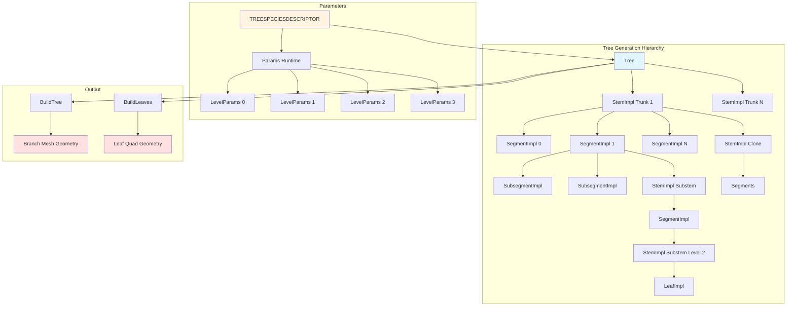

# Phoenix Arbaro Tree Generation System Overview

Building a forest scene for a 64k demo creates an immediate challenge: you can't ship tree models. A single high-quality tree OBJ file might consume 50-100 KB—more than your entire executable budget. Yet demos like Clean Slate feature full forest environments with botanically convincing trees, complete with natural branching, realistic taper, and individually placed leaves. The secret isn't clever compression—it's algorithmic generation from compact parameter sets.

Phoenix's Arbaro system solves this by encoding trees as species descriptors. A TREESPECIESDESCRIPTOR structure (Arbaro.h:90-94) packs all parameters for an entire tree species into roughly 200 bytes. From this, the system recursively generates trunk stems, branch hierarchies, segment subdivisions, and leaf placement, producing thousands of vertices and polygons at runtime. The algorithm derives from Jason Weber's seminal "Creation and Rendering of Realistic Trees" paper, which introduced parametric models capturing botanical growth patterns—apical dominance, phototropism, branch angle distributions—with surprisingly few parameters.

The key insight is that trees exhibit recursive structure. A tree is a trunk with branches. Each branch is itself a smaller tree. This self-similarity means you can define growth rules once—branch count, curvature, taper rate, split angles—and apply them recursively across levels. Level 0 is the trunk. Level 1 is primary branches. Level 2 is secondary branches. Level 3 is twigs with leaves. The same generation code runs at each level, just with different parameters. A 4-level tree might have parameters totaling 150 bytes, yet generate geometry that would take megabytes to store explicitly.

This architecture matters because procedural tree generation appears in many frameworks—SpeedTree, L-systems, algorithmic botany—but most target offline rendering or games with relaxed size constraints. Arbaro is optimized for 64k demos: no external libraries, no dynamic memory allocations beyond fixed arrays, and tight integration with Phoenix's mesh system. The trade-off is generation time—a complex tree can take hundreds of milliseconds to build—but that cost is paid once during demo precalculation, then amortized across thousands of rendered frames.

Think of Arbaro like a grammatical language for trees. The TREESPECIESDESCRIPTOR is the grammar. It defines how trunks split, how branches curve, how thickness tapers. The Tree class is the sentence generator, recursively applying grammar rules to produce a concrete structure. The StemImpl, SegmentImpl, and LeafImpl classes are the words—individual components assembled by the grammar. And the final mesh is the rendered text, readable by the GPU.

## System Architecture

Arbaro organizes tree generation into a hierarchical class structure within the `Arbaro` namespace. At the top sits the Tree class, which holds trunk stems and orchestrates generation. Each trunk is a StemImpl, which recursively creates child substems, segments along its length, clones for splitting, and leaves at terminal branches. Segments subdivide into SubsegmentImpl nodes for smooth curvature. Leaves attach as LeafImpl quads. All classes share access to Params and LevelParams, which decode the compact binary TREESPECIESDESCRIPTOR into runtime-accessible floats and integers.



The generation flow starts when Tree::make() is called (Arbaro.cpp:1083-1100). This creates the initial trunk stems, typically one for a single tree or multiple for a grove. Each trunk calls StemImpl::make() (Arbaro.cpp:464-484), which calculates stem length and radius, then recursively creates segments. Each segment can spawn substems (child branches) and leaves, leading to exponential branching. Finally, BuildTree() and BuildLeaves() traverse the hierarchy, converting the tree structure into CphxMesh geometry suitable for GPU rendering.

## Key Data Structures

### TREESHAPE: Growth Form Envelope

The global tree shape determines how branch density distributes vertically. This isn't per-branch curvature—it's the overall silhouette.

Arbaro.h:17-28 defines nine shape types:

| Shape | Value | Description | Visual Profile |
|-------|-------|-------------|----------------|
| Conical | 0 | Christmas tree, dense at base tapering to apex | ▲ |
| Spherical | 1 | Rounded crown, dense at mid-height | ● |
| Hemispherical | 2 | Dome shape, flat bottom dense top | ◗ |
| Cylindrical | 3 | Uniform density vertically | ▮ |
| Tapered_Cylindrical | 4 | Slight taper from base to top | ▱ |
| Flame | 5 | Narrow at base and top, bulge in middle | ⧫ |
| Inverse_Conical | 6 | Upside-down triangle, dense at top | ▼ |
| Tend_Flame | 7 | Modified flame with gentler taper | ◊ |
| Envelope | 8 | Custom shape via pruning parameters | ⬡ |

The shape affects branch distribution via the `getShapeRatio()` function (Arbaro.cpp:31-69). This takes a normalized height ratio (0.0 at base, 1.0 at top) and returns a density multiplier. For example, Spherical shape uses `0.2 + 0.8 * sin(PI * ratio)`, giving minimum density at base/top and maximum density at mid-height. This ratio multiplies branch counts, leaf placement, and secondary branch length calculations throughout generation.

### TREELEVELPARAMETERS: Per-Level Growth Rules

Each branching level (trunk, primary branches, secondary branches, twigs) has its own parameter set. This captures how growth patterns change as you move from thick trunks to thin twigs.

Arbaro.h:30-52 defines the structure:

```cpp
struct TREELEVELPARAMETERS {
    unsigned char nBranches;      // Branch count: 0..inf
    unsigned char nCurveRes;      // Segment count: 1..inf
    unsigned char nTaper;         // Taper mode: 0..2.99999
    unsigned char nSplitAngle;    // Split angle: 0..180 degrees
    unsigned char nSplitAngleV;   // Split angle variation
    unsigned char nBranchDist;    // Branch distribution: 0..1
    short nRotate;                // Rotation angle: -360..360
    short nRotateV;               // Rotation variation
    short nDownAngle;             // Down angle: -179.999..179.999
    short nDownAngleV;            // Down angle variation
    short nCurve;                 // Curvature: -inf..inf
    short nCurveV;                // Curvature variation: -90..inf
    short nCurveBack;             // Reverse curvature: -inf..inf
    D3DXFLOAT16 nLength;          // Segment length: 0.00001..inf
    D3DXFLOAT16 nLengthV;         // Length variation
    D3DXFLOAT16 nSegSplits;       // Segment splits: 0..inf
};
```

Most parameters store quantized values to minimize size. `nBranches` is a byte (0-255). `nTaper` packs a 0-3 range into 0-255. `nRotate` is a short covering -360 to +360 degrees. Half-precision floats (D3DXFLOAT16) store lengths and split counts. The Params constructor (Arbaro.cpp:76-141) decodes these into full float values with proper scaling: `nTaper = tp.nTaper / 255.0f * 3.0f` expands the byte to a 0-3 range.

The most important parameters are:

- **nBranches**: How many child branches spawn from a parent stem
- **nCurveRes**: How many segments subdivide a stem (more = smoother curvature)
- **nCurve/nCurveBack**: Primary and reverse curvature, creating S-shaped branches
- **nDownAngle**: Angle away from parent stem direction (gravity/phototropism)
- **nRotate**: Spiral phyllotaxis angle around parent stem
- **nTaper**: Controls thickness taper (0-1 = linear, 1-2 = spherical end, 2+ = bumpy)

### TREEPARAMETERS: Global Tree Properties

Global parameters affect the entire tree, not individual levels. These control overall scale, root flare, leaf distribution, and pruning.

Arbaro.h:54-88 defines the structure:

```cpp
struct TREEPARAMETERS {
    unsigned char Levels;         // Branch hierarchy depth: 0..9
    unsigned char Lobes;          // Trunk lobe count: 0..inf
    unsigned char _0BaseSplits;   // Trunk base split count: 0..inf
    unsigned char LeafShape;      // Leaf quad shape enum
    TREESHAPE Shape;              // Overall tree shape
    TREESHAPE LeafDistrib;        // Leaf distribution shape
    unsigned char BaseSize;       // Trunk base height: 0..1
    unsigned char LeafQuality;    // Leaf density: 0.00001..1
    unsigned char LeafBend;       // Leaf gravity bend: 0..1
    unsigned char Smooth;         // Mesh smoothness: 0..1
    unsigned char Flare;          // Root flare amount: -1..inf
    unsigned char Ratio;          // Radius/length ratio: 0.00001..inf
    char AttractionUp;            // Phototropism: -10..10
    short Leaves;                 // Leaf count: -inf..inf
    char RatioPower;              // Branch radius power: -inf..inf
    unsigned char PruneRatio;     // Pruning amount
    unsigned char PruneWidth;     // Pruning envelope width
    unsigned char PruneWidthPeak; // Pruning peak height
    D3DXFLOAT16 PrunePowerLow;    // Lower pruning power
    D3DXFLOAT16 PrunePowerHigh;   // Upper pruning power
    D3DXFLOAT16 LobeDepth;        // Lobe depth: 0..inf
    D3DXFLOAT16 Scale;            // Overall tree scale
    D3DXFLOAT16 _0Scale;          // Trunk radius scale
    D3DXFLOAT16 _0ScaleV;         // Trunk radius variation
    D3DXFLOAT16 LeafScale;        // Leaf size
    D3DXFLOAT16 LeafScaleX;       // Leaf X scale (width)
    D3DXFLOAT16 LeafStemLen;      // Leaf stem length
};
```

Key parameters:

- **Levels**: Determines recursion depth. 0 = trunk only, 1 = trunk + branches, 2 = trunk + branches + twigs, 3 = includes leaf-bearing stems
- **Shape**: Controls branch distribution vertically (Conical, Spherical, etc.)
- **Ratio**: Base radius as fraction of length. Higher = thicker branches
- **RatioPower**: How child branch radius scales. Positive = thinner children, negative = thicker
- **Flare**: Root flare at trunk base. Stored as `(Flare / 25.5) - 1.0` to pack -1 to +10 range
- **AttractionUp**: Phototropism—branches curve upward. Stored as `AttractionUp / 12.7` to encode -10 to +10
- **Lobes**: Radial lobes for non-circular trunks (e.g., oak trees with grooved bark)
- **Leaves**: Leaf count per terminal branch. Positive = evenly distributed, negative = fan arrangement
- **PruneRatio/Width/Peak**: Define envelope pruning (cutting branches outside bounding volume)

The TREESPECIESDESCRIPTOR combines these into a complete tree definition:

```cpp
// Arbaro.h:90-94
struct TREESPECIESDESCRIPTOR {
    TREELEVELPARAMETERS Levels[4];  // Per-level parameters
    TREEPARAMETERS Parameters;       // Global parameters
};
```

This is the ultimate compact representation—approximately 220 bytes total. Four level definitions (16 bytes each = 64 bytes) plus global parameters (~150 bytes) define an entire tree species.

## Runtime Parameter Classes

The binary parameter structures optimize for storage. Runtime classes optimize for access.

### Params: Global Runtime Parameters

The Params class (Arbaro.h:162-212) decodes TREEPARAMETERS into float values. The constructor (Arbaro.cpp:76-141) performs all conversions:

```cpp
Params::Params(TREESPECIESDESCRIPTOR& desc, unsigned char Seed) {
    srand(Seed);  // Seed controls random variations

    // Decode quantized values to floats
    BaseSize = desc.Parameters.BaseSize / 255.0f;
    Shape = (ShapeType)desc.Parameters.Shape;
    Ratio = desc.Parameters.Ratio / 2048.0f;
    RatioPower = desc.Parameters.RatioPower / 32.0f;
    Flare = desc.Parameters.Flare / 25.5f - 1.0f;
    LeafQuality = desc.Parameters.LeafQuality / 255.0f;
    AttractionUp = desc.Parameters.AttractionUp / 12.7f;
    // ... etc

    // Decode per-level parameters
    for (int x = 0; x < 4; x++) {
        LevelParams &p = lparams[x];
        TREELEVELPARAMETERS& tp = desc.Levels[x];
        p.nTaper = tp.nTaper / 255.0f * 3.0f;
        p.nBranchDist = tp.nBranchDist / 255.0f;
        // ... etc
    }
}
```

The key addition is `mesh_points` calculation (Arbaro.cpp:131-140), which determines radial polygon resolution. Trunks get higher resolution for lobes: `max(Lobes * pow(2, 1 + 2.5*Smooth), 4 * (1 + 2*Smooth))`. Branches get simpler geometry: `max(3, mesh_points * (1 + 1.5*Smooth))`. This adapts LOD based on branch level—trunks are visible and need detail, twigs are distant and can be triangular.

### LevelParams: Per-Level Runtime Parameters

LevelParams (Arbaro.h:128-160) stores decoded per-level values. Each Params instance holds an array of four LevelParams (one per tree level). The structure mirrors TREELEVELPARAMETERS but uses floats:

```cpp
struct LevelParams {
    int level;                  // 0-3
    int nBranches;
    float nBranchDist;
    float nRotate, nRotateV;
    float nDownAngle, nDownAngleV;
    int nCurveRes;
    float nSegSplits;
    float nLength, nLengthV;
    float nTaper;
    float nCurve, nCurveV, nCurveBack;
    float nSplitAngle, nSplitAngleV;

    float substemErrorValue;    // Error diffusion accumulator
    float splitErrorValue;      // Error diffusion accumulator
    int mesh_points;            // Radial resolution

    long randstate;             // Saved RNG state
    float spliterrval;          // Saved split error
};
```

The error values (`substemErrorValue`, `splitErrorValue`) implement error diffusion for fractional branch counts. If `nBranches = 2.7` on average, some segments get 3 branches, others get 2, distributing the fractional 0.7 across segments to maintain the correct average. The `PropagateError()` function (Arbaro.cpp:24-29) handles this:

```cpp
int PropagateError(float &err, float Val) {
    int eff = (int)(Val + err + 0.5);  // Round with accumulated error
    err -= (eff - Val);                // Update error for next call
    return eff;
}
```

This ensures statistical correctness without requiring integer-only parameters.

## Generation Hierarchy

### Tree: Top-Level Container

The Tree class (Arbaro.h:336-354) orchestrates generation. It creates trunk stems and exposes two build methods for separate branch and leaf geometry.

Key methods:

```cpp
class Tree {
public:
    Params params;                  // Decoded parameters
    float trunk_rotangle;           // Trunk rotation state
    CphxArray<StemImpl*> trunks;   // Trunk stems

    Tree(TREESPECIESDESCRIPTOR& desc, unsigned char seed);
    void make();                    // Generate tree structure
    int BuildTree(CphxMesh *mesh, unsigned char* levelDensities, BranchData* branchOutput);
    int BuildLeaves(CphxMesh *mesh, unsigned char* levelDensities, BranchData* branchOutput);
};
```

The `make()` method (Arbaro.cpp:1083-1100) creates trunks:

```cpp
void Tree::make() {
    trunk_rotangle = 0;
    Transformation transf;  // Identity at origin

    LevelParams& lpar = params.getLevelParams(0);
    for (int i = 0; i < lpar.nBranches; i++) {
        float angle = var(360);  // Random angle
        float dist = var(lpar.nBranchDist);  // Random offset

        // Position trunk with random offset
        Transformation trf = trunkDirection(transf, lpar)
            .translate(D3DXVECTOR3(dist*sin(angle), dist*cos(angle), 0));

        StemImpl* trunk = new StemImpl(this, nullptr, 0, trf, 0);
        trunks.Add(trunk);
        trunk->make();  // Recursively generate trunk and branches
    }
}
```

Multiple trunks create groves or base-split trees (like multi-trunk oaks). Each trunk gets random positional offset and rotation angle for natural variation.

### StemImpl: Recursive Branch Generation

StemImpl (Arbaro.h:265-334) is the core generation class. It represents a single branch—trunk, limb, or twig—and recursively creates child branches, segments, clones, and leaves.

Key members:

```cpp
class StemImpl {
public:
    Tree *tree;                     // Parent tree
    int stemlevel;                  // Hierarchy level 0-3
    Transformation transf;          // Position and orientation
    float offset;                   // Distance from parent base

    StemImpl *parent;               // Parent stem
    StemImpl *clonedFrom;           // Clone source

    Params par;                     // Global parameters
    LevelParams& lpar;              // Level-specific parameters

    CphxArray<SegmentImpl*> segments;  // Stem segments
    CphxArray<StemImpl*> clones;       // Split clones
    CphxArray<StemImpl*> substems;     // Child branches
    CphxArray<LeafImpl*> leaves;       // Attached leaves

    struct StemData {
        int segmentCount;           // Total segments
        float length;               // Total stem length
        float lengthChildMax;       // Max child length ratio
        float segmentLength;        // Length per segment
        float baseRadius;           // Radius at base
        float substemsPerSegment;   // Child branch rate
        float leavesPerSegment;     // Leaf rate
        float substemRotangle;      // Phyllotaxis angle
        float splitCorrection;      // Curvature correction
    } stemdata;

    bool make();  // Generate this stem
};
```

The `make()` method (Arbaro.cpp:464-484) orchestrates stem creation:

```cpp
bool StemImpl::make() {
    stemdata.segmentCount = lpar.nCurveRes;
    stemdata.length = stemLength();
    stemdata.segmentLength = stemdata.length / lpar.nCurveRes;
    stemdata.baseRadius = stemBaseRadius();

    // Optionally prune branches outside envelope
    if (stemlevel > 0 && par.PruneRatio > 0)
        pruning();

    // Only create if above minimum size
    if (stemdata.length > MIN_STEM_LEN && stemdata.baseRadius > MIN_STEM_RADIUS) {
        prepareSubstemParams();  // Calculate child branch parameters
        makeSegments(0, stemdata.segmentCount);  // Create segments
        return true;
    }
    return false;
}
```

Stem length calculation (Arbaro.cpp:486-495) varies by level:

```cpp
float StemImpl::stemLength() {
    if (stemlevel == 0)  // Trunk
        return (lpar.nLength + var(lpar.nLengthV)) * par.scale_tree;

    if (stemlevel == 1)  // Primary branches
        return parent->stemdata.length
            * parent->stemdata.lengthChildMax
            * getShapeRatio((parent->stemdata.length - offset) /
                           (parent->stemdata.length - par.BaseSize * par.scale_tree),
                           par.Shape);

    // Secondary/tertiary branches
    return parent->stemdata.lengthChildMax * (parent->stemdata.length - 0.6f * offset);
}
```

Level 0 (trunk) uses absolute length. Level 1 (primary branches) scales by parent length and tree shape—branches near the trunk base or apex are shorter due to shape ratio. Level 2+ scales by remaining parent length, creating natural taper.

Radius calculation (Arbaro.cpp:497-505) follows the power law:

```cpp
float StemImpl::stemBaseRadius() {
    if (stemlevel == 0)
        return stemdata.length * par.Ratio;  // Trunk: radius = length * ratio

    float max_radius = parent->stemRadius(offset);  // Can't exceed parent
    float radius = parent->stemdata.baseRadius
        * pow(stemdata.length / parent->stemdata.length, par.RatioPower);
    return min(radius, max_radius);
}
```

RatioPower controls how quickly branches thin. Positive values (1-3) create natural trees with thinner branches. Zero creates uniform thickness. Negative values create thicker child branches (unnatural but useful for stylized trees).

### SegmentImpl: Individual Stem Segments

Each stem subdivides into segments for curvature and child branch attachment. SegmentImpl (Arbaro.h:237-263) represents one subdivision.

```cpp
class SegmentImpl {
public:
    float length;
    float _rad1, _rad2;        // Start and end radius
    StemImpl *stem;
    D3DXVECTOR3 pos;

    Params par;
    LevelParams& lpar;

    int index;                 // Segment index in stem
    Transformation transf;     // Position and orientation
    CphxArray<SubsegmentImpl*> subsegments;  // Smooth curve points

    void make();  // Generate subsegments
    void BuildMesh(int branchIdx, CphxMesh *mesh, int &cntr,
                   float &branchDist, float uvscale, bool isClone);
};
```

The `make()` method (Arbaro.cpp:268-328) creates subsegments for smooth geometry. Three special cases exist:

1. **Helix mode** (if `nCurveV < 0`): Creates spiral stems by sampling a helical path
2. **Spherical end** (if `nTaper > 1 && nTaper <= 2` and this is the last segment): Exponentially spaces subsegments to create rounded branch tips
3. **Flare** (if level 0, index 0, and `Flare != 0`): Exponentially spaces subsegments near trunk base to create root flare

Normal case creates evenly spaced subsegments:

```cpp
for (int i = 1; i < cnt + 1; i++) {
    float pos = i * length / cnt;
    D3DXVECTOR3 position = transf.Position + (transf.getZ() * pos);
    subsegments.Add(new SubsegmentImpl(position,
                                       stem->stemRadius(index * length + pos),
                                       pos,
                                       this));
}
```

Each subsegment stores position, radius, and distance along stem. These define the smooth curve for mesh generation.

### SubsegmentImpl: Curve Interpolation Points

SubsegmentImpl (Arbaro.h:225-235) is a simple data holder for smooth curve points:

```cpp
class SubsegmentImpl {
public:
    D3DXVECTOR3 pos;    // World position
    float rad;          // Radius at this point
    float dist;         // Distance from segment start
    SegmentImpl *segment;  // Parent segment
};
```

These subsegments define the smooth curve. During mesh generation, the system creates circular cross-sections at each subsegment position, then connects them with quad strips to form cylindrical branch geometry.

### LeafImpl: Leaf Quad Generation

LeafImpl (Arbaro.h:214-223) represents a single leaf:

```cpp
class LeafImpl {
public:
    Transformation transf;  // Leaf position and orientation

    LeafImpl(Transformation& trf);
    void make(Params& par);  // Apply gravity bend
    void BuildMesh(int branchIdx, CphxMesh *mesh,
                   float leafScale, float leafScaleX, float leafStemLen);
};
```

The `make()` method (Arbaro.cpp:226-233) applies leaf bend (gravity pulling leaves downward):

```cpp
void LeafImpl::make(Params& par) {
    if (par.LeafBend == 0) return;

    // Rotate leaf toward ground based on position
    transf.rotaxis(par.LeafBend * (atan2(transf.Position.y, transf.Position.x)
                                 - atan2(transf.Rotation.m[1][1], transf.Rotation.m[0][1]))
                   * 180 / PI,
                   D3DXVECTOR3(0, 0, 1));

    // Tilt leaf outward
    transf.rotx(par.LeafBend * atan2(sqrt(transf.Rotation.m[0][1] * transf.Rotation.m[0][1]
                                        + transf.Rotation.m[1][1] * transf.Rotation.m[1][1]),
                                     transf.Rotation.m[2][1])
                * 180 / PI);
}
```

This creates natural leaf droop—leaves orient toward the ground based on gravity simulation, not rigidly perpendicular to branches.

Mesh building (Arbaro.cpp:235-261) creates a simple quad:

```cpp
void LeafImpl::BuildMesh(int branchIdx, CphxMesh *mesh,
                         float leafScale, float leafScaleX, float leafStemLen) {
    D3DXVECTOR3 root = transf.apply(D3DXVECTOR3(0, 0, 0));
    D3DXVECTOR3 dir = transf.apply(D3DXVECTOR3(0, 0, 1)) - root;

    // Create 4 vertices: (-1,0), (1,0), (1,2), (-1,2)
    for (int x = 0; x < 4; x++) {
        D3DXVECTOR3 &vx = transf.apply(
            D3DXVECTOR3(leafVertexData[x][0] * leafScaleX,
                        0,
                        leafVertexData[x][1] + leafStemLen * 2)
            * leafScale * 0.5f);

        mesh->AddVertex(vx.x, vx.z, vx.y);  // XZY swap for Y-up
        CphxVertex &vert = mesh->Vertices[mesh->Vertices.NumItems() - 1];
        vert.Position2 = D3DXVECTOR3(root.x, root.z, root.y);  // Store stem base
    }

    mesh->AddPolygon(vxc + 0, vxc + 1, vxc + 2, vxc + 3, ...);
}
```

The leaf is a 1x2 quad (width x height) scaled by `leafScale` and `leafScaleX`. The `leafStemLen` offsets the quad along Z to create a small stem. Position2 stores the attachment point for potential animation.

## Transformation: Position and Orientation

The Transformation class (Arbaro.h:108-126) encapsulates position and rotation for each tree component:

```cpp
struct Transformation {
    D3DXMATRIX Rotation;    // 3x3 rotation matrix
    D3DXVECTOR3 Position;   // World position

    D3DXVECTOR3 apply(D3DXVECTOR3& p);  // Transform point to world space
    D3DXVECTOR3 getZ();                 // Get forward direction
    void rotx(float angle);             // Rotate around X
    Transformation translate(D3DXVECTOR3& v);  // Create translated copy
    void rotaxisz(float delta, float rho);     // Rotate around axis in XY plane
    void rotaxis(float angle, D3DXVECTOR3& axis);  // Rotate around arbitrary axis
    Transformation rotxz(float delta, float rho);  // Rotate X then Z
};
```

Key method is `rotxz()` (Arbaro.cpp:210-219), which creates branch directions:

```cpp
Transformation Transformation::rotxz(float delta, float rho) {
    float radDelta = delta * PI / 180;
    float radRho = rho * PI / 180;

    D3DXMATRIX rm, rx, rz;
    D3DXMatrixMultiply(&rm,
                       D3DXMatrixRotationZ(&rx, -radRho),
                       D3DXMatrixRotationX(&rz, -radDelta));
    return Transformation(*D3DXMatrixMultiply(&rm, &Rotation, &rm), Position);
}
```

This combines two rotations: `delta` (downAngle, away from vertical) and `rho` (rotation around parent stem, for phyllotaxis). The result creates natural spiral branch patterns.

## Generation Process

### Stem Creation Flow

The makeSegments() method (Arbaro.cpp:636-675) creates segments and recursively spawns children:

```cpp
int StemImpl::makeSegments(int start_seg, int end_seg) {
    Transformation trf = transf;

    for (int s = start_seg; s < end_seg; s++) {
        if (s != 0)
            trf = newDirection(trf, s);  // Apply curvature

        // Create segment
        SegmentImpl* segment = new SegmentImpl(this, s, trf,
                                               stemRadius(s * stemdata.segmentLength),
                                               stemRadius((s+1) * stemdata.segmentLength));
        segment->make();
        segments.Add(segment);

        // Spawn child branches or leaves
        if (lpar.level < par.Levels - 1)
            makeSubstems(segment);  // Create child branches
        else
            makeLeaves(segment);    // Terminal level: create leaves

        // Advance position
        trf = trf.translate(trf.getZ() * stemdata.segmentLength);

        // Check for pruning
        if (stemdata.pruneTest && !isInsideEnvelope(trf.Position))
            return s;  // Stop generation outside envelope

        // Create split clones
        if (s < end_seg - 1) {
            int segm = makeClones(trf, s);
            if (segm >= 0) return segm;  // Pruning stopped clone
        }
    }
    return -1;
}
```

Each segment gets a curvature-adjusted transformation via `newDirection()` (Arbaro.cpp:677-713):

```cpp
Transformation StemImpl::newDirection(Transformation trf, int nsegm) {
    float delta;
    if (lpar.nCurveBack == 0) {
        delta = lpar.nCurve;  // Constant curvature
    } else {
        // S-curve: curve forward in first half, back in second half
        if (nsegm < (lpar.nCurveRes + 1) / 2)
            delta = lpar.nCurve * 2;
        else
            delta = lpar.nCurveBack * 2;
    }
    delta = delta / lpar.nCurveRes + stemdata.splitCorrection;

    trf.rotx(delta);  // Primary curvature

    // Random variation
    if (lpar.nCurveV > 0) {
        delta = var(lpar.nCurveV) / lpar.nCurveRes;
        trf.rotaxisz(delta, 180 + var(180));  // Random axis
    }

    // Phototropism: curve toward vertical
    if (par.AttractionUp != 0 && stemlevel >= 2) {
        D3DXVECTOR3 z = trf.getZ();
        float declination = acos(z.z);  // Angle from vertical
        float curve_up = par.AttractionUp * abs(declination * sin(declination))
                        / lpar.nCurveRes;
        trf.rotaxis(-curve_up * 180 / PI, D3DXVECTOR3(-z.y, z.x, 0));
    }
    return trf;
}
```

This creates natural branch curvature. S-curves (`nCurveBack != 0`) make branches curve away then back, avoiding straight lines. Phototropism curves branches upward regardless of parent direction, simulating light-seeking growth.

### Child Branch Spawning

The makeSubstems() method (Arbaro.cpp:715-762) creates child branches at each segment:

```cpp
void StemImpl::makeSubstems(SegmentImpl* segment) {
    LevelParams& lpar_1 = par.getLevelParams(stemlevel + 1);

    float subst_per_segm = stemdata.substemsPerSegment;
    float offs = 0;

    // Skip base of trunk (below BaseSize)
    if (stemlevel == 0 && segment->index * stemdata.segmentLength < par.BaseSize * stemdata.length) {
        // Partial substem count if segment crosses BaseSize boundary
        offs = (par.BaseSize * stemdata.length - segment->index * stemdata.segmentLength)
             / stemdata.segmentLength;
        subst_per_segm = stemdata.substemsPerSegment * (1 - offs);
    }

    // Error diffusion for fractional counts
    int substems_eff = PropagateError(lpar.substemErrorValue, subst_per_segm);
    if (substems_eff <= 0) return;

    float dist = (1.0f - offs) / substems_eff * lpar_1.nBranchDist;

    for (int s = 0; s < substems_eff; s++) {
        float where = offs + dist / 2 + s * dist + var(dist * 0.25f);
        float offset = (segment->index + where) * stemdata.segmentLength;

        Transformation trf = substemDirection(segment->transf, offset);
        trf = segment->substemPosition(trf, where);

        StemImpl* substem = new StemImpl(tree, this, stemlevel + 1, trf, offset);
        substem->stemdata.index = substems.NumItems();

        if (substem->make())  // Recursively generate child
            substems.Add(substem);
    }
}
```

Child branch direction (Arbaro.cpp:764-793) uses phyllotaxis rotation:

```cpp
Transformation StemImpl::substemDirection(Transformation& trf, float offset) {
    LevelParams& lpar_1 = par.getLevelParams(stemlevel + 1);

    float rotangle;
    if (lpar_1.nRotate >= 0) {
        // Accumulate angle for spiral phyllotaxis
        stemdata.substemRotangle = fmod((stemdata.substemRotangle
                                       + lpar_1.nRotate
                                       + var(lpar_1.nRotateV)
                                       + 360), 360);
        rotangle = stemdata.substemRotangle;
    } else {
        // Alternating pattern
        stemdata.substemRotangle = -stemdata.substemRotangle;
        rotangle = stemdata.substemRotangle * (180 + lpar_1.nRotate + var(lpar_1.nRotateV));
    }

    float downangle = lpar_1.nDownAngle + var(lpar_1.nDownAngleV);
    return trf.rotxz(downangle, rotangle);
}
```

Positive `nRotate` creates continuous spiral (like pine needles: 137.5 degrees gives golden angle phyllotaxis). Negative `nRotate` creates alternating pattern (like maple leaves: left, right, left, right).

### Stem Splitting

The makeClones() method (Arbaro.cpp:885-913) creates stem splits (forking):

```cpp
int StemImpl::makeClones(Transformation trf, int nseg) {
    int seg_splits_eff;

    if (stemlevel == 0 && nseg == 0 && par._0BaseSplits > 0)
        seg_splits_eff = par._0BaseSplits;  // Trunk base splits
    else
        seg_splits_eff = PropagateError(lpar.splitErrorValue, lpar.nSegSplits);

    if (seg_splits_eff < 1) return -1;

    float s_angle = 360 / (seg_splits_eff + 1);

    for (int i = 0; i < seg_splits_eff; i++) {
        StemImpl* newclone = clone(trf, nseg + 1);
        newclone->transf = newclone->split(trf, s_angle * (1 + i), nseg, seg_splits_eff);

        int segm = newclone->makeSegments(nseg + 1, newclone->stemdata.segmentCount);
        if (segm >= 0) return segm;  // Pruning stopped

        clones.Add(newclone);
    }

    trf = split(trf, 0, nseg, seg_splits_eff);  // Adjust original stem
    return -1;
}
```

Splits distribute evenly around the stem: 1 split = 180 degrees apart, 2 splits = 120 degrees, etc. Each clone continues from the split point with adjusted direction.

## Mesh Output

### Branch Mesh Generation

BuildTree() (Arbaro.cpp:1102-1114) converts the tree structure to mesh geometry:

```cpp
int Tree::BuildTree(CphxMesh *Mesh, unsigned char* levelDensities,
                    BranchData* branchOutput) {
    idx = 0;
    BranchData* data = branchOutput;
    aholdrand = 0;  // Reset RNG for deterministic density culling

    for (int x = 0; x < trunks.NumItems(); x++)
        trunks[x]->BuildMesh(-1, Mesh, levelDensities, data);

    Mesh->SmoothGroupSeparation = 2.0f;  // Wide angle threshold for hard edges
    return idx;  // Return branch count
}
```

The `levelDensities` array allows LOD control. Each level (0-3) has a density byte (0-255). During traversal, each branch checks `arand() % 255 <= *levelDensities` to determine if it should be rendered. This enables distance-based culling or performance scaling.

StemImpl::BuildMesh() (Arbaro.cpp:972-1016) recursively builds branch geometry:

```cpp
void StemImpl::BuildMesh(int parentID, CphxMesh *mesh,
                         unsigned char* levelDensities, BranchData *&data) {
    int currIdx = idx++;

    // Store branch metadata
    data->parentIndex = parentID;
    data->Rotation = transf.Rotation;
    data->Position = transf.Position;
    data++;

    // Build child substems
    long ssrand = aholdrand;  // Save RNG state
    for (int x = 0; x < substems.NumItems(); x++)
        if (arand() % 255 <= *levelDensities)
            substems[x]->BuildMesh(currIdx, mesh, levelDensities + 1, data);
    aholdrand = ssrand;  // Restore for clone consistency

    // Build clones
    for (int x = 0; x < clones.NumItems(); x++)
        if (arand() % 255 <= *levelDensities)
            clones[x]->BuildMesh(currIdx, mesh, levelDensities + 1, data);
    aholdrand = ssrand;

    // Build segment geometry
    int cntr = 0;
    float branchDist = 0;
    float uvscale = max(1.0f, (int)(segments[0]->_rad1 * PI * 2));

    for (int x = 0; x < segments.NumItems(); x++)
        segments[x]->BuildMesh(currIdx, mesh, cntr, branchDist, uvscale, isClone);
}
```

The RNG state saving ensures deterministic culling—substems and clones get the same random sequence regardless of which is rendered first.

SegmentImpl::BuildMesh() (Arbaro.cpp:411-425) creates cylindrical geometry:

```cpp
void SegmentImpl::BuildMesh(int branchIdx, CphxMesh *mesh, int &cntr,
                            float &branchDist, float uvscale, bool isClone) {
    // Create initial cross-section if first segment
    if (!subsegments.NumItems() || cntr == 0)
        getSectionPoints(branchIdx, mesh, _rad1 * (isClone ? 0.9f : 1.0f),
                        transf, cntr, branchDist, branchDist, uvscale);

    // Create cross-sections at each subsegment
    float last = branchDist;
    for (int x = 0; x < subsegments.NumItems(); x++) {
        D3DXVECTOR3 d = subsegments[x]->pos - transf.Position;
        float l = branchDist + D3DXVec3Length(&d);
        getSectionPoints(branchIdx, mesh, subsegments[x]->rad,
                        transf.translate(d), cntr, last, l, uvscale);
        last = l;
    }
    branchDist = last;
}
```

Each subsegment creates a circular cross-section. Consecutive cross-sections connect with quads, forming a cylindrical branch. The `uvscale` parameter sets texture coordinate wrapping based on circumference.

getSectionPoints() (Arbaro.cpp:360-409) creates the radial vertices:

```cpp
void SegmentImpl::getSectionPoints(int branchIdx, CphxMesh *mesh, float rad,
                                   Transformation& trf, int &counter,
                                   float branchDist1, float branchDist2,
                                   float uvscale) {
    int pt_cnt = lpar.mesh_points;

    if (rad < 0.000001) {
        // Degenerate to single point (branch tip)
        D3DXVECTOR3 vx = trf.apply(D3DXVECTOR3(0, 0, 0));
        mesh->AddVertex(vx.x, vx.z, vx.y);

        // Connect to previous ring with triangles
        if (counter) {
            for (int i = 0; i < pt_cnt; i++)
                mesh->AddPolygon(vxb + pt_cnt, vxb + (i+1) % pt_cnt, vxb + i, ...);
        }
    } else {
        // Create radial vertices
        for (int i = 0; i < pt_cnt; i++) {
            float angle = i * 360.0f / pt_cnt;

            // Offset for lobe alignment
            if (lpar.level == 0 && par.Lobes != 0)
                angle -= 10.0f / par.Lobes;

            D3DXVECTOR3 pt(cos(angle * PI / 180), sin(angle * PI / 180), 0);

            float multiplier = rad;

            // Apply lobes and trunk variation
            if (lpar.level == 0 && (par.Lobes != 0 || par._0ScaleV != 0))
                multiplier = rad * (1 + var(par._0ScaleV) / subsegments.NumItems())
                           * (1.0 + par.LobeDepth * cos(par.Lobes * angle * PI / 180));

            pt = trf.apply(pt * multiplier);
            mesh->AddVertex(pt.x, pt.z, pt.y);

            // Connect to previous ring with quads
            if (counter) {
                mesh->AddPolygon(vxb + i + pt_cnt, vxb + (i+1) % pt_cnt + pt_cnt,
                                vxb + (i+1) % pt_cnt, vxb + i, ...);
            }
        }
    }
    counter++;
}
```

Lobes modulate radius: `1.0 + LobeDepth * cos(Lobes * angle)`. For `Lobes = 5`, this creates a 5-lobed star cross-section (like oak bark). The angle offset (`-10.0 / Lobes`) aligns lobes vertically across segments.

### Leaf Mesh Generation

BuildLeaves() (Arbaro.cpp:1116-1128) creates separate leaf geometry:

```cpp
int Tree::BuildLeaves(CphxMesh *Mesh, unsigned char* levelDensities,
                      BranchData* branchOutput) {
    idx = 0;
    BranchData* data = branchOutput;
    aholdrand = 0;

    for (int x = 0; x < trunks.NumItems(); x++)
        trunks[x]->BuildLeaves(-1, Mesh, levelDensities, data);

    Mesh->SmoothGroupSeparation = DEFAULTSMOOTHGROUPSEPARATION;
    return idx;
}
```

Separate leaf geometry allows different materials (alpha-tested leaf texture vs. opaque bark) and culling strategies (drop leaves entirely for distant trees).

## BranchData: Hierarchy Export

The BranchData structure (Arbaro.h:98-106) exports branch hierarchy for animation or wind simulation:

```cpp
struct BranchData {
    D3DXMATRIX Rotation;    // Branch orientation
    D3DXVECTOR3 Position;   // Branch base position
    int parentIndex;        // Parent branch ID (-1 for trunks)
    float parentPosition;   // Offset along parent (unused in current impl)
    float baseThickness;    // Base radius (unused)
    float endThickness;     // Tip radius (unused)
};
```

Each branch writes its metadata to the output array. The parent index creates a hierarchy—a shader could traverse this to propagate wind forces from trunk to twigs, or animate branch growth.

## Key Algorithms

### Shape Ratio Function

The getShapeRatio() function (Arbaro.cpp:31-69) maps tree height to branch density:

```cpp
float getShapeRatio(float ratio, Params::ShapeType shape) {
    switch (shape) {
    case Params::CONICAL:
        return ratio;  // Linear: 0 at base, 1 at top

    case Params::SPHERICAL:
        return 0.2f + 0.8f * sin(PI * ratio);  // Peak at mid-height

    case Params::HEMISPHERICAL:
        return 0.2f + 0.8f * sin(0.5 * PI * ratio);  // Asymmetric peak

    case Params::CYLINDRICAL:
        return 1.0f;  // Uniform

    case Params::TAPERED_CYLINDRICAL:
        return 0.5f + 0.5f * ratio;  // Gentle taper

    case Params::FLAME:
        return ratio <= 0.7f ? ratio / 0.7f : (1 - ratio) / 0.3f;  // Peak at 70%

    case Params::INVERSE_CONICAL:
        return 1 - 0.8f * ratio;  // Reverse taper

    case Params::TEND_FLAME:
        return ratio <= 0.7f ? 0.5f + 0.5f * ratio / 0.7f
                              : 0.5f + 0.5f * (1 - ratio) / 0.3f;  // Softer flame
    }
    return 0;
}
```

This creates natural tree silhouettes. Spherical shapes (deciduous trees) concentrate branches at mid-height. Conical shapes (conifers) thin linearly toward apex. Flame shapes (cypress) peak near top then taper.

### Stem Radius with Taper

The stemRadius() function (Arbaro.cpp:507-550) calculates radius at any point along a stem:

```cpp
float StemImpl::stemRadius(float h) {
    float Z = min(h / stemdata.length, 1.0f);  // Normalized position

    float unit_taper = 0;

    if (lpar.nTaper <= 1) {
        unit_taper = lpar.nTaper;  // Linear taper
    } else if (lpar.nTaper <= 2) {
        unit_taper = 2 - lpar.nTaper;  // Inverse for spherical end
    }

    float radius = stemdata.baseRadius * (1 - unit_taper * Z);

    // Taper modes > 1: periodic bumps
    if (lpar.nTaper > 1) {
        float depth = (lpar.nTaper < 2 || Z2 < radius) ? 1 : lpar.nTaper - 2;
        float Z2 = (1 - Z) * stemdata.length;
        float Z3 = abs(Z2 - 2 * radius * (int)(Z2 / 2 / radius + 0.5f));

        if (lpar.nTaper > 2 || Z3 < radius)
            radius = (1 - depth) * radius
                   + depth * sqrt(radius * radius - (Z3 - radius) * (Z3 - radius));
    }

    // Trunk flare
    if (stemlevel == 0)
        radius *= par._0Scale * (1 + par.Flare * (pow(100, max(0, 1 - 8*Z)) - 1) / 100.0f);

    return radius;
}
```

Taper modes:
- **0-1**: Linear taper (0 = cylindrical, 1 = cone)
- **1-2**: Spherical end (creates rounded branch tips)
- **2+**: Bumpy (periodic radial bulges like bamboo nodes)

Flare applies exponential radius increase near trunk base: `pow(100, max(0, 1 - 8*Z))` creates rapid flare in bottom 12.5% of trunk height.

### Error Diffusion

PropagateError() (Arbaro.cpp:24-29) distributes fractional counts:

```cpp
int PropagateError(float &err, float Val) {
    int eff = (int)(Val + err + 0.5);  // Round with accumulated error
    err -= (eff - Val);                // Update error for next call
    return eff;
}
```

Example: If `nBranches = 2.3` per segment, and 10 segments exist:
- Segment 0: `eff = (2.3 + 0 + 0.5) = 2`, `err = 0 - (2 - 2.3) = 0.3`
- Segment 1: `eff = (2.3 + 0.3 + 0.5) = 3`, `err = 0.3 - (3 - 2.3) = -0.4`
- Segment 2: `eff = (2.3 - 0.4 + 0.5) = 2`, `err = -0.4 - (2 - 2.3) = -0.1`
- ...

Result: 10 segments get 23 total branches (7 segments with 2, 3 segments with 3), exactly matching `2.3 * 10 = 23`.

## Implications for Rust Framework

Arbaro demonstrates several patterns valuable for a Rust creative coding framework:

### Compact Binary Descriptors

The TREESPECIESDESCRIPTOR approach—storing quantized parameters in minimal bytes—applies beyond trees. Consider:

```rust
struct ParticleSystemDescriptor {
    emission_rate: u8,     // 0-255 mapped to 0-1000 particles/sec
    lifetime: f16,         // Half-precision
    velocity: [u8; 3],     // Quantized velocity
    color_curve: [u8; 16], // 16-point color gradient
}
```

Rust's strong type system allows newtype wrappers for automatic encoding/decoding:

```rust
struct QuantizedFloat<const MIN: i32, const MAX: i32>(u8);

impl<const MIN: i32, const MAX: i32> QuantizedFloat<MIN, MAX> {
    fn decode(&self) -> f32 {
        MIN as f32 + (self.0 as f32 / 255.0) * (MAX - MIN) as f32
    }
}
```

This enforces valid ranges at compile time and clarifies intent.

### Recursive Generation with Shared Parameters

The `Params` + `LevelParams` split cleanly maps to Rust's ownership model:

```rust
struct TreeGenerator {
    global: Rc<GlobalParams>,
    level_params: [LevelParams; 4],
}

struct Stem<'a> {
    global: &'a GlobalParams,
    level: &'a LevelParams,
    children: Vec<Stem<'a>>,
}
```

Shared references avoid copying global parameters to every branch. Rust's borrow checker ensures parameters don't mutate during generation.

### Error Diffusion as Iterator Adapter

PropagateError() becomes a stateful iterator:

```rust
struct ErrorDiffusion {
    value: f32,
    error: f32,
}

impl Iterator for ErrorDiffusion {
    type Item = usize;

    fn next(&mut self) -> Option<Self::Item> {
        let eff = (self.value + self.error + 0.5) as usize;
        self.error -= eff as f32 - self.value;
        Some(eff)
    }
}
```

This integrates with Rust's iterator chains:

```rust
let branch_counts: Vec<usize> = ErrorDiffusion { value: 2.3, error: 0.0 }
    .take(10)
    .collect();
```

### Transformation as Copy Type

D3DXMATRIX requires heap allocation in managed languages. Rust's stack-based Transformation:

```rust
#[derive(Copy, Clone)]
struct Transformation {
    rotation: Mat3,     // 36 bytes
    position: Vec3,     // 12 bytes
}
```

Total: 48 bytes, stack-allocated, trivially copyable. Recursive generation doesn't stress the allocator.

### Mesh as Linear Arrays

Phoenix stores vertices and polygons in dynamic arrays. Rust's `Vec<T>` with capacity hints:

```rust
struct Mesh {
    vertices: Vec<Vertex>,
    indices: Vec<u32>,
}

impl Mesh {
    fn with_capacity_estimate(segment_count: usize, radial_points: usize) -> Self {
        let vertex_estimate = segment_count * radial_points;
        let index_estimate = (segment_count - 1) * radial_points * 6; // Quads as 2 tris
        Mesh {
            vertices: Vec::with_capacity(vertex_estimate),
            indices: Vec::with_capacity(index_estimate),
        }
    }
}
```

Pre-allocating based on segment count avoids incremental reallocations during generation.

### Optional Features via Cargo Features

Phoenix uses `#ifdef PHX_ARBARO_HAVE_PRUNING`. Rust uses feature flags:

```rust
#[cfg(feature = "tree-pruning")]
fn pruning(&mut self) {
    // Complex pruning logic
}

#[cfg(not(feature = "tree-pruning"))]
fn pruning(&mut self) {
    // No-op
}
```

Users building minimal demos disable `tree-pruning` in Cargo.toml, eliminating dead code at compile time.

### WGPU Integration

Phoenix outputs DirectX 11 buffers. A Rust framework would target WGPU:

```rust
impl Tree {
    fn build_buffers(&self, device: &wgpu::Device) -> TreeBuffers {
        let vertex_data = self.generate_vertices();
        let index_data = self.generate_indices();

        TreeBuffers {
            vertices: device.create_buffer_init(&wgpu::util::BufferInitDescriptor {
                label: Some("Tree Vertices"),
                contents: bytemuck::cast_slice(&vertex_data),
                usage: wgpu::BufferUsages::VERTEX,
            }),
            indices: device.create_buffer_init(&wgpu::util::BufferInitDescriptor {
                label: Some("Tree Indices"),
                contents: bytemuck::cast_slice(&index_data),
                usage: wgpu::BufferUsages::INDEX,
            }),
        }
    }
}
```

The generation stays CPU-side. WGPU handles cross-platform GPU upload.

## Performance Characteristics

Tree generation is CPU-intensive. A typical 4-level tree with:
- 3 trunk segments
- 20 primary branches, 5 segments each
- 15 secondary branches per primary, 4 segments each
- 10 twigs per secondary, 3 segments each
- 25 leaves per twig

Results in:
- Stems: `1 + 20 + (20*15) + (20*15*10) = 3,321`
- Segments: `3 + (20*5) + (20*15*4) + (20*15*10*3) = 10,303`
- Leaves: `20*15*10*25 = 75,000`

Total geometry:
- Branch vertices: ~400,000 (10,303 segments * ~40 radial points average)
- Branch indices: ~1,200,000 (quads as triangles)
- Leaf vertices: 300,000 (75,000 quads * 4 vertices)
- Leaf indices: 450,000 (75,000 quads * 6 indices)

Generation time on modern CPU: 50-200ms. Memory: ~40 MB intermediate structures, ~25 MB final GPU buffers.

For comparison, storing this tree as OBJ would require ~30 MB compressed, ~80 MB uncompressed. The 220-byte TREESPECIESDESCRIPTOR achieves ~140,000:1 compression ratio—but requires runtime decompression.

## Related Documents

- **parameters.md** — Detailed parameter reference with visual examples
- **generation.md** — Step-by-step generation walkthrough with annotated output
- **shapes-taper.md** — Shape function analysis and taper mode illustrations
- **mesh-output.md** — Vertex layout, UV mapping, normal calculation
- **pruning.md** — Envelope pruning algorithm for shaped canopies
- **wind-animation.md** — Using BranchData hierarchy for procedural wind
- **leaf-systems.md** — Fan vs. distributed leaf placement modes
- **lod-strategies.md** — Level density culling and distance-based simplification

## Summary

Arbaro encodes botanical growth rules into compact parameter sets, then recursively generates branch hierarchies from those rules. The core insight—trees are self-similar recursive structures—enables surprisingly rich geometry from minimal data. A 220-byte descriptor produces megabytes of mesh data that would otherwise require external model files, solving the fundamental constraint of 64k demos: no external assets.

The architecture separates concerns cleanly: compact binary parameters for storage, decoded runtime parameters for computation, transformation math for positioning, and recursive generation for structure. This modularity makes the system debuggable despite exponential complexity. You can trace a single branch from trunk to leaf, understanding exactly how parameters combine at each level.

For creative coders, Arbaro demonstrates that procedural generation isn't about replacing artists—it's about amplifying them. An artist tweaking 20 parameters can explore millions of tree variations, finding aesthetically interesting species impossible to model manually. The compact representation enables rapid iteration: change a parameter, regenerate, render. No import/export cycle, no file I/O overhead.

The lessons extend beyond trees. Any hierarchical, self-similar structure—river networks, lightning bolts, cave systems, city layouts—benefits from similar recursive generation with level-specific parameters. The error diffusion technique applies anywhere fractional counts need distribution. The shape ratio concept generalizes to any spatial falloff curve. Arbaro isn't just a tree generator—it's a reference implementation for parametric procedural content.
