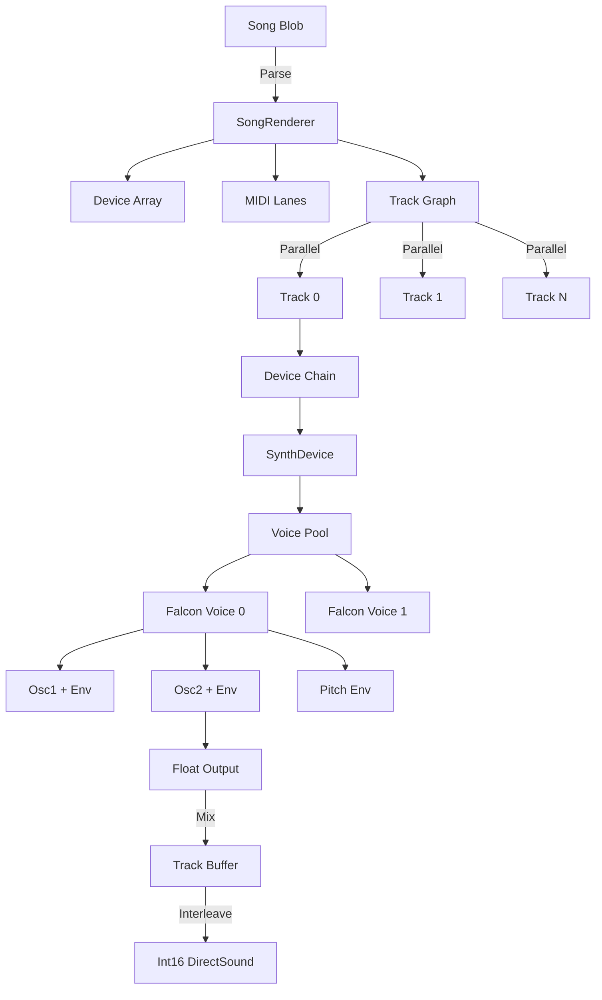

# WaveSabre Audio Synthesis Pipeline

Think of WaveSabre as a miniature recording studio compressed into 64KB. Where a traditional DAW loads gigabytes of samples and plugins, WaveSabre stores only the *recipe* for sound—device parameters, MIDI events, routing graphs—then renders everything in real-time. This architectural choice solves the central problem of demoscene audio: how do you deliver film-quality soundtracks when your entire executable must fit on a floppy disk?

The insight that makes this possible is sample-accurate event scheduling. Traditional audio engines process events at buffer boundaries, causing timing jitter that accumulates over a multi-minute track. WaveSabre counts samples like a metronome counts beats, ensuring that a note triggered at sample 147,328 plays at *exactly* that moment, not "sometime in the next 512 samples." This precision is what allows visuals to sync perfectly to audio hits—a non-negotiable requirement when your demo's impact depends on bass drops aligning with particle explosions.

The pipeline flows like an assembly line for sound: binary blob → song structure → parallel track rendering → device chains → voice synthesis → sample output. Each stage is optimized for size (code must be tiny) and speed (44,100 samples/second isn't a suggestion). Let's trace how pressing a MIDI note becomes air pressure waves in your speakers.

## The Problem: Real-Time Synthesis Under Size Constraints

Modern games ship with gigabytes of audio assets. A 3-minute rock song as MP3 might be 5MB. But 64KB demos can't afford that luxury. WaveSabre's solution is generative: store the *instructions* for creating sound (synth parameters, note sequences, effect chains) rather than the sound itself. The binary "blob" format packs BPM, sample rate, device graphs, MIDI lanes, and track routing into a few kilobytes.

The challenge becomes rendering this data structure into audio fast enough to keep up with playback (44.1kHz sample rate means generating 44,100 stereo samples every second) while maintaining sample-accurate timing for visual synchronization. This requires careful threading, lock-free coordination, and event scheduling that doesn't drift.

## Entry Point: Bootstrapping the Audio Engine

When the demo starts, `wsPlayer_Init()` (MusicPlayer.cpp:298) receives a pointer to the song blob—a compact binary representation of the entire track. This function creates the core rendering infrastructure:

```cpp
int wsPlayer_Init(HWND hWndParent, char* pMusicData, int nMusicDataSize) {
    SongRenderer::Song* Song = new SongRenderer::Song;
    Song->factory = SongFactory;
    Song->blob = (unsigned char*)pMusicData;
    int numRenderThreads = 3;

    player = new RealtimePlayer(Song, numRenderThreads);
    return 1;
}
```

The `SongFactory` function pointer maps device IDs to concrete synth types (Falcon, Slaughter, Thunder). This factory pattern keeps the player library decoupled from specific synth implementations—important for code size, since you only link the synths you actually use.

The `RealtimePlayer` wraps a `SongRenderer` with DirectSound output. Three render threads allow parallel processing of independent tracks, a crucial optimization when synthesizing dozens of device chains simultaneously.

## Parsing the Song Blob: Building the Audio Graph

The `SongRenderer` constructor (SongRenderer.cpp:7) deserializes the binary blob into runtime data structures. The blob format is brutally compact—no JSON, no XML, just raw bytes packed with custom read functions:

```cpp
SongRenderer::SongRenderer(const SongRenderer::Song *song, int numRenderThreads) {
    Helpers::Init();

    songBlobPtr = song->blob;
    bpm = readInt();
    sampleRate = readInt();
    length = readDouble();

    numDevices = readInt();
    devices = new Device *[numDevices];
    for (int i = 0; i < numDevices; i++) {
        devices[i] = song->factory((DeviceId)readByte());
        devices[i]->SetSampleRate((float)sampleRate);
        devices[i]->SetTempo(bpm);
        int chunkSize = readInt();
        devices[i]->SetChunk((void *)songBlobPtr, chunkSize);
        songBlobPtr += chunkSize;
    }

    numMidiLanes = readInt();
    midiLanes = new MidiLane *[numMidiLanes];
    // ...parse MIDI events with delta encoding...

    numTracks = readInt();
    tracks = new Track *[numTracks];
    // ...parse track routing and receives...
}
```

Each device's "chunk" contains its parameter values as floats (oscillator ratios, envelope times, filter cutoffs). Delta-encoded MIDI events store note-on/note-off messages with timestamps. Tracks define routing graphs—which devices run in which order, which tracks send audio to others.

This parsing happens once at startup. The resulting object graph (`devices`, `midiLanes`, `tracks`) is what gets traversed 44,100 times per second during playback.

## Parallel Track Rendering: Lock-Free Work Distribution

When the audio callback needs samples, `RenderSamples()` (SongRenderer.cpp:117) dispatches work across three threads using a dependency-aware scheduler:

```cpp
void SongRenderer::RenderSamples(Sample *buffer, int numSamples) {
    MxcsrFlagGuard mxcsrFlagGuard;  // Enable FTZ mode for denormals

    // Set up work: mark all tracks as idle
    for (int i = 0; i < numTracks; i++)
        trackRenderStates[i] = TrackRenderState::TrackRenderState_Idle;
    renderThreadNumFloatSamples = numSamples / 2;

    // Dispatch work: wake all render threads
    renderThreadsRunning = numRenderThreads;
    for (int i = 0; i < numRenderThreads; i++)
        SetEvent(renderThreadStartEvents[i]);

    // Main thread participates in rendering
    renderThreadWork(0);

    // Wait for completion
    WaitForSingleObject(renderDoneEvent, INFINITE);

    // Final interleaved output
    float **masterTrackBuffers = tracks[numTracks - 1]->Buffers;
    for (int i = 0; i < numSamples; i++) {
        int sample = (int)(masterTrackBuffers[i & 1][i / 2] * 32767.0f);
        if (sample < -32768) sample = -32768;
        if (sample > 32767) sample = 32767;
        buffer[i] = (Sample)sample;
    }
}
```

The `MxcsrFlagGuard` sets the CPU's flush-to-zero (FTZ) flag, treating denormal floats (very small numbers near zero) as zero. This prevents massive performance hits when filter states decay toward silence—a subtle but critical optimization for real-time audio.

Each thread runs `renderThreadWork()` (SongRenderer.cpp:162), which scans for tracks whose dependencies are finished:

```cpp
bool SongRenderer::renderThreadWork(int renderThreadIndex) {
    WaitForSingleObject(renderThreadStartEvents[renderThreadIndex], INFINITE);

    while (trackRenderStates[numTracks - 1] != TrackRenderState::TrackRenderState_Finished) {
        for (int i = 0; i < numTracks; i++) {
            // Skip if track isn't idle
            if (trackRenderStates[i] != TrackRenderState::TrackRenderState_Idle)
                continue;

            // Check dependencies: all receives must be finished
            bool allDependenciesFinished = true;
            for (int j = 0; j < tracks[i]->NumReceives; j++) {
                if (trackRenderStates[tracks[i]->Receives[j].SendingTrackIndex]
                    != TrackRenderState::TrackRenderState_Finished) {
                    allDependenciesFinished = false;
                    break;
                }
            }
            if (!allDependenciesFinished)
                continue;

            // Try to claim this track atomically
            if ((TrackRenderState)InterlockedCompareExchange(
                (unsigned int *)&trackRenderStates[i],
                (unsigned int)TrackRenderState::TrackRenderState_Rendering,
                (unsigned int)TrackRenderState::TrackRenderState_Idle)
                == TrackRenderState::TrackRenderState_Idle) {
                // We got it! Render and mark finished
                tracks[i]->Run(renderThreadNumFloatSamples);
                trackRenderStates[i] = TrackRenderState::TrackRenderState_Finished;
                break;
            }
        }
    }

    if (!InterlockedDecrement(&renderThreadsRunning))
        SetEvent(renderDoneEvent);
    return true;
}
```

This is lock-free work stealing. Threads scan the track array looking for work (idle tracks with finished dependencies), then use `InterlockedCompareExchange` to atomically claim ownership. No mutexes, no contention—just wait-free progress. The master track (index `numTracks - 1`) acts as the completion barrier.

## Track Processing: Mixing, Routing, and Device Chains

Each `Track::Run()` (SongRenderer.Track.cpp:74) orchestrates MIDI event dispatch, receive mixing, and device chain execution:

```cpp
void SongRenderer::Track::Run(int numSamples) {
    // Dispatch MIDI events sample-accurately
    MidiLane* lane = songRenderer->midiLanes[midiLaneId];
    for (; eventIndex < lane->numEvents; eventIndex++) {
        Event *e = &lane->events[eventIndex];
        int samplesToEvent = accumEventTimestamp + e->TimeStamp - lastSamplePos;
        if (samplesToEvent >= numSamples) break;

        switch (e->Type) {
        case EventType::EventType_NoteOn:
            for (int i = 0; i < numDevices; i++)
                songRenderer->devices[devicesIndicies[i]]->NoteOn(
                    e->Note, e->Velocity, samplesToEvent);
            break;
        case EventType::EventType_NoteOff:
            for (int i = 0; i < numDevices; i++)
                songRenderer->devices[devicesIndicies[i]]->NoteOff(
                    e->Note, samplesToEvent);
            break;
        }
        accumEventTimestamp += e->TimeStamp;
    }

    // Run parameter automation
    for (int i = 0; i < numAutomations; i++) automations[i]->Run(numSamples);

    // Clear buffers and mix receives
    for (int i = 0; i < numBuffers; i++) memset(Buffers[i], 0, numSamples * sizeof(float));
    for (int i = 0; i < NumReceives; i++) {
        Receive *r = &Receives[i];
        float **receiveBuffers = songRenderer->tracks[r->SendingTrackIndex]->Buffers;
        for (int j = 0; j < 2; j++) {
            for (int k = 0; k < numSamples; k++)
                Buffers[j + r->ReceivingChannelIndex][k] += receiveBuffers[j][k] * r->Volume;
        }
    }

    // Run device chain (synths, effects)
    for (int i = 0; i < numDevices; i++)
        songRenderer->devices[devicesIndicies[i]]->Run(
            (double)lastSamplePos / Helpers::CurrentSampleRate,
            Buffers, Buffers, numSamples);

    // Apply track volume
    if (volume != 1.0f) {
        for (int i = 0; i < numBuffers; i++) {
            for (int j = 0; j < numSamples; j++) Buffers[i][j] *= volume;
        }
    }

    lastSamplePos += numSamples;
}
```

The key insight here is `samplesToEvent`—the delta in samples from the current render position to when the event should fire. MIDI events don't just get processed "sometime this buffer"; they're queued with exact sample offsets. A note-on at sample 237 gets a `deltaSamples` of 237, ensuring it triggers precisely when it should relative to the visual timeline.

Tracks have 4-channel float buffers (stereo input + stereo output), allowing flexible routing like sidechain compression or multi-band processing. The receive mixing loop sums audio from other tracks before running the device chain.

## Voice Management: Pooling and Allocation

`SynthDevice::Run()` (SynthDevice.cpp:38) bridges the gap between MIDI events and actual sound generation. It maintains a fixed pool of 256 voices and processes events sample-accurately:

```cpp
void SynthDevice::Run(double songPosition, float **inputs, float **outputs, int numSamples) {
    int originalNumSamples = numSamples;
    clearOutputs(outputs, numSamples);

    float *runningOutputs[2];
    runningOutputs[0] = outputs[0];
    runningOutputs[1] = outputs[1];

    while (numSamples) {
        // Find next event delta
        int samplesToNextEvent = numSamples;
        for (int i = 0; i < maxEvents; i++) {
            Event *e = &events[i];
            if (e->Type != EventType::EventType_None) {
                if (!e->DeltaSamples) {
                    // Event fires NOW
                    switch (e->Type) {
                    case EventType::EventType_NoteOn:
                        int j = VoicesUnisono;
                        for (int k = 0; k < maxVoices; k++) {
                            if (!voices[k]->IsOn) {
                                j--;
                                float f = (float)j / (VoicesUnisono > 1 ? (float)(VoicesUnisono - 1) : 1.0f);
                                voices[k]->NoteOn(
                                    e->Note, e->Velocity,
                                    f * VoicesDetune,  // Per-voice detuning
                                    (f - 0.5f) * (VoicesPan * 2.0f - 1.0f) + 0.5f);  // Stereo spread
                            }
                        }
                        break;
                    // ...NoteOff handling...
                    }
                    events[i].Type = EventType::EventType_None;
                } else if (e->DeltaSamples < samplesToNextEvent) {
                    samplesToNextEvent = e->DeltaSamples;
                }
            }
        }

        // Render active voices
        for (int i = 0; i < maxVoices; i++) {
            if (voices[i]->IsOn) voices[i]->Run(songPosition, runningOutputs, samplesToNextEvent);
        }

        // Advance all event deltas
        for (int i = 0; i < maxEvents; i++) {
            if (events[i].Type != EventType::EventType_None)
                events[i].DeltaSamples -= samplesToNextEvent;
        }

        songPosition += (double)samplesToNextEvent / Helpers::CurrentSampleRate;
        runningOutputs[0] += samplesToNextEvent;
        runningOutputs[1] += samplesToNextEvent;
        numSamples -= samplesToNextEvent;
    }
}
```

The loop processes samples in chunks bounded by event timestamps. If the next note-on is 137 samples away, render 137 samples first, *then* trigger the note. This is how sample-accurate scheduling works: instead of "check for events every 512 samples," you render *up to* the next event, handle it, then continue.

Voice allocation uses first-available policy: scan the voice array for the first inactive slot. For unison mode (thick supersaw-style sounds), multiple voices get allocated per note-on, each with slightly different detuning and panning. The formula `f * VoicesDetune` spreads voices across the stereo field like a chorus.

No heap allocations happen here—everything uses fixed arrays. This keeps the audio thread deterministic and cache-friendly.

## FM Synthesis: The Sound-Generating Core

`Falcon::FalconVoice::Run()` (Falcon.cpp:153) implements the actual synthesis algorithm—in this case, two-operator FM with feedback:

```cpp
void Falcon::FalconVoice::Run(double songPosition, float **outputs, int numSamples) {
    double vibratoFreq = falcon->VibratoFreq / Helpers::CurrentSampleRate;
    double osc1Feedback = falcon->osc1Feedback * falcon->osc1Feedback / 2.0;
    double osc2Feedback = falcon->osc2Feedback * falcon->osc2Feedback / 2.0;
    float osc1FeedForwardScalar = falcon->osc1FeedForward * falcon->osc1FeedForward;
    float masterLevelScalar = Helpers::VolumeToScalar(falcon->masterLevel);
    float leftPanScalar = Helpers::PanToScalarLeft(Pan);
    float rightPanScalar = Helpers::PanToScalarRight(Pan);

    double osc1RatioScalar = ratioScalar((double)falcon->osc1RatioCoarse, (double)falcon->osc1RatioFine);
    double osc2RatioScalar = ratioScalar((double)falcon->osc2RatioCoarse, (double)falcon->osc2RatioFine);

    for (int i = 0; i < numSamples; i++) {
        double baseNote = GetNote() + Detune + falcon->Rise * 24.0f;

        // Operator 1: Self-feedback + sine/square morph
        double osc1Input = osc1Phase / Helpers::CurrentSampleRate * 2.0 * 3.141592
                          + osc1Output * osc1Feedback;
        osc1Output = ((Helpers::FastSin(osc1Input)
                     + Helpers::Square35(osc1Input) * (double)falcon->osc1Waveform))
                     * osc1Env.GetValue() * 13.25;

        // Operator 2: Modulated by Osc1 (feedforward) + self-feedback
        double osc2Input = osc2Phase / Helpers::CurrentSampleRate * 2.0 * 3.141592
                          + osc2Output * osc2Feedback * 13.25
                          + osc1Output * osc1FeedForwardScalar;
        osc2Output = ((Helpers::FastSin(osc2Input)
                     + Helpers::Square35(osc2Input) * (double)falcon->osc2Waveform))
                     * osc2Env.GetValue();

        // Output with panning
        float finalOutput = (float)osc2Output * masterLevelScalar;
        outputs[0][i] += finalOutput * leftPanScalar;
        outputs[1][i] += finalOutput * rightPanScalar;

        // Advance envelopes
        osc2Env.Next();
        if (osc2Env.State == EnvelopeState::EnvelopeState_Finished) {
            IsOn = false;
            break;
        }

        // Update oscillator phases with pitch envelope + vibrato
        float pEnv = pitchEnv.GetValue();
        double freq1 = Helpers::NoteToFreq(baseNote + pEnv * falcon->pitchEnvAmt1
                                          + Helpers::FastSin(vibratoPhase) * falcon->VibratoAmount);
        double freq2 = Helpers::NoteToFreq(baseNote + pEnv * falcon->pitchEnvAmt2
                                          + Helpers::FastSin(vibratoPhase) * falcon->VibratoAmount);
        osc1Phase += freq1 * osc1RatioScalar;
        osc2Phase += freq2 * osc2RatioScalar;
        vibratoPhase += vibratoFreq;
        osc1Env.Next();
        pitchEnv.Next();
    }
}
```

This is more flexible than classic Yamaha DX7 FM: both operators have self-feedback *and* operator 1 modulates operator 2. The `osc1Waveform` parameter morphs between sine and square waves, adding harmonic grit.

Each operator has its own ADSR envelope (`osc1Env`, `osc2Env`), plus a shared pitch envelope for swoops and vibrato. The voice automatically deactivates when the amplitude envelope finishes, returning it to the pool.

Phase accumulation (`osc1Phase += freq1 * osc1RatioScalar`) is classic digital synthesis: increment a counter by frequency each sample, wrap at 2π, feed to a sine lookup. The ratio scalars (computed from coarse + fine tuning) allow non-integer frequency multiples—crucial for bell tones and metallic timbres.

## Envelope Generation: Perceptually Smooth Curves

The `Envelope` class (Envelope.cpp:30) implements ADSR with quadratic curves for decay/release:

```cpp
float Envelope::GetValue() const {
    switch (State) {
    case EnvelopeState::EnvelopeState_Attack:
        return pos / Attack;  // Linear ramp

    case EnvelopeState::EnvelopeState_Decay:
        {
            float f = 1.0f - pos / Decay;
            f *= f;  // Quadratic curve
            return 1.0f * f + Sustain * (1.0f - f);
        }

    case EnvelopeState::EnvelopeState_Sustain:
        return Sustain;

    case EnvelopeState::EnvelopeState_Release:
        {
            float f = 1.0f - pos / Release;
            f *= f;  // Quadratic curve
            return releaseValue * f;
        }

    default:
        return 0.0f;
    }
}

void Envelope::Next() {
    if (State == EnvelopeState::EnvelopeState_Finished) return;
    float posDelta = (float)(1000.0 / Helpers::CurrentSampleRate);
    switch (State) {
    case EnvelopeState::EnvelopeState_Attack:
        pos += posDelta;
        if (pos >= Attack) {
            State = EnvelopeState::EnvelopeState_Decay;
            pos -= Attack;  // Carry overflow into next stage
        }
        break;
    case EnvelopeState::EnvelopeState_Decay:
        pos += posDelta;
        if (pos >= Decay) State = EnvelopeState::EnvelopeState_Sustain;
        break;
    case EnvelopeState::EnvelopeState_Release:
        pos += posDelta;
        if (pos >= Release) State = EnvelopeState::EnvelopeState_Finished;
    }
}
```

The quadratic curves (`f *= f`) create exponential-feeling fades that sound more natural than linear. Our ears perceive amplitude logarithmically, so squaring the decay factor creates perceptually even fade-outs.

The `pos -= Attack` overflow handling ensures smooth transitions between stages—no clicks or discontinuities. This is essential for FM synthesis, where phase discontinuities create audible glitches.

## Final Output: Clipping and Interleaving

Back in `RenderSamples()`, the master track's float buffers get converted to int16 samples for DirectSound:

```cpp
float **masterTrackBuffers = tracks[numTracks - 1]->Buffers;
for (int i = 0; i < numSamples; i++) {
    int sample = (int)(masterTrackBuffers[i & 1][i / 2] * 32767.0f);
    if (sample < -32768) sample = -32768;
    if (sample > 32767) sample = 32767;
    buffer[i] = (Sample)sample;
}
```

The `i & 1` and `i / 2` bit tricks interleave stereo: even indices are left channel, odd are right. Hard clipping at ±32768 prevents wrap-around distortion—crude but effective for demoscene's compressed mixes.

## Data Structures

**Device Hierarchy:**
```
Device (base)
└── SynthDevice (adds voice management)
    └── Falcon (2-op FM synth)
        └── FalconVoice (per-note state)
```

**Key Voice State:**
```cpp
struct FalconVoice : SynthDevice::Voice {
    double osc1Phase, osc2Phase;       // Phase accumulators
    double osc1Output, osc2Output;     // Feedback taps
    Envelope osc1Env, osc2Env;         // Amplitude envelopes
    Envelope pitchEnv;                 // Pitch modulation
    double vibratoPhase;               // LFO state
    float Detune, Pan;                 // Unison spread
};
```

**Track Rendering:**
```cpp
struct Track {
    float **Buffers;                   // 4-channel float arrays
    Receive *Receives;                 // Routing graph
    Device **devicesIndicies;          // Effect chain
    MidiLane *lane;                    // Event source
    int lastSamplePos;                 // Timeline position
};
```

**Event Queue:**
```cpp
struct Event {
    EventType Type;                    // NoteOn/NoteOff
    int DeltaSamples;                  // Countdown to fire
    int Note, Velocity;
};
```

## Architecture Diagram



## Implications for Rust Framework Design

**Voice Pool Management:**
The fixed 256-voice array is simple but wasteful. A Rust equivalent could use a `Vec<Voice>` with `Option<VoiceState>` slots, allowing dynamic sizing while maintaining cache-friendly iteration:

```rust
struct VoicePool {
    voices: Vec<Option<VoiceState>>,
    free_list: Vec<usize>,  // Indices of inactive slots
}

impl VoicePool {
    fn allocate(&mut self) -> Option<&mut VoiceState> {
        self.free_list.pop()
            .and_then(|idx| self.voices[idx].as_mut())
    }

    fn release(&mut self, idx: usize) {
        self.voices[idx] = None;
        self.free_list.push(idx);
    }
}
```

This avoids scanning 256 slots on every note-on—O(1) allocation via the free list.

**Envelope API:**
WaveSabre's envelope is a state machine with `GetValue()` and `Next()`. A more Rustic design uses iterator combinators:

```rust
struct Envelope {
    state: EnvelopeState,
    pos: f32,
    params: AdsrParams,
}

impl Iterator for Envelope {
    type Item = f32;

    fn next(&mut self) -> Option<f32> {
        let value = match self.state {
            EnvelopeState::Attack => self.pos / self.params.attack,
            EnvelopeState::Decay => {
                let f = 1.0 - self.pos / self.params.decay;
                f * f * (1.0 - self.params.sustain) + self.params.sustain
            }
            // ...
            EnvelopeState::Finished => return None,
        };
        self.advance();
        Some(value)
    }
}
```

Voices can `.zip()` envelope iterators with sample buffers, making the control-rate/audio-rate relationship explicit.

**Sample-Accurate Events:**
The delta-based event queue is elegant but requires manual delta management. Rust's type system can enforce this:

```rust
struct EventQueue {
    events: VecDeque<(usize, MidiEvent)>,  // (absolute_sample, event)
    current_sample: usize,
}

impl EventQueue {
    fn process_until(&mut self, target_sample: usize) -> impl Iterator<Item = MidiEvent> + '_ {
        std::iter::from_fn(move || {
            self.events.front()
                .filter(|(sample, _)| *sample <= target_sample)
                .map(|(_, event)| {
                    self.events.pop_front();
                    *event
                })
        })
    }
}
```

The `process_until()` API makes it impossible to forget advancing the sample counter—the iterator handles it.

**Lock-Free Track Scheduling:**
WaveSabre's `InterlockedCompareExchange` pattern maps to Rust's `AtomicU8` with `compare_exchange`:

```rust
use std::sync::atomic::{AtomicU8, Ordering};

enum TrackState { Idle = 0, Rendering = 1, Finished = 2 }

fn try_claim_track(state: &AtomicU8) -> bool {
    state.compare_exchange(
        TrackState::Idle as u8,
        TrackState::Rendering as u8,
        Ordering::AcqRel,
        Ordering::Relaxed
    ).is_ok()
}
```

Rayon's `par_iter()` could replace manual thread management, though you'd lose the dependency graph awareness. A custom `par_iter_with_deps()` using `crossbeam::channel` might be the sweet spot.

**Denormal Handling:**
Instead of global FTZ flags, Rust can use explicit flush-to-zero wrappers:

```rust
#[inline(always)]
fn ftz(x: f32) -> f32 {
    if x.abs() < 1e-15 { 0.0 } else { x }
}

// Or SIMD-aware:
#[cfg(target_feature = "sse")]
unsafe fn ftz_sse(x: f32) -> f32 {
    use std::arch::x86_64::*;
    let v = _mm_set_ss(x);
    let flushed = _mm_and_ps(v, _mm_cmpge_ss(v, _mm_set1_ps(1e-15)));
    _mm_cvtss_f32(flushed)
}
```

This avoids the global state mutation of `MxcsrFlagGuard`.

## Key Takeaways

- **Sample-accurate scheduling** via delta counters is non-negotiable for tight audio-visual sync
- **Lock-free work stealing** enables parallel rendering without contention overhead
- **Fixed voice pools** trade memory for deterministic allocation—good for real-time, wasteful for sparse music
- **Quadratic envelope curves** provide perceptual smoothness at near-zero CPU cost
- **Binary blob serialization** achieves 10x compression over JSON—critical for 64KB constraint
- **FTZ mode** prevents denormal performance cliffs during long filter tails
- **Unison spreading** (detuning + panning) creates thick sounds from multiple voices per note

The pipeline's elegance comes from separation of concerns: song structure (parsing), event timing (delta counters), parallel execution (lock-free scheduler), and synthesis (voice DSP) each operate independently. A Rust rewrite could improve on allocation strategy and type safety while preserving this modular architecture.

## References

- `/demoscene/apex-public/apEx/MinimalPlayer/MusicPlayer.cpp:298` — Player initialization
- `/demoscene/apex-public/apEx/Libraries/WaveSabre/WaveSabrePlayerLib/src/SongRenderer.cpp:7` — Blob parsing
- `/demoscene/apex-public/apEx/Libraries/WaveSabre/WaveSabrePlayerLib/src/SongRenderer.cpp:117` — Parallel rendering
- `/demoscene/apex-public/apEx/Libraries/WaveSabre/WaveSabrePlayerLib/src/SongRenderer.Track.cpp:74` — Track processing
- `/demoscene/apex-public/apEx/Libraries/WaveSabre/WaveSabreCore/src/SynthDevice.cpp:38` — Voice management
- `/demoscene/apex-public/apEx/Libraries/WaveSabre/WaveSabreCore/src/Falcon.cpp:153` — FM synthesis
- `/demoscene/apex-public/apEx/Libraries/WaveSabre/WaveSabreCore/src/Envelope.cpp:30` — ADSR envelope
