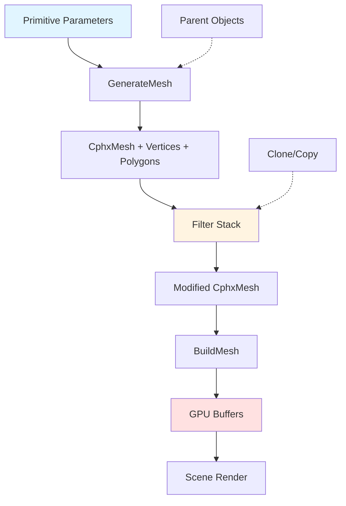

# apEx Geometry System Overview

When you're working within a 64-kilobyte constraint, you can't ship OBJ files or GLTF models. Every polygon, every vertex, every surface in your demo needs to be generated at runtime from compact procedural descriptions. The challenge isn't just making a cube or sphere—it's building complex scenes with thousands of polygons from parameter sets measured in bytes, not megabytes.

apEx's geometry system addresses this by treating meshes as data flow pipelines. You start with a parametric primitive—a cube, sphere, or loft surface defined by a handful of bytes. Then you transform it through a stack of filters that subdivide, deform, texture, and color the geometry. Finally, you pack the result into GPU buffers for rendering. The entire process happens at demo startup, converting kilobytes of primitive definitions into megabytes of renderable geometry that only exists in memory.

The key insight is that procedural generation isn't about writing code to create each model. It's about composing reusable operations. A tree isn't hand-coded—it's a base primitive modified by instancing filters, scattered leaves, and normal deformation. A building facade isn't modeled—it's a plane subdivided with greebling filters and CSG operations. Artists stack these operations in the demotool's visual interface, the parameters get serialized to a few bytes, and the player reconstructs the full geometry at runtime.

This architecture matters because most creative coding frameworks assume you'll load geometry from files. Processing has `loadShape()`. Three.js has `GLTFLoader`. But those loaders bring in megabytes of data. apEx's approach keeps the executable tiny while still giving artists powerful modeling capabilities. The trade-off is generation time—complex scenes can take seconds to build—but for 64k intros, that's an acceptable cost.

Think of the geometry system like a node-based shader editor. Each primitive is a source node. Each filter is a processing node with parameters. The graph structure is implicit—filters execute in order, each transforming the mesh from the previous step. Instead of rendering pixels, you're generating polygons. And instead of real-time frame rates, you're targeting one-time startup generation.

## System Architecture

apEx organizes geometry processing into four major phases: primitive creation, filter application, GPU buffer building, and scene integration. Each phase operates on the CphxMesh container, transforming it from initial parameters to renderable state.



The flow starts when Project.cpp loads a demo. For each Model, the system iterates through its ModelObjects. Each object has a primitive type, a parameter array, and a filter stack. GenerateMesh() creates the initial primitive mesh. Then filters apply in sequence, each modifying vertices, polygons, or topology. Finally, BuildMesh() packs the CphxMesh into DirectX 11 buffers and attaches them to the ModelObject for rendering.

This pipeline executes once per model during demo precalculation. Unlike the material or scene systems which run every frame, geometry generation is strictly startup-time. The output—vertex buffers, index buffers, and wireframe buffers—persists for the demo's lifetime. This amortizes the generation cost across thousands of frames.

## Core Data Structures

The CphxMesh class (Mesh.h:208) serves as the central container for all geometry operations. It holds three primary arrays.

| Component | Type | Purpose | Location |
|-----------|------|---------|----------|
| Vertices | CphxArray\<CphxVertex\> | Per-vertex positions, normals, colors | Mesh.h:220 |
| Polygons | CphxArray\<CphxPolygon\> | Face definitions with vertex indices | Mesh.h:221 |
| Edges | CphxArray\<CphxEdge\> | Polygon connectivity for operations | Mesh.h:222 |

Each vertex stores multiple positions for animation support.

```cpp
// Mesh.h:136
class CphxVertex {
public:
  D3DXVECTOR3 Position;        // Current vertex position
  D3DXVECTOR3 Position2;       // Secondary position (for morphing)
  D3DXVECTOR3 StoredPosition;  // Original position backup
  D3DXVECTOR3 Normal;          // Vertex normal
  float Color[4];              // Accumulated vertex color
  int ColorCount;              // Color sample count (for averaging)
  CphxArray<int> EdgeIDs;      // Connected edges
};
```

Position2 supports the SavePos2 filter, which stores current vertex positions for later blending or deformation. StoredPosition preserves original coordinates before transformations. The Color array accumulates contributions from multiple tinting operations, normalized by ColorCount.

Polygons are quads or triangles defined by vertex indices.

```cpp
// Mesh.h:171
class CphxPolygon {
public:
  int VertexCount;           // 3 for tris, 4 for quads
  int VertexIDs[4];          // Vertex indices
  int EdgeIDs[4];            // Edge indices
  D3DXVECTOR3 PolyNormal;    // Face normal
  D3DXVECTOR3 Normals[4];    // Per-vertex normals (smooth shading)
  D3DXVECTOR2 Texcoords[4][4]; // 4 UV channels, 4 verts each
  bool TouchedByNormalCalculator; // Smooth group tracking
};
```

Each polygon can store four UV coordinate channels. This supports multi-texture effects without requiring separate vertex streams. The TouchedByNormalCalculator flag tracks smooth group processing, ensuring normals only accumulate from polygons within the same angular threshold.

The GPU-ready vertex format differs from CphxVertex.

```cpp
// Mesh.h:119
struct PHXVERTEXDATA {
  D3DXVECTOR3 Position;
  D3DXVECTOR3 Position2;
  D3DXVECTOR3 Normal;
  unsigned int Color;        // RGBA packed
  D3DXVECTOR4 Texcoord;      // 4 UV channels, XY and ZW
  D3DXVECTOR4 Texcoord2;     // 4 more UV channels
};
```

BuildMesh() converts from CphxVertex arrays to PHXVERTEXDATA buffers. Colors collapse from float[4] to unsigned int. UV coordinates pack into two vec4s, supporting up to 8 texture channels total. Position2 passes through unchanged for shader-based morphing.

## Primitive Types

apEx provides 20 primitive types, each with specialized parameters stored as byte arrays. The system groups them into four categories.

**Basic parametric shapes** form the foundation. Cube generates an axis-aligned box. Plane creates a subdivided grid with XRes × YRes quads. Sphere produces a UV sphere with latitude/longitude topology, supporting top/bottom cutting and polar caps. Cylinder and Cone use similar cylindrical topology with configurable resolution and end caps. Arc generates a curved segment, useful for swept surfaces.

```cpp
// Project.cpp:1717-1745
case Mesh_Cube:
  m->Mesh.CreateCube();
  break;

case Mesh_Plane:
  m->Mesh.CreatePlane(Data[0], Data[1]);  // XRes, YRes
  break;

case Mesh_Sphere:
  m->Mesh.CreateSphere(Data[0], Data[1],   // XRes, YRes
                       (Data[2]+1)/256.0f,  // TopCut
                       Data[3]/256.0f,       // BottomCut
                       Data[4] != 0);        // Caps
  break;
```

**Advanced procedural types** enable complex organic forms. GeoSphere subdivides an icosahedron, producing near-perfect spheres with uniform triangle distribution—critical for subdivision algorithms. Loft sweeps a slice mesh along a path mesh using the Frenet frame, creating tubes, pipes, and extrusions. Tree and TreeLeaves use the Arbaro algorithm to generate botanical models from growth rules.

Marched creates geometry from implicit surface functions using marching cubes. This converts mathematical formulas (spheres, tori, metaballs) into triangle meshes. Text converts font outlines to extruded 3D geometry.

**Instancing primitives** duplicate and arrange geometry. Clone references other model objects, applying transformations during scene traversal. Copy duplicates a parent mesh's vertices and polygons, creating an independent copy that filters can modify. Scatter distributes instances of an object mesh across the vertices, edges, or faces of a shape mesh—essential for placing details like bolts on surfaces. Merge combines multiple parent meshes into a single unified mesh.

**Storage primitives** support mesh caching. Stored loads pre-generated vertices and polygons from binary data, useful for importing external models. StoredMini uses a compressed format trading precision for size.

## Filter System

Filters transform meshes after primitive creation. Each ModelObject stores a filter array with type, parameters, and optional transformation matrices. The system applies filters sequentially in Project.cpp:902-987, each modifying the mesh in place.

```cpp
// Project.cpp:902-908
for (int z = 0; z < m->FilterCount; z++) {
  unsigned char *filterparams = m->FilterData[z].FilterParams;
  D3DXFLOAT16 *filtertransform = m->FilterData[z].filtertransform;

  switch (m->FilterData[z].Type) {
    case ModelFilter_UVMap:
      m->Mesh.CalculateTextureCoordinates(...);
      break;
    // ... 12 more filter types
  }
}
```

Filters fall into six functional categories based on their effect on mesh topology and attributes.

**UV and transformation filters** modify coordinates without changing topology. UVMap calculates texture coordinates using planar, spherical, cylindrical, or box projection, with full transform support for scaling, rotation, and offset. MapXForm applies position transformations to vertices. These filters set up the mapping space for procedural textures.

**Subdivision filters** increase geometric detail. Bevel insets polygon faces, creating beveled edges. MeshSmooth implements Catmull-Clark subdivision, doubling polygon count per iteration while smoothing the surface. Linear mode preserves hard edges. These filters turn low-poly primitives into smooth organic forms.

**Normal control filters** affect shading without changing positions. SmoothGroup sets the angle threshold for normal smoothing—adjacent faces with normals closer than the threshold share vertex normals. Invert flips polygon winding and normals, turning inside-out geometry.

**Color filters** paint vertex colors procedurally. TintMesh samples a procedural texture and writes color to vertices. TintMeshShape uses geometric shapes (spheres, boxes) as color masks with blend operations. Vertex colors multiply material colors in the pixel shader.

**Deformation filters** modify geometry based on normals or boolean operations. NormalDeform displaces vertices along normals—positive values inflate, negative values deflate. Greeble subdivides polygons and extrudes them, creating surface detail like panels and vents. CSG performs constructive solid geometry (union, subtraction, intersection) between two meshes using the Carve library.

**Instancing and state filters** handle duplication and caching. Replicate creates multiple copies with transformations—useful for radial arrays. SavePos2 copies current positions to Position2, enabling morph targets or deformation blending.

The filter stack's sequential nature creates dependencies. You must calculate normals before NormalDeform. UVMap should precede TintMesh. MeshSmooth typically comes early to increase topology before detail operations. The demotool interface enforces some dependencies but allows artists flexibility.

## Build Pipeline

Once primitives and filters execute, BuildMesh() converts the CphxMesh into GPU buffers. This is where abstract vertex arrays become concrete DirectX resources.

The pipeline has four steps. First, it triangulates quads—DirectX only renders triangles, so any four-sided polygons split into two triangles. Edge lists update to reflect the new topology. Second, it packs PHXVERTEXDATA structures with positions, normals, colors, and UVs from CphxVertex and CphxPolygon arrays. Third, it builds index buffers mapping vertices to triangle indices. Finally, it creates a wireframe index buffer for debug rendering.

```cpp
// Mesh.cpp:368 (conceptual flow)
void CphxMesh::BuildMesh(ID3D11Buffer *&VxBuffer,
                         ID3D11Buffer *&TriIndexBuffer,
                         ID3D11Buffer *&WireIndexBuffer,
                         int &VxCount, int &TriCount, int &EdgeCount) {
  // 1. Allocate PHXVERTEXDATA array
  PHXVERTEXDATA *vertexData = new PHXVERTEXDATA[VertexCount];

  // 2. Copy vertex data with color normalization
  for (int i = 0; i < Vertices.NumItems(); i++) {
    vertexData[i].Position = Vertices[i].Position;
    vertexData[i].Normal = Vertices[i].Normal;
    // Normalize accumulated colors
    if (Vertices[i].ColorCount > 0) {
      float r = Vertices[i].Color[0] / Vertices[i].ColorCount;
      float g = Vertices[i].Color[1] / Vertices[i].ColorCount;
      float b = Vertices[i].Color[2] / Vertices[i].ColorCount;
      float a = Vertices[i].Color[3] / Vertices[i].ColorCount;
      vertexData[i].Color = D3DCOLOR_RGBA(r, g, b, a);
    }
  }

  // 3. Build triangle index buffer
  unsigned short *indices = new unsigned short[TriCount * 3];
  int idx = 0;
  for (int i = 0; i < Polygons.NumItems(); i++) {
    if (Polygons[i].VertexCount == 3) {
      indices[idx++] = Polygons[i].VertexIDs[0];
      indices[idx++] = Polygons[i].VertexIDs[1];
      indices[idx++] = Polygons[i].VertexIDs[2];
    } else if (Polygons[i].VertexCount == 4) {
      // Split quad into two triangles
      indices[idx++] = Polygons[i].VertexIDs[0];
      indices[idx++] = Polygons[i].VertexIDs[1];
      indices[idx++] = Polygons[i].VertexIDs[2];
      indices[idx++] = Polygons[i].VertexIDs[0];
      indices[idx++] = Polygons[i].VertexIDs[2];
      indices[idx++] = Polygons[i].VertexIDs[3];
    }
  }

  // 4. Create DirectX buffers
  phxDev->CreateBuffer(D3D11_BIND_VERTEX_BUFFER, vertexData,
                       sizeof(PHXVERTEXDATA) * VxCount, &VxBuffer);
  phxDev->CreateBuffer(D3D11_BIND_INDEX_BUFFER, indices,
                       sizeof(unsigned short) * TriCount * 3, &TriIndexBuffer);
  phxDev->CreateBuffer(D3D11_BIND_INDEX_BUFFER, wireIndices,
                       sizeof(unsigned short) * EdgeCount * 2, &WireIndexBuffer);
}
```

The vertex buffer holds all geometry in a single allocation. Index buffers use 16-bit indices, limiting meshes to 65535 vertices. The wireframe buffer stores edges as line lists for debug visualization. Both index buffers reference the same vertex buffer—the only difference is primitive topology (triangle list vs. line list).

BuildMesh() executes after all filters complete. This means filters work with flexible CphxVertex arrays, adding and removing vertices dynamically. Only at the end does the system commit to immutable GPU buffers. Filters don't worry about DirectX constraints—the build step handles that translation.

## Scene Integration

Geometry becomes visible when a Model integrates into a Scene's render queue. This happens during scene graph traversal, where Objects create RenderDataInstances that reference their GPU buffers and materials.

The integration flow starts in Scene.cpp when UpdateSceneGraph() evaluates animation splines and traverses the object hierarchy. For each Object_Model, the system calls CreateRenderDataInstances() with the current world transform matrix. This delegates to CphxModel::CreateRenderDataInstances(), which iterates ModelObjects.

For Mesh objects, the process collects material parameters, applies material animation splines, and creates render instances for each material pass. Clone objects multiply their transform with parent transforms and recursively create instances for all cloned children.

```cpp
// Model.cpp:25
void CphxModelObject_Mesh::CreateRenderDataInstances(
    CphxObjectClip *Clip, const D3DXMATRIX &m,
    CphxScene *RootScene, void *CloneData) {

  if (!Material) return;

  // Combine object transform with parent transform
  D3DXMatrixMultiply(&phxWorldMatrix, &GetMatrix(), &m);

  // Apply animated material parameters from timeline
  Clip->MaterialSplines->ApplyToParameters(this);

  // Collect per-pass material data
  int passid = 0;
  for (int x = 0; x < Material->TechCount; x++)
    for (int y = 0; y < Material->Techniques[x]->PassCount; y++)
      Material->Techniques[x]->CollectAnimatedData(MaterialState[passid++], y);

  // Create render instances for each material pass
  Material->CreateRenderDataInstances(this, RootScene, CloneData);
}
```

CreateRenderDataInstances() doesn't copy geometry—it references the already-built VxBuffer, IndexBuffer, and WireBuffer from the ModelObject_Mesh. Materials create RenderDataInstances that store buffer pointers, index counts, and per-instance material state. These instances go into RenderLayers sorted by priority and blend state.

During rendering, each RenderLayer iterates its instances, binding vertex buffers and drawing indexed primitives. The geometry itself—those megabytes of vertex data—stays fixed in GPU memory. Only transforms, material parameters, and draw calls change per frame.

This separation of concerns—geometry generation during precalc, instance creation during scene update, rendering during draw—keeps each phase focused. Geometry code doesn't know about materials. Materials don't know about primitives. The Model and Scene layers mediate between them.

## Memory Management

apEx manages geometry memory differently in minimal builds versus full builds. The minimal player (64k executables) optimizes for runtime footprint. The full build (authoring tool) optimizes for editing flexibility.

In minimal builds, CphxMesh vertices and polygons arrays deallocate after BuildMesh() completes. The GPU buffers become the source of truth. This saves megabytes of RAM for complex scenes—you don't need both CPU-side arrays and GPU-side buffers during playback. Destructors are conditionally compiled out (notice the `#ifndef PHX_MINIMAL_BUILD` guards on virtual destructors in Mesh.h, Model.h, Scene.h).

The full build retains CPU-side mesh data. This enables the demotool to regenerate geometry when artists tweak parameters. Changing a filter setting rebuilds the mesh on the fly, updating the preview without reloading the entire project. Dynamic allocation and cleanup use standard C++ destructors.

GPU buffers persist for the demo's lifetime in both modes. There's no streaming or dynamic buffer updates—once built, geometry is immutable. This trades memory for performance. No allocations during rendering means no frame hitches or fragmentation.

Stored and StoredMini primitives use pre-baked vertex arrays embedded in the executable. These arrays compress well since they're binary data. The trade-off is generation time—importing a 10k triangle model and baking it into StoredMini format can take minutes in the tool, but loads instantly at runtime.

## Optimization Strategies

Several techniques keep geometry compact in the 64k executable.

**Parameter quantization** stores most values as unsigned bytes (0-255 range) in the MeshParameters array. Subdivision counts, resolution, cuts, and boolean flags all fit in single bytes. For floating-point precision, the system uses D3DXFLOAT16—half-precision floats consume 2 bytes instead of 4. Filter transforms (scale, rotation, translation) pack 12 half-floats into 24 bytes.

**Compile-time feature selection** uses preprocessor macros to exclude unused primitives and filters. The PhoenixConfig.h file defines symbols like PHX_MESH_GREEBLE or PHX_MESH_CREATEGEOSPHERE. If a demo doesn't use greebling, that entire code path vanishes from the executable. This can save 5-10 KB for complex features.

**Edge sharing** means vertices store edge indices, and polygons reference edges. Filters like Bevel and MeshSmooth need adjacency information. Building edge lists once during primitive creation avoids recomputing connectivity for each filter. The edge array scales with polygon count, not vertex count, keeping overhead proportional to complexity.

**Smooth group caching** uses the TouchedByNormalCalculator flag to avoid recalculating normals unnecessarily. If a filter doesn't modify positions, it sets SkipNormalCalculation = true. CalculateNormals() only runs when needed, typically once after all deformations complete.

**Procedural over storage** generates geometry when the algorithm is smaller than the data. A sphere primitive might be 10 bytes (type, XRes, YRes, cuts, caps). The generated mesh could be 10,000 bytes. But simple shapes compress poorly, while parameter-driven code compresses well. The executable stores the generator, not the output.

## Implications for Framework Design

apEx's geometry system demonstrates several patterns applicable to Rust creative coding frameworks.

**Separate generation from rendering**. Geometry construction is CPU-intensive and infrequent. Rendering is GPU-bound and happens every frame. Don't mix the two. Use builder patterns for mesh construction, then freeze the result into GPU buffers. Rust's ownership model naturally enforces this—move the built mesh into an immutable buffer type that only exposes draw commands.

**Compose operations, don't hard-code models**. Artists want to combine primitives and filters, not write code. A Rust framework should provide composable mesh operations as functions that take `Mesh` and return `Mesh`. Think iterator chains for geometry—sphere().subdivide(2).displace(noise). Type safety prevents invalid compositions (can't UV-map before creating geometry).

**Parameterize for reuse**. Every primitive and filter should have a compact parameter representation. In Rust, use strongly-typed structs: `SphereParams { x_res: u8, y_res: u8, top_cut: f32, ... }`. Serialize these for saving/loading. The parameters are the "source code" for your geometry.

**Cache derived data aggressively**. Normals, edges, and bounding volumes are expensive to compute but cheap to store. Rust's type system can enforce this with read-only accessor methods that compute-and-cache on first access. Use `OnceCell` or `Lazy` for deferred initialization.

**Offer escape hatches for custom code**. Not everything fits the primitive+filter model. apEx includes Marched (arbitrary implicit functions) and Stored (external imports). A Rust framework needs similar hooks—a trait for procedural generators, or accepting `Vec<Vertex>` directly. Balance ease-of-use with power.

**Design for data-driven workflows**. The fact that apEx serializes geometry as byte arrays in demo projects is crucial. Artists work in the tool, export compact data, and the player reconstructs it. Rust frameworks should think in terms of `serde`-compatible scene descriptions, not just runtime APIs.

## Related Documents

This overview covers the high-level geometry pipeline. For detailed implementations, see:

- **mesh-primitives.md** — Algorithms for cube, sphere, geosphere, loft, and tree generation
- **mesh-filters.md** — Implementation details for bevel, smooth, tint, greeble, and CSG filters
- **scene-integration.md** — How models connect to scenes, animation, and materials
- **size-optimization.md** — Compile-time feature selection and compression strategies
- **rendering-pipeline.md** — From geometry buffers to pixels on screen

## Source File Reference

| File | Purpose | Key Components |
|------|---------|----------------|
| Mesh.h | Core geometry data structures | CphxVertex (136), CphxPolygon (171), CphxMesh (208), PHXVERTEXDATA (119) |
| Mesh.cpp | Primitive generation and BuildMesh | CreateCube, CreateSphere, BuildMesh (368) |
| Model.h | Model object hierarchy | CphxModelObject (14), CphxModelObject_Mesh (62), CphxModel (108) |
| Model.cpp | Render instance creation | CreateRenderDataInstances (6, 25, 48) |
| Scene.h | Scene graph integration | CphxScene (398), CphxObject_Model (199) |
| Project.cpp | Load and generate pipeline | GenerateMesh (1702), filter application loop (902-987) |

All source paths are relative to `demoscene/apex-public/apEx/Phoenix/`.
