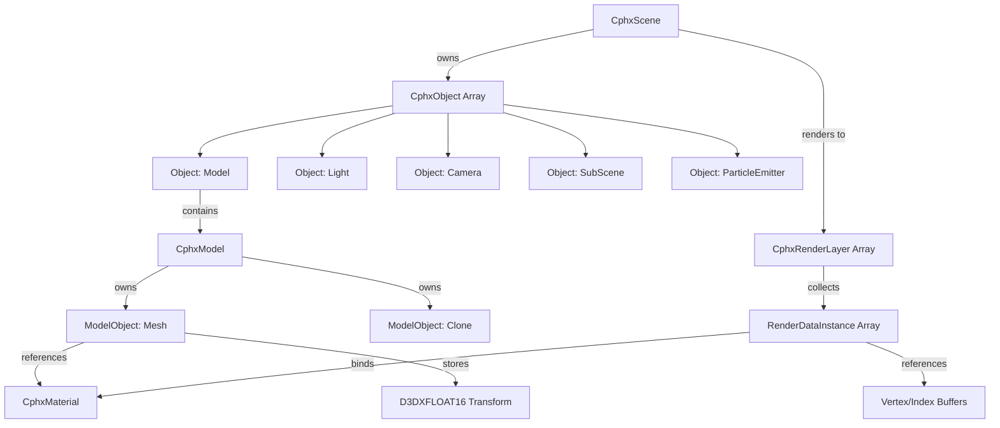

# Scene Integration

How geometry connects to apEx's hierarchical scene graph, transforms, cloning semantics, and the render instance system that binds meshes to materials for drawing.

## The Core Problem

Demoscene tools need to answer: *How do thousands of geometric objects, animated over time, get organized, transformed, and submitted for rendering?* The naive approach creates chaos—orphaned meshes, tangled hierarchies, and no clear path from "model file" to "pixels on screen."

apEx solves this with a three-tier architecture: **Scene Objects** own world-space placement and animation, **Models** group related geometry, and **ModelObjects** represent individual mesh instances with local transforms. The system treats the scene graph as a transform accumulator while keeping rendering entirely separate through a deferred instance collection pass.

## The Mental Model: Theater Production

Think of a scene like a theater production:

- **Scene Objects** are actors on stage—they have positions, can move, and might carry props
- **Models** are the props themselves—a chair might be a Model containing multiple ModelObjects (seat, legs, backrest)
- **ModelObjects** define the relative arrangement of prop components
- **Clone** is when an actor picks up a chair and spawns multiple copies, each independently animatable
- **RenderDataInstances** are the lighting crew's cue sheet—they know what to illuminate, with which lights, in what order

The scene graph traversal is like rehearsal blocking—figuring out where everyone stands. Rendering is the actual performance.

## Scene Hierarchy Structure



## Object Types in the Scene Graph

Every scene object inherits from `CphxObject` and declares its purpose through the `PHXOBJECT` enum (Scene.h:95-111):

```cpp
enum PHXOBJECT {
  Object_Model = 0,           // Geometric mesh container
  Object_Light,               // Light source (directional, point, spot)
  Object_CamEye,              // Camera position/orientation
  Object_Dummy,               // Transform-only (animation pivot, grouping)
  Object_SubScene,            // Nested scene instance
  Object_ParticleEmitter,     // GPU particle system
  Object_ParticleEmitterCPU,  // CPU-simulated particles
  Object_ParticleDrag,        // Particle force: air resistance
  Object_ParticleGravity,     // Particle force: gravity well
  Object_ParticleTurbulence,  // Particle force: 3D noise field
  Object_ParticleVortex,      // Particle force: swirl
  Object_LogicObject,         // Scripting hook
  Object_Count,
};
```

**Key insight:** Only `Object_Model` contains renderable geometry. The others manipulate transforms, lighting, or particle state. This separation allows lights and cameras to participate in the scene graph hierarchy (imagine a camera parented to a moving car) without cluttering the rendering pipeline.

## Model Structure: Geometry Containers

`CphxModel` is a collection of `CphxModelObject` instances, each representing either actual mesh data or a cloning operator (Model.h:108-120):

```cpp
class CphxModel {
public:
  CphxArray<CphxModelObject*> Objects;  // Heterogeneous mesh/clone list

  void CreateRenderDataInstances(CphxObjectClip *Clip,
                                  const D3DXMATRIX &m,
                                  CphxScene *RootScene,
                                  void *ToolData);
};
```

The `Objects` array can contain:

1. **CphxModelObject_Mesh** — Actual geometry with vertex/index buffers
2. **CphxModelObject_Clone** — Procedural duplication operator

This heterogeneity enables *authored cloning*—artists explicitly place Clone operators in the model hierarchy, which expand at render-instance-creation time.

## ModelObject: The Atomic Rendering Unit

Each ModelObject carries its own local transform and (for meshes) material binding:

```cpp
class CphxModelObject {
  D3DXFLOAT16 TransformationF16[12];  // 4×3 matrix (24 bytes)
  PHXMESHPRIMITIVE Primitive;         // Cube, sphere, stored mesh, etc.
  CphxArray<CphxModelObject*> ClonedObjects;  // For Clone operators
  virtual void CreateRenderDataInstances(...) = 0;
};

class CphxModelObject_Mesh : public CphxModelObject {
  CphxMaterial *Material;                  // Shader/texture/state binding
  ID3D11Buffer *VxBuffer, *IndexBuffer;    // GPU geometry
  CphxMaterialPassConstantState **MaterialState;  // Per-pass constants
  CphxMesh Mesh;                           // CPU-side geometry (for filters)
  int FilterCount;                         // Mesh modifiers (displace, etc.)
  PHXMESHFILTERDATA *FilterData;
};
```

### Transform Storage: Half-Precision Optimization

The `D3DXFLOAT16[12]` transform stores a 4×3 matrix in **half-precision floats** (16-bit). This saves 24 bytes per ModelObject compared to full 4×4 floats (64 bytes). The fourth row (assumed to be `[0 0 0 1]`) is implicit.

**Why half-precision is safe:**
- Vertex positions in model space are typically small (±10 units)
- Artists design with uniform scales (~0.1 to 10.0)
- 11-bit mantissa provides ~3 decimal digits, enough for relative positioning
- Final world-space matrices use full precision after concatenation

Decompression happens in `GetMatrix()` (Model.cpp:14-23):

```cpp
D3DXMATRIX CphxModelObject::GetMatrix() {
  D3DXMATRIX m;
  D3DXMatrixIdentity(&m);
  for (int x = 0; x < 4; x++)
    for (int y = 0; y < 3; y++)
      m.m[x][y] = TransformationF16[y + x * 3];  // Converts to float32
  return m;
}
```

## Clone vs Copy: Different Duplication Semantics

The system distinguishes two cloning patterns:

### Clone (CphxModelObject_Clone)

Creates **independent geometric variations** of referenced ModelObjects. Each clone:
- Gets its own transform (accumulated from Clone operator's matrix)
- Applies filters independently (e.g., random displacement per clone)
- Can reference different materials
- Exists as separate CPU-side geometry

**Use case:** Forest of trees where each trunk has unique noise deformation.

Implementation (Model.cpp:48-55):

```cpp
void CphxModelObject_Clone::CreateRenderDataInstances(
    CphxObjectClip *Clip, const D3DXMATRIX &m,
    CphxScene *RootScene, void *ToolData) {
  D3DXMATRIX newm;
  D3DXMatrixMultiply(&newm, &GetMatrix(), &m);

  for (int x = 0; x < ClonedObjects.NumItems(); x++)
    ClonedObjects[x]->CreateRenderDataInstances(Clip, newm, RootScene, ToolData);
}
```

The Clone operator simply concatenates its transform and delegates to children. The actual cloning logic happens in the tool—this is just playback.

### Copy (Implicit via Shared Buffers)

Creates **instanced mesh references** where multiple scene objects point to the same GPU buffers:
- Same vertex data, different world matrices
- Same material (though constants can vary)
- Minimal memory overhead

**Use case:** 1000 identical cubes in a grid pattern. One VxBuffer, 1000 scene objects.

apEx doesn't have an explicit "Copy" operator—this happens naturally when multiple `Object_Model` instances reference the same `CphxModel`, or when a particle emitter spawns mesh particles.

## Material Binding Flow

Materials connect to geometry at the ModelObject level, not the Scene Object level. This allows a single Model to contain meshes with different shaders:

1. **Authoring:** Artist assigns Material to ModelObject_Mesh in the tool
2. **Build time:** Material creates `CphxMaterialPassConstantState` array—one entry per material pass
3. **Animation update:** Clip splines write animated values into MaterialState constant data
4. **Render instance creation:** MaterialState copied into RenderDataInstance

From CphxModelObject_Mesh::CreateRenderDataInstances (Model.cpp:25-46):

```cpp
void CphxModelObject_Mesh::CreateRenderDataInstances(
    CphxObjectClip *Clip, const D3DXMATRIX &m,
    CphxScene *RootScene, void *CloneData) {

  if (!Material) return;

  // Concatenate local transform with accumulated parent transform
  D3DXMatrixMultiply(&phxWorldMatrix, &GetMatrix(), &m);
  D3DXMatrixInverse(&phxITWorldMatrix, NULL, &phxWorldMatrix);
  D3DXMatrixTranspose(&phxITWorldMatrix, &phxITWorldMatrix);

  // Apply animated material parameters from timeline
  Clip->MaterialSplines->ApplyToParameters(this);

  // Collect per-pass constant data
  int passid = 0;
  for (int x = 0; x < Material->TechCount; x++)
    for (int y = 0; y < Material->Techniques[x]->PassCount; y++)
      Material->Techniques[x]->CollectAnimatedData(MaterialState[passid++], y);

  // Create render instance and add to appropriate layer
  Material->CreateRenderDataInstances(this, RootScene, CloneData);
}
```

## The Scene Graph Traversal

When you call `CphxScene::UpdateSceneGraph(Clip, Time)`, here's what happens:

### Phase 1: Hierarchy Traversal (Scene.cpp:229-272)

```cpp
void CphxObject::TraverseSceneGraph(int Clip, float t,
                                     D3DXMATRIX CurrentMatrix,
                                     CphxScene *RootScene,
                                     void *SubSceneData) {
  // 1. Animate this object's splines (position, rotation, scale)
  CalculateAnimation(Clip, t);

  // 2. Build local transform matrix from spline results
  D3DXMATRIX prs;
  D3DXMatrixTransformation(&prs, NULL, NULL,
                            (D3DXVECTOR3*)&SplineResults[Spline_Scale_x],
                            NULL,
                            &RotationResult,
                            (D3DXVECTOR3*)&SplineResults[Spline_Position_x]);

  // 3. Concatenate with parent transform
  D3DXMATRIX m;
  D3DXMatrixMultiply(&m, &prs, &CurrentMatrix);

  // 4. Store for motion blur
  prevMatrix = currMatrix;
  currMatrix = m;

  // 5. Calculate world-space position (for lights, particles)
  D3DXVECTOR4 v;
  D3DXVec3Transform(&v, (D3DXVECTOR3*)&SplineResults[Spline_Position_x],
                    &CurrentMatrix);
  WorldPosition = *(D3DXVECTOR3*)&v;

  // 6. CREATE RENDER INSTANCES FOR THIS OBJECT
  CreateRenderDataInstances(Clip, m, RootScene, SubSceneData);

  // 7. Recurse into children
  for (int x = 0; x < ChildCount; x++)
    Children[x]->TraverseSceneGraph(Clip, t, m, RootScene, SubSceneData);
}
```

**Critical insight:** Transforms accumulate down the tree (step 3), but render instance creation happens at each node (step 6). This means a mesh deep in the hierarchy gets a fully concatenated world matrix passed to its Material, which copies it into the RenderDataInstance.

### Phase 2: Target Direction Calculation (Scene.cpp:62-73)

After traversal, objects with `Target` pointers (like spotlights aimed at a moving car) calculate direction vectors:

```cpp
for (int x = 0; x < ObjectCount; x++) {
  CphxObject *o = Objects[x];
  if (o->Target) {
    o->TargetDirection = o->Target->WorldPosition - o->WorldPosition;
    D3DXVec3Normalize(&o->TargetDirection, &o->TargetDirection);
    o->SplineResults[Spot_Direction_X] = o->TargetDirection.x;
    o->SplineResults[Spot_Direction_Y] = o->TargetDirection.y;
    o->SplineResults[Spot_Direction_Z] = o->TargetDirection.z;
  }
}
```

This deferred calculation ensures both the target and the tracking object have valid `WorldPosition` values.

### Phase 3: Light Collection (Scene.cpp:101-134)

Lights don't create render instances—they populate a global `LIGHTDATA` array:

```cpp
void CphxScene::CollectLights(CphxScene* sceneToCollectFrom) {
  for (int x = 0; x < sceneToCollectFrom->ObjectCount; x++) {
    if (LightCount >= 8) return;  // Max 8 lights

    CphxObject* object = sceneToCollectFrom->Objects[x];
    if (object->ObjectType == Object_Light) {
      memcpy(&Lights[LightCount],
             &object->SplineResults[Spline_Position_x],
             sizeof(LIGHTDATA));

      // Directional vs point light handling...
      LightCount++;
    }
  }
}
```

The `LIGHTDATA` array gets uploaded to GPU constant buffers during rendering (Scene.cpp:159-163).

### Phase 4: Render Instance Sorting (Scene.cpp:77-78)

Each RenderLayer sorts its instances by `RenderPriority`:

```cpp
for (int x = 0; x < LayerCount; x++)
  SortRenderLayer(RenderLayers[x]->RenderInstances.Array,
                  0, RenderLayers[x]->RenderInstances.ItemCount - 1);
```

Priority comes from the Material's technique settings. This enables:
- Skybox rendered first (priority 255)
- Opaque geometry middle (priority 128)
- Transparent particles last (priority 0)

## Render Instances: The Deferred Command Buffer

`CphxRenderDataInstance` is the bridge between scene logic and GPU submission (RenderLayer.h:10-51):

```cpp
class CphxRenderDataInstance {
public:
  int RenderPriority;
  bool Wireframe, Indexed;

  // Geometry
  ID3D11Buffer *VertexBuffer;
  ID3D11Buffer *IndexBuffer;
  ID3D11Buffer *WireBuffer;
  int TriIndexCount, WireIndexCount;

  // Shaders (copied from MaterialPass)
  ID3D11VertexShader *VS;
  ID3D11PixelShader *PS;
  ID3D11GeometryShader *GS;
  ID3D11HullShader *HS;
  ID3D11DomainShader *DS;

  // Render state (copied from MaterialPassConstantState)
  ID3D11BlendState *BlendState;
  ID3D11RasterizerState *RasterizerState;
  ID3D11DepthStencilState *DepthStencilState;
  ID3D11ShaderResourceView *Textures[8];

  // Per-instance data
  D3DXMATRIX Matrices[2];              // [0]=worldMatrix, [1]=worldITMatrix
  float MaterialData[MATERIALDATASIZE/4];  // Constant buffer payload

  void *ToolData;  // Editor backpointer
  void Render();
};
```

**Creation flow:**
1. ModelObject_Mesh calls `Material->CreateRenderDataInstances(this, RootScene, ...)`
2. Material iterates over Techniques, each Technique over Passes
3. For each Pass, a new RenderDataInstance is allocated and filled:
   - Copy shader pointers from Pass
   - Copy render state from MaterialPassConstantState
   - Copy world matrices from globals (`phxWorldMatrix`, `phxITWorldMatrix`)
   - Copy material constants
4. Instance added to target RenderLayer via `RootScene->AddRenderDataInstance(Layer, RDI)`

From Scene.cpp:205-216:

```cpp
void CphxScene::AddRenderDataInstance(CphxRenderLayerDescriptor *Layer,
                                       CphxRenderDataInstance *RDI) {
  for (int x = 0; x < LayerCount; x++)
    if (RenderLayers[x]->Descriptor == Layer) {
      RenderLayers[x]->RenderInstances.Add(RDI);
      return;
    }
  delete RDI;  // Layer not found in this scene
}
```

**Why defer instance creation?**
- Animated materials: Spline values update per frame, instances must be rebuilt
- Cloning: Clone operators expand into N instances at traversal time
- Particles: Each live particle becomes a mesh instance (for mesh particles)

The RenderDataInstance array becomes a flat, cache-friendly list of "draw this mesh with these settings" commands.

## SubScene System: Reusable Scene Graphs

A `CphxObject_SubScene` embeds another scene as a child, enabling:
- Prefab-like reuse (a "building" scene instantiated 50 times)
- Isolated animation (subscene has independent timeline)
- Recursive nesting (subscene can contain subscenes)

From Scene.cpp:338-365:

```cpp
void CphxObject_SubScene::CreateRenderDataInstances(
    int Clip, const D3DXMATRIX &m,
    CphxScene *RootScene, void *SubSceneData) {

  D3DXMATRIX mtx = m;
  D3DXMATRIX prs;
  D3DXMatrixTransformation(&prs, NULL, NULL,
                            (D3DXVECTOR3*)&SplineResults[Spline_Scale_x],
                            NULL, &RotationResult,
                            (D3DXVECTOR3*)&SplineResults[Spline_Position_x]);

  int clipId = (int)SplineResults[Spline_SubScene_Clip];
  int repeatCount = max(1, (int)SplineResults[Spline_SubScene_RepeatCount]);
  float timeOffset = SplineResults[Spline_SubScene_RepeatTimeOffset];

  // Spawn multiple instances with time offset
  for (int x = 0; x < repeatCount; x++) {
    SubSceneTarget->UpdateSceneGraph(
      clipId,
      fabs(fmod(SplineResults[Spline_SubScene_Time] + timeOffset * x, 1.0f)),
      mtx,
      RootScene,  // Render instances go to root scene!
      SubSceneData);

    D3DXMatrixMultiply(&mtx, &prs, &mtx);  // Offset next repeat
  }

  RootScene->CollectLights(SubSceneTarget);
}
```

**Key detail:** `RootScene` parameter ensures subscene render instances end up in the parent scene's RenderLayers, not isolated in the subscene. This allows proper render ordering across subscene boundaries.

## Particle-Geometry Integration

Particle emitters can spawn geometry instead of billboards. Each live particle becomes a mesh instance:

From Scene.cpp:648-722 (mesh particles):

```cpp
for (int y = 0; y < particlecount; y++) {
  if (Particles[y].LifeLeft > 0) {
    // Build transform: particle position + rotation + scale
    D3DXMATRIX m;
    D3DXQUATERNION q;

    if (RotateToDirection) {
      // Align to velocity vector
      D3DXVECTOR3 xd = Particles[y].Velocity;
      D3DXVec3Normalize(&xd, &xd);
      // ... build orthonormal basis ...
      D3DXQuaternionRotationMatrix(&q, &mx);
    } else {
      D3DXQuaternionRotationAxis(&q, &Particles[y].RotationAxis,
                                  (Particles[y].Rotation + ...) * 3.1415f / 180.0f);
    }

    float life = Aging ? (1 - ((Particles[y].LifeLeft - Ticks) /
                               (float)Particles[y].MaxLife)) : 0.0f;

    // Evaluate scale splines at particle lifetime
    float scale = evaluateScaleSpline(life);
    D3DXVECTOR3 interpolatedPosition = Particles[y].Position +
                                        Particles[y].Velocity * Ticks;

    D3DXMatrixTransformation(&m, nullptr, nullptr,
                              &D3DXVECTOR3(scale * scalex, scale * scaley, scale),
                              nullptr, &q, &interpolatedPosition);

    // Emit mesh with particle transform
    ObjectToEmit->CreateRenderDataInstances(Clips[Clip], m, RootScene, ...);
  }
}
```

This creates *thousands* of RenderDataInstances per frame—each particle gets its own mesh draw call. Extremely inefficient compared to GPU instancing, but apEx predates widespread instancing support (circa 2010-2014 era).

## Clip System: Animation Timeline Integration

Every scene object has an array of `CphxObjectClip` pointers, one per timeline clip. A clip contains:
- Spline array (position, rotation, scale, material parameters)
- Material spline batch (animated shader constants)
- SubScene target reference

From Scene.h:121-129:

```cpp
struct CphxObjectClip {
  CphxScene *SubSceneTarget;           // If this is a SubScene object
  unsigned char RandSeed;              // For particle emitters
  unsigned char TurbulenceFrequency;   // For turbulence affectors
  int SplineCount;
  CphxClipSpline **Splines;            // Transform/parameter curves
  CphxMaterialSplineBatch *MaterialSplines;  // Shader constant curves
};
```

During `CalculateAnimation(Clip, t)` (Scene.cpp:274-315):

```cpp
void CphxObject::CalculateAnimation(int Clip, float t) {
  // Set defaults
  SplineResults[Spline_Scale_x] = 1;
  SplineResults[Spline_Scale_y] = 1;
  SplineResults[Spline_Scale_z] = 1;
  // ... 30+ more defaults ...

  // Evaluate all splines at time t
  for (int x = 0; x < Clips[Clip]->SplineCount; x++) {
    CphxClipSpline *s = Clips[Clip]->Splines[x];
    s->Spline->CalculateValue(t);
    SplineResults[s->Type] = s->Spline->Value[0];
    if (s->Type == Spline_Rotation)
      RotationResult = s->Spline->GetQuaternion();
  }

  // Material splines update MaterialPassConstantState data
  Clips[Clip]->MaterialSplines->CalculateValues(t);
  SubSceneTarget = Clips[Clip]->SubSceneTarget;
}
```

The `SplineResults` array is indexed by `PHXSPLINETYPE` enum (Scene.h:17-91), covering everything from position/rotation/scale to particle emission rates to light colors.

## Implications for Framework Design

### 1. Separation of Scene Graph and Rendering

apEx never renders directly from scene traversal. Instead:
- Traversal builds a flat RenderDataInstance array
- Rendering iterates the array, setting state and calling Draw

**Advantage:** Sorting, culling, and batching become trivial—just manipulate the instance array.

**Rust mapping:** `Vec<RenderInstance>` collected during scene update, sorted by material/depth, submitted to wgpu in a tight loop.

### 2. Deferred Material Binding

Materials aren't "applied" to meshes—they're consulted during render instance creation to copy state. This allows:
- Same mesh rendered with different materials in different layers
- Material swapping without rebuilding geometry
- Animated materials without mutating scene graph

**Rust mapping:** Material is a `&MaterialHandle` reference, not owned data. RenderInstance clones necessary state.

### 3. Transform Precision Trade-offs

Half-precision transforms save significant memory in large scenes (10,000 objects = 240KB saved). The accumulated error matters less than you'd think because:
- Artists work in local space (small values)
- Final concatenated matrices use full precision
- Rendering uses world matrices, not the stored f16 data

**Rust consideration:** `glam` supports `f16` via feature flags. Benchmark before adopting—modern GPUs have enough bandwidth that the cache benefit may not offset conversion cost.

### 4. Clone Operator as First-Class Concept

Allowing Clones to appear in the model hierarchy (not just scene graph) enables authored variations:
- Mesh filter applied once, results cloned N times
- Clone-of-clone (fractal branching)
- Clones with different materials

**Rust mapping:** `enum ModelNode { Mesh(MeshData), Clone(CloneOperator) }`. Traversal expands Clones recursively.

### 5. Particle-Mesh Hybrid Rendering

Using particles as transform generators for mesh instances creates effects impossible with billboards:
- Shattering glass (each shard a mesh particle)
- Swarming drones (each drone a mesh with animated rotors)

**Cost:** N particles = N draw calls. Modern approach uses GPU instancing or compute shaders for transform generation.

**Rust consideration:** `wgpu` supports instanced draws via vertex buffers. Store particle transforms in a SSBO, use instance ID to index in vertex shader.

## Code Trace: Single Mesh to Screen

Let's trace a cube from scene file to pixels:

1. **Scene load:** `Project` deserializes scene, creates `CphxObject_Model` with `Model` pointing to "CubeModel"
2. **Model contains:** Single `CphxModelObject_Mesh` with `Primitive=Cube`, `Material="RedPhong"`, local transform = identity
3. **Frame update:** `Demo::Update()` calls `Scene->UpdateSceneGraph(clipIndex, time)`
4. **Traversal starts:** Root object (identity transform) traverses into Model object
5. **Model object:** `CalculateAnimation()` evaluates position spline → `[0, sin(time), 0]`
6. **Transform build:** `D3DXMatrixTransformation()` creates matrix with translation `[0, sin(time), 0]`
7. **Concatenate:** `D3DXMatrixMultiply(&m, &prs, &CurrentMatrix)` → `m` = parent * local
8. **Create instances:** `Model->CreateRenderDataInstances(Clip, m, RootScene, ...)`
9. **Model delegates:** Iterates `Objects` array, calls `CubeMesh->CreateRenderDataInstances(...)`
10. **Mesh instance creation:**
    - Concatenates local transform (identity) with parent `m`
    - Sets global `phxWorldMatrix = m`
    - Evaluates material splines (none for static red)
    - Calls `Material->CreateRenderDataInstances(this, RootScene, ...)`
11. **Material creates pass instances:**
    - Material "RedPhong" has 1 technique, 1 pass
    - Allocates `CphxRenderDataInstance`
    - Copies shader pointers, blend state, textures
    - Copies `phxWorldMatrix` into `RDI->Matrices[0]`
    - Copies red color into `RDI->MaterialData`
    - Calls `RootScene->AddRenderDataInstance(TargetLayer, RDI)`
12. **Layer add:** Finds "GeometryLayer" in scene's RenderLayers array, appends RDI
13. **Sorting:** After traversal, `SortRenderLayer()` orders instances by priority
14. **Rendering:** `Scene->Render()` iterates layers:
    - Sets render targets
    - Uploads scene constants (view/proj matrices, lights)
    - Iterates `RenderInstances` array
    - For each RDI: sets shaders, states, constant buffers, draws geometry

The cube appears at `[0, sin(time), 0]` with red Phong shading.

## References

- `demoscene/apex-public/apEx/Phoenix/Scene.h:95-212` — Object type enum and base class
- `demoscene/apex-public/apEx/Phoenix/Model.h:108-120` — Model and ModelObject structure
- `demoscene/apex-public/apEx/Phoenix/Scene.cpp:229-272` — Scene graph traversal
- `demoscene/apex-public/apEx/Phoenix/Model.cpp:6-55` — Render instance creation
- `demoscene/apex-public/apEx/Phoenix/RenderLayer.h:10-80` — Render instance and layer definitions
- `demoscene/apex-public/apEx/Phoenix/Material.cpp:197-208` — Material render instance generation
- `notes/per-demoscene/apex-public/architecture.md` — System overview
- `notes/per-demoscene/apex-public/geometry-pipeline.md` — Mesh building details
