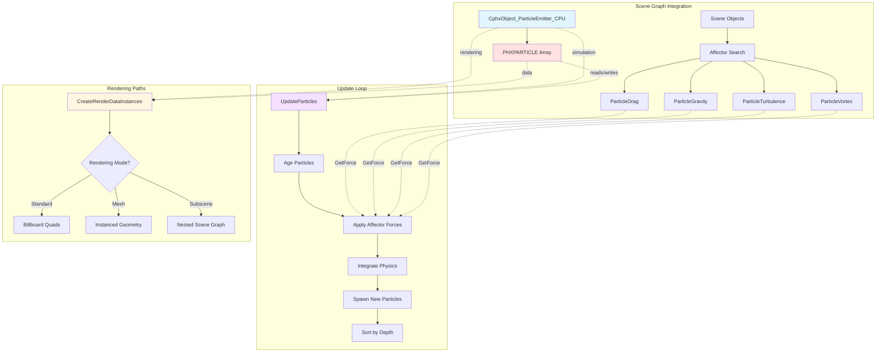
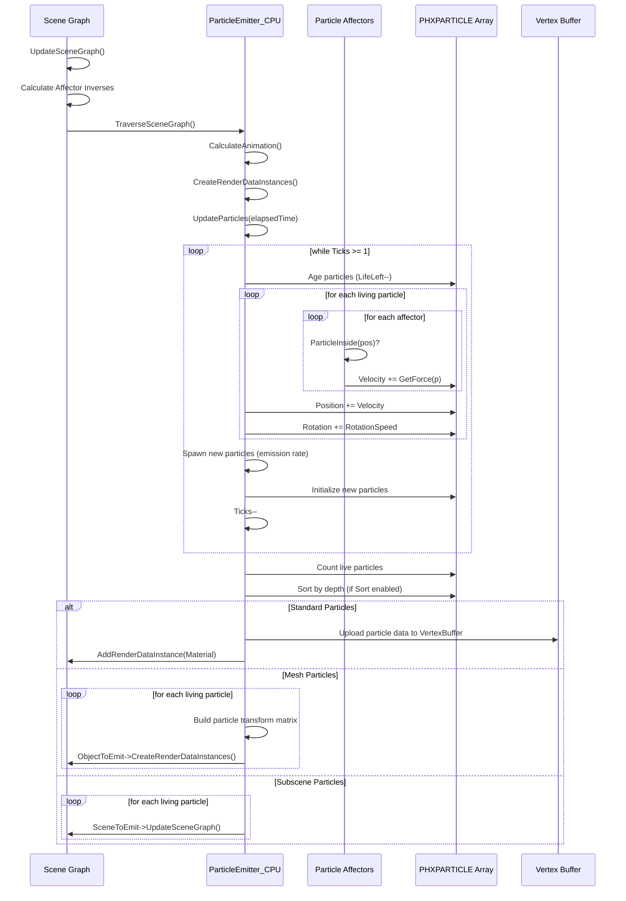

# Phoenix Particle System Overview

When you think of modern particle systems, you might picture GPU compute shaders spinning up millions of particles with physics simulations running in parallel on the graphics card. Phoenix takes a different path. Its particles live on the CPU, simulated at a fixed 25 frames per second, with all the logic written in straightforward C++ that fits comfortably in the compressed executable. Why? Because for 64k demos, simplicity and code size matter more than raw particle count.

This isn't a compromise born of technical limitation. It's a deliberate design decision. CPU-based particles give you complete control over every aspect of simulation. Need a particle to check its distance from five different affectors? Just write the loop. Want particles that spawn mesh instances with their own material animations? Call the model rendering code. Need custom emission patterns from child transform nodes? Walk the hierarchy. There's no shader language barrier, no GPU debugging nightmares, no synchronization headaches. Just particles as structs, forces as functions, and simulation as a straightforward update loop.

The architecture is remarkably clean. An emitter object spawns particles within a volume (box or sphere), initializing each with position, velocity, rotation, scale, and lifetime. Each frame, the system ages particles, applies forces from affector objects (drag, gravity, turbulence, vortex), integrates velocity into position, and sorts particles for rendering if needed. The rendering happens in one of three modes: billboard quads facing the camera, instanced mesh geometry, or even complete subscenes with their own animation hierarchies. All of it coordinated through the scene graph's familiar spline-driven animation system.

Think of the particle system like a stage full of autonomous performers. The emitter is the stage door—actors enter according to a schedule, each receiving a costume (initial state) and direction (velocity). Once on stage, they follow the choreography: aging with each beat, responding to directional cues from affector objects positioned in the space, moving through their dance. Some performers are simple light points (billboards), others carry full props (mesh instances), and some are entire sub-performances (subscene instances). The director (scene graph) coordinates everything through the same timing and spatial systems used for lights, cameras, and models.

This architecture matters because it reveals a fundamental truth about particle systems: you don't always need a million particles. Sometimes a thousand particles with rich behavior beats ten thousand particles with simple motion. Phoenix's CPU approach enables that richness—complex emission patterns, nested mesh instancing, spline-animated material properties per particle—all within the constraints of real-time demo rendering and 64k executables.

## The Challenge: Expressive Particles in Minimal Code

Particle systems face a design tension. You want expressive control—complex emission shapes, varied forces, custom rendering, animation over lifetime. But you also want minimal code size. Every feature adds bytes to the executable. GPU compute shaders require shader compilers, resource binding infrastructure, and synchronization logic. CPU particles require none of that, just structs and loops.

Phoenix resolves this tension through architectural cohesion. Particles don't live in isolation. They're scene objects, using the same spline system as cameras and lights, the same hierarchy system as models, the same material system as geometry. An emitter is just another `CphxObject` subclass. Affectors are just specialized scene nodes. The particle rendering code reuses the existing material pipeline. This design means adding particles costs hundreds of lines, not thousands.

The core insight is that particles are fundamentally spatial entities that need animation, hierarchy, and rendering—exactly what the scene graph already provides. Rather than building a parallel system, Phoenix extends the scene graph with particle-specific simulation behavior. The result is remarkably compact: about 450 lines for the core particle and affector implementation in Scene.cpp.

## System Architecture

The particle system has three main components working together: the emitter (spawns and simulates particles), affectors (apply forces), and the particle data structure (holds per-particle state).



The emitter runs at a fixed 25 fps timestep, decoupled from the rendering framerate. This is crucial for deterministic simulation. Whether you render at 30, 60, or 144 fps, the particle motion remains identical. The `Ticks` accumulator converts elapsed time into discrete simulation steps. If rendering runs faster than 25 fps, some frames process zero physics steps. If rendering runs slower, multiple physics steps catch up the simulation.

### Fixed Timestep Simulation

**Scene.h:15**

```cpp
#define PARTICLEENGINE_FRAMERATE 25.0f
```

Why 25 fps? It's a balance between smooth motion and CPU cost. Higher rates mean more simulation steps per second, increasing CPU load without proportional visual benefit. 25 fps provides smooth enough motion for typical particle effects—smoke, sparks, debris, magical auras. At 40ms per simulation step, even complex forces like turbulence remain responsive.

**Scene.cpp:463-539** shows the accumulator pattern:

```cpp
void CphxObject_ParticleEmitter_CPU::UpdateParticles(float elapsedtime, bool updatebuffer)
{
    int particlecount = 1 << BufferSize;
    Ticks += elapsedtime * PARTICLEENGINE_FRAMERATE;

    // Update particle system
    while (Ticks >= 1)
    {
        // Age and move particles
        for (int y = 0; y < particlecount; y++)
        {
            if (Aging) Particles[y].LifeLeft -= 1;
            if (Particles[y].LifeLeft > 0)
            {
                // Update velocity based on affecting forces
                for (int x = 0; x < affectorcount; x++)
                    if (affectors[x]->ParticleInside(Particles[y].Position))
                        Particles[y].Velocity += affectors[x]->GetForce(&Particles[y]);

                // Update position
                Particles[y].Position += Particles[y].Velocity;
                Particles[y].Rotation += Particles[y].RotationSpeed;
            }
        }

        // Spawn new particles
        // ... emission logic ...

        EmissionFraction--;
        Ticks--;
    }
}
```

The outer loop consumes whole timesteps. Each iteration ages all particles by one frame, applies forces, and integrates motion. The emission logic inside spawns particles according to the emission rate. After all complete timesteps are processed, the remaining `Ticks` fraction carries forward to the next call.

This pattern is common in game physics engines. It decouples simulation rate from framerate, ensuring consistent behavior across different hardware. The cost is that particles positions are slightly stale—they reflect the last complete timestep, not the current interpolated frame. Phoenix handles this by interpolating particle positions when uploading to the vertex buffer (Scene.cpp:592), smoothing out the 25 fps steps to match the render framerate.

## PHXPARTICLE Structure

Each particle is a complete physics entity with position, velocity, rotation state, scale parameters, lifetime tracking, and per-particle randomness.

**Scene.h:234-242**

```cpp
struct PHXPARTICLE
{
    D3DXVECTOR3 Position;
    D3DXVECTOR3 Velocity;
    float Rotation, RotationSpeed, Chaos, Scale, ScaleChaos, StretchX, StretchY;
    int MaxLife, LifeLeft;  // particle alive if LifeLeft > 0
    float RandSeed;
    D3DXVECTOR3 RotationAxis;
};
```

Let's break down each field and why it exists:

### Core Physics

**Position** and **Velocity** are standard Verlet integration state. Each frame, `Position += Velocity` advances the particle. Affectors modify `Velocity` by adding forces. Simple Euler integration is sufficient for demo particle effects—the visual quality doesn't justify higher-order integrators like Runge-Kutta.

**Rotation** stores the current angle in degrees. **RotationSpeed** is the angular velocity in degrees per frame. Like position and velocity, `Rotation += RotationSpeed` advances the angle each frame. This drives billboard rotation (particles spinning as they fly) or mesh instance rotation (spinning debris).

**RotationAxis** defines the 3D rotation axis for mesh particles. When rendering mesh instances (rather than billboards), the particle can rotate around an arbitrary axis defined at spawn time. This creates tumbling motion for debris, leaves, or mechanical parts.

### Scale and Stretch

**Scale** is the base size multiplier. A value of 1.0 renders at default size. **ScaleChaos** is the per-particle random scale modifier, applied at spawn time. If `ScaleChaos = 0.5`, particles spawn at 50-150% of the base scale, creating size variation.

**StretchX** and **StretchY** elongate particles along their local axes. A spark particle might have `StretchX = 3.0` and `StretchY = 1.0`, creating a stretched oval. Combined with rotation, this creates motion-blur-like streaking without actual motion blur rendering.

These are baked at spawn time from spline values:

**Scene.cpp:443-446**

```cpp
Particles[idx].ScaleChaos = max(0, 1 + ((rand() / (float)RAND_MAX) * 2 - 1) *
                                SplineResults[Spline_Particle_ScaleChaos]);
Particles[idx].Scale = SplineResults[Spline_Particle_Scale] * Particles[idx].ScaleChaos;
Particles[idx].StretchX = SplineResults[Spline_Particle_Stretch_X] * Particles[idx].Scale;
Particles[idx].StretchY = SplineResults[Spline_Particle_Stretch_Y] * Particles[idx].Scale;
```

### Lifetime Tracking

**MaxLife** stores the particle's initial lifetime in frames (at 25 fps). **LifeLeft** counts down each frame. When `LifeLeft` reaches zero, the particle is dead and can be reused for new emissions. The `Aging` flag controls whether particles age—when false, particles live forever (useful for static particle fields or persistent effects).

The lifetime is randomized at spawn:

**Scene.cpp:401**

```cpp
Particles[idx].MaxLife = Particles[idx].LifeLeft = Aging ?
    (int)((SplineResults[Spline_Particle_Life] +
           (rand() / (float)RAND_MAX) * SplineResults[Spline_Particle_LifeChaos]) *
          PARTICLEENGINE_FRAMERATE) : 1;
```

The normalized lifetime `(MaxLife - LifeLeft) / MaxLife` drives material animation. Shaders sample the spline texture (more on that later) using lifetime as the U coordinate, animating color, opacity, or other properties over the particle's life.

### Randomness

**Chaos** is a per-particle random value in [0,1], initialized at spawn. Materials can use this for per-particle variation—some particles brighter, some dimmer, some with different hues. It's passed to shaders alongside position and rotation.

**RandSeed** is currently unused but reserved for future per-particle procedural behaviors. The idea is that each particle carries a seed that could drive procedural textures or animation variations without requiring additional particle fields.

## Emitter Types and Emission Shapes

Emitters define the volume where particles spawn. Phoenix supports two shape primitives: box and sphere, with optional inner radius for hollow shapes.

### Box Emitter (EmitterType = 0)

Particles spawn uniformly within a unit cube centered at the origin, then transformed by the emitter's world matrix.

**Scene.cpp:403-406**

```cpp
do
{
    Particles[idx].Position = D3DXVECTOR3(rand() / (float)RAND_MAX - 0.5f,
                                          rand() / (float)RAND_MAX - 0.5f,
                                          rand() / (float)RAND_MAX - 0.5f);
} while (!(EmitterType != 1 || D3DXVec3LengthSq(&Particles[idx].Position) < 0.25));
```

Each component is in [-0.5, 0.5], creating a unit cube. The do-while loop only matters for sphere emitters (it keeps looping until the point is inside the sphere). For box emitters, the first iteration always succeeds.

The position transforms to world space using the emitter's transformation matrix:

**Scene.cpp:429-432**

```cpp
D3DXVECTOR4 va, vb, vc;
D3DXVec3Transform(&va, &Particles[idx].Position, &m);
D3DXVec3Transform(&vb, &Particles[idx].Position, &o);
D3DXVec4Lerp(&vc, &vb, &va, 1 - mt);
Particles[idx].Position = D3DXVECTOR3(vc);
```

The lerp between `o` (old matrix) and `m` (current matrix) smooths emission when the emitter moves rapidly. New particles spawn interpolated between the emitter's old and new positions, preventing gaps in particle trails.

### Sphere Emitter (EmitterType = 1)

Sphere emitters generate random points until one falls within a sphere of radius 0.5. The rejection sampling loop (Scene.cpp:406) rejects points where `length² > 0.25` (radius² = 0.5²).

This rejection approach is simple and correct, though not the most efficient method. A better approach would generate spherical coordinates (theta, phi, radius) uniformly. But rejection sampling compresses better—it's fewer instructions—and the expected iteration count is only ~1.9 for uniform sphere sampling.

### Inner Radius: Hollow Emitters

The `InnerRadius` field (0-255) creates hollow emission volumes. A value of 0 fills the entire shape. A value of 255 emits only at the outer surface. Intermediate values create shells.

**Scene.cpp:411-424** implements this:

```cpp
D3DXVECTOR3 outerboundarypos;
D3DXVECTOR3 originalpos = Particles[idx].Position;

float originallength = D3DXVec3Length(&originalpos);

float poslength = max(max(fabs(originalpos.x), fabs(originalpos.y)), fabs(originalpos.z));  // cube
if (EmitterType == 1) poslength = originallength;  // sphere
outerboundarypos = originalpos * 0.5f / poslength;

float outerlength = D3DXVec3Length(&outerboundarypos);
float r = lerp(InnerRadius / 255.0f, 1, originallength / outerlength);

Particles[idx].Position = outerboundarypos * r;
```

The code finds the "outer boundary position"—the point on the shape's surface in the direction of the original random position. For cubes, this uses the max absolute component (the dominant axis determines which face you hit). For spheres, it's the normalized direction scaled to radius 0.5.

Then it lerps from the inner radius ratio to 1.0 based on the original position's distance from center. A random point near the center maps toward the inner radius. A random point near the outer edge maps toward the outer radius. The result is uniform distribution in the shell volume.

### Emission from Child Transforms

One of Phoenix's cleverest features is emitting particles from child objects. If you parent dummy objects to the emitter, particles spawn from each child's transform rather than just the emitter's origin.

**Scene.cpp:475-486** collects child transform matrices:

```cpp
int objectcount = 1;
for (int x = 0; x < Scene->ObjectCount; x++)
{
    if (Scene->Objects[x]->Parent == this)
        objectcount++;
    // ... also collect affectors ...
}

D3DXMATRIX *matrices = new D3DXMATRIX[objectcount];
matrices[0] = currMatrix;

int cnt = 1;
for (int x = 0; x < Scene->ObjectCount; x++)
    if (Scene->Objects[x]->Parent == this)
    {
        matrices[cnt] = Scene->Objects[x]->currMatrix;
        oldmatrices[cnt++] = Scene->Objects[x]->prevMatrix;
    }
```

During emission, the code cycles through child matrices:

**Scene.cpp:530-531**

```cpp
int id = (objIdxMod++) % objectcount;
SpawnParticle(EmissionFraction - (int)EmissionFraction, matrices[id], oldmatrices[id],
              idx / (float)cnt);
```

This enables complex emission patterns. Want particles emitting in a circle? Create 12 child dummies arranged in a ring. Want a helix? Position children along a spiral path. Want a grid? Create a 5×5 array of emission points. All without writing custom emission code—just scene graph hierarchy.

## Affector Types

Affectors modify particle velocity based on spatial position. They're scene objects with a virtual `GetForce()` method that returns a force vector to apply to the particle's velocity.

All affectors share a common base class:

**Scene.h:307-320**

```cpp
class CphxObject_ParticleAffector : public CphxObject
{
public:
    unsigned char AreaType;
    bool ParticleInside(D3DXVECTOR3 v);
    virtual D3DXVECTOR3 GetForce(PHXPARTICLE *p) = 0;
};
```

The `AreaType` field determines influence volume. A value of 0 means infinite range (affects all particles). A value of 1 means box-shaped volume (affect only particles inside a 1×1×1 cube in the affector's local space).

**Scene.cpp:832-848**

```cpp
bool CphxObject_ParticleAffector::ParticleInside(D3DXVECTOR3 v)
{
    D3DXVECTOR4 pos;
    D3DXVec3Transform(&pos, &v, &inverse);

    if (AreaType)
        return pos.x < 0.5f && pos.x > -0.5f &&
               pos.y < 0.5f && pos.y > -0.5f &&
               pos.z < 0.5f && pos.z > -0.5f;

    return true;
}
```

The particle position transforms into the affector's local space using the precomputed inverse matrix (calculated during scene traversal, Scene.cpp:80-89). This is elegant: you position, rotate, and scale affectors in the scene just like any other object. The local-space test automatically handles orientation and size.

### ParticleDrag: Velocity Damping

Drag opposes motion, slowing particles over time. It's the simplest affector.

**Scene.cpp:920-925**

```cpp
D3DXVECTOR3 CphxObject_ParticleDrag::GetForce(PHXPARTICLE *p)
{
    return p->Velocity * (-SplineResults[Spline_AffectorPower]);
}
```

The force is velocity scaled by negative power. A power of 0.1 creates gentle drag. A power of 1.0 reduces velocity to zero in one second (at 25 fps, velocity becomes `velocity * (1 - 1.0)^25 ≈ 0` after 25 frames).

This is linear drag, not physically accurate quadratic air resistance. But it's visually convincing and computationally trivial. Demo particle effects prioritize visual appeal over physical accuracy.

### ParticleGravity: Directional and Point Attractors

Gravity affectors pull particles in a constant direction or toward a point.

**Scene.cpp:927-942**

```cpp
D3DXVECTOR3 CphxObject_ParticleGravity::GetForce(PHXPARTICLE *p)
{
    D3DXVECTOR3 pos = WorldPosition;

    if (Directional)
    {
        D3DXVec3Normalize(&pos, &pos);
        return pos * (SplineResults[Spline_AffectorPower] / 100.0f);
    }

    D3DXVECTOR3 v = pos - p->Position;
    float l = D3DXVec3Length(&v);
    return v * (SplineResults[Spline_AffectorPower] / (l * l * l) / 100.0f);
}
```

**Directional gravity** uses the affector's world position as the force direction (normalized). The force magnitude is constant everywhere. Use this for "down" forces (rain, snow) or wind effects.

**Point gravity** uses inverse-square falloff: `force = power / distance²`. The formula includes an extra division by `l` (the third `/l`), which normalizes the direction vector. This clever optimization combines normalization and distance scaling in one operation: `v * (power / l³)` equals `normalize(v) * (power / l²)`.

The `/100.0f` scaling factor keeps artist-facing power values intuitive. Setting power to 50 creates moderate attraction. Setting it to 500 creates strong pull. Without the scaling, artists would work with values like 0.5 and 5.0, which feel arbitrary.

### ParticleTurbulence: 3D Noise Fields

Turbulence creates chaotic, swirling motion using 3D value noise.

**Scene.h:350-368**

```cpp
class CphxObject_ParticleTurbulence : public CphxObject_ParticleAffector
{
    D3DXVECTOR3 SampleKernel(const D3DXVECTOR4& Pos);
public:
    D3DXVECTOR3 Kernel[32][32][32];
    unsigned char calculatedKernelSeed;

    void InitKernel();
    D3DXVECTOR3 GetForce(PHXPARTICLE *p);
};
```

The 32×32×32 kernel stores random direction vectors—32,768 vectors consuming 384 KB per turbulence object. This is substantial memory, but the quality is worth it. The kernel initialization is simple:

**Scene.cpp:852-867**

```cpp
void CphxObject_ParticleTurbulence::InitKernel()
{
    if (RandSeed == calculatedKernelSeed)
        return;

    srand(RandSeed);
    calculatedKernelSeed = RandSeed;
    for (int x = 0; x < 32; x++)
        for (int y = 0; y < 32; y++)
            for (int z = 0; z < 32; z++)
            {
                for (int i = 0; i < 3; i++)
                    Kernel[x][y][z][i] = (float)(rand() / (float)RAND_MAX) - 0.5f;
                D3DXVec3Normalize(&Kernel[x][y][z], &Kernel[x][y][z]);
            }
}
```

Each kernel cell holds a normalized random direction. The `RandSeed` caching means the kernel only regenerates when the seed changes, allowing artists to keyframe seed values to morph the turbulence field over time.

The force calculation uses multi-octave sampling for fractal noise:

**Scene.cpp:909-917**

```cpp
D3DXVECTOR3 CphxObject_ParticleTurbulence::GetForce(PHXPARTICLE *p)
{
    InitKernel();
    D3DXVECTOR4 Pos;
    D3DXVec3Transform(&Pos, &p->Position, &inverse);
    D3DXVECTOR3 v3 = SampleKernel(Pos * TurbulenceFrequency) +
                     SampleKernel(Pos * (TurbulenceFrequency * 2.0f)) * (1 / 2.0f) +
                     SampleKernel(Pos * (TurbulenceFrequency * 4.0f)) * (1 / 4.0f);
    D3DXVec3Normalize(&v3, &v3);
    return v3 * (SplineResults[Spline_AffectorPower] / 100.0f);
}
```

Three noise octaves combine: base frequency at full amplitude, double frequency at half amplitude, quadruple frequency at quarter amplitude. This creates both large-scale flow and small-scale detail, the hallmark of good turbulence.

The kernel sampling uses trilinear interpolation for smooth transitions between cells:

**Scene.cpp:874-906**

```cpp
D3DXVECTOR3 CphxObject_ParticleTurbulence::SampleKernel(const D3DXVECTOR4& Pos)
{
    int v[3];
    D3DXVECTOR3 f;
    D3DXVECTOR3 area[2][2][2];

    for (int x = 0; x < 3; x++)
    {
        v[x] = (int)Pos[x];
        if (Pos[x] < 0)
            v[x] -= 1;
        f[x] = (Pos[x] - v[x]);
    }

    for (int x = 0; x < 2; x++)
        for (int y = 0; y < 2; y++)
            for (int z = 0; z < 2; z++)
                area[x][y][z] = Kernel[(v[0] + x) & 31][(v[1] + y) & 31][(v[2] + z) & 31];

    D3DXVECTOR3 v1 = Lerp(area[0][0][0], area[1][0][0], f.x);
    D3DXVECTOR3 v2 = Lerp(area[0][1][0], area[1][1][0], f.x);
    D3DXVECTOR3 v3 = Lerp(area[0][0][1], area[1][0][1], f.x);
    D3DXVECTOR3 v4 = Lerp(area[0][1][1], area[1][1][1], f.x);
    D3DXVECTOR3 v5 = Lerp(v1, v2, f.y);
    D3DXVECTOR3 v6 = Lerp(v3, v4, f.y);
    D3DXVECTOR3 res = Lerp(v5, v6, f.z);
    D3DXVec3Normalize(&res, &res);

    return res;
}
```

The `& 31` wrapping makes the kernel tileable—particles can move beyond the 32×32×32 grid and the noise pattern repeats seamlessly. This is standard value noise implementation, the same technique used in Perlin noise but with random directions instead of gradients.

### ParticleVortex: Rotational Forces

Vortex affectors create spinning motion around an axis.

**Scene.cpp:944-959**

```cpp
D3DXVECTOR3 CphxObject_ParticleVortex::GetForce(PHXPARTICLE* p)
{
    float pwr = SplineResults[Spline_AffectorPower];

    D3DXVECTOR3 pos = WorldPosition;
    D3DXVECTOR3 v = pos - p->Position;
    D3DXVECTOR4 axis;
    D3DXVECTOR3 force;
    D3DXVec3Transform(&axis, &D3DXVECTOR3(0, 1, 0), &GetWorldMatrix());
    D3DXVec3Normalize((D3DXVECTOR3*)&axis, (D3DXVECTOR3*)&axis);
    D3DXVec3Normalize(&v, &v);
    D3DXVec3Cross(&force, (D3DXVECTOR3*)&axis, &v);
    return force * pwr;
}
```

The vortex axis is the affector's local Y axis transformed to world space. The direction from particle to vortex center is `v`. The cross product `axis × v` produces a force perpendicular to both, creating circular motion.

Unlike gravity, the force magnitude is constant regardless of distance. Particles near the center spin at the same angular rate as particles far away. For tornado-like effects, combine a vortex with a point gravity pulling inward—the gravity provides radial acceleration while the vortex provides tangential acceleration.

## Affector Power Summary

| Affector | Force Formula | Power Interpretation | Typical Range |
|----------|---------------|---------------------|---------------|
| **Drag** | `velocity × -power` | Damping coefficient | 0.05 - 0.5 |
| **Gravity (Directional)** | `direction × power / 100` | Acceleration magnitude | 10 - 100 |
| **Gravity (Point)** | `direction × power / distance³ / 100` | Attraction strength | 50 - 500 |
| **Turbulence** | `noise3D(pos × freq) × power / 100` | Force magnitude | 5 - 50 |
| **Vortex** | `cross(axis, direction) × power` | Tangential acceleration | 0.01 - 0.1 |

The power values are spline-animated through `Spline_AffectorPower`, allowing affector strength to change over time. A gravity well that pulses, turbulence that intensifies, drag that suddenly kicks in—all achieved through animation curves.

## Rendering Modes

Phoenix supports three distinct rendering approaches for particles: standard billboards, instanced meshes, and nested subscenes.

### Standard Particles: Billboard Quads

The most common mode renders particles as camera-facing quads with a custom material.

**Scene.h:276-283**

```cpp
ID3D11Texture2D *SplineTexture;
ID3D11ShaderResourceView *SplineTextureView;
ID3D11Buffer* VertexBuffer;
CphxMaterialPassConstantState **MaterialState;
CphxMaterial *Material;
```

The vertex buffer stores per-particle data: position (xyz), lifetime (w), rotation, and chaos. The material's vertex shader expands each particle into a quad facing the camera. The pixel shader samples the spline texture to animate material properties over the particle's lifetime.

**Scene.cpp:574-605** uploads particle data to the vertex buffer:

```cpp
D3D11_MAPPED_SUBRESOURCE ms;
phxContext->Map(VertexBuffer, NULL, D3D11_MAP_WRITE_DISCARD, NULL, &ms);

float *Data = (float*)ms.pData;

for (int y = 0; y < LiveCount; y++)
{
    int idx = DistanceBuffer[y].Idx;

    D3DXVECTOR3 v = Particles[idx].Position + Particles[idx].Velocity * Ticks;  // interpolate
    Data[0] = v.x;
    Data[1] = v.y;
    Data[2] = v.z;
    Data[3] = 1;
    Data[4] = Aging ? (Particles[idx].LifeLeft - Ticks) / (float)Particles[idx].MaxLife : 1;
    Data[5] = Particles[idx].Rotation + Particles[idx].RotationSpeed * Ticks;
    Data[6] = Particles[idx].Chaos;
    Data[7] = 0;
    Data += 8;
}

phxContext->Unmap(VertexBuffer, NULL);
```

The interpolation `Position + Velocity × Ticks` smooths the 25 fps physics to match the render framerate. If the simulation last updated 0.7 timesteps ago, particles render 70% of the way toward their next position.

### Spline Texture System

Material parameters can animate over particle lifetime. Evaluating splines per particle per frame on the CPU is expensive, so Phoenix bakes spline curves into a texture.

**Scene.cpp:729-774**

```cpp
void CphxObject_ParticleEmitter_CPU::UpdateSplineTexture()
{
    int splinecnt = 0;
    for (int x = 0; x < Clips[0]->MaterialSplines->SplineCount; x++)
    {
        CphxMaterialSpline *s = Clips[0]->MaterialSplines->Splines[x];
        if (s->Target->Type == PARAM_PARTICLELIFEFLOAT) splinecnt++;
    }

    splinecnt = 0;
    for (int x = 0; x < Clips[0]->MaterialSplines->SplineCount; x++)
    {
        CphxMaterialSpline *s = Clips[0]->MaterialSplines->Splines[x];
        if (s->Target->Type == PARAM_PARTICLELIFEFLOAT)
        {
            for (int z = 0; z < 2048; z++)
            {
                s->Splines[0]->CalculateValue(z / 2048.0f);
                texturedata[z + splinecnt * 2048] = s->Splines[0]->Value[0];
            }
            splinecnt++;
        }
    }

    // Create 2048×N texture (DXGI_FORMAT_R32_FLOAT)
    D3D11_TEXTURE2D_DESC tex = {2048, splinecnt, 1, 1, DXGI_FORMAT_R32_FLOAT, ...};
    D3D11_SUBRESOURCE_DATA data = {texturedata, 2048 * 4, 0};

    phxDev->CreateTexture2D(&tex, &data, &SplineTexture);
    phxDev->CreateShaderResourceView(SplineTexture, NULL, &SplineTextureView);
}
```

Material parameters marked as `PARAM_PARTICLELIFEFLOAT` get baked: 2048 samples from time 0 to 1. The texture layout is 2048 pixels wide (U coordinate = lifetime) by N pixels tall (V coordinate = parameter index). Shaders sample using `texture(splineTexture, vec2(lifetime, parameterIndex))`.

This converts per-particle curve evaluation into texture lookups. The 2048-sample resolution provides smooth interpolation. Common animated parameters include opacity (fade in/out), color (shift from yellow to red), scale (grow then shrink), emissive intensity (flash at spawn).

### Mesh Particles: Instanced Geometry

When `ObjectToEmit` is set, each particle spawns an instance of a mesh model.

**Scene.cpp:648-723**

```cpp
int particlecount = 1 << BufferSize;
for (int y = 0; y < particlecount; y++)
{
    if (Particles[y].LifeLeft > 0)
    {
        D3DXMATRIX m;
        D3DXQUATERNION q;

        if (!RotateToDirection)
        {
            D3DXQuaternionRotationAxis(&q, &Particles[y].RotationAxis,
                (Particles[y].Rotation + Particles[y].RotationSpeed * Ticks) * 3.1415f / 180.0f);
        }
        else
        {
            // Build quaternion from velocity direction
            D3DXVECTOR3 xd = Particles[y].Velocity;
            D3DXVECTOR3 yd, zd;
            D3DXVec3Normalize(&xd, &xd);
            D3DXVECTOR3 up(0, 1, 0);
            D3DXVec3Normalize(&zd, D3DXVec3Cross(&zd, &xd, &up));
            D3DXVec3Normalize(&yd, D3DXVec3Cross(&yd, &zd, &xd));
            D3DXMATRIX mx;
            D3DXMatrixIdentity(&mx);
            *(D3DXVECTOR3*)mx.m[0] = xd;
            *(D3DXVECTOR3*)mx.m[1] = yd;
            *(D3DXVECTOR3*)mx.m[2] = zd;
            D3DXQuaternionRotationMatrix(&q, &mx);
            // Additional rotation around X axis
            D3DXQUATERNION q2;
            D3DXQuaternionRotationAxis(&q2, &D3DXVECTOR3(1, 0, 0),
                (Particles[y].Rotation + Particles[y].RotationSpeed * Ticks) * 3.1415f / 180.0f);
            D3DXQuaternionMultiply(&q, &q2, &q);
        }

        float life = Aging ? (1 - ((Particles[y].LifeLeft - Ticks) / (float)Particles[y].MaxLife)) : 0.0f;

        float scale = 1;
        float scalex = 1;
        float scaley = 1;
        for (int x = 0; x < Clips[Clip]->SplineCount; x++)
        {
            if (Clips[Clip]->Splines[x]->Type == Spline_Particle_Scale)
            {
                Clips[Clip]->Splines[x]->Spline->CalculateValue(life);
                scale = max(0, Particles[y].ScaleChaos) * Clips[Clip]->Splines[x]->Spline->Value[0];
            }
            // ... similar for StretchX and StretchY ...
        }

        D3DXVECTOR3 interpolatedPosition = Particles[y].Position + Particles[y].Velocity * Ticks;
        D3DXMatrixTransformation(&m, nullptr, nullptr,
            &D3DXVECTOR3(scale * scalex, scale * scaley, scale),
            nullptr, &q, &interpolatedPosition);

        Clips[Clip]->MaterialSplines->CalculateValues(life);
        ObjectToEmit->CreateRenderDataInstances(Clips[Clip], m, RootScene, SubSceneData);
    }
}
```

Each living particle builds a transformation matrix from its position, rotation quaternion, and scale. The `RotateToDirection` flag controls whether particles rotate according to `RotationAxis` or align with their velocity direction (useful for arrows, missiles, or swooshing trails).

The scale splines are evaluated at the particle's lifetime, allowing particles to grow and shrink over their life. Material splines are also evaluated at lifetime, enabling color shifts, opacity fades, or roughness changes as the particle ages.

Finally, `ObjectToEmit->CreateRenderDataInstances()` stamps the mesh at the particle's transform. This goes through the full material rendering pipeline—multiple material passes, shadow casting, lighting—just like any other model in the scene.

### Subscene Particles: Nested Animation

When `SceneToEmit` is set, each particle spawns an entire animated scene.

**Scene.cpp:707-711**

```cpp
if (SceneToEmit)
{
    SceneToEmit->UpdateSceneGraph(0, life, m, RootScene, SubSceneData);
}
```

The subscene's animation timeline is driven by the particle's lifetime. A particle with `life = 0.5` (halfway through its life) evaluates the subscene at time 0.5. This creates synchronized nested animations—imagine particles that are flapping birds, each with wing animation phased by their spawn time.

The transform matrix `m` positions the subscene at the particle's location. Any objects in the subscene (models, lights, even nested particle emitters) render relative to that transform. This is Phoenix's particle system at its most expressive: particles that are themselves complete animated scenes.

## Data Flow: Spawn to Render

Let's trace a single frame's particle update to see how all the pieces fit together.



The key insight is separation of concerns. Physics simulation happens in `UpdateParticles()` at 25 fps. Rendering happens in `CreateRenderDataInstances()` at the display framerate. The interpolation between them (`Position + Velocity × Ticks`) bridges the gap, providing smooth motion without running physics at 60+ fps.

## Particle Sorting

When particles use alpha blending, rendering order matters. Back-to-front sorting ensures correct transparency compositing.

**Scene.cpp:547-572**

```cpp
LiveCount = 0;

D3DXVECTOR4 cd1, cd2;
D3DXMATRIX mx;
D3DXMatrixTranspose(&mx, &phxViewMatrix);
D3DXVec3Transform(&cd1, &D3DXVECTOR3(0, 0, 1), &mx);
D3DXVec3Transform(&cd2, &D3DXVECTOR3(0, 0, 0), &mx);
D3DXVECTOR3 camdir = *(D3DXVECTOR3*)&(cd1 - cd2);

for (int y = 0; y < particlecount; y++)
{
    if (Particles[y].LifeLeft > 0)
    {
        DistanceBuffer[LiveCount].Idx = y;
        if (Sort)
            DistanceBuffer[LiveCount].Dist = Particles[y].Position.x * camdir.x +
                                             Particles[y].Position.y * camdir.y +
                                             Particles[y].Position.z * camdir.z;
        LiveCount++;
    }
}

if (Sort)
    qsort(DistanceBuffer, LiveCount, sizeof(PHXPARTICLEDISTANCE), ParticleSorter);
```

The camera forward direction is extracted from the view matrix (the third column, representing the Z basis vector). The dot product between particle position and camera direction gives depth along the view axis. Standard library `qsort` sorts the distance buffer, and subsequent rendering uses `DistanceBuffer[i].Idx` to access particles in back-to-front order.

Sorting is optional because it costs CPU time. Additive blending doesn't require sorting (order-independent). Opaque particles don't need sorting. Only alpha-blended particles where overlap order affects appearance need the sort.

**Scene.h:244-248**

```cpp
struct PHXPARTICLEDISTANCE
{
    int Idx;
    float Dist;
};
```

The indirection through a distance buffer avoids moving entire particle structs during sorting. Particles stay in place; only the 8-byte distance entries shuffle. This is faster than sorting a 64-byte particle array.

## Integration with Scene Graph

Particle emitters aren't isolated systems. They're `CphxObject` subclasses, fully integrated into the scene graph with hierarchy, animation, and rendering.

### Spline-Driven Parameters

All emission parameters come from splines:

| Spline | Default | Purpose |
|--------|---------|---------|
| `Spline_Particle_EmissionPerSecond` | 25 | Particles spawned per second |
| `Spline_Particle_EmissionVelocity` | 1.0 | Initial velocity magnitude |
| `Spline_Particle_EmissionVelocityChaos` | 0 | Random velocity variation |
| `Spline_Particle_Life` | 10 | Particle lifetime in seconds |
| `Spline_Particle_LifeChaos` | 0 | Random lifetime variation |
| `Spline_Particle_EmissionRotation` | 0 | Initial rotation speed (deg/frame) |
| `Spline_Particle_EmissionRotationChaos` | 0 | Random rotation speed variation |
| `Spline_Particle_Scale` | 1.0 | Base particle scale |
| `Spline_Particle_ScaleChaos` | 0 | Random scale variation |
| `Spline_Particle_Stretch_X` | 1.0 | Horizontal stretch multiplier |
| `Spline_Particle_Stretch_Y` | 1.0 | Vertical stretch multiplier |
| `Spline_Particle_Offset_x/y/z` | 0 | Emission position offset |

These splines are evaluated in `CalculateAnimation()` like any other scene object. An emitter's emission rate can ramp up over time, explosions can pulse scale, fountains can rotate their emission direction—all through the standard animation system.

### Hierarchical Emission

Parenting objects to the emitter creates multi-source emission. The code iterates child objects and collects their transform matrices:

**Scene.cpp:475-502**

```cpp
int objectcount = 1;

for (int x = 0; x < Scene->ObjectCount; x++)
    if (Scene->Objects[x]->Parent == this)
        objectcount++;

D3DXMATRIX *matrices = new D3DXMATRIX[objectcount];
D3DXMATRIX *oldmatrices = new D3DXMATRIX[objectcount];
matrices[0] = currMatrix;
oldmatrices[0] = prevMatrix;

int cnt = 1;
for (int x = 0; x < Scene->ObjectCount; x++)
    if (Scene->Objects[x]->Parent == this)
    {
        matrices[cnt] = Scene->Objects[x]->currMatrix;
        oldmatrices[cnt++] = Scene->Objects[x]->prevMatrix;
    }
```

During emission, `objIdxMod` cycles through child indices:

**Scene.cpp:530**

```cpp
int id = (objIdxMod++) % objectcount;
SpawnParticle(EmissionFraction - (int)EmissionFraction, matrices[id], oldmatrices[id],
              idx / (float)cnt);
```

This distributes particles evenly across emission sources. If you have 5 child objects and emit 100 particles per second, each child emits 20 particles per second.

### Affector Search

Affectors are discovered by searching the scene's object array:

**Scene.cpp:476-485**

```cpp
int affectorcount = 0;

for (int x = 0; x < Scene->ObjectCount; x++)
{
    if (Scene->Objects[x]->ObjectType == Object_ParticleGravity ||
        Scene->Objects[x]->ObjectType == Object_ParticleDrag ||
        Scene->Objects[x]->ObjectType == Object_ParticleTurbulence ||
        Scene->Objects[x]->ObjectType == Object_ParticleVortex)
        affectors[affectorcount++] = (CphxObject_ParticleAffector*)Scene->Objects[x];
}
```

There's no explicit linking between emitters and affectors. All affectors in the scene potentially affect all emitters. The `ParticleInside()` check filters which affectors actually apply forces to each particle.

This simplicity is elegant for demos. You position affectors in the scene and they "just work" on nearby particles. For large-scale simulations with hundreds of affectors, you'd want spatial acceleration (quadtrees, octrees, bounding volume hierarchies). For demos with 5-10 affectors, the linear search is fine.

## Implications for Rust Framework

Phoenix's particle system offers several design lessons for a modern creative coding framework.

### CPU vs GPU Particles

Phoenix chose CPU simulation for simplicity and code size. Modern frameworks should offer both:

**CPU particles** for flexibility. Complex custom logic, easy debugging, integration with gameplay systems. Suitable for < 10,000 particles with rich behavior.

**GPU particles** for scale. Compute shader simulation, millions of particles, parallel force evaluation. Suitable for effects like rain, snow, explosions, or abstract visuals.

The API should be unified. Both modes implement the same `ParticleSystem` trait:

```rust
trait ParticleSystem {
    fn emit(&mut self, count: usize, transform: &Mat4);
    fn update(&mut self, delta_time: f32, affectors: &[Box<dyn Affector>]);
    fn render(&self, context: &mut RenderContext);
}
```

Artists choose CPU or GPU implementation based on their needs. The scene graph doesn't distinguish between them.

### Fixed Timestep Simulation

The accumulator pattern decouples simulation from rendering. This is essential for deterministic behavior. Rust frameworks should provide this as a standard utility:

```rust
struct FixedTimestep {
    accumulator: f32,
    timestep: f32,
}

impl FixedTimestep {
    fn update<F>(&mut self, delta_time: f32, mut simulate: F)
    where
        F: FnMut(),
    {
        self.accumulator += delta_time;
        while self.accumulator >= self.timestep {
            simulate();
            self.accumulator -= self.timestep;
        }
    }

    fn alpha(&self) -> f32 {
        self.accumulator / self.timestep
    }
}
```

The `alpha()` method returns the interpolation factor for rendering between physics steps, matching Phoenix's `Ticks` interpolation.

### Affector as Trait

Phoenix's affector system maps naturally to Rust traits:

```rust
trait ParticleAffector {
    fn contains(&self, position: Vec3) -> bool;
    fn force(&self, particle: &Particle) -> Vec3;
}

struct Drag {
    power: f32,
    area: InfluenceVolume,
}

impl ParticleAffector for Drag {
    fn contains(&self, position: Vec3) -> bool {
        self.area.contains(position)
    }

    fn force(&self, particle: &Particle) -> Vec3 {
        particle.velocity * -self.power
    }
}
```

The `Box<dyn ParticleAffector>` dynamic dispatch cost is negligible compared to particle simulation cost. Type safety ensures affectors can't be misused.

### Spline Texture Baking

Phoenix's curve-to-texture optimization should be generalized. Any frequently-evaluated curve can be baked:

```rust
struct BakedCurve<T> {
    samples: Vec<T>,
}

impl<T: Lerp> BakedCurve<T> {
    fn new(curve: &Curve<T>, sample_count: usize) -> Self {
        let samples = (0..sample_count)
            .map(|i| curve.evaluate(i as f32 / sample_count as f32))
            .collect();
        BakedCurve { samples }
    }

    fn sample(&self, t: f32) -> T {
        let idx = (t * self.samples.len() as f32).clamp(0.0, self.samples.len() as f32 - 1.0);
        let i = idx.floor() as usize;
        let frac = idx.fract();
        if i + 1 < self.samples.len() {
            self.samples[i].lerp(&self.samples[i + 1], frac)
        } else {
            self.samples[i].clone()
        }
    }
}
```

For GPU access, upload to a texture or storage buffer. For CPU access, keep as a `Vec<T>`. The abstraction is the same.

### Power-of-Two Particle Buffers

Phoenix uses `1 << BufferSize` for particle counts. This simplifies allocation and enables wrapping via `& mask`:

```rust
struct ParticleBuffer {
    particles: Vec<Particle>,
    capacity_log2: u8,
}

impl ParticleBuffer {
    fn new(capacity_log2: u8) -> Self {
        let capacity = 1 << capacity_log2;
        ParticleBuffer {
            particles: vec![Particle::default(); capacity],
            capacity_log2,
        }
    }

    fn capacity(&self) -> usize {
        1 << self.capacity_log2
    }

    fn wrap_index(&self, idx: usize) -> usize {
        idx & ((1 << self.capacity_log2) - 1)
    }
}
```

This pattern is useful for ring buffers, circular queues, and other fixed-size data structures.

### Separation of Simulation and Rendering

Phoenix's `UpdateParticles()` and `CreateRenderDataInstances()` separation should be preserved in Rust:

```rust
trait ParticleSystem {
    // Called at fixed timestep
    fn simulate(&mut self, affectors: &[Box<dyn Affector>]);

    // Called every frame
    fn render(&self, context: &mut RenderContext);
}
```

This enables:
- Running simulation on a background thread
- Scrubbing timeline without rendering
- Rendering the same simulation state multiple times (shadows, reflections)
- Testing simulation logic without GPU context

### Emission from Hierarchy

Phoenix's multi-source emission from child objects is elegant. Rust frameworks should support this pattern:

```rust
struct ParticleEmitter {
    emission_sources: Vec<EntityId>,  // Child entities to emit from
}

impl ParticleEmitter {
    fn emit(&mut self, scene: &Scene) {
        let transforms: Vec<Mat4> = self.emission_sources
            .iter()
            .filter_map(|id| scene.get_transform(*id))
            .collect();

        let per_source = self.emission_rate / transforms.len();
        for transform in transforms {
            self.spawn_particles(per_source, &transform);
        }
    }
}
```

Entity IDs replace pointers, avoiding Rust ownership issues. The emission logic is the same: collect transforms, distribute particles across sources.

### Mesh and Subscene Particles

Phoenix's ability to emit meshes or subscenes as particles is powerful but niche. Most frameworks don't need this. But when you do need it—for effects like shattering objects, flocks of animated creatures, or recursive particle systems—it's invaluable.

A Rust framework could support this through generic particle data:

```rust
enum ParticleRenderMode {
    Billboard { material: MaterialId },
    Mesh { model: ModelId },
    Subscene { scene: SceneId },
}

struct ParticleEmitter {
    render_mode: ParticleRenderMode,
}
```

The rendering code matches on `render_mode` and handles each case appropriately. This keeps the common case (billboards) efficient while supporting advanced cases when needed.

## Related Documents

This overview introduces Phoenix's particle system architecture. For detailed subsystem documentation, see:

- **emitters.md** — Emission shapes, multi-source emission, hierarchical spawning patterns
- **affectors.md** — Force calculations, area types, multi-octave turbulence, inverse transforms
- **simulation.md** — Fixed timestep integration, particle lifecycle, sorting algorithms
- **rendering.md** — Billboard expansion, spline textures, mesh instancing, subscene rendering

For implementation traces with source references:

- **../code-traces/particle-emission.md** — Complete emission walkthrough from spawn to render
- **../code-traces/turbulence-noise.md** — Trilinear sampling, kernel initialization, multi-octave combining

For cross-system integration:

- **../scene/overview.md** — How particles integrate with the scene graph system
- **../scene/objects.md** — Detailed particle emitter and affector object documentation
- **../rendering/materials.md** — How particle materials use the spline texture system

## Source File Reference

| File | Lines | Purpose | Key Functions |
|------|-------|---------|---------------|
| Scene.h | 234-242 | PHXPARTICLE struct | Particle data structure definition |
| Scene.h | 250-305 | CphxObject_ParticleEmitter_CPU | Emitter class, rendering modes |
| Scene.h | 307-381 | Affector classes | ParticleDrag, ParticleGravity, ParticleTurbulence, ParticleVortex |
| Scene.cpp | 373-453 | SpawnParticle() | Emission shape, inner radius, child transforms |
| Scene.cpp | 463-539 | UpdateParticles() | Fixed timestep loop, affector forces, physics integration |
| Scene.cpp | 547-572 | Particle sorting | Depth calculation, qsort integration |
| Scene.cpp | 574-605 | Vertex buffer upload | Position interpolation, lifetime calculation |
| Scene.cpp | 608-723 | CreateRenderDataInstances() | Standard, mesh, and subscene particle rendering |
| Scene.cpp | 729-774 | UpdateSplineTexture() | Bake material splines into 2048×N texture |
| Scene.cpp | 831-959 | Affector implementations | ParticleInside, GetForce for all affector types |

**Key constants:**

- **PARTICLEENGINE_FRAMERATE** (Scene.h:15): 25.0f — Fixed simulation timestep
- **PARTICLESIZE** (Scene.h:232): 32 bytes — Particle data size for GPU upload

**Key spline types:**

- **Spline_Particle_EmissionPerSecond** (40): Particles spawned per second
- **Spline_Particle_EmissionVelocity** (42): Initial velocity magnitude
- **Spline_Particle_Life** (43): Particle lifetime in seconds
- **Spline_Particle_Scale** (51): Base particle scale
- **Spline_AffectorPower** (50): Affector force magnitude

All source paths are relative to `demoscene/apex-public/apEx/Phoenix/`.
