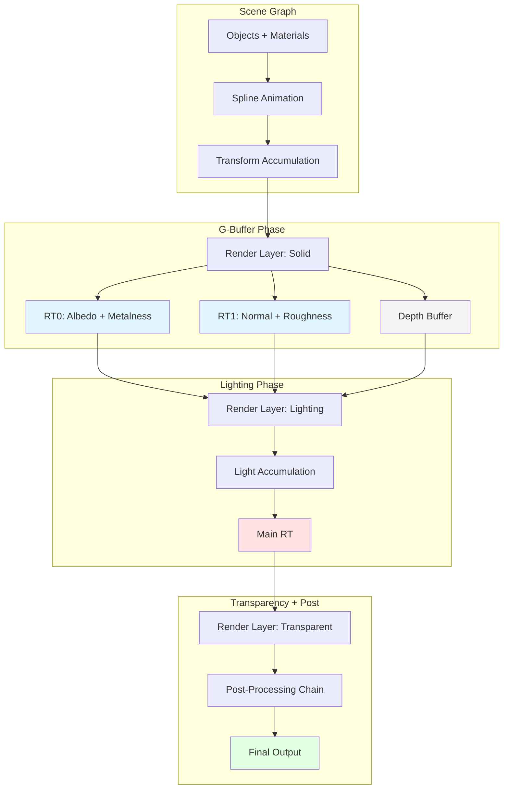

# apEx PBR Rendering System Overview

When you're rendering a 64k demo, you can't ship megabytes of engine middleware. Every shader, every material parameter, every lighting algorithm needs to justify its bytes. Yet Clean Slate and other apEx productions achieve visuals that rival AAA game engines—physically based materials, area lights with proper soft shadows, deferred rendering with multiple light sources. The trick isn't magic; it's ruthless focus on what matters visually and what compresses well in the final executable.

The Phoenix engine implements a complete PBR pipeline through three interconnected systems. Materials define surface properties—roughness, metalness, albedo—and organize them into rendering passes. Shaders implement the Cook-Torrance BRDF, derivative-based tangent reconstruction, and area light integration. The deferred rendering infrastructure writes material properties to G-Buffers, then accumulates lighting contributions in separate passes. Together, these systems transform a scene graph into photorealistic output.

The key insight is that PBR isn't about complex code—it's about correct math. The core BRDF equations fit in a few dozen lines. Normal mapping without tangent vectors uses screen-space derivatives. Area lights use analytical approximations or pre-computed lookup tables (LTC). Each technique is mathematically elegant and compresses well. The complexity budget goes to visual impact, not architectural overhead.

Think of the rendering system like a photography studio. The G-Buffer pass captures "reference photos" of every surface—its color, roughness, metalness, and facing direction. Then lighting passes act like studio lights, each calculating how much illumination reaches each pixel based on those recorded properties. The final image composites all lighting contributions. Separating material capture from light calculation means you can add lights without re-rendering geometry.

This architecture matters because most creative coding frameworks make you choose: either simple forward rendering with limited lights, or complex deferred pipelines that consume hundreds of kilobytes. Phoenix achieves both quality and compactness by implementing only what 64k demos actually need—no shadow cascades for open worlds, no clustered lighting for thousands of lights, just elegant algorithms for controlled scenes.

## System Architecture

Phoenix's PBR pipeline flows through four major phases: G-Buffer generation, deferred lighting, transparency handling, and post-processing. Each phase operates on render layers with specific render targets and blend modes.



The flow starts when the timeline triggers a scene render. The scene graph traverses objects, evaluating animation splines and accumulating transformation matrices. Each mesh creates render instances for its material passes, organized into render layers. Layers execute in order, each targeting specific render textures with appropriate clear and blend states.

## Render Layer Organization

Clean Slate defines four primary render layers that execute in sequence. Each layer has a distinct purpose in the PBR pipeline.

| Layer | Purpose | Render Targets | Notes |
|-------|---------|----------------|-------|
| Shadow Layer | Shadow map generation | Shadow Map RT | Depth-only rendering |
| Solid Layer | G-Buffer generation | Main RT, Albedo+Metal, Normal+Rough | Multi-render-target output |
| Lighting Layer | Deferred light accumulation | Main RT | No depth write, additive blend |
| Transparent Layer | Alpha-blended geometry | Main RT | Standard forward rendering |

This organization separates concerns cleanly. Shadow mapping happens first because lights need shadow maps. G-Buffer generation writes all material properties in one geometry pass. Lighting reads the G-Buffer and accumulates contributions additively. Transparency renders last with standard forward shading because transparent surfaces can't participate in deferred lighting.

## G-Buffer Layout

The G-Buffer packs material properties into two render targets plus depth. This minimizes memory bandwidth while capturing all PBR inputs.

| Render Target | RGB Channels | Alpha Channel | Format |
|---------------|--------------|---------------|--------|
| RT0 | Albedo color | Metalness | RGBA8 |
| RT1 | World normal | Roughness | RGBA8 or RGBA16F |
| Depth | — | — | D24_S8 or D32F |

This layout exploits the fact that metalness and roughness are single scalars. Packing them into alpha channels halves bandwidth compared to separate render targets. The trade-off is precision—8-bit alpha limits metalness/roughness to 256 levels—but for most materials, this is sufficient.

World normals store in RGB rather than view-space normals. This simplifies the lighting pass because light positions are already in world space. No per-pixel view-to-world transformation needed.

## PBR Material Model

Phoenix implements the metalness workflow, the same approach used by Unreal Engine, Unity, and Substance Designer. Materials specify three primary properties.

**Albedo** is the base color of the surface. For non-metals (dielectrics), this represents diffuse reflection color. For metals, it represents the specular reflection color. The same texture channel serves both purposes, interpreted differently based on metalness.

**Metalness** is a binary-ish property: surfaces are either metal (1.0) or non-metal (0.0). Values between 0 and 1 represent mixed or layered materials. At metalness 0, specular reflectance uses 4% (F0 = 0.04)—typical for plastics and ceramics. At metalness 1, specular reflectance uses the albedo color—metals reflect their body color.

**Roughness** controls microfacet distribution. Low roughness (0.0) produces sharp reflections like polished chrome. High roughness (1.0) produces diffuse-like broad highlights like rough concrete. The value maps to the GGX distribution's alpha parameter through squaring: `alpha = roughness^2`.

Additional properties come from material parameters and modifiers:

- **Normal maps** perturb surface normals for fine detail without geometry
- **Roughness/metalness modifiers** adjust texture values at runtime via splines
- **Emissive** adds self-illumination independent of lighting

### Emissive Materials

Phoenix supports emissive (self-illuminating) materials through a texture-driven approach. The emissive map occupies texture slot 2 with the following layout:

| Channel | Purpose |
|---------|---------|
| RGB | Emissive color and intensity |
| Alpha | Alpha mask for cutout effects |

Emissive uses "mixed rendering"—a hybrid of forward and deferred. The shader writes to the G-Buffer for reflections while also computing lighting and adding emissive contribution directly:

```hlsl
float3 Lo = emissiveMap.xyz;  // Initialize with emissive
for (int i = 0; i < lightcount; i++) {
    // ... BRDF calculations ...
    Lo += (kD * albedo / PI + specular) * radiance * NdotL;
}
```

This approach allows emissive surfaces to:
- Glow in complete darkness (emissive adds directly to output)
- Participate in reflections (G-Buffer still written)
- Use alpha cutout for complex shapes (`discard` based on emissive alpha)

## BRDF Implementation

The Cook-Torrance microfacet BRDF calculates specular reflection as three multiplicative terms:

```
f_specular = D(h) * F(v,h) * G(l,v,n) / (4 * (n·l) * (n·v))
```

Phoenix implements each term with optimized approximations:

**D_GGX** (Normal Distribution Function) describes how microfacets orient relative to the half-vector. GGX has a "long tail" that creates realistic highlights even on rough surfaces.

**F_Schlick** (Fresnel) calculates how much light reflects vs. refracts at glancing angles. All materials reflect more at shallow angles—the "Fresnel effect" visible as rim lighting.

**Vis_SmithJointApprox** (Visibility/Geometry) accounts for microfacet self-shadowing. The Epic approximation combines view and light terms efficiently.

Diffuse uses simple Lambertian reflection: `albedo * (1 - metalness) / PI`. Metals have no diffuse because their free electrons absorb and re-emit light as specular reflection.

## Lighting System

Phoenix supports multiple light types with per-light shadow mapping and area light extensions.

**Point lights** emit omnidirectionally with distance attenuation. The attenuation model uses `1 / (distance^2 + 1)` to prevent singularities at zero distance.

**Directional lights** represent infinitely distant sources (sun, moon) with no attenuation. Shadow mapping uses orthographic projection sized to the scene bounds.

**Spot lights** combine point light falloff with angular attenuation. The `cutoff` angle defines the cone edge; the `exponent` controls edge softness.

**Area sphere lights** extend point lights with physical size. Two implementations exist:
- **Analytical approximation** uses `SphereHorizonCosWrap()` for horizon clipping and representative point methods
- **LTC (Linearly Transformed Cosines)** transforms the BRDF for analytical polygon integration, using 2.5KB of lookup tables

The lighting layer renders full-screen quads for each light. Each quad's pixel shader reads the G-Buffer, reconstructs world position from depth, and calculates that light's contribution. Additive blending accumulates all lights into the main render target.

## Shadow Mapping

Shadow maps capture light-space depth for visibility testing. Phoenix uses a single shadow map with percentage-closer filtering (PCF).

The shadow layer renders geometry from the light's perspective, writing only depth. During the lighting pass, each pixel transforms to light space and compares its depth against the shadow map. If the pixel is farther than the stored depth, it's in shadow.

PCF softens shadow edges by sampling multiple points and averaging. Clean Slate uses a 5×5 kernel:

```hlsl
for (int x = 0; x < 5; x++)
    for (int y = 0; y < 5; y++)
        shadow += t_3.SampleCmpLevelZero(Sampler, uv + offset, depth);
return shadow / 25.0;
```

The trade-off is sample count vs. softness. 25 samples provide pleasing soft shadows at minimal cost. More samples would blur further but cost more shader cycles.

## Shader Architecture

Shaders organize around constant buffer slots and texture conventions.

**Constant Buffer 0** (Scene-level): View matrix, projection matrix, camera position, light count, light array, render target resolution. Bound once per layer.

**Constant Buffer 1** (Object-level): World matrix, inverse-transpose matrix, material parameters. Bound per draw call.

**Texture Slots**: t0-t7 for material textures. t_0 typically holds albedo+metalness. t_1 holds normal+roughness. Higher slots hold shadow maps, LTC tables, and effect textures.

Material-specific parameters pack into a float array in the object constant buffer. The `MATERIALPARAMTYPE` enum defines parameter types (FLOAT, COLOR, TEXTURE0-7, LTC1, LTC2). At material creation, parameters collect into contiguous memory for efficient GPU upload.

## Key Data Structures

Understanding the core types illuminates the design.

**LIGHTDATA** (Scene.h:131) holds per-light properties:
```cpp
struct LIGHTDATA {
    D3DXVECTOR4 Position;        // World position (or direction for directional)
    D3DXVECTOR4 Ambient;         // Ambient color contribution
    D3DXVECTOR4 Diffuse;         // Diffuse color × intensity
    D3DXVECTOR4 Specular;        // Specular color × intensity
    D3DXVECTOR4 SpotDirection;   // Spot cone direction
    D3DXVECTOR4 SpotData;        // Exponent, cutoff, linear/quadratic atten
};
```

**CphxMaterialParameter** (Material.h:116) defines material inputs:
```cpp
struct CphxMaterialParameter {
    MATERIALPARAMTYPE Type;      // PARAM_FLOAT, PARAM_COLOR, PARAM_TEXTURE0...
    MATERIALPARAMSCOPE Scope;    // CONSTANT, VARIABLE, ANIMATED
    MATERIALVALUE Value;         // Union of possible value types
};
```

**FGBufferData** (shader-side) unpacks G-Buffer for lighting:
```hlsl
struct FGBufferData {
    float3 WorldNormal;
    float3 DiffuseColor;     // Albedo * (1 - metalness)
    float3 SpecularColor;    // lerp(0.04, albedo, metalness)
    float Roughness;
};
```

## Performance Characteristics

The PBR pipeline makes specific trade-offs for 64k demo constraints.

**One draw call per material pass**: No batching or instancing. For tightly authored scenes with hundreds of objects, this is acceptable. The code overhead of batching would exceed the runtime savings.

**Full-screen lighting passes**: Each light renders a quad covering all pixels. For 8 lights, that's 8 full-screen passes reading the G-Buffer. This is bandwidth-intensive but code-simple.

**No clustered/tiled lighting**: Modern engines use spatial acceleration for thousands of lights. Phoenix limits to 8 lights in the constant buffer, sufficient for demo scenes.

**No cascaded shadows**: Open-world games need shadow cascades for different distance ranges. Demos use single shadow maps with artistic light placement.

These choices optimize for executable size over runtime performance. A scene with 200 objects and 8 lights runs smoothly. A scene with 10,000 objects would struggle—but demos don't have 10,000 objects.

## Implications for Rust Framework

This architecture reveals patterns worth adopting, modifying, or avoiding.

**Adopt: G-Buffer compactness**. Two render targets plus depth capture full PBR state. The metalness workflow's scalar properties pack naturally into alpha channels.

**Adopt: Separated lighting passes**. Each light type can have its own shader without branching. New light types add new shaders, not complexity to existing code.

**Adopt: LTC for area lights**. The 2.5KB lookup tables provide deterministic, noise-free area light integration. This is far better than Monte Carlo sampling for real-time use.

**Modify: Add optional instancing**. For scenes with repeated elements (particles, vegetation), hardware instancing reduces draw calls dramatically.

**Modify: Consider tiled lighting**. For more general use, compute shaders can bin lights spatially, reducing per-pixel light iteration.

**Avoid: Fixed light count**. The hardcoded `MAX_LIGHT_COUNT = 8` works for demos but limits general use. A Rust framework should support dynamic light lists.

## Related Documents

This overview introduces the PBR rendering system. For detailed implementations, see:

- **[pipeline.md](pipeline.md)** — Scene graph to GPU draw calls, render layer architecture
- **[materials.md](materials.md)** — Material parameter system, technique organization, shader binding
- **[shaders.md](shaders.md)** — HLSL patterns, constant buffer layout, BRDF implementation
- **[lighting.md](lighting.md)** — Light types, shadows, LTC area lights, IBL
- **[deferred.md](deferred.md)** — G-Buffer layout, world position reconstruction
- **[examples.md](examples.md)** — Clean Slate production materials and techniques

For implementation traces with source references:

- **[../code-traces/pbr-pipeline.md](../code-traces/pbr-pipeline.md)** — Cook-Torrance BRDF, G-Buffer packing
- **[../code-traces/ltc-area-lighting.md](../code-traces/ltc-area-lighting.md)** — LTC lookup tables and integration
- **[../code-traces/scene-to-pixels.md](../code-traces/scene-to-pixels.md)** — Complete render path walkthrough

## Source File Reference

| File | Purpose | Key Components |
|------|---------|----------------|
| Scene.h | Scene graph, lights | LIGHTDATA (131), CphxScene (398), PHXSPLINETYPE (17) |
| Scene.cpp | Rendering loop | UpdateSceneGraph (51), Render (136), CollectLights |
| Material.h | Material system | MATERIALPARAMTYPE (24), CphxMaterialParameter (116), CphxMaterialTechnique (203) |
| Material.cpp | Instance creation | CreateRenderDataInstances (117), CollectAnimatedData |
| RenderLayer.h | Render instances | CphxRenderDataInstance (10), CphxRenderLayer |
| RenderLayer.cpp | Draw execution | Render (27), state binding |
| phxEngine.h/cpp | DX11 context | LTC texture creation, sampler setup |

All source paths are relative to `demoscene/apex-public/apEx/Phoenix/`.
