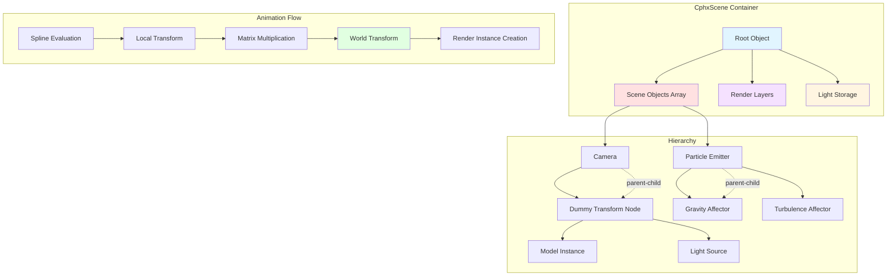

# Phoenix Scene Graph System Overview

Every 3D demo needs a way to organize objects in space. You need to position a camera, hang lights, place models, emit particles, and have all their positions relate to each other. Parent a light to a rotating model and the light should rotate too. Animate a camera's position along a path while pointing at a moving target. These spatial relationships form a hierarchy—the scene graph.

Phoenix's scene graph is the spatial backbone of every demo frame. It's not trying to be a general-purpose entity-component system or a physics-enabled game engine. It's a transform hierarchy animated by splines, optimized for 64k executables where every feature costs bytes. The graph supports twelve object types: models, lights, cameras, particle emitters, particle affectors, subscenes, and logic nodes. Each type knows how to animate itself, traverse the hierarchy, and generate rendering work.

The key insight is that scene graphs are fundamentally about accumulated transformations. You build a tree where each node has a local transform (position, rotation, scale) and the final world transform is the product of all parent transforms. Animation splines drive the local transforms. Traversal walks the tree depth-first, multiplying matrices as it descends. At each node, objects create render instances using their current world transform. This separation—animation from traversal from rendering—keeps the code clean and compresses well.

Think of the scene graph like a stage production. The root is the stage itself. Each object is an actor or prop with a script (animation splines). Parent-child relationships are like props attached to actors' hands—move the actor and the prop follows. The director (CphxScene) calls "action!" and the whole hierarchy comes alive, each node executing its script while maintaining spatial relationships. At each frame, the director collects what needs rendering (render instances) and what light sources exist (light collection). Then the rendering system takes over.

This architecture matters because most creative coding frameworks either provide no scene graph (everything in world space, manual transform multiplication) or heavyweight scene graphs with lifecycle management, observers, and dynamic updates. Phoenix achieves both minimal code size and expressive spatial relationships by implementing exactly what demos need—hierarchical transforms, spline-driven animation, and type-specific rendering behavior.

## System Architecture

The Phoenix scene graph centers on two classes: `CphxScene` manages the container and rendering, while `CphxObject` represents individual nodes in the hierarchy. Each object has a type discriminator (`PHXOBJECT enum`), parent/child links, animation data (splines), and transform state (current and previous matrices for motion blur).



The flow starts when `CphxScene::UpdateSceneGraph()` is called with a clip index and time value. The scene clears all render layers, resets light count, and kicks off hierarchy traversal from root objects (objects with no parent). As traversal descends, each object:

1. Evaluates its animation splines for the current time
2. Builds its local transform matrix (position, rotation, scale)
3. Multiplies local transform by parent's world transform
4. Stores current world transform (for rendering) and previous (for motion blur)
5. Calls type-specific `CreateRenderDataInstances()` to generate GPU work
6. Recursively traverses child objects

After traversal, the scene performs post-processing: calculates target directions for lights pointing at targets, collects all lights into a flat array, sorts render instances by priority, and computes inverse matrices for particle affectors.

## Object Types

Phoenix defines twelve object types through the `PHXOBJECT` enum (Scene.h:95-111). Each type extends `CphxObject` with type-specific data and overrides `CreateRenderDataInstances()` to generate appropriate rendering work.

| Type | Enum Value | Purpose | Renders? | Has Children? |
|------|-----------|---------|----------|---------------|
| **Object_Model** | 0 | Mesh geometry | Yes (delegates to Model) | Yes |
| **Object_Light** | 1 | Light source | No (collected for lighting) | Yes |
| **Object_CamEye** | 2 | Camera viewpoint | No (sets view matrix) | Yes |
| **Object_Dummy** | 3 | Empty transform node | No | Yes |
| **Object_SubScene** | 4 | Nested scene instance | Yes (recursive) | Yes |
| **Object_ParticleEmitter** | 5 | GPU particle emitter (deprecated) | No | Yes |
| **Object_ParticleEmitterCPU** | 6 | CPU-simulated particles | Yes | Yes |
| **Object_ParticleDrag** | 7 | Particle drag force | No (affects emitters) | Yes |
| **Object_ParticleGravity** | 8 | Particle gravity force | No (affects emitters) | Yes |
| **Object_ParticleTurbulence** | 9 | Particle noise force | No (affects emitters) | Yes |
| **Object_ParticleVortex** | 10 | Particle vortex force | No (affects emitters) | Yes |
| **Object_LogicObject** | 11 | Scripting/event node | No | Yes |

**Object_Model** is the most common type. It references a `CphxModel` (geometry + materials) and creates render instances by delegating to the model's material passes. Models can be parented to anything—cameras for heads-up displays, lights for dynamic shadows, particle emitters for emitting meshes.

**Object_Light** stores light properties (color, attenuation, spot angles) in spline results. During `CollectLights()`, the scene copies light data into a flat `LIGHTDATA` array (max 8 lights) for GPU upload. Lights can be parented to models for attached light sources.

**Object_CamEye** defines camera position and orientation. Its transform sets the view matrix. The FOV (field of view) and roll come from animation splines. Cameras can target other objects—the `TargetDirection` is calculated post-traversal from target's world position.

**Object_Dummy** provides transform nodes without visual representation. Use cases: pivot points, grouping nodes, intermediate transforms for complex animation rigs. The name "Dummy" comes from 3ds Max terminology for helper objects.

**Object_SubScene** instances another scene as a child of the current scene. This enables reusable scene chunks (repeating geometry, instanced effects). SubScenes have clip and time parameters, allowing nested animation timelines. The `Spline_SubScene_RepeatCount` spline can stamp multiple instances with time offsets.

**Object_ParticleEmitterCPU** simulates particles on CPU, uploads to vertex buffer, and renders as billboards or mesh instances. Emitters define emission rate, lifetime, velocity, rotation, and chaos parameters. Child objects parented to the emitter become emission sources—particles spawn from each child's transform.

**Particle Affectors** (Drag, Gravity, Turbulence, Vortex) modify particle velocities during simulation. The emitter searches the scene for affector objects, tests if particles are inside each affector's volume, and applies forces. Affectors have area types (infinite or box-shaped) and power splines.

**Object_LogicObject** serves as a scripting hook. The `camCenterX` and `camCenterY` fields store logic type and data. This is a minimal extension point for demo-specific behavior without bloating the object system.

## CphxScene Class

`CphxScene` (Scene.h:398-428) acts as the container and orchestrator for scene rendering. It owns objects, manages render layers, and coordinates the update/render split.

```cpp
class CphxScene {
public:
    int LightCount;
    LIGHTDATA Lights[MAX_LIGHT_COUNT];  // MAX_LIGHT_COUNT = 8

    int ObjectCount;
    CphxObject** Objects;               // Flat array of all objects

    int LayerCount;
    CphxRenderLayer** RenderLayers;     // Render layers (shadow, solid, lighting, etc.)

    CphxObject Root;                     // Root transform (not in Objects array)

    void CollectLights(CphxScene* sceneToCollectFrom);
    void UpdateSceneGraph(int Clip, float t);
    void Render(bool ClearColor, bool ClearZ, int cubeResolution);
    void AddRenderDataInstance(CphxRenderLayerDescriptor* Layer, CphxRenderDataInstance* RDI);
};
```

**Objects array** stores all objects in a flat structure. Hierarchy is represented through `Parent` and `Children` pointers, not by array nesting. This simplifies memory layout and iteration.

**Root object** is a special transform that isn't in the `Objects` array. It serves as the parent for top-level objects and provides a coordinate space for the entire scene.

**Render layers** organize rendering work by pass type (shadow, solid, lighting, transparent). Each layer has a descriptor (render targets, clear/blend state) and an array of render instances. During traversal, objects call `AddRenderDataInstance()` to register GPU work with the appropriate layer.

**Light storage** holds up to 8 lights. The `CollectLights()` method walks the object array, copies light properties from light objects' spline results into `LIGHTDATA` structs, and transforms directional light positions to world space.

**UpdateSceneGraph** has two overloads. The public version (Scene.cpp:51) initializes state and calls the recursive version. It clears render layers, resets light count, traverses from root objects, calculates target directions, collects lights, sorts render instances by priority, and computes particle affector inverse matrices.

**Render** (Scene.cpp:136) executes all render layers in sequence. For each layer, it sets the rendering environment (render targets, clear flags), uploads scene-level data (view/projection matrices, camera position, light array) to constant buffer 0, and renders all instances in the layer. Post-processing effects can then consume layer outputs.

## CphxObject Class

`CphxObject` (Scene.h:139-197) represents a single node in the scene graph. It's designed for inheritance—the base class provides hierarchy, animation, and transform management, while subclasses add type-specific rendering behavior.

```cpp
class CphxObject {
public:
    CphxScene* Scene;                // Owning scene
    CphxScene* SubSceneTarget;       // For SubScene objects

    CphxObject* Parent;              // Parent transform
    int ChildCount;
    CphxObject** Children;           // Child transforms

    float SplineResults[Spline_Count];     // 57 floats: animation output
    D3DXQUATERNION RotationResult;         // Rotation as quaternion
    D3DXVECTOR3 TargetDirection;           // Direction to target object

    PHXOBJECT ObjectType;            // Type discriminator

    CphxObjectClip** Clips;          // Per-clip animation data

    D3DXVECTOR3 WorldPosition;       // World-space position
    D3DXMATRIX currMatrix;           // Current world transform
    D3DXMATRIX prevMatrix;           // Previous frame (for motion blur)

    CphxObject* Target;              // Target object for aiming

    virtual void CreateRenderDataInstances(int Clip, const D3DXMATRIX& m,
                                           CphxScene* RootScene, void* SubSceneData) {};
    void TraverseSceneGraph(int Clip, float t, D3DXMATRIX CurrentMatrix,
                            CphxScene* RootScene, void* SubSceneData);
    void CalculateAnimation(int Clip, float t);
};
```

**SplineResults array** stores 57 floats representing all possible spline outputs. The `PHXSPLINETYPE` enum (Scene.h:17-92) defines what each slot means: position (x,y,z), rotation quaternion, scale (x,y,z), light colors, camera FOV, particle emission parameters, etc. Not all objects use all splines—models only need position/rotation/scale, while lights need colors and attenuation.

**RotationResult quaternion** holds rotation separately because it requires 4 floats but is conceptually a single value. Splines can animate Euler angles or quaternion components; `CalculateAnimation()` extracts the quaternion after spline evaluation.

**currMatrix and prevMatrix** are world-space transforms. Current matrix is used for rendering. Previous matrix enables motion blur—shaders can sample velocity by comparing current and previous screen-space positions.

**Clips array** provides per-clip animation data. A "clip" is a named animation sequence (e.g., "intro", "main", "outro"). Each clip has its own spline set, allowing different animations for the same object in different parts of the demo. The clip index passed to `UpdateSceneGraph()` selects which animation to evaluate.

**Target pointer** enables aim constraints. If an object has a target, `UpdateSceneGraph()` calculates `TargetDirection = Target->WorldPosition - this->WorldPosition` after traversal. Lights use this for spot direction. Cameras use it for look-at orientation.

**CreateRenderDataInstances** is virtual and overridden by concrete types. The base implementation does nothing (Dummy objects). Subclasses create render instances and add them to render layers via `Scene->AddRenderDataInstance()`.

## Clip and Spline System

Animation in Phoenix is clip-based and spline-driven. Clips organize multiple splines into named animation sequences. Splines map time to float values (or quaternions). The separation allows reusing objects with different animations across demo sections.

```cpp
struct CphxObjectClip {
    CphxScene* SubSceneTarget;               // For SubScene objects
    unsigned char RandSeed;                  // For turbulence
    unsigned char TurbulenceFrequency;       // For turbulence
    int SplineCount;
    CphxClipSpline** Splines;                // Splines driving this clip
    CphxMaterialSplineBatch* MaterialSplines; // Material parameter animation
};

struct CphxClipSpline {
    PHXSPLINETYPE Type;                      // Which SplineResults slot
    CphxSpline* Spline;                      // Spline curve
    CphxMaterialParameter* MaterialParam;    // If animating material param
    void* GroupingData;                      // Tool-specific
};
```

**CphxObjectClip** groups all animation data for one clip. The `Splines` array holds references to `CphxSpline` objects (Hermite or Bezier curves) and specifies which `SplineResults` slot each spline writes to. `MaterialSplines` animates material parameters (colors, roughness, texture weights) in sync with transform animation.

**Spline evaluation** happens in `CalculateAnimation()` (Scene.cpp:274). It sets default values for all spline slots (scale defaults to 1, diffuse color to white, emission rate to 25 particles/sec), then iterates through the clip's splines, evaluates each at time `t`, and stores the result in `SplineResults[Type]`. Rotation splines receive special handling—the quaternion is extracted via `Spline->GetQuaternion()`.

**Material splines** animate shader parameters. A material might have a roughness spline that transitions from shiny (0.0) to rough (1.0) over time. During `CreateRenderDataInstances()`, materials read animated values from their spline batch and pack them into constant buffers.

**Subscene clip selection** uses `Spline_SubScene_Clip` and `Spline_SubScene_Time` to select and scrub nested scene timelines. This enables complex nested animations—a subscene looping while the parent scene progresses linearly, or time-remapped playback.

## Hierarchy Traversal

Scene graph traversal is a recursive depth-first walk that accumulates transforms and generates rendering work. The entry point is `CphxObject::TraverseSceneGraph()` (Scene.cpp:229).

```cpp
void CphxObject::TraverseSceneGraph(int Clip, float t, D3DXMATRIX CurrentMatrix,
                                    CphxScene* RootScene, void* SubSceneData)
{
    D3DXMATRIX m = CurrentMatrix;
    CalculateAnimation(Clip, t);

    // Build local PRS (Position, Rotation, Scale) matrix
    D3DXMATRIX prs;
    D3DXMatrixTransformation(&prs, NULL, NULL,
                             (D3DXVECTOR3*)&SplineResults[Spline_Scale_x],
                             NULL, &RotationResult,
                             (D3DXVECTOR3*)&SplineResults[Spline_Position_x]);

    // Multiply by parent's world transform
    D3DXMatrixMultiply(&m, &prs, &CurrentMatrix);

    // Store for rendering and motion blur
    prevMatrix = currMatrix;
    currMatrix = m;

    // Calculate world position for lighting and targeting
    D3DXVECTOR4 v;
    D3DXVec3Transform(&v, (D3DXVECTOR3*)&SplineResults[Spline_Position_x], &CurrentMatrix);
    WorldPosition = *(D3DXVECTOR3*)&v;

    // Generate render instances (type-specific)
    CreateRenderDataInstances(Clip, m, RootScene, SubSceneData);

    // Recurse to children
    for (int x = 0; x < ChildCount; x++)
        Children[x]->TraverseSceneGraph(Clip, t, m, RootScene, SubSceneData);
}
```

**Matrix accumulation** is the heart of the scene graph. Each object's local transform (position, rotation, scale) multiplies by the incoming parent transform. The result becomes the world transform for this object and the parent transform for children. This is standard scene graph mathematics.

**Motion blur support** requires storing both current and previous transforms. At the start of traversal, `prevMatrix` gets the old `currMatrix`, then `currMatrix` gets the new value. Shaders can compare object-space positions transformed by both matrices to compute velocity.

**World position extraction** transforms the object's local position (from splines) through the parent's transform to get world-space position. This is used for light position calculations and target direction computations.

**Render instance creation** is deferred to the virtual method. Models create instances for each material pass. Particle emitters update simulation and create billboard instances. SubScenes recursively invoke their target scene's `UpdateSceneGraph()` with nested transforms.

**Recursion depth** is limited by scene structure, not code. Clean Slate's scenes rarely exceed 5-6 levels (root → model group → model → submodel → particle emitter → affector). Deep hierarchies would work but aren't needed.

## Type-Specific Rendering

Each object type implements rendering differently. The virtual `CreateRenderDataInstances()` method provides the extension point.

### Object_Model

Model objects delegate to their `CphxModel` reference (Scene.cpp:331):

```cpp
void CphxObject_Model::CreateRenderDataInstances(int Clip, const D3DXMATRIX& m,
                                                 CphxScene* RootScene, void* SubSceneData)
{
    Model->CreateRenderDataInstances(Clips[Clip], m, RootScene, SubSceneData);
}
```

The model walks its material techniques, creates a `CphxRenderDataInstance` for each material pass (vertex buffer, index buffer, material state), and registers instances with appropriate render layers (solid for opaque, transparent for alpha-blended).

### Object_SubScene

SubScene objects recurse into another scene's hierarchy (Scene.cpp:338):

```cpp
void CphxObject_SubScene::CreateRenderDataInstances(int Clip, const D3DXMATRIX& m,
                                                    CphxScene* RootScene, void* SubSceneData)
{
    int clipId = max(0, min(SubSceneTarget->ClipCount - 1,
                            (int)SplineResults[Spline_SubScene_Clip]));
    int repeatCount = max(1, (int)SplineResults[Spline_SubScene_RepeatCount]);
    float timeOffset = SplineResults[Spline_SubScene_RepeatTimeOffset];

    D3DXMATRIX mtx = m;
    D3DXMATRIX prs;  // Repeat offset transform
    D3DXMatrixTransformation(&prs, NULL, NULL,
                             (D3DXVECTOR3*)&SplineResults[Spline_Scale_x],
                             NULL, &RotationResult,
                             (D3DXVECTOR3*)&SplineResults[Spline_Position_x]);

    for (int x = 0; x < repeatCount; x++) {
        SubSceneTarget->UpdateSceneGraph(clipId,
            fmod(SplineResults[Spline_SubScene_Time] + timeOffset * x, 1.0f),
            mtx, RootScene, SubSceneData);
        D3DXMatrixMultiply(&mtx, &prs, &mtx);  // Offset for next instance
    }

    RootScene->CollectLights(SubSceneTarget);
}
```

This creates instanced subscenes. If `repeatCount = 5`, the subscene renders 5 times with incremental time offsets and transform offsets. It's how Clean Slate creates repeating geometry patterns (spiral staircases, radial arrays) without duplicating scene data.

### Object_ParticleEmitterCPU

Particle emitters simulate, sort, and upload particle data before creating render instances (Scene.cpp:608). The simulation updates particle positions based on velocity, ages particles, spawns new particles according to emission rate, and applies affector forces. Then it creates render instances either as billboards (standard particles) or as mesh/subscene instances (mesh particles).

For standard billboard particles, the emitter updates a vertex buffer with particle positions, lifetimes, rotations, and chaos values. The material system renders the vertex buffer as billboards.

For mesh particles, the emitter iterates live particles, builds a transform matrix from particle position/rotation/scale, evaluates material splines at particle lifetime, and calls the mesh's `CreateRenderDataInstances()` with the particle's transform. This stamps mesh instances at particle positions.

### Particle Affectors

Affectors don't create render instances. They exist for simulation side effects. Emitters search for affector objects, test particle positions against affector volumes, and accumulate forces (Scene.cpp:513-515):

```cpp
for (int x = 0; x < affectorcount; x++)
    if (affectors[x]->ParticleInside(Particles[y].Position))
        Particles[y].Velocity += affectors[x]->GetForce(&Particles[y]);
```

Each affector type implements `GetForce()` differently. Gravity returns force toward the affector's position (or a directional vector). Drag returns force opposite to velocity. Turbulence samples a 3D noise kernel. Vortex returns force perpendicular to the affector's up vector and particle direction.

## Global Rendering State

The scene system uses global variables for shared rendering state (Scene.h:430-439). This is unusual in modern engines but sensible for 64k demos where accessing globals is smaller than passing parameters everywhere.

```cpp
extern D3DXMATRIX phxViewMatrix;           // Camera view matrix
extern D3DXMATRIX phxIViewMatrix;          // Inverse view matrix
extern D3DXMATRIX phxProjectionMatrix;     // Perspective projection
extern D3DXMATRIX phxIProjectionMatrix;    // Inverse projection
extern D3DXMATRIX phxWorldMatrix;          // Current object world matrix
extern D3DXMATRIX phxITWorldMatrix;        // Inverse-transpose world (for normals)
extern D3DXVECTOR4 phxCameraPos;           // Camera world position
extern D3DXVECTOR4 phxCameraDir;           // Camera facing direction
extern D3DXMATRIX phxPrevFrameViewMatrix;  // Previous view (for motion blur)
extern D3DXMATRIX phxPrevFrameProjectionMatrix;  // Previous projection
```

**phxViewMatrix and phxProjectionMatrix** are set by camera objects during scene setup. The `Render()` method uploads these to constant buffer 0 at the start of each layer.

**phxWorldMatrix** is set per render instance. Each instance's `Render()` method uploads its world matrix to constant buffer 1 before issuing draw calls.

**phxITWorldMatrix** (inverse-transpose world matrix) transforms normals correctly when non-uniform scale is present. Normal transformation requires the inverse-transpose, not the world matrix.

**phxCameraPos and phxCameraDir** are used for lighting calculations, environment mapping, and particle billboarding. Camera position in world space is needed for specular highlights and Fresnel calculations.

**Previous frame matrices** enable temporal effects. Motion blur compares current and previous screen-space positions. Temporal anti-aliasing jitters projection and tracks history.

## Light Collection

Light collection happens in two phases. During traversal, light objects populate their `SplineResults` with light properties (colors, attenuation, spot angles). After traversal, `CphxScene::CollectLights()` (Scene.cpp:101) walks the object array and copies light data into the `Lights` array.

```cpp
void CphxScene::CollectLights(CphxScene* sceneToCollectFrom) {
    for (int x = 0; x < sceneToCollectFrom->ObjectCount; x++) {
        if (LightCount >= 8) return;

        CphxObject* object = sceneToCollectFrom->Objects[x];
        if (object->ObjectType == Object_Light) {
            // Copy light data from spline results
            memcpy(&Lights[LightCount],
                   &object->SplineResults[Spline_Position_x],
                   sizeof(LIGHTDATA));

            // Handle point vs directional lights
            if (object->SplineResults[Spline_Position_w] != 0) {
                // Point/spot light: position is world position
                Lights[LightCount].Position.x = object->WorldPosition.x;
                Lights[LightCount].Position.y = object->WorldPosition.y;
                Lights[LightCount].Position.z = object->WorldPosition.z;
            } else {
                // Directional light: direction is world position
                Lights[LightCount].SpotDirection.x = object->WorldPosition.x;
                Lights[LightCount].SpotDirection.y = object->WorldPosition.y;
                Lights[LightCount].SpotDirection.z = object->WorldPosition.z;
            }
            LightCount++;
        }
    }
}
```

**Light data layout** exploits the fact that `SplineResults` are laid out to match `LIGHTDATA` structure. Position, ambient, diffuse, specular, and spot data occupy contiguous spline slots, so `memcpy()` can bulk-transfer data.

**Position vs. direction** is distinguished by `Spline_Position_w`. Directional lights (sun, moon) have w=0 and use world position as direction. Point/spot lights have w=1 and use world position as position.

**Subscene lights** are collected recursively. When a SubScene renders, it calls `RootScene->CollectLights(SubSceneTarget)` to merge nested scene's lights into the root scene's light array.

**Light limit enforcement** caps at 8 lights (`MAX_LIGHT_COUNT`). If more than 8 lights exist, only the first 8 are collected. This is a hard limit from the constant buffer size (8 × sizeof(LIGHTDATA) = 8 × 112 bytes = 896 bytes).

## Render Layer Integration

Render layers organize rendering work by pass type. The scene doesn't know about specific layer types (shadow, solid, lighting)—it just provides infrastructure for registering render instances with layers.

```cpp
void CphxScene::AddRenderDataInstance(CphxRenderLayerDescriptor* Layer,
                                      CphxRenderDataInstance* RDI)
{
    for (int x = 0; x < LayerCount; x++)
        if (RenderLayers[x]->Descriptor == Layer) {
            RenderLayers[x]->RenderInstances.Add(RDI);
            return;
        }
}
```

**Descriptor matching** uses pointer equality. Each render layer has a descriptor that specifies render targets, clear/blend state, and rendering environment. Materials reference descriptors when creating render instances. The scene finds the matching layer and adds the instance.

**Priority sorting** happens after traversal (Scene.cpp:77-78). Each layer sorts its render instances by `RenderPriority` field. Higher priority renders first. This enables manual draw order control—render sky first (priority 1000), then solid geometry (priority 500), then transparent effects (priority 100).

**Layer execution** is sequential (Scene.cpp:148-202). For each layer, the scene uploads scene-level data, binds constant buffers, iterates render instances calling `Render()`, and generates mipmaps for render target outputs if needed.

## Workflow Patterns

Real-world scene graph usage follows common patterns seen throughout Clean Slate.

**Camera targeting** places a dummy object at the target location and sets the camera's `Target` pointer. After traversal, the camera's `TargetDirection` vector points from camera to target. The camera's view matrix is built from position and target direction.

**Parented lights** attach light objects as children of animated models. As the model moves, lights move too. A rotating mechanical structure with attached spotlights requires no additional scripting—hierarchy handles it.

**Particle emission from hierarchy** parents multiple dummy objects to an emitter. Each child becomes an emission source. Particles spawn from child transforms with child rotations affecting emission direction. This creates complex emission patterns (circle, helix, grid) without particle system code.

**Affector volumes** position and scale affector objects to create force fields. A large turbulence affector at the scene origin creates ambient noise. Small gravity affectors near the ground simulate wind currents. The affector's transform defines the force field shape.

**Nested subscenes** instantiate reusable scene chunks. A spiral staircase subscene with 20 steps can be instanced 5 times around a tower with `repeatCount = 5` and `timeOffset` to stagger animation. Each instance inherits the parent's transform.

**Mixed rendering** uses dummy objects to group related geometry. A spaceship model might have children for hull (one material), windows (emissive material), and engines (particle emitters). The parent dummy animates rotation; children inherit and add local offsets.

## Performance Characteristics

The scene graph makes specific trade-offs for 64k demo constraints.

**Flat object storage** uses a single array for all objects regardless of hierarchy depth. This simplifies iteration for light collection and affector search. The cost is that hierarchy traversal uses pointer chasing (Parent/Children) rather than array indexing.

**No spatial acceleration** means particle affector searches are O(n) in affector count. For 10-20 affectors, this is fine. For 1000 affectors, it would be slow. Demos have controlled scene complexity.

**Matrix storage** keeps both current and previous world matrices per object. For 200 objects, that's 200 × 64 bytes × 2 = 25KB. This is acceptable for motion blur support. GPU skinning would be more efficient for dense hierarchies but requires more code.

**Virtual dispatch** on `CreateRenderDataInstances()` costs one vtable lookup per object per frame. For 200 objects at 60fps, that's 12,000 lookups/sec, negligible compared to rendering cost. The code size savings from polymorphism outweigh the runtime cost.

**No dirty flags** mean objects always recalculate transforms, even if animations haven't changed. For spline-driven demos where most objects animate every frame, dirty tracking would add code without benefit.

## Implications for Rust Framework

Phoenix's scene graph reveals patterns worth adopting, modifying, or avoiding in a modern Rust creative coding framework.

**Adopt: Clear type discriminator**. The `PHXOBJECT` enum makes object types explicit and creates natural extension points. Rust's enums with data (algebraic data types) would make this type-safe without inheritance.

**Adopt: Separated update/render phases**. Animation evaluation and render instance creation happen separately. This enables asynchronous rendering—update on one thread, render on another—without scene graph locks.

**Adopt: Clip-based animation**. Multiple animation sequences on the same object hierarchy is powerful for non-linear demos. Rust could use named clips with type-safe spline access.

**Modify: Replace parent/child pointers with entity IDs**. Rust's ownership rules make pointer-based graphs painful. Entity-component systems with entity IDs as weak references avoid borrow checker fights.

**Modify: Add spatial queries**. Modern frameworks need frustum culling, ray casting, and proximity tests. A scene graph with bounds propagation and spatial partitioning would generalize better than flat arrays.

**Modify: Consider transform caching**. Rust's ownership enables safely caching world transforms. If parent didn't change and local transform didn't change, reuse previous world transform.

**Avoid: Global rendering state**. Global mutable state is idiomatic C++ for 64k demos but violates Rust safety. Pass rendering context explicitly or use thread-local storage.

**Avoid: Fixed light arrays**. The hardcoded 8-light limit works for demos but limits general use. Rust's `Vec<Light>` grows dynamically. Shader code can handle variable-length light arrays with dynamic indexing.

**Avoid: Void pointers for SubSceneData**. The `void*` for tool-specific data is a type-safety hole. Rust generics (`SubSceneData: Any`) or trait objects provide type-safe extension.

## Related Documents

This overview introduces the Phoenix scene graph system. For detailed subsystem documentation, see:

- **[objects.md](objects.md)** — Individual object type implementations, particle systems, subscene instancing
- **[animation.md](animation.md)** — Spline system, clip management, material animation
- **[rendering.md](rendering.md)** — Render layer architecture, render instance creation, GPU data upload
- **[examples.md](examples.md)** — Scene graph patterns from Clean Slate production scenes

For implementation traces with source references:

- **[../code-traces/scene-traversal.md](../code-traces/scene-traversal.md)** — Complete traversal walkthrough with matrix math
- **[../code-traces/particle-emission.md](../code-traces/particle-emission.md)** — CPU particle simulation and affector forces
- **[../code-traces/subscene-instancing.md](../code-traces/subscene-instancing.md)** — Nested scene rendering and light collection

For cross-system integration:

- **[../rendering/pipeline.md](../rendering/pipeline.md)** — How scene graph connects to deferred rendering
- **[../rendering/materials.md](../rendering/materials.md)** — Material spline animation integration

## Source File Reference

| File | Lines | Purpose | Key Components |
|------|-------|---------|----------------|
| Scene.h | 440 | Scene graph structures | PHXOBJECT (95), CphxObjectClip (121), CphxObject (139), CphxScene (398) |
| Scene.cpp | 960 | Scene graph algorithms | UpdateSceneGraph (51), CollectLights (101), Render (136), TraverseSceneGraph (229), CalculateAnimation (274) |

**Key type definitions:**

- **PHXOBJECT** (Scene.h:95-111): Object type enum, 12 types from Model to LogicObject
- **PHXSPLINETYPE** (Scene.h:17-92): Spline slot enum, 57 types from MaterialParam to SubScene_RepeatTimeOffset
- **CphxObjectClip** (Scene.h:121-129): Clip animation data, splines + material splines
- **CphxObject** (Scene.h:139-197): Base object class, hierarchy + animation + transform
- **CphxScene** (Scene.h:398-428): Scene container, objects + layers + lights
- **LIGHTDATA** (Scene.h:131-137): GPU light data, 7×vec4 = 112 bytes

**Key algorithms:**

- **UpdateSceneGraph** (Scene.cpp:51-90): Top-level update, traversal + post-processing
- **TraverseSceneGraph** (Scene.cpp:229-272): Recursive traversal, matrix accumulation
- **CalculateAnimation** (Scene.cpp:274-315): Spline evaluation, defaults + overrides
- **CollectLights** (Scene.cpp:101-134): Light object → LIGHTDATA array
- **CreateRenderDataInstances** (Scene.cpp:331+): Type-specific overrides

All source paths are relative to `demoscene/apex-public/apEx/Phoenix/`.
