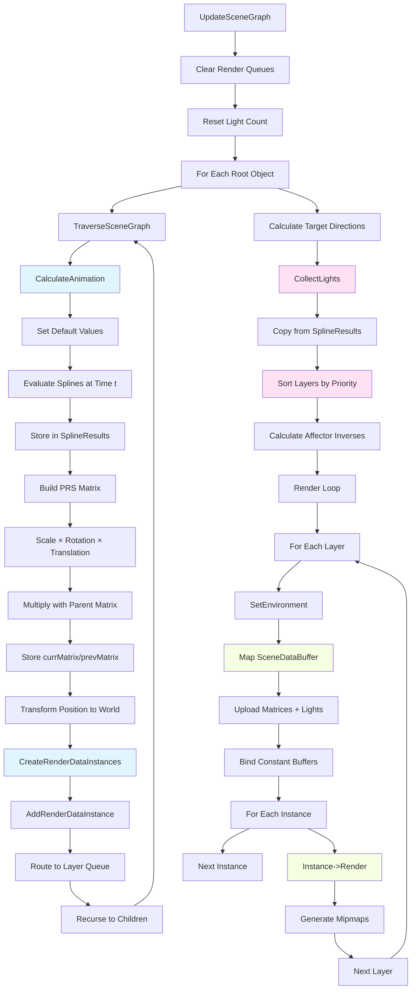

# Scene Rendering

How Phoenix transforms animated objects into pixels through a two-phase update-and-render architecture.

Every frame, Phoenix faces a choreography problem: dozens of scene objects with animated transforms and material properties need to become draw calls with the right GPU state. The naive approach would be to traverse the scene graph during rendering, calculating transforms on the fly. But this tangles animation logic with GPU commands, making it impossible to sort draw calls by priority or collect lights before rendering begins.

Phoenix splits the work into two distinct phases. First, `UpdateSceneGraph` walks the hierarchy once, calculating world transforms, evaluating animation splines, and collecting instances into per-layer buckets. Then `Render` iterates those sorted buckets, uploading global scene data (view/projection matrices, lights) and issuing draw calls. This separation means animation code never touches GPU state, and rendering code never recurses through object hierarchies.

The key insight is that render instances are ephemeral. Each frame they're created fresh from the scene graph, sorted by priority, rendered, and discarded. The scene graph itself persists between frames, storing animation state and hierarchy relationships. This makes the rendering pipeline stateless and parallelizable—though Phoenix doesn't exploit that yet.

## The Problem: Continuous Animation Meets Hierarchical Transforms

Why split update from render? Because you can't sort until you've collected everything, and you can't upload lights until you know how many there are. The scene graph is a tree of transforms, but the GPU wants flat arrays of instances grouped by render state. The update phase flattens the tree into arrays. The render phase consumes those arrays.

In the demoscene, everything animates continuously. Position, rotation, scale, color, material properties, light intensity—all driven by splines evaluated every frame. There are no static objects to cache. When nothing stays constant, rebuilding from scratch is simpler than tracking changes.

Think of it like a factory assembly line with two distinct phases. In the first phase, workers walk through a warehouse of animated machinery, taking snapshots of each machine's current state. They don't build anything yet, they just record: "This gear is at 37 degrees rotation, this conveyor is moving at 2.3 meters per second, this robotic arm is at coordinates (4, 7, 12)." They also figure out which workshop each component goes to for final assembly.

In the second phase, workers take those snapshots to assembly workshops (render layers). Each workshop specializes in a different task: the main assembly floor handles primary construction, the finishing workshop applies polish and effects, the packaging station does final presentation. Within each workshop, work orders execute in priority sequence: foundations before walls, walls before paint, paint before final coating.

This two-phase design means decision-making happens once, during snapshot collection. The assembly workers don't debate which tool to use or which paint to apply. All those choices were made during the walkthrough. They just execute pre-planned work orders.

## UpdateSceneGraph: The Orchestrator

The scene graph update is where all the magic happens. This is the snapshot phase, the moment when the engine walks the animated world and collects all the information needed for rendering. The function begins by clearing all render instances from the previous frame—no persistent queues, no dirty tracking, complete regeneration every frame.

Here's the complete orchestration sequence (from `Scene.cpp:51-90`):

```cpp
void CphxScene::UpdateSceneGraph(int Clip, float t)
{
  D3DXMATRIX Root;
  D3DXMatrixIdentity(&Root);

  // Clear all render layer queues from previous frame
  for (int x = 0; x < LayerCount; x++)
    RenderLayers[x]->RenderInstances.FreeArray();

  LightCount = 0;
  UpdateSceneGraph(Clip, t, Root, this, NULL);

  // Calculate target directions for spotlights
  for (int x = 0; x < ObjectCount; x++)
  {
    CphxObject *o = Objects[x];
    if (o->Target)
    {
      o->TargetDirection = o->Target->WorldPosition - o->WorldPosition;
      D3DXVec3Normalize(&o->TargetDirection, &o->TargetDirection);
      o->SplineResults[Spot_Direction_X] = o->TargetDirection.x;
      o->SplineResults[Spot_Direction_Y] = o->TargetDirection.y;
      o->SplineResults[Spot_Direction_Z] = o->TargetDirection.z;
    }
  }

  CollectLights(this);

  // Sort each layer by render priority
  for (int x = 0; x < LayerCount; x++)
    SortRenderLayer(RenderLayers[x]->RenderInstances.Array, 0,
                    RenderLayers[x]->RenderInstances.ItemCount - 1);

  // Calculate inverse matrices for particle affectors
  for (int x = 0; x < ObjectCount; x++)
    if (Objects[x]->ObjectType == Object_ParticleGravity ||
        Objects[x]->ObjectType == Object_ParticleDrag ||
        Objects[x]->ObjectType == Object_ParticleTurbulence ||
        Objects[x]->ObjectType == Object_ParticleVortex)
    {
      D3DXMATRIX m = Objects[x]->GetWorldMatrix();
      D3DXMatrixInverse(&Objects[x]->inverse, NULL, &m);
    }
}
```

This function establishes the pattern: clear, traverse, post-process, sort, finalize. The `FreeArray()` call releases all render instances, ensuring each frame starts fresh. The identity matrix seeds the root transformation—every child in the hierarchy will multiply its local transform against accumulated parent matrices.

Notice the spotlight target calculation happens *after* traversal. You can't calculate "point this light at that object" until both objects have their world positions. Traversal computes world positions, then this post-process step calculates directions between linked objects. The same reasoning applies to light collection—lights are just objects that animate like everything else, so their data needs to be gathered after positions are finalized.

The sorting by render priority ensures draw order correctness. Within each layer, transparent objects must draw after opaque ones, sky domes must draw first, depth-dependent effects need specific ordering. Priority values encode these requirements, and quicksort enforces them.

The particle affector inverse matrix calculation is subtle but crucial. Particle systems need to know "is this particle inside the affector's influence volume?" World-space distance checks are expensive. Instead, transform the particle position into the affector's local space using the inverse matrix, then do a simple box or sphere test. Calculate the inverse once per frame, reuse for every particle.

## TraverseSceneGraph: Recursive Transform Propagation

This is where the engine walks the object hierarchy depth-first, calculating animated transformations and creating render instances. Each object evaluates its animation splines, builds a transform matrix, multiplies with its parent's matrix, and recurses to children.

The recursive walker handles the core transformation logic (from `Scene.cpp:229-272`):

```cpp
void CphxObject::TraverseSceneGraph(int Clip, float t, D3DXMATRIX CurrentMatrix,
                                     CphxScene *RootScene, void *SubSceneData)
{
  D3DXMATRIX m = CurrentMatrix;
  CalculateAnimation(Clip, t);

  // Build position-rotation-scale matrix from spline results
  D3DXMATRIX prs;
  D3DXMatrixTransformation(&prs, NULL, NULL,
                           (D3DXVECTOR3*)&SplineResults[Spline_Scale_x],
                           NULL,
                           &RotationResult,
                           (D3DXVECTOR3*)&SplineResults[Spline_Position_x]);

  // Multiply local transform by parent transform
  D3DXMatrixMultiply(&m, &prs, &CurrentMatrix);

  prevMatrix = currMatrix;
  currMatrix = m;

  // Calculate world position
  D3DXVECTOR4 v;
  D3DXVec3Transform(&v, (D3DXVECTOR3*)&SplineResults[Spline_Position_x], &CurrentMatrix);
  WorldPosition = *(D3DXVECTOR3*)&v;

  // Polymorphic dispatch: mesh objects create render instances
  CreateRenderDataInstances(Clip, m, RootScene, SubSceneData ? SubSceneData : ToolData);

  // Recurse to children with accumulated matrix
  for (int x = 0; x < ChildCount; x++)
    Children[x]->TraverseSceneGraph(Clip, t, m, RootScene, SubSceneData);
}
```

The `CalculateAnimation` call evaluates every spline curve at the current timestamp `t`. Position, rotation, scale, color, material parameters—everything comes from splines. This is the heart of demoscene animation: continuous procedural motion defined by curves.

The `D3DXMatrixTransformation` function builds a transformation matrix from scale, rotation quaternion, and translation vectors. It's equivalent to `Matrix = Translate × Rotate × Scale`, but optimized and handling edge cases correctly. The `NULL` parameters are for scaling/rotation centers, which Phoenix doesn't use—all transformations happen relative to the local origin.

Matrix multiplication order matters critically here. `D3DXMatrixMultiply(&m, &prs, &CurrentMatrix)` means `m = prs × CurrentMatrix`. The local transformation multiplies on the left, accumulating with the parent matrix on the right. This propagates transformations correctly: if the parent rotated 90 degrees, the child's local transforms happen in that rotated space.

The engine stores both current and previous frame matrices for motion blur effects. By maintaining both `currMatrix` and `prevMatrix`, shaders can compute velocity vectors without additional passes. Camera-based motion blur samples between previous and current positions to create directional blur.

World position calculation transforms the local position through the accumulated parent matrix. Even though the object's spline specifies local position, the shader needs world position for lighting calculations. The engine computes this once during traversal and stores it in `WorldPosition`.

The `CreateRenderDataInstances` call is polymorphic—the base class defines a virtual method that different object types override. `CphxObject_Model` creates render instances with material expansion, `CphxObject_Light` does nothing, `CphxObject_SubScene` recursively renders another scene. Type-specific behavior dispatches cleanly without cluttering the traversal code.

## CalculateAnimation: Spline Evaluation

Animation evaluation is where timeline position transforms into concrete values. Not every object animates every property, so the function begins by setting sensible defaults—scale defaults to (1, 1, 1), diffuse and specular colors default to white (1, 1, 1), FOV defaults to 1. Without defaults, uninitialized memory would cause random behavior.

The spline evaluation process (from `Scene.cpp:274-315`):

```cpp
void CphxObject::CalculateAnimation(int Clip, float t)
{
  // Set default values for splines that might not exist
  SplineResults[Spline_Scale_x] = 1;
  SplineResults[Spline_Scale_y] = 1;
  SplineResults[Spline_Scale_z] = 1;
  SplineResults[Spline_Light_DiffuseR] = 1;
  SplineResults[Spline_Light_DiffuseG] = 1;
  SplineResults[Spline_Light_DiffuseB] = 1;
  // ... more defaults ...

  // Evaluate all splines for this clip at time t
  for (int x = 0; x < Clips[Clip]->SplineCount; x++)
  {
    CphxClipSpline *s = Clips[Clip]->Splines[x];
    s->Spline->CalculateValue(t);
    SplineResults[s->Type] = s->Spline->Value[0];
    if (s->Type == Spline_Rotation)
      RotationResult = s->Spline->GetQuaternion();
  }

  Clips[Clip]->MaterialSplines->CalculateValues(t);
  SubSceneTarget = Clips[Clip]->SubSceneTarget;

  if (ObjectType == Object_ParticleTurbulence)
  {
    RandSeed = Clips[Clip]->RandSeed;
    TurbulenceFrequency = Clips[Clip]->TurbulenceFrequency;
  }
}
```

The spline evaluation loop iterates all splines attached to this object for the current clip. Objects can have multiple clips (like animation states), and each clip has its own spline set. The `Clip` parameter selects which animation to play.

`CalculateValue(t)` evaluates the spline at timestamp `t`, storing the result in `Spline->Value[0]`. For position splines, this might produce 4.7. For color splines, it might produce 0.82. The value is unitless—its meaning depends on the spline type.

Rotation is special. While position and scale are vectors with three independent components, rotation is a quaternion with four interdependent components. The spline stores quaternion control points and interpolates using spherical linear interpolation (slerp). The `GetQuaternion()` call returns the evaluated quaternion, which then goes into the transformation matrix as a single unit.

Material splines are separate from object splines. This separation enables independent animation: an object might move smoothly while its color pulses rhythmically. The `MaterialSplines->CalculateValues(t)` call evaluates all material parameter splines, storing results for later GPU upload.

The `SubSceneTarget` assignment is fascinating. Objects can be subscenes, which recursively render another entire scene graph at a specific clip and time. This enables effects like portals showing different times or locations, or recursive structures where a scene contains a copy of itself. The spline controls which scene and what time, enabling animated transitions between completely different worlds.

## CollectLights: Gathering Illumination

After traversal calculates world positions, the engine collects up to 8 lights for shader illumination. The maximum of 8 is a common demoscene constraint—shader code loops through lights, and unrolling an 8-iteration loop is manageable. More lights would require dynamic branching or multiple shader passes, increasing code complexity.

The light collection logic (from `Scene.cpp:101-134`):

```cpp
void CphxScene::CollectLights(CphxScene* sceneToCollectFrom)
{
  for (int x = 0; x < sceneToCollectFrom->ObjectCount; x++)
  {
    if (LightCount >= 8)
      return;

    CphxObject* object = sceneToCollectFrom->Objects[x];

    if (object->ObjectType == Object_Light)
    {
      memcpy(&Lights[LightCount], &object->SplineResults[Spline_Position_x],
             sizeof(LIGHTDATA));

      if (object->SplineResults[Spline_Position_w] != 0)
      {
        // Point/spot light: use world position
        Lights[LightCount].Position.x = object->WorldPosition.x;
        Lights[LightCount].Position.y = object->WorldPosition.y;
        Lights[LightCount].Position.z = object->WorldPosition.z;
      }
      else
      {
        // Directional light: use world position as direction
        Lights[LightCount].SpotDirection.x = object->WorldPosition.x;
        Lights[LightCount].SpotDirection.y = object->WorldPosition.y;
        Lights[LightCount].SpotDirection.z = object->WorldPosition.z;
        Lights[LightCount].Ambient.w = object->SplineResults[Spline_Light_OrthoX];
        Lights[LightCount].Diffuse.w = object->SplineResults[Spline_Light_OrthoY];
      }
      LightCount++;
    }
  }
}
```

The `memcpy` is clever—the `SplineResults` array stores light data in exactly the same memory layout as `LIGHTDATA`. Position (x, y, z, w) starts at `Spline_Position_x`, followed by ambient color, diffuse color, specular color, spot direction, and spot parameters. One memory copy transfers all light data from spline results to the light array.

The `Position.w` component distinguishes light types using homogeneous coordinates. `w = 1` means a point in space (point/spot lights), `w = 0` means a direction vector (directional lights). For point lights, the engine copies the object's world position. For directional lights, it uses the world position as a direction vector.

You might wonder why store a direction in `WorldPosition`. Because during scene graph traversal, objects transform their positions into world space. For a directional light, you don't want a position—you want a direction. But the light is still an object with a rotation. So the engine treats its local position as a direction vector, transforms it by parent matrices (which applies rotation but ignores translation due to `w = 0`), and stores the result in `WorldPosition`. It's conceptually "world direction" but stored in the `WorldPosition` field for simplicity.

The ortho shadow parameters pack into the unused `.w` components of ambient and diffuse colors. These control orthographic shadow map size for directional lights. Reusing padding bytes saves a few bytes in the structure definition, and those bytes matter in a 64KB intro.

## Render: Layer Iteration and GPU Execution

With the scene graph traversed, lights collected, and instances sorted, rendering becomes straightforward: iterate layers, bind targets, upload shared data, render instances. The complexity is in the update phase; rendering is just execution.

The render loop structure (from `Scene.cpp:136-203`):

```cpp
void CphxScene::Render(bool ClearColor, bool ClearZ, int cubeResolution)
{
  SetSamplers();

  // Calculate inverse matrices for unprojection
  D3DXMatrixInverse(&phxIViewMatrix, NULL, &phxViewMatrix);
  D3DXMatrixInverse(&phxIProjectionMatrix, NULL, &phxProjectionMatrix);

  for (int x = 0; x < LayerCount; x++)
  {
    RenderLayers[x]->Descriptor->SetEnvironment(ClearColor, ClearZ, cubeResolution);

    // Upload scene constant buffer
    D3D11_MAPPED_SUBRESOURCE map;
    phxContext->Map(SceneDataBuffer, 0, D3D11_MAP_WRITE_DISCARD, 0, &map);
    unsigned char* m = (unsigned char*)map.pData;

    float LightCountData[4];
    LightCountData[0] = (float)LightCount;

    memcpy(m, &phxViewMatrix, sizeof(phxViewMatrix)); m += sizeof(phxViewMatrix);
    memcpy(m, &phxProjectionMatrix, sizeof(phxProjectionMatrix)); m += sizeof(phxProjectionMatrix);
    memcpy(m, &phxCameraPos, sizeof(phxCameraPos)); m += sizeof(phxCameraPos);
    memcpy(m, &LightCountData, sizeof(LightCountData)); m += sizeof(LightCountData);
    memcpy(m, Lights, sizeof(LIGHTDATA)*MAX_LIGHT_COUNT); m += sizeof(LIGHTDATA)*MAX_LIGHT_COUNT;

    float RTResolution[4];
    if (RenderLayers[x]->Descriptor->TargetCount)
    {
      RTResolution[0] = (float)RenderLayers[x]->Descriptor->Targets[0]->XRes;
      RTResolution[1] = (float)RenderLayers[x]->Descriptor->Targets[0]->YRes;
      RTResolution[2] = 1 / RTResolution[0];
      RTResolution[3] = 1 / RTResolution[1];
    }
    memcpy(m, RTResolution, 16); m += 16;

    memcpy(m, &phxIViewMatrix, sizeof(phxIViewMatrix)); m += sizeof(phxIViewMatrix);
    memcpy(m, &phxIProjectionMatrix, sizeof(phxIProjectionMatrix)); m += sizeof(phxIProjectionMatrix);

    phxContext->Unmap(SceneDataBuffer, 0);

    // Bind scene data to all shader stages
    for (int y = 0; y < 2; y++)
    {
      ID3D11Buffer *Buffer = y ? ObjectMatrixBuffer : SceneDataBuffer;
      phxContext->VSSetConstantBuffers(y, 1, &Buffer);
      phxContext->GSSetConstantBuffers(y, 1, &Buffer);
      phxContext->PSSetConstantBuffers(y, 1, &Buffer);
    }

    // Render all instances in this layer
    for (int y = 0; y < RenderLayers[x]->RenderInstances.NumItems(); y++)
      RenderLayers[x]->RenderInstances[y]->Render();

#ifdef PHX_VOLUMETRIC_RENDERTARGETS
    if (RenderLayers[x]->Descriptor->VoxelizerLayer)
      phxContext->GenerateMips(phxTexture3DResourceView);
#endif
    RenderLayers[x]->Descriptor->GenMipmaps();
  }
}
```

The `SetSamplers()` call configures texture sampling state globally—anisotropic filtering, texture wrapping, mipmap filtering. Materials don't specify sampling state per-texture; that would waste bytes. One global sampler configuration suffices.

The inverse matrix calculation supports screen-space effects. If a post-processing shader needs to reconstruct world position from depth, it multiplies screen coordinates by the inverse projection matrix, then by the inverse view matrix. These matrices transform from screen space back to world space, enabling deferred rendering and screen-space ambient occlusion.

The scene constant buffer layout is carefully structured for shader access. It starts with frequently-used matrices (view, projection), then camera position, then light count, then the light array, then render target resolution with reciprocals, and finally the inverse matrices. This ordering matches typical shader access patterns.

Notice the render target resolution includes reciprocals. Instead of dividing by resolution in shaders (`uv / resolution`), multiply by the reciprocal (`uv * invResolution`). On older GPUs, division was several cycles while multiplication was one cycle. Modern GPUs optimize this automatically, but the pattern persists. It costs four floats in the constant buffer (trivial) and saves potential cycles in every shader invocation.

The constant buffer binding loop binds both `SceneDataBuffer` (slot 0) and `ObjectMatrixBuffer` (slot 1) to all three shader stages: vertex, geometry, and pixel. Slot 0 contains shared scene data, uploaded once per layer. Slot 1 will receive per-instance object data, uploaded during instance rendering. This two-tier structure separates shared from unique data, minimizing redundant uploads.

The render loop itself is trivial: iterate instances, call `Render()`. No sorting here—that already happened after scene traversal. No state diffing—every instance carries complete state. No culling—every instance made it into the queue during traversal. Just execute work orders sequentially.

The mipmap generation handles render-to-texture effects that need filtered sampling in later passes. A bloom effect renders bright areas to a texture, generates mipmaps to progressively blur it, then samples multiple mip levels to produce a soft glow. Automatic mipmap generation after rendering is simpler than manual Gaussian blur passes.

## SceneDataBuffer: The Shared Uniform Layout

The scene constant buffer packs shared data for all shader stages. Understanding its layout reveals what information the engine considers universal versus per-instance. The structure totals 816 bytes and follows DirectX 11's requirement for 16-byte alignment.

Here's the complete memory layout:

| Offset | Size | Field | Purpose |
|--------|------|-------|---------|
| 0 | 64 | phxViewMatrix | Camera view transformation |
| 64 | 64 | phxProjectionMatrix | Projection to clip space |
| 128 | 16 | phxCameraPos | Camera world position |
| 144 | 16 | LightCountData | Number of active lights |
| 160 | 1280 | Lights[8] | 8 × LIGHTDATA structs |
| 1440 | 16 | RTResolution | Render target size + reciprocals |
| 1456 | 64 | phxIViewMatrix | Inverse view for unprojection |
| 1520 | 64 | phxIProjectionMatrix | Inverse projection |

Each `LIGHTDATA` entry (160 bytes) contains position/direction, ambient/diffuse/specular colors, spot direction, and attenuation parameters. The structure is defined as:

```cpp
struct LIGHTDATA
{
  D3DXVECTOR4 Position;      // xyz = pos/dir, w = type (1=point, 0=directional)
  D3DXVECTOR4 Ambient;       // rgb = color, w = ortho shadow X
  D3DXVECTOR4 Diffuse;       // rgb = color, w = ortho shadow Y
  D3DXVECTOR4 Specular;      // rgb = color, w = unused
  D3DXVECTOR4 SpotDirection; // xyz = spot direction, w = unused
  D3DXVECTOR4 SpotData;      // x = exponent, y = cutoff, z/w = attenuation
};
```

This layout mirrors the classic OpenGL lighting model: ambient, diffuse, and specular colors, plus position/direction and spotlight parameters. Modern physically-based rendering uses different parameterizations, but this structure is compact and hardware-friendly. The shader accesses this data through a constant buffer declaration that matches the C++ layout exactly.

## Render Priority Sorting: Controlling Draw Order

After scene traversal, the engine sorts each render layer's instances by priority to ensure correct rendering order for transparency and depth-dependent effects. The implementation is a classic quicksort with one important detail: it's stable, meaning instances with equal priority maintain their relative order from traversal.

The sorting implementation (from `Scene.cpp:16-49`):

```cpp
int Pivot(CphxRenderDataInstance **Instances, int first, int last)
{
  int p = first;
  int pivot = Instances[first]->RenderPriority; // Extract once for stability

  CphxRenderDataInstance *temp;

  for (int i = first + 1; i <= last; i++)
  {
    if (Instances[i]->RenderPriority > pivot)
    {
      p++;
      temp = Instances[i];
      Instances[i] = Instances[p];
      Instances[p] = temp;
    }
  }

  temp = Instances[p];
  Instances[p] = Instances[first];
  Instances[first] = temp;

  return p;
}

void SortRenderLayer(CphxRenderDataInstance **Instaces, int first, int last)
{
  if (first < last)
  {
    int pivot = Pivot(Instaces, first, last);
    SortRenderLayer(Instaces, first, pivot - 1);
    SortRenderLayer(Instaces, pivot + 1, last);
  }
}
```

The comment "moving this value out of the main loop makes this sort stable" is the key. By extracting `pivot = Instances[first]->RenderPriority` before the partition loop, instances with equal priority maintain their relative order from traversal. This matters for transparent objects—if two windows have the same render priority, you want them to draw in the order they were added during scene traversal, which typically matches hierarchy order. Unstable sorting might reverse them randomly, causing visual artifacts.

The sort is in descending order (`RenderPriority > pivot`), so higher priority instances move toward the beginning of the array. During rendering, high-priority objects draw first. The priority scheme typically assigns negative values for sky domes and backgrounds, 0-1000 for opaque geometry, 1001+ for transparent objects. This ensures sky draws first, then opaque geometry, then transparency.

For transparent objects specifically, the system relies on distance-based priority assignment during traversal. Objects calculate their depth from camera, then encode it as `priority = 1000 + depth_value`. The stable sort maintains relative order for equal integer priorities while separating coarse ranges.

## AddRenderDataInstance: Queue Routing

When an object creates a render instance, it doesn't directly add it to the render pipeline—it routes it through the scene's layer system. Each render instance specifies which layer it belongs to, and the scene searches for a matching layer.

The routing logic (from `Scene.cpp:205-216`):

```cpp
void CphxScene::AddRenderDataInstance(CphxRenderLayerDescriptor *Layer,
                                       CphxRenderDataInstance *RDI)
{
  for (int x = 0; x < LayerCount; x++)
    if (RenderLayers[x]->Descriptor == Layer)
    {
      RenderLayers[x]->RenderInstances.Add(RDI);
      return;
    }

#ifndef PHX_MINIMAL_BUILD
  delete RDI; // Layer not found, clean up (tool mode only)
#endif
}
```

This linear search through layers seems inefficient, but remember there are typically 3-10 layers per scene. The cost of a hash table or dictionary would exceed the cost of checking a few pointers. Simplicity wins for small N.

The `#ifndef PHX_MINIMAL_BUILD` guard is significant. In the final 64KB intro, layer descriptors always exist—material definitions reference valid layers or the content is broken. But during tool development, artists might delete a layer while materials still reference it. The tool build includes cleanup code to prevent memory leaks. The minimal build strips this out to save bytes.

Layer assignment happens in the material definition. When an artist creates a material in the tool, they specify which layer each technique targets. The material stores the layer descriptor pointer, and every instance created from that material routes to the specified layer automatically. This decoupling is elegant—material code doesn't know about multi-pass effect composition, it just says "put me in layer 2."

## Data Flow Diagram

The complete flow from update to pixels visualizes the two-phase architecture:



Notice the clear separation: the top half (blue/pink) is the update phase, computing transforms and collecting instances. The bottom half (green) is the render phase, executing GPU commands from pre-collected data. The two phases touch disjoint data structures, enabling parallelization opportunities.

## Matrix Math: D3DXMatrixTransformation Explained

The `D3DXMatrixTransformation` function is central to hierarchy traversal. It combines position, rotation, and scale into a single matrix, equivalent to multiplying separate transformation matrices.

The call pattern Phoenix uses:

```cpp
D3DXMatrixTransformation(
  &prs,                                          // Output matrix
  NULL,                                          // Scaling center (unused)
  NULL,                                          // Scaling rotation (unused)
  (D3DXVECTOR3*)&SplineResults[Spline_Scale_x], // Scale vector
  NULL,                                          // Rotation center (unused)
  &RotationResult,                               // Rotation quaternion
  (D3DXVECTOR3*)&SplineResults[Spline_Position_x] // Translation vector
);
```

This produces the composite matrix `PRS = Translate × Rotate × Scale`. The order matters critically: scaling happens in local space, rotation happens around the local origin, translation moves to world space. Reversing the order would produce incorrect results—scaling would affect translation distance.

The quaternion rotation handles gimbal lock correctly. Euler angles (pitch, yaw, roll) suffer from singularities where certain rotations become ambiguous. Quaternions avoid this, providing smooth interpolation and correct composition. The spline system stores quaternion control points and interpolates using spherical linear interpolation (slerp), ensuring smooth rotation animation without artifacts.

## Key Observations

### 1. Complete Regeneration Every Frame

Unlike game engines that maintain persistent render queues and use dirty flags to track changes, Phoenix regenerates everything every frame. Clear all queues, traverse the entire scene graph, rebuild all instances, re-sort all layers. This seems wasteful until you remember that in a demo, everything animates continuously—there are no static objects to cache. When nothing stays constant, rebuilding is simpler than tracking changes.

### 2. Early Decision Making

By the time rendering starts, every decision is frozen. Shader selection, blend mode, material parameters, transformation matrices all lock during scene traversal. The render loop has zero conditional logic beyond the layer iteration. It just binds state and draws. This pattern trades memory for CPU efficiency—storing complete GPU state for every instance uses more memory than indices into shared state objects, but it eliminates hash table lookups and state diffing.

### 3. Spline-Driven Animation Ubiquity

Position, rotation, scale, color, material parameters, light intensity, particle emission rate, subscene time—everything animates through splines. The `CalculateAnimation` call evaluates potentially dozens of spline curves every frame for every object. This ubiquity shapes the entire architecture: materials need per-instance animated parameters, scenes need complete rebuilding every frame, lights need re-collection after traversal. Everything flows from "nothing is static."

Spline data is compact—instead of keyframe arrays, splines store a few control points and interpolation modes. Catmull-Rom splines produce smooth motion from four points per segment. This data compresses well in the final executable, making splines both beautiful and byte-efficient.

### 4. Render Layers Enable Effect Composition

Layers solve the multi-pass rendering problem elegantly without explicit orchestration. Each layer has independent render targets, clear flags, and instance queues. Effects compose by assigning materials to layers. Want bloom? Render glowing objects to a layer, blur it, combine with the main scene. Want depth-of-field? Render depth to a layer, use it to blur the final image. Material definitions specify target layers through simple pointers, and the engine handles sequencing automatically.

### 5. Priority Sorting Ensures Correctness

Render priority controls draw order without manual management. Transparent objects get high priority to draw last, sky domes get low priority to draw first. The sorting happens once per layer after traversal using quicksort. The stable sort maintains relative order for equal priorities—if two transparent objects have priority 1000, they draw in hierarchy traversal order, preventing flickering artifacts from inconsistent ordering.

## Implications for Rust Framework Design

Phoenix's rendering architecture reveals patterns worth adopting, modifying, or avoiding in a modern creative coding framework.

### Adopt: Clean Two-Phase Separation

The split between scene graph updating (collecting state) and rendering (GPU submission) is elegant and parallelizable. A Rust framework should embrace this pattern:

```rust
pub struct Scene {
    objects: Vec<Object>,
    layers: Vec<RenderLayer>,
}

impl Scene {
    pub fn update(&mut self, clip: usize, time: f32) {
        // Phase 1: Traverse hierarchy, evaluate splines, collect instances
        self.clear_layers();
        self.traverse_objects(clip, time, Mat4::IDENTITY);
        self.calculate_targets();
        self.collect_lights();
        self.sort_layers();
    }

    pub fn render(&self, encoder: &mut wgpu::CommandEncoder) {
        // Phase 2: Execute GPU commands from pre-collected instances
        for layer in &self.layers {
            layer.render(encoder);
        }
    }
}
```

Ownership rules enforce the separation naturally. Update takes `&mut self` and writes to layers. Render takes `&self` and only reads. Parallel execution becomes possible: update frame N+1 on CPU while rendering frame N on GPU.

### Adopt: Spline Animation as First-Class Feature

Everything in Phoenix animates through splines. A Rust framework should make this trivial with generic splines:

```rust
pub struct Spline<T> {
    control_points: Vec<(f32, T)>,
    interpolation: InterpolationMode,
}

impl<T: Interpolate> Spline<T> {
    pub fn evaluate(&self, t: f32) -> T {
        // Catmull-Rom, Bezier, or linear interpolation
    }
}

pub struct AnimatedTransform {
    position: Spline<Vec3>,
    rotation: Spline<Quat>,
    scale: Spline<Vec3>,
}
```

Generic splines work with any type implementing `Interpolate`. Provide implementations for common types (`f32`, `Vec3`, `Quat`, `Color`) and let users extend to custom types.

### Adopt: Render Layer System

The layer system maps naturally to Rust and enables elegant effect composition:

```rust
pub struct RenderLayer {
    descriptor: LayerDescriptor,
    instances: Vec<RenderInstance>,
}

impl RenderLayer {
    pub fn add_instance(&mut self, instance: RenderInstance) {
        self.instances.push(instance);
    }

    pub fn render(&self, encoder: &mut wgpu::CommandEncoder) {
        self.descriptor.begin_pass(encoder);
        for instance in &self.instances {
            instance.render(encoder);
        }
        self.descriptor.end_pass(encoder);
    }
}
```

Materials specify target layers at creation. The framework routes instances automatically. Post-processing, shadow maps, reflection probes all use the same mechanism.

### Modify: Use Handle-Based Instances

Phoenix stores complete GPU state in every instance (300+ bytes per instance). A Rust framework should use lightweight handles instead:

```rust
pub struct RenderInstance {
    mesh: MeshHandle,
    material: MaterialHandle,
    transform: Mat4,
    layer: LayerIndex,
    priority: i32,
}
```

Handles are 4-8 bytes. Instance data shrinks to ~80 bytes. Materials cache pipelines and bind groups, deduplicating automatically. This trades memory for one level of indirection, which modern CPUs handle efficiently.

### Modify: Add Optional Frustum Culling

Phoenix skips culling because content is tightly authored. General-purpose frameworks need optional culling:

```rust
pub struct Scene {
    objects: Vec<Object>,
    spatial_index: Option<Octree>,
}

impl Scene {
    pub fn collect_visible(&self, frustum: &Frustum) -> Vec<&Object> {
        match &self.spatial_index {
            Some(octree) => octree.query_frustum(frustum),
            None => self.objects.iter().collect(),
        }
    }
}
```

Users creating open-world content enable the octree. Users creating tightly authored scenes disable it. Default to simplicity, opt into complexity.

### Avoid: Per-Frame Instance Allocation

Phoenix calls `new CphxRenderDataInstance()` hundreds of times per frame. A Rust framework should use an arena allocator:

```rust
pub struct FrameArena {
    instances: Vec<RenderInstance>,
    index: usize,
}

impl FrameArena {
    pub fn allocate(&mut self) -> &mut RenderInstance {
        if self.index >= self.instances.len() {
            self.instances.push(RenderInstance::default());
        }
        let instance = &mut self.instances[self.index];
        self.index += 1;
        instance
    }

    pub fn reset(&mut self) {
        self.index = 0; // Reuse allocations next frame
    }
}
```

Allocate once at startup, reuse every frame. This eliminates allocator churn and improves cache locality.

## References

**Source Files:**
- `apEx/Phoenix/Scene.h:398-428` — CphxScene structure and render methods
- `apEx/Phoenix/Scene.cpp:51-90` — UpdateSceneGraph orchestration
- `apEx/Phoenix/Scene.cpp:229-272` — TraverseSceneGraph recursive walker
- `apEx/Phoenix/Scene.cpp:274-315` — CalculateAnimation spline evaluation
- `apEx/Phoenix/Scene.cpp:101-134` — CollectLights light gathering
- `apEx/Phoenix/Scene.cpp:136-203` — Render layer iteration
- `apEx/Phoenix/Scene.cpp:16-49` — SortRenderLayer priority sorting
- `apEx/Phoenix/Scene.cpp:205-216` — AddRenderDataInstance routing
- `apEx/Phoenix/Scene.h:131-137` — LIGHTDATA structure

**Related Documentation:**
- [Scene Graph Architecture](./architecture.md) — Object hierarchy and clip system
- [Rendering Pipeline](../rendering/overview.md) — Complete pipeline from scene to pixels
- [Materials](../materials/overview.md) — Material parameter animation via splines
- [Particle Systems](../particles/overview.md) — CPU simulation and affector system

**External References:**
- D3DXMatrixTransformation — DirectX 9 SDK documentation
- D3DXMatrixMultiply — Hierarchical transform propagation
- D3DXMatrixInverse — Affector local-space transforms
