# Shader Reference Index

> Complete inventory of 71 HLSL shaders from Clean Slate (2023), categorized by pipeline role

---

## Summary

The Clean Slate demo uses 71 custom HLSL shaders split between material rendering (34) and procedural texture generation (37). This index catalogs each shader by its role in the rendering pipeline.

| Category | Count | Description |
|----------|-------|-------------|
| **Material Shaders** | 34 | G-Buffer, lighting, shadows, post-processing |
| **Texgen Shaders** | 37 | Procedural texture operators |
| **Total** | 71 | |

### Material Shaders by Role

| Role | Count |
|------|-------|
| G-Buffer / Geometry | 3 |
| Mixed Rendering | 2 |
| Deferred Lighting | 7 |
| Shadow | 2 |
| Post-Processing | 11 |
| Geometry / Particle | 3 |
| Utility / Texturing | 6 |

### Texgen Shaders by Function

| Function | Count |
|----------|-------|
| Generators | 11 |
| Transforms | 10 |
| Color Operations | 9 |
| Blending | 4 |
| Filtering | 2 |
| Normal Generation | 1 |

---

## Material Shaders (34)

All material shaders are located in:
```
demoscene/apex-public/Projects/Clean Slate/extracted/shaders/materials/
```

### G-Buffer / Geometry (3)

Core shaders that write to the G-Buffer during the geometry pass.

| Shader | Purpose | Outputs | Documentation |
|--------|---------|---------|---------------|
| `pbr-pure-deferred.hlsl` | Standard PBR material, fully deferred | Albedo, Normal, Material | [rendering/deferred.md](../rendering/deferred.md) |
| `pbr-mixed-rendering.hlsl` | PBR with forward transparency pass | G-Buffer + Forward | [rendering/materials.md](../rendering/materials.md) |
| `base-material.hlsl` | Minimal material foundation | Albedo, Normal | [rendering/materials.md](../rendering/materials.md) |

### Mixed Rendering (2)

Hybrid shaders supporting both deferred and forward paths.

| Shader | Purpose | Special Features | Documentation |
|--------|---------|------------------|---------------|
| `pbr-mixed-rendering-with-vertex-offset.hlsl` | PBR + vertex animation | Vertex offset for waves, wind | [rendering/materials.md](../rendering/materials.md) |
| `colored-texture-uv-offset-anim.hlsl` | Textured material with UV animation | Scrolling textures, animated surfaces | [rendering/materials.md](../rendering/materials.md) |

### Deferred Lighting (7)

Shaders that read the G-Buffer and compute lighting in screen space.

| Shader | Purpose | Technique | Documentation |
|--------|---------|-----------|---------------|
| `area-sphere-light-ltc.hlsl` | Sphere area light with LTC | Linearly Transformed Cosines | [code-traces/ltc-area-lighting.md](../code-traces/ltc-area-lighting.md) |
| `area-sphere-light-ltc-optimized.hlsl` | Optimized LTC sphere light | Reduced texture lookups | [code-traces/ltc-area-lighting.md](../code-traces/ltc-area-lighting.md) |
| `area-sphere-light-non-ltc.hlsl` | Sphere light without LTC | Analytic approximation | [rendering/lighting.md](../rendering/lighting.md) |
| `area-sphere-light-diffuseonly.hlsl` | Diffuse-only sphere light | No specular term | [rendering/lighting.md](../rendering/lighting.md) |
| `area-body-sphere-light-body.hlsl` | Light body visualization | Emissive sphere geometry | [rendering/lighting.md](../rendering/lighting.md) |
| `deferred-ambient-light.hlsl` | Ambient/IBL lighting | Image-based lighting | [rendering/lighting.md](../rendering/lighting.md) |
| `deferred-fake-cubemap.hlsl` | Fake cubemap reflections | Procedural environment | [rendering/lighting.md](../rendering/lighting.md) |

### Shadow (2)

Depth-only shaders for shadow map generation.

| Shader | Purpose | Features | Documentation |
|--------|---------|----------|---------------|
| `shadow-pass.hlsl` | Standard shadow depth | Linear depth output | [rendering/lighting.md](../rendering/lighting.md) |
| `shadow-pass-with-uv-offset.hlsl` | Shadow with UV animation | Matches vertex-offset materials | [rendering/lighting.md](../rendering/lighting.md) |

### Post-Processing (11)

Full-screen effects applied after lighting.

| Shader | Purpose | Algorithm | Documentation |
|--------|---------|-----------|---------------|
| `aces-color-grading.hlsl` | Filmic tone mapping | ACES approximation | [rendering/post-processing.md](../rendering/post-processing.md) |
| `chromatic-aberration.hlsl` | Lens chromatic aberration | RGB channel separation | [rendering/post-processing.md](../rendering/post-processing.md) |
| `depth-of-field.hlsl` | Bokeh depth of field | Circle of confusion | [rendering/post-processing.md](../rendering/post-processing.md) |
| `film-grain.hlsl` | Film grain overlay | Noise-based grain | [rendering/post-processing.md](../rendering/post-processing.md) |
| `fxaa.hlsl` | Fast anti-aliasing | NVIDIA FXAA | [rendering/post-processing.md](../rendering/post-processing.md) |
| `ghosting.hlsl` | Motion blur / ghosting | Frame blending | [rendering/post-processing.md](../rendering/post-processing.md) |
| `glow.hlsl` | Bloom / glow effect | Gaussian blur + additive | [rendering/post-processing.md](../rendering/post-processing.md) |
| `lens-flares.hlsl` | Lens flare simulation | Ghost sprites | [rendering/post-processing.md](../rendering/post-processing.md) |
| `sharpen.hlsl` | Sharpening filter | Unsharp mask | [rendering/post-processing.md](../rendering/post-processing.md) |
| `ssao.hlsl` | Ambient occlusion | Screen-space AO | [rendering/post-processing.md](../rendering/post-processing.md) |
| `screen-space-reflections.hlsl` | SSR reflections | Ray marching | [rendering/post-processing.md](../rendering/post-processing.md) |

### Geometry / Particle (3)

Special geometry rendering modes and particle systems.

| Shader | Purpose | Rendering Mode | Documentation |
|--------|---------|----------------|---------------|
| `wireframe.hlsl` | Wireframe debug rendering | Line rasterization | [rendering/materials.md](../rendering/materials.md) |
| `pointsprites.hlsl` | Point sprite particles | Geometry expansion | [particles/overview.md](../particles/overview.md) |
| `default-particle.hlsl` | Standard particle material | Billboard quads | [particles/overview.md](../particles/overview.md) |

### Utility / Texturing (6)

Texture utilities and special-purpose shaders.

| Shader | Purpose | Usage | Documentation |
|--------|---------|-------|---------------|
| `colored-texture.hlsl` | Basic textured material | Simple texture sampling | [rendering/materials.md](../rendering/materials.md) |
| `texture-draw.hlsl` | Direct texture blit | UI, overlays | [rendering/pipeline.md](../rendering/pipeline.md) |
| `mapped-fresnel.hlsl` | Fresnel-based effects | Rim lighting, glass | [rendering/materials.md](../rendering/materials.md) |
| `mirror.hlsl` | Mirror/reflection surface | Planar reflection | [rendering/materials.md](../rendering/materials.md) |
| `palette.hlsl` | Palette-based coloring | Color lookup tables | [rendering/materials.md](../rendering/materials.md) |
| `mapdistort.hlsl` | UV distortion mapping | Heat haze, water | [rendering/materials.md](../rendering/materials.md) |

---

## Texgen Shaders (37)

All texgen shaders are located in:
```
demoscene/apex-public/Projects/Clean Slate/extracted/shaders/texgen/
```

These shaders implement the procedural texture operator system. Each shader is invoked via the texgen pipeline to generate or transform textures.

### Generators (11)

Pattern generators that create textures from parameters.

| Shader | Purpose | Parameters | Documentation |
|--------|---------|------------|---------------|
| `noise.hlsl` | Perlin/Simplex noise | Octaves, frequency, seed | [texgen/generators.md](../texgen/generators.md) |
| `cells.hlsl` | Voronoi cells | Cell count, seed | [texgen/generators.md](../texgen/generators.md) |
| `cells-2.hlsl` | Voronoi variant | Second-nearest distance | [texgen/generators.md](../texgen/generators.md) |
| `celledges.hlsl` | Cell edge detection | Edge width, falloff | [texgen/generators.md](../texgen/generators.md) |
| `subplasma.hlsl` | Plasma subdivision | Iterations, roughness | [texgen/generators.md](../texgen/generators.md) |
| `gradient.hlsl` | Linear/radial gradient | Direction, colors | [texgen/generators.md](../texgen/generators.md) |
| `rectangle.hlsl` | Rectangle primitive | Position, size, softness | [texgen/generators.md](../texgen/generators.md) |
| `tiles.hlsl` | Tiled grid pattern | Tile count, spacing | [texgen/generators.md](../texgen/generators.md) |
| `sprinkle.hlsl` | Random dot scatter | Density, size range | [texgen/generators.md](../texgen/generators.md) |
| `envmap.hlsl` | Environment map lookup | Direction, mip level | [texgen/generators.md](../texgen/generators.md) |
| `solid-color.hlsl` | Solid color fill | RGBA color | [texgen/generators.md](../texgen/generators.md) |

### Transforms (10)

UV coordinate transformations and distortion operators.

| Shader | Purpose | Parameters | Documentation |
|--------|---------|------------|---------------|
| `rotozoom.hlsl` | Rotation + zoom | Angle, scale, center | [texgen/transforms.md](../texgen/transforms.md) |
| `translate.hlsl` | UV offset | X, Y offset | [texgen/transforms.md](../texgen/transforms.md) |
| `scale.hlsl` | UV scaling | X, Y scale | [texgen/transforms.md](../texgen/transforms.md) |
| `mirror.hlsl` | UV mirroring | Axis selection | [texgen/transforms.md](../texgen/transforms.md) |
| `loop.hlsl` | Tiling / wrapping | Tile count | [texgen/transforms.md](../texgen/transforms.md) |
| `pixelize.hlsl` | Pixelation effect | Block size | [texgen/transforms.md](../texgen/transforms.md) |
| `to-polar.hlsl` | Cartesian to polar | Center point | [texgen/transforms.md](../texgen/transforms.md) |
| `turbulence.hlsl` | Noise-based distortion | Strength, frequency | [texgen/transforms.md](../texgen/transforms.md) |
| `mapdistort.hlsl` | Map-driven distortion | Distortion map input | [texgen/transforms.md](../texgen/transforms.md) |
| `glass.hlsl` | Glass refraction | IOR, normal map | [texgen/transforms.md](../texgen/transforms.md) |

### Color Operations (9)

Color adjustment and manipulation operators.

| Shader | Purpose | Parameters | Documentation |
|--------|---------|------------|---------------|
| `hsl.hlsl` | HSL adjustment | Hue, saturation, lightness | [texgen/color-blend.md](../texgen/color-blend.md) |
| `hslcurves.hlsl` | HSL curves | Per-channel curves | [texgen/color-blend.md](../texgen/color-blend.md) |
| `colorize.hlsl` | Colorization | Target hue, saturation | [texgen/color-blend.md](../texgen/color-blend.md) |
| `curves.hlsl` | RGB curves | Per-channel control | [texgen/color-blend.md](../texgen/color-blend.md) |
| `palette.hlsl` | Palette mapping | Gradient LUT | [texgen/color-blend.md](../texgen/color-blend.md) |
| `contrast.hlsl` | Contrast adjustment | Contrast, brightness | [texgen/color-blend.md](../texgen/color-blend.md) |
| `smoothstep.hlsl` | Smoothstep remapping | Edge0, edge1 | [texgen/color-blend.md](../texgen/color-blend.md) |
| `invert.hlsl` | Color inversion | Channel mask | [texgen/color-blend.md](../texgen/color-blend.md) |
| `text.hlsl` | Text rendering | Font, string, position | [texgen/color-blend.md](../texgen/color-blend.md) |

### Blending (4)

Operators for combining multiple texture inputs.

| Shader | Purpose | Blend Modes | Documentation |
|--------|---------|-------------|---------------|
| `combine.hlsl` | Multi-input blend | Add, multiply, screen, overlay | [texgen/color-blend.md](../texgen/color-blend.md) |
| `mix.hlsl` | Linear interpolation | Factor-based lerp | [texgen/color-blend.md](../texgen/color-blend.md) |
| `mixmap.hlsl` | Map-driven blend | Per-pixel blend factor | [texgen/color-blend.md](../texgen/color-blend.md) |
| `replace-alpha.hlsl` | Alpha channel swap | Alpha from second input | [texgen/color-blend.md](../texgen/color-blend.md) |

### Filtering (2)

Convolution and blur operations.

| Shader | Purpose | Parameters | Documentation |
|--------|---------|------------|---------------|
| `blur.hlsl` | Gaussian blur | Radius, iterations | [texgen/shaders.md](../texgen/shaders.md) |
| `dirblur.hlsl` | Directional blur | Angle, distance | [texgen/shaders.md](../texgen/shaders.md) |

### Normal Generation (1)

Normal map generation from height data.

| Shader | Purpose | Parameters | Documentation |
|--------|---------|------------|---------------|
| `normalmap.hlsl` | Height to normal | Strength, wrap mode | [texgen/shaders.md](../texgen/shaders.md) |

---

## Shader Documentation Map

```mermaid
graph TD
    subgraph "Material Shaders"
        M_GBUF[G-Buffer<br/>3 shaders]
        M_MIX[Mixed Rendering<br/>2 shaders]
        M_LIGHT[Deferred Lighting<br/>7 shaders]
        M_SHADOW[Shadow<br/>2 shaders]
        M_POST[Post-Processing<br/>11 shaders]
        M_GEOM[Geometry/Particle<br/>3 shaders]
        M_UTIL[Utility<br/>6 shaders]
    end

    subgraph "Documentation"
        D_PIPE[rendering/pipeline.md]
        D_MAT[rendering/materials.md]
        D_LIGHT[rendering/lighting.md]
        D_DEF[rendering/deferred.md]
        D_POST[rendering/post-processing.md]
        D_LTC[code-traces/ltc-area-lighting.md]
        D_PART[particles/overview.md]
    end

    subgraph "Texgen Shaders"
        T_GEN[Generators<br/>11 shaders]
        T_TRANS[Transforms<br/>10 shaders]
        T_COLOR[Color Ops<br/>9 shaders]
        T_BLEND[Blending<br/>4 shaders]
        T_FILT[Filtering<br/>2 shaders]
        T_NORM[Normals<br/>1 shader]
    end

    subgraph "Texgen Docs"
        D_TGEN[texgen/generators.md]
        D_TTRANS[texgen/transforms.md]
        D_TCOL[texgen/color-blend.md]
        D_TSHAD[texgen/shaders.md]
    end

    M_GBUF --> D_DEF
    M_GBUF --> D_MAT
    M_MIX --> D_MAT
    M_LIGHT --> D_LIGHT
    M_LIGHT --> D_LTC
    M_SHADOW --> D_LIGHT
    M_POST --> D_POST
    M_GEOM --> D_MAT
    M_GEOM --> D_PART
    M_UTIL --> D_MAT
    M_UTIL --> D_PIPE

    T_GEN --> D_TGEN
    T_TRANS --> D_TTRANS
    T_COLOR --> D_TCOL
    T_BLEND --> D_TCOL
    T_FILT --> D_TSHAD
    T_NORM --> D_TSHAD
```



---

## Annotated Shaders

Detailed line-by-line annotations are available for key shaders:

| File | Content |
|------|---------|
| [`annotated/README.md`](../../../../demoscene/apex-public/Projects/Clean%20Slate/extracted/shaders/annotated/README.md) | Annotation methodology |
| [`annotated/algorithms.md`](../../../../demoscene/apex-public/Projects/Clean%20Slate/extracted/shaders/annotated/algorithms.md) | Algorithm deep-dives (noise, LTC, etc.) |

---

## Cross-References

### Rendering Pipeline
- [rendering/pipeline.md](../rendering/pipeline.md) — Full render pass sequence
- [rendering/deferred.md](../rendering/deferred.md) — G-Buffer layout and reconstruction
- [code-traces/pbr-pipeline.md](../code-traces/pbr-pipeline.md) — PBR BRDF implementation

### Texture Generation
- [texgen/overview.md](../texgen/overview.md) — Texgen system architecture
- [texgen/pipeline.md](../texgen/pipeline.md) — Operator evaluation order
- [code-traces/operator-evaluation.md](../code-traces/operator-evaluation.md) — Shader dispatch trace

### Source Files
- Material shaders: `demoscene/apex-public/Projects/Clean Slate/extracted/shaders/materials/`
- Texgen shaders: `demoscene/apex-public/Projects/Clean Slate/extracted/shaders/texgen/`
- Engine code: `demoscene/apex-public/apEx/Phoenix/`
