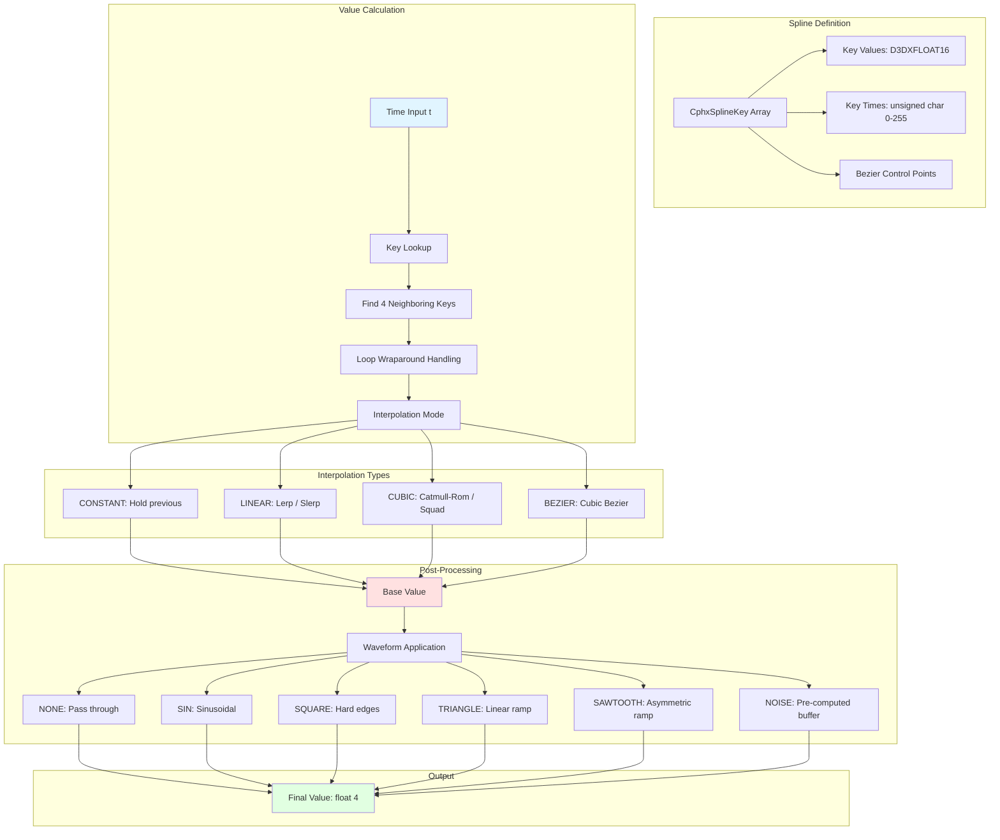

# Phoenix Spline Animation System Overview

Everything moves in a demo. Cameras sweep through procedural geometry. Lights pulse and oscillate. Material roughness animates from chrome to concrete. Particles shift color as they age. The universal primitive behind all this motion isn't hand-keyframed animation curves or physics simulation—it's splines. Compact, expressive, and deterministic, splines transform discrete keyframes into continuous motion.

Phoenix's spline system is the engine's animation foundation. Every animatable property—camera position, light intensity, material parameters, particle velocity—routes through the same infrastructure. You define a handful of keyframes, choose an interpolation mode, optionally apply waveform modulation, and the system generates smooth values for any point in time. The elegance lies in the abstraction: the same CphxSpline class handles scalar animation, vector motion, color transitions, and quaternion rotation with specialized subclasses handling type-specific interpolation math.

This architecture matters because animation is where 64k demos face their harshest size constraints. You can't ship motion capture data, baked animation curves, or keyframe-dense timelines. Yet Clean Slate contains camera moves that would take hundreds of keyframes to animate manually. The trick is expressive interpolation modes—Catmull-Rom splines flow through points naturally, Bezier curves offer precise control with explicit tangents, and waveform modifiers add periodic motion without additional keys. A 4-key spline with sine modulation generates infinite complexity from 40 bytes of data.

Think of splines like vector graphics for motion. A bitmap stores every pixel; a vector image stores control points and rendering instructions. Similarly, baked animation stores every frame's value; a spline stores control keys and interpolation rules. You can scale, time-remap, and modulate splines without increasing storage. The spline system is to animation what procedural generation is to geometry—compact representation with emergent complexity.

## System Architecture

The spline system consists of three layers: key storage, interpolation, and waveform post-processing. Keys define control points in time with half-precision float values. Interpolation generates smooth transitions between keys using linear, cubic, or Bezier algorithms. Waveforms apply periodic modulation—sine waves, square pulses, triangle oscillations, or smoothed noise—on top of the interpolated base curve.



The process starts in `CphxSpline::CalculateValue(float t)` at phxSpline.cpp:33-101. The method takes normalized time (0.0 to 1.0), searches the key array for the surrounding interval, calculates interpolation weights, delegates to type-specific interpolation methods, and optionally applies waveform post-processing before storing the result in the `Value[4]` array.

## CphxSplineKey: Compact Key Storage

Keys pack temporal and value data into a minimal footprint. Each key represents a control point—a specific moment in time with associated values.

phxSpline.h:17-29 defines the key structure:

```cpp
class CphxSplineKey {
public:
    unsigned char t;                    // Time position 0-255

    D3DXFLOAT16 Value[4];              // Up to 4 component values

    D3DXFLOAT16 controlvalues[6];      // Bezier control point values
    unsigned char controlpositions[2];  // Bezier control point positions

    float GetTime() { return SPLINEPOSITIONCALC(t); }
    void GetValue(float v[4]);
};
```

The time value `t` is a single byte representing positions from 0 to 255. The macro `SPLINEPOSITIONCALC(t)` (phxSpline.h:15) converts this to normalized time: `(t + 1.0f) / 256.0f`. This gives 256 discrete time positions with a peculiar property—time 0 maps to ~0.0039 (1/256), not exactly 0.0. The offset ensures no key sits exactly at zero, which simplifies loop wraparound logic. A key with `t=0` represents time 0.0039; `t=255` represents time 1.0.

The `Value[4]` array uses 16-bit half-precision floats (D3DXFLOAT16). Most splines only use one component—scalar animation for light intensity, material roughness, particle size. Vector splines use three components for position or color. Quaternion splines use all four for rotation. Storing all four unconditionally wastes space but simplifies code—no polymorphic key types, no specialized memory layouts.

Bezier control points occupy `controlvalues[6]` and `controlpositions[2]`. For Bezier interpolation between two keys, each key stores values and time positions for its outgoing and incoming tangent handles. The values are relative offsets from the key's base value; the positions are time offsets (0-255). Standard Catmull-Rom or linear interpolation ignores these fields.

## Interpolation Modes

Four interpolation modes offer different trade-offs between smoothness, control, and computational cost.

phxSpline.h:31-37 defines the enumeration:

```cpp
enum SPLINEINTERPOLATION {
    INTERPOLATION_CONSTANT = 0,  // Hold previous key value
    INTERPOLATION_LINEAR = 1,    // Linear interpolation
    INTERPOLATION_CUBIC = 2,     // Catmull-Rom through 4 keys
    INTERPOLATION_BEZIER = 3,    // Bezier with explicit control points
};
```

### INTERPOLATION_CONSTANT

The simplest mode: hold the previous key's value until the next key is reached. This produces stepped animation—no smooth transitions. Useful for discrete state changes (material switches, effect toggles) or deliberately robotic motion.

phxSpline.cpp:76-78 shows the implementation:

```cpp
case INTERPOLATION_CONSTANT:
    NeededKeys[1]->GetValue(Value);
    break;
```

No math, just a value copy. The key before the current time dictates the output.

### INTERPOLATION_LINEAR

Linear interpolation blends smoothly between two keys. For scalar values, this is standard lerp: `a + (b - a) * t`. For quaternions, it's slerp: spherical linear interpolation that maintains constant angular velocity along the rotation arc.

phxSpline.cpp:104-107 implements scalar linear interpolation:

```cpp
void CphxSpline_float16::Lerp(CphxSplineKey *a, CphxSplineKey *b, float t) {
    Value[0] = lerp(a->Value[0], b->Value[0], t);
}
```

phxSpline.cpp:233-244 implements quaternion slerp:

```cpp
void CphxSpline_Quaternion16::Lerp(CphxSplineKey *a, CphxSplineKey *b, float t) {
    D3DXQUATERNION q1, q2, r;
    q1 = D3DXQUATERNION(a->Value);
    q2 = D3DXQUATERNION(b->Value);
    D3DXQuaternionSlerp(&r, &q1, &q2, t);
    Value[0] = r.x; Value[1] = r.y;
    Value[2] = r.z; Value[3] = r.w;
}
```

Linear interpolation is computationally cheap and predictable. The trade-off is that velocity isn't continuous—the curve can "corner" sharply at keyframes. For smooth camera motion, cubic interpolation is preferred.

### INTERPOLATION_CUBIC

Cubic interpolation uses Catmull-Rom splines, which pass through all keyframes while maintaining C1 continuity (continuous first derivative). The curve's tangent at each key is determined by neighboring keys—no manual tangent editing required. This produces naturally flowing motion.

Catmull-Rom requires four keys: two neighbors on each side of the interpolation interval. The formula is:

```
value = 0.5 * (
    2*b +
    (-a + c) * t +
    (2*a - 5*b + 4*c - d) * t^2 +
    (-a + 3*b - 3*c + d) * t^3
)
```

phxSpline.cpp:111-114 implements this for scalars:

```cpp
void CphxSpline_float16::QuadraticInterpolation(
    CphxSplineKey *a, CphxSplineKey *b,
    CphxSplineKey *c, CphxSplineKey *d, float t) {
    Value[0] = catmullrom(a->Value[0], b->Value[0], c->Value[0], d->Value[0], t);
}
```

For quaternions, the analog is Squad (Spherical Quadrangle interpolation), which uses four quaternions to compute an intermediate rotation with smooth tangents:

phxSpline.cpp:248-263:

```cpp
void CphxSpline_Quaternion16::QuadraticInterpolation(
    CphxSplineKey *a, CphxSplineKey *b,
    CphxSplineKey *c, CphxSplineKey *d, float t) {
    D3DXQUATERNION q0, q1, q2, q3, qa, qb, qc, r;
    q0 = D3DXQUATERNION(a->Value);
    q1 = D3DXQUATERNION(b->Value);
    q2 = D3DXQUATERNION(c->Value);
    q3 = D3DXQUATERNION(d->Value);

    D3DXQuaternionSquadSetup(&qa, &qb, &qc, &q0, &q1, &q2, &q3);
    D3DXQuaternionSquad(&r, &q1, &qa, &qb, &qc, t);

    Value[0] = r.x; Value[1] = r.y;
    Value[2] = r.z; Value[3] = r.w;
}
```

Cubic modes cost more cycles than linear but produce significantly more natural motion. Camera paths and organic motion nearly always use cubic interpolation.

### INTERPOLATION_BEZIER

Bezier interpolation grants explicit control over tangents via control points stored in each key. Unlike Catmull-Rom, where tangents derive automatically from neighbors, Bezier lets artists sculpt acceleration and deceleration precisely.

The Bezier implementation is more complex because it operates in both time and value dimensions. First, it calculates the effective time `t` by solving the Bezier curve in the time domain (phxSpline.cpp:126-130), then applies a standard cubic Bezier formula in the value domain (phxSpline.cpp:131-135):

```cpp
t = getbeziert(t1,
               t1 + k1->controlpositions[1] / 255.0f,
               t2 - k2->controlpositions[0] / 255.0f,
               t2, t);
Value[0] = bezier(k1->Value[0],
                  k1->Value[0] + k1->controlvalues[1],
                  k2->Value[0] - k2->controlvalues[0],
                  k2->Value[0], t);
```

This two-stage approach means Bezier handles can create ease-in, ease-out, and even overshoot effects. The cost is storage—each key needs 6 additional half-floats and 2 bytes for control data.

## Interpolation Mode Comparison

Here's how the modes stack up:

| Mode | Keys Required | Continuity | Manual Control | Typical Use | Cost (approx.) |
|------|---------------|------------|----------------|-------------|----------------|
| CONSTANT | 1 | C⁻¹ (discontinuous) | None | State switches, discrete values | Minimal |
| LINEAR | 2 | C⁰ (position) | None | Simple fades, uniform motion | Low |
| CUBIC | 4 | C¹ (velocity) | None | Smooth camera paths, natural motion | Medium |
| BEZIER | 2 | C¹ (velocity) | Full tangent control | Precise timing, animation curves | High |

Most splines in Clean Slate use cubic interpolation. Linear appears for simple fades. Bezier is reserved for specific timing needs—like synchronizing visual beats to music.

## Key Lookup and Time Calculation

Before interpolation can occur, the system must find the correct keys. This involves binary search logic, loop handling, and fractional time calculation.

phxSpline.cpp:55-71 performs key selection:

```cpp
int pos = -1;
while (pos < KeyCount - 1 && Keys[(pos + 1) % KeyCount]->GetTime() <= t) pos++;
pos += KeyCount - 1;

CphxSplineKey *NeededKeys[4];
for (int x = 0; x < 4; x++)
    NeededKeys[x] = Keys[(pos + x) % KeyCount];

// t is between NeededKeys[1] and NeededKeys[2]
float distkeys = NeededKeys[2]->GetTime() - NeededKeys[1]->GetTime();
if (Loop) distkeys = 1 + distkeys - (int)(1 + distkeys);

float partialt = t - NeededKeys[1]->GetTime() + 1;
partialt = (partialt - (int)(partialt)) / distkeys;
```

The while loop advances `pos` until `Keys[pos+1]->GetTime()` exceeds the input time `t`. Then it backs up by `KeyCount - 1` and grabs four consecutive keys using modulo arithmetic. This approach handles wraparound naturally—if the spline loops and you need keys past the end of the array, modulo wraps to the beginning.

The `distkeys` calculation determines the time span between the two interpolation keys. For non-looping splines, this is straightforward subtraction. For looping splines, if `NeededKeys[2]->GetTime()` is less than `NeededKeys[1]->GetTime()` (we wrapped around), the formula `1 + distkeys - (int)(1 + distkeys)` extracts the fractional component to get the true interval.

The `partialt` calculation normalizes time within the key interval. Adding 1 before taking the integer part ensures the modulo operation works correctly for negative values (which occur during loop wraparound). Dividing by `distkeys` produces a 0.0–1.0 value passed to interpolation functions.

This logic is dense but reliable. The code handles edge cases—single-key splines, time before the first key, time after the last key—with early returns (phxSpline.cpp:39-51).

## Waveform Modifiers

Waveforms add periodic oscillation on top of the base interpolated curve. This enables effects like pulsing lights, vibrating cameras, or oscillating material properties without keyframing every oscillation.

phxSpline.h:39-47 defines available waveforms:

```cpp
enum SPLINEWAVEFORM {
    WAVEFORM_NONE = 0,      // No modification
    WAVEFORM_SIN = 1,       // Sinusoidal oscillation
    WAVEFORM_SQUARE = 2,    // Square wave
    WAVEFORM_TRIANGLE = 3,  // Triangle wave
    WAVEFORM_SAWTOOTH = 4,  // Sawtooth wave
    WAVEFORM_NOISE = 5,     // Pre-computed noise buffer
};
```

Waveforms operate in the `PostProcess()` method called after interpolation. Each waveform calculates a modifier value based on time, multiplies it by `WaveformAmplitude`, and either adds or multiplies it into the base value depending on the `MultiplicativeWaveform` flag.

### WAVEFORM_SIN

Sine waves produce smooth periodic oscillation. The phase is `t * WaveformFrequency * 2π`, and the result is `sin(phase)`.

phxSpline.cpp:155-166:

```cpp
float ph = t * WaveformFrequency;
float s = sin(ph * pi * 2.0f);

switch (Waveform) {
case WAVEFORM_SIN:
    wf = s;
    break;
```

A frequency of 1.0 produces one full cycle over the animation's duration. Frequency 4.0 oscillates four times. The amplitude scales the oscillation magnitude.

### WAVEFORM_SQUARE

Square waves toggle between -1 and +1 based on the sine wave's sign. This creates hard transitions—no smooth ramp.

phxSpline.cpp:169-174:

```cpp
case WAVEFORM_SQUARE:
    if (s == 0)
        wf = 1.0;
    else
        wf = s / fabs(s);
    break;
```

The edge case `s == 0` maps to 1.0 to avoid division issues. Otherwise, dividing sine by its absolute value produces -1 or +1.

### WAVEFORM_TRIANGLE

Triangle waves ramp linearly from -1 to +1 and back. The formula uses modulo arithmetic to create a sawtooth, then reflects the second half.

phxSpline.cpp:186-188:

```cpp
case WAVEFORM_TRIANGLE:
    wf = (fmodf(ph, 1) - 0.5f) * 2;
    break;
```

Taking `fmod(ph, 1)` produces a 0.0–1.0 sawtooth. Subtracting 0.5 shifts to -0.5–0.5, and multiplying by 2 scales to -1–1.

### WAVEFORM_SAWTOOTH

Sawtooth waves ramp from -1 to +1, then instantly drop and repeat. This creates asymmetric oscillation.

phxSpline.cpp:177-183:

```cpp
case WAVEFORM_SAWTOOTH: {
    float f = fmodf(ph, 2.0f);
    f = (f > 1.0f) ? 2 - f : f;
    wf = (f - 0.5f) * 2;
    break;
}
```

The modulo 2.0 creates a period, then the conditional reflects values above 1.0 to create the sawtooth's distinctive shape.

### WAVEFORM_NOISE

Noise waveforms use a pre-computed smoothed random buffer. This provides organic variation—camera shake, flicker effects—without the computation cost of per-frame Perlin noise.

phxSpline.cpp:191-219:

```cpp
case WAVEFORM_NOISE: {
    if (!NoiseCalculated) {
        srand(RandSeed);
        for (int x = 0; x < WAVEFORMSPLINENOISEBUFFERSIZE; x++)
            map[x] = rand() / (float)RAND_MAX;
        int sampleWidth = WAVEFORMSPLINENOISEBUFFERSIZE / max(1, WaveformFrequency);

        for (int z = 0; z < 3; z++) {
            for (int x = 0; x < WAVEFORMSPLINENOISEBUFFERSIZE; x++) {
                float val = 0;
                for (int y = 0; y < sampleWidth; y++)
                    val += map[(x + y) % WAVEFORMSPLINENOISEBUFFERSIZE];
                NoiseMap[x] = val / (float)sampleWidth;
            }
            for (int x = 0; x < WAVEFORMSPLINENOISEBUFFERSIZE; x++)
                map[x] = NoiseMap[x];
        }
        NoiseCalculated = true;
    }

    float tn = fmod(t * WAVEFORMSPLINENOISEBUFFERSIZE, 1);
    int tp = (int)(t * WAVEFORMSPLINENOISEBUFFERSIZE);
    wf = (NoiseMap[tp] + (NoiseMap[(tp + 1) % WAVEFORMSPLINENOISEBUFFERSIZE] - NoiseMap[tp]) * tn) * 2 - 1;
    break;
}
```

On first use, the system seeds random, fills an 8192-sample buffer with random values, then smooths via a windowed averaging pass repeated three times. The `sampleWidth` derives from frequency—higher frequency produces tighter, faster noise.

At runtime, it linearly interpolates between adjacent noise samples based on time, producing continuous variation. The 8192-sample buffer provides roughly 2.7 minutes of unique noise at 60fps before looping.

### Waveform Application

After calculating the waveform value `wf`, it's scaled by amplitude and applied:

phxSpline.cpp:223-229:

```cpp
wf *= WaveformAmplitude;

if (MultiplicativeWaveform)
    Value[0] *= wf;
else
    Value[0] += wf;
```

Additive waveforms shift the value up and down (e.g., light intensity oscillating around a base level). Multiplicative waveforms scale the value (e.g., doubling and halving scale for a pulsing effect). The choice depends on the desired visual behavior.

## Waveform Use Cases

Here's how different waveforms map to visual effects:

| Waveform | Formula | Characteristics | Typical Use |
|----------|---------|-----------------|-------------|
| SIN | `sin(t * freq * 2π)` | Smooth, periodic | Breathing effects, gentle oscillation |
| SQUARE | `sign(sin(...))` | Hard transitions, binary | Strobe lights, robotic motion |
| TRIANGLE | `abs((t*freq) mod 2 - 1)` | Linear ramps | Mechanical motion, scanline effects |
| SAWTOOTH | `(t*freq) mod 1` | Asymmetric ramp | Repeating sweeps, analog synth feel |
| NOISE | Pre-computed smooth random | Organic, aperiodic | Camera shake, flicker, turbulence |

Combining waveforms with cubic interpolation creates rich motion. A camera's base path flows smoothly via Catmull-Rom, while a noise waveform adds subtle handheld shake. A light's intensity fades via spline keys, while a sine waveform creates pulsing.

## CphxSpline Class Hierarchy

The system uses inheritance to specialize interpolation for different value types.

phxSpline.h:81-127 defines the base class:

```cpp
class CphxSpline {
public:
    float Value[4];  // Calculated output value

    SPLINEINTERPOLATION Interpolation;
    bool Loop;

    CphxSplineKey **Keys;
    int KeyCount;

    SPLINEWAVEFORM Waveform;
    D3DXFLOAT16 WaveformAmplitude;
    D3DXFLOAT16 WaveformFrequency;
    bool MultiplicativeWaveform;
    unsigned char RandSeed;
    bool NoiseCalculated;
    float NoiseMap[WAVEFORMSPLINENOISEBUFFERSIZE];

    void CalculateValue(float t);
    virtual void PostProcess(float t) {};
    virtual void Lerp(CphxSplineKey* a, CphxSplineKey* b, float t) = 0;
    virtual void QuadraticInterpolation(...) = 0;

    D3DXQUATERNION GetQuaternion() { return D3DXQUATERNION(Value); }
    D3DXVECTOR3 GetVector() { return D3DXVECTOR3(Value); }
};
```

The `Value[4]` array holds the computed result. After calling `CalculateValue(t)`, the caller reads `Value[0]` for scalar splines, `Value[0..2]` for vector splines, or `Value[0..3]` for quaternion splines.

The noise buffer (`NoiseMap[8192]`) lives in every spline instance, even if unused. This wastes memory but simplifies code—no polymorphic noise handling, no dynamic allocation. For 64k demos with controlled spline counts, the trade-off is acceptable.

### CphxSpline_float16: Scalar Splines

phxSpline.h:129-146:

```cpp
class CphxSpline_float16 : public CphxSpline {
public:
    virtual void PostProcess(float t);
    virtual void Lerp(CphxSplineKey *a, CphxSplineKey *b, float t);
    virtual void QuadraticInterpolation(CphxSplineKey *a, CphxSplineKey *b,
                                         CphxSplineKey *c, CphxSplineKey *d, float t);
    virtual void BezierInterpolation(CphxSplineKey *a, CphxSplineKey *b,
                                      CphxSplineKey *c, CphxSplineKey *d, float t);
};
```

This subclass implements standard numeric interpolation: lerp for linear, catmullrom for cubic, bezier for Bezier. It also handles waveform post-processing, applying sine/square/triangle/sawtooth/noise modulation to the scalar output.

Most splines in Phoenix are `CphxSpline_float16`—material parameters, light intensities, particle attributes, camera field-of-view, and more.

### CphxSpline_Quaternion16: Rotation Splines

phxSpline.h:148-159:

```cpp
class CphxSpline_Quaternion16 : public CphxSpline {
public:
    virtual void Lerp(CphxSplineKey *a, CphxSplineKey *b, float t);
    virtual void QuadraticInterpolation(CphxSplineKey *a, CphxSplineKey *b,
                                         CphxSplineKey *c, CphxSplineKey *d, float t);
    virtual const int GetKeyFloatCount() { return 4; }
};
```

Quaternion splines use slerp (spherical linear interpolation) instead of lerp, and squad instead of catmullrom. This ensures rotations maintain constant angular velocity and avoid gimbal lock. Waveforms don't apply to quaternions—you can't "add a sine wave" to a rotation meaningfully.

The `GetKeyFloatCount()` method returns 4, indicating all four components of `Value[]` are significant. The base class returns 1 for scalars.

## Default Spline Types

Not every animatable property needs custom keyframes. Many properties hold constant values—a light that never moves, a material parameter fixed at 1.0. Phoenix encodes these as "default splines" to save space.

phxSpline.h:49-69 defines default types:

```cpp
enum DEFAULTSPLINETYPE {
    DEFAULTSPLINE_NOT_DEFAULT = 0,      // Regular spline with keys
    DEFAULTSPLINE_ZERO = 1,             // Constant 0.0 (or null quaternion)
    DEFAULTSPLINE_ONE = 2,              // Constant 1.0
    DEFAULTSPLINE_CONSTANTVALUE = 3,    // Arbitrary constant value
    DEFAULTSPLINE_UNKNOWN,              // Used by tool during export
};
```

A `DEFAULTSPLINE_ZERO` spline allocates no key storage—the system just returns 0.0 every frame. Similarly, `DEFAULTSPLINE_ONE` returns 1.0. `DEFAULTSPLINE_CONSTANTVALUE` stores a single value without time information.

This optimization is significant. A scene with 100 objects might have 500 animatable parameters, but only 50 actually animate. The other 450 use default splines, consuming almost zero memory.

## Performance Characteristics

Spline evaluation has predictable cost but varies by configuration.

**Key lookup cost**: Linear scan through keys until `GetTime() > t`. For N keys, this is O(N) worst-case. Most splines have 2–10 keys, so the scan completes in a few cycles. A binary search would be O(log N) but requires more code—linear search wins for small N.

**Interpolation cost**:
- Constant: ~1 cycle (copy)
- Linear: ~5 cycles (lerp formula)
- Cubic: ~20 cycles (Catmull-Rom polynomial)
- Slerp: ~30 cycles (quaternion math + sqrt)
- Squad: ~80 cycles (quaternion setup + interpolation)
- Bezier: ~40 cycles (two-stage evaluation)

**Waveform cost**:
- None: 0 cycles
- Sin: ~15 cycles (sin + multiply)
- Square/Triangle/Sawtooth: ~8 cycles (fmod + arithmetic)
- Noise: ~12 cycles (buffer lookup + lerp)

For a scene with 200 animated splines evaluated per frame at 60fps, total cost is roughly 12,000 spline evaluations per second. At an average 30 cycles per evaluation, that's 360,000 cycles—negligible on a modern CPU running billions of cycles per second. Splines are not a bottleneck.

The real cost is memory. Each `CphxSpline` consumes ~32,800 bytes due to the 8192-float noise buffer (8192 * 4 bytes). If only 10% of splines use noise waveforms, 90% of that memory is wasted. A more sophisticated system would allocate noise buffers on-demand. Phoenix prioritizes code simplicity over memory efficiency—a valid trade-off for controlled demo scenes.

## Integration with Other Systems

Splines interconnect with nearly every Phoenix system.

**Timeline events**: The `CphxEvent::Time` field holds a `CphxSpline_float16*` that remaps event time non-linearly. Reverse motion, time dilation, and looping effects all use time splines.

**Materials**: Every material parameter can have an associated spline. The material system evaluates parameter splines each frame and uploads updated values to constant buffers. This enables animated roughness, color shifts, texture coordinate scrolling, and more.

**Scene objects**: Object position, rotation, and scale are animated via vector and quaternion splines. The scene graph evaluates these during transform accumulation.

**Cameras**: Field-of-view, position, target, and roll are spline-driven. Combined with cubic interpolation, this produces cinematic camera moves from minimal keyframes.

**Lights**: Position, color, intensity, and attenuation parameters animate via splines. A pulsing light might have a static position spline and an intensity spline with sine waveform.

**Particles**: Emitter position, velocity, color over lifetime, size over lifetime—all spline-based. Particles read splines indexed by particle age.

This pervasive integration is why the spline system is so critical. It's not a feature; it's infrastructure.

## Implications for Rust Framework

Phoenix's spline architecture offers lessons for a Rust-based creative coding framework.

**Adopt: Unified animation primitive**. Using splines for all animation creates consistency. Users learn one system and apply it everywhere. The alternative—separate animation systems for transforms, materials, and particles—multiplies API surface area.

**Adopt: Interpolation mode abstraction**. Offering constant/linear/cubic/Bezier gives artists control without complexity. Most users will default to cubic; power users will leverage Bezier for precision.

**Adopt: Waveform modulation**. Adding periodic functions on top of base curves is incredibly expressive. The five waveform types (sin, square, triangle, sawtooth, noise) cover most use cases. Supporting waveform parameters (amplitude, frequency, additive/multiplicative) enables rich effects.

**Modify: Separate noise buffer storage**. Allocating 32KB per spline for noise buffers is wasteful. A Rust framework should use `Option<Box<[f32; 8192]>>` to heap-allocate only when needed. Or use an arena allocator shared across all noise-using splines.

**Modify: Use proper search for many keys**. Linear scan works for 2–10 keys but degrades with dozens. Implement binary search or cache the last-found interval. For splines with 50+ keys, linear scan becomes measurable.

**Modify: Explicit type safety for quaternions**. Phoenix uses virtual methods to dispatch between scalar and quaternion interpolation. Rust can use generics and traits for zero-cost dispatch:

```rust
trait SplineValue: Copy {
    fn lerp(a: Self, b: Self, t: f32) -> Self;
    fn cubic(a: Self, b: Self, c: Self, d: Self, t: f32) -> Self;
}

impl SplineValue for f32 { /* scalar math */ }
impl SplineValue for Quat { /* slerp/squad */ }

struct Spline<T: SplineValue> {
    keys: Vec<SplineKey<T>>,
    interpolation: Interpolation,
    // ...
}
```

This ensures quaternion splines can't accidentally use scalar interpolation, catching errors at compile time.

**Avoid: Tight coupling to D3DX types**. Phoenix uses `D3DXFLOAT16` and `D3DXQUATERNION` directly in keys. A framework should abstract over vector/quaternion types or use its own. This enables backends beyond DirectX and avoids dependency on deprecated libraries.

**Avoid: Goto-based control flow**. The `POSTPROCESS` macro (phxSpline.cpp:31) uses `goto` to jump to post-processing. It saves a few bytes in the minimal build but harms readability. Modern optimizers eliminate redundant branches without requiring manual goto.

## Related Documents

This overview introduces the spline animation system. For detailed implementations and usage patterns, see:

- **[interpolation.md](interpolation.md)** — Deep dive on lerp, catmullrom, bezier, slerp, squad algorithms with derivations
- **[waveforms.md](waveforms.md)** — Waveform mathematics, amplitude/frequency/phase relationships, noise generation
- **[integration.md](integration.md)** — How materials, timeline, cameras, and particles consume spline data
- **[time-remapping.md](time-remapping.md)** — Using splines to warp time within timeline events
- **[../code-traces/camera-animation.md](../code-traces/camera-animation.md)** — Walkthrough of a complete camera path using quaternion and vector splines
- **[../code-traces/material-animation.md](../code-traces/material-animation.md)** — Roughness and color animation in PBR materials

For cross-cutting analysis:

- **[../timeline/overview.md](../timeline/overview.md)** — Timeline event system and time spline usage
- **[../rendering/materials.md](../rendering/materials.md)** — Material parameter system and spline binding
- **[../scene/objects.md](../scene/objects.md)** — Transform animation via position/rotation/scale splines

## Source File Reference

| File | Purpose | Key Components | Lines |
|------|---------|----------------|-------|
| phxSpline.h | Type definitions | CphxSplineKey (17-29), SPLINEINTERPOLATION (31-37), SPLINEWAVEFORM (39-47), DEFAULTSPLINETYPE (49-69), CphxSpline (81-127), CphxSpline_float16 (129-146), CphxSpline_Quaternion16 (148-159) | 159 |
| phxSpline.cpp | Implementation | CphxSplineKey::GetValue (21-25), CphxSpline::CalculateValue (33-101), CphxSpline_float16::Lerp (104-107), CphxSpline_float16::QuadraticInterpolation (111-114), CphxSpline_float16::BezierInterpolation (118-136), CphxSpline_float16::PostProcess (143-229), CphxSpline_Quaternion16::Lerp (233-244), CphxSpline_Quaternion16::QuadraticInterpolation (248-263) | 264 |
| phxMath.h | Math utilities | lerp, catmullrom, bezier, getbeziert functions (not shown) | — |

All source paths are relative to `demoscene/apex-public/apEx/Phoenix/`.
