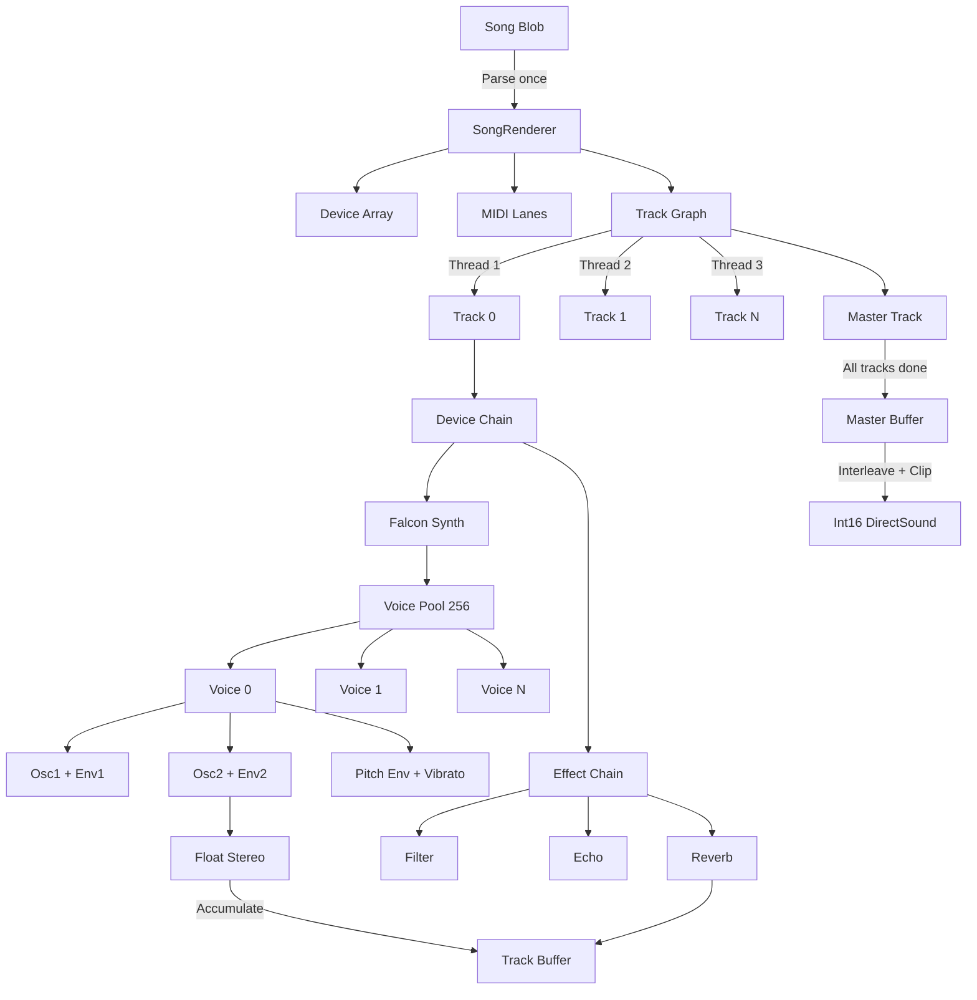

# MVX Audio Synthesis

Imagine packing a three-minute orchestral soundtrack into the space of a floppy disk—not as compressed audio files, but as executable code that generates the music in real-time. This is the demoscene's 64KB challenge, where entire productions including visuals, music, and effects must fit in less space than a typical email attachment. MVX is apEx's answer to this constraint: a synthesis engine that stores musical *instructions* rather than waveforms, rendering soundtracks algorithmically while maintaining sample-accurate timing for visual synchronization.

The core problem is one of representation. Traditional game audio ships gigabytes of recorded samples—orchestral hits, drum loops, vocal phrases—loaded into memory and triggered on demand. But 64KB demos can't afford this luxury. MVX's solution builds on a lineage of demoscene audio tools: V2 (Farbrausch's virtual analog synth), WaveSabre (Logicoma's modernization), and finally MVX (Conspiracy's real-time player). Each generation refined the same trade-off: maximize sonic complexity while minimizing storage footprint. The result is a pipeline that stores BPM, MIDI events, synth parameters, and effect chains in a compact binary "blob," then renders this recipe into audio at 44,100 samples per second.

You might wonder why this matters beyond size constraints. The answer lies in audio-visual synchronization. When a bass drum hits, particles explode. When a synth pad swells, the camera zooms. These relationships demand sample-accurate timing—not "sometime in the next buffer," but *exactly* at sample 147,328. Traditional audio engines process events at fixed buffer boundaries (512 or 1024 samples), creating timing jitter that accumulates over minutes. MVX counts samples like a metronome counts beats, ensuring that a note triggered at a specific sample plays at precisely that moment. This is what allows demoscene productions to feel tightly choreographed rather than loosely synchronized.

The technical challenge is rendering this precision fast enough for real-time playback. At 44.1kHz stereo, the audio thread must generate 88,200 floating-point values every second while also parsing MIDI events, managing voice allocations, running FM operators with envelopes, applying effects chains, and mixing multiple tracks in parallel. The architecture that makes this possible is surprisingly elegant: binary blob parsing → parallel track rendering → voice pooling → per-sample synthesis → delta-based event scheduling. Each stage is optimized for size (code must be tiny) and speed (missing a buffer deadline causes audible glitches). Let's trace how a MIDI note-on becomes air pressure waves in your speakers.

## The Lineage: V2 → WaveSabre → MVX

MVX didn't emerge from nothing—it's the third generation of a design philosophy pioneered by Farbrausch's V2 synthesizer in the early 2000s. V2 proved that virtual analog synthesis could deliver film-quality soundtracks within size budgets measured in kilobytes. Its architecture established the pattern: compact parameter storage, CPU-based synthesis, and real-time rendering without sample playback. The core insight was treating audio like a program rather than data—store the algorithm, not the output.

WaveSabre, developed by Logicoma, modernized V2's approach with cleaner C++ (V2's core was x86 assembly), pluggable device architectures, and sample-accurate event scheduling. It introduced the "blob" format—a binary representation of song structure where every byte counts—and the concept of parallel track rendering for better CPU utilization. WaveSabre's devices (Falcon for FM synthesis, Slaughter for subtractive, Cathedral for reverb) became the building blocks for 64KB soundtracks across multiple demoscene productions.

MVX represents Conspiracy's integration of WaveSabre into the apEx framework. The synthesis pipeline remains WaveSabre's design, but MVX adds a simplified initialization API (`mvxSystem_Init`), raw waveform playback for pre-rendered tracks, and tighter integration with the demo's visual timeline. Think of it as WaveSabre specialized for demo playback rather than general music production. The core innovation—sample-accurate scheduling via delta counters—flows unchanged from V2 through WaveSabre to MVX.

## Song Representation: The Binary Blob

When the demo executable launches, it contains embedded musical data as a contiguous byte array—the "blob." This isn't JSON or XML; it's raw binary packed with custom serialization functions (`readInt()`, `readByte()`, `readDouble()`) that advance a pointer through the data. The format is brutally compact: no field names, no padding, just sequential values in a contract both writer and reader must honor. A typical blob encodes BPM, sample rate, song length, device definitions with parameter chunks, MIDI lanes with delta-encoded events, and track routing graphs.

The blob's structure mirrors the rendering pipeline. First comes global parameters—tempo and sample rate set the timing foundation for everything that follows. Next, device definitions: a count, then for each device, a type ID byte (which factory function creates it?), followed by a chunk of parameter data. Each device deserializes its own chunk format; Falcon reads oscillator ratios and envelope times, while effects like Cathedral read reverb decay and diffusion coefficients. This polymorphic serialization keeps the blob dense—parameters only appear if the device uses them.

MIDI lanes follow, storing note events with delta encoding. Instead of absolute timestamps ("note-on at sample 147,328"), deltas encode relative offsets ("147,328 samples after the previous event"). This compression matters: a 3-minute track at 44.1kHz spans 7.9 million samples, requiring 23 bits per timestamp. Delta encoding typically uses 8-16 bits per event, cutting storage in half. The high bit of the note byte distinguishes note-on (0) from note-off (1), packing two enumerations into one field.

Track definitions complete the blob, specifying device chains (indices into the device array), routing receives (which other tracks feed audio in), MIDI lane assignments, and automation curves. The master track—always the last in the array—becomes the synchronization barrier: when it finishes rendering, all dependencies have completed. Blob parsing happens once at startup (`SongRenderer::SongRenderer`, SongRenderer.cpp:7), building the runtime object graph that the renderer traverses 44,100 times per second during playback.

## Playback Pipeline: From Blob to Sound

The player initialization at MusicPlayer.cpp:298 receives a pointer to the song blob and constructs a `SongRenderer` with three render threads. The factory function pointer (`SongFactory`) maps device IDs to concrete types—Falcon for FM synthesis, Slaughter for subtractive, Thunder for drums. This indirection is essential for code size: only link the synths you actually use, not the entire library. The `RealtimePlayer` wraps the renderer with DirectSound output, buffering rendered audio for the Windows audio subsystem.

When playback begins, DirectSound requests samples in fixed chunks (typically 512 or 1024 frames). The `RenderSamples()` function (SongRenderer.cpp:117) becomes the heart of the engine, orchestrating parallel track rendering while maintaining sample accuracy. It first sets CPU flags to flush denormal floats to zero—a subtle optimization that prevents massive performance hits when filter states decay toward silence. Denormals (floating-point numbers very close to zero) trigger slow microcode paths on x86 CPUs; flushing them to actual zero keeps the fast path active.

The rendering model treats tracks as tasks in a dependency graph. A track can't run until all its "receives" (input tracks) have finished. The master track depends on all others, forming the completion barrier. Three threads scan the track array looking for work: idle tracks whose dependencies are met. When a thread finds one, it atomically claims ownership via `InterlockedCompareExchange`, runs the track, marks it finished, then scans again. This is lock-free work stealing—no mutexes, no contention, just wait-free progress.

Once all tracks finish, the renderer converts the master track's stereo buffers (32-bit float) to 16-bit signed integers for DirectSound. The bit tricks `i & 1` and `i / 2` interleave stereo channels: even indices are left, odd are right. Hard clipping at ±32768 prevents wrap-around distortion. This final conversion is the only point where floating-point audio becomes hardware samples.

## Voice Architecture: Pooling and Polyphony

Synthesizers need polyphony—multiple notes sounding simultaneously—which requires managing multiple "voices," each with independent state (oscillator phases, envelopes, filters). MVX's `SynthDevice` (SynthDevice.cpp:38) maintains a fixed pool of 256 voices per device. When a note-on arrives, the device scans for the first inactive slot, initializes its state, and marks it active. When the amplitude envelope completes, the voice returns to the pool.

The pool uses first-available allocation: iterate through the array, find `IsOn == false`, claim it. This is simple but potentially slow (O(n) scan on every note-on). The advantage is cache-friendly iteration during rendering—active voices are scattered throughout the array, but the array itself is contiguous. A free-list design (track indices of inactive voices) would be O(1) for allocation but requires maintaining the list structure.

Unison mode complicates allocation: a single note-on triggers multiple voices with slight detuning and panning. The code allocates `VoicesUnisono` slots per note, spreading them across the stereo field with the formula `(f - 0.5) * (VoicesPan * 2.0 - 1.0) + 0.5`. This creates the "thick supersaw" effect heard in trance leads—multiple oscillators beating against each other with slight frequency offsets. The detuning parameter `f * VoicesDetune` ensures each voice has a unique pitch, creating the chorus effect.

No heap allocations occur in the audio thread. Everything uses fixed arrays (`Voice voices[256]`, `Event events[32]`). This keeps the audio callback deterministic—no risk of allocation stalls causing buffer underruns. The trade-off is memory waste when polyphony is low, but for 64KB demos prioritizing real-time performance over memory efficiency, this is acceptable.

## Sample-Accurate Scheduling: The Delta Queue

Here's where MVX's design diverges from typical game audio. Instead of "check for events every N samples," it renders *up to* the next event, handles it precisely, then continues. The `SynthDevice::Run()` method (SynthDevice.cpp:38) maintains an event queue where each entry has a `DeltaSamples` countdown. The core loop finds the nearest upcoming event, renders that many samples, fires the event, decrements all deltas, and repeats.

This looks like the pattern you'd find in a discrete event simulator. Each iteration asks "when does the next thing happen?" and advances time to that moment. For audio, "things" are MIDI events (note-on, note-off, control changes). The loop processes samples in chunks bounded by event timestamps. If the next note-on is 137 samples away, render 137 samples first, *then* trigger the note. This guarantees the note starts at exactly the right sample.

Track rendering (SongRenderer.Track.cpp:74) uses a similar pattern but with absolute sample positions. MIDI lanes store events with delta-encoded timestamps, accumulated into `accumEventTimestamp` as the track plays. For each event, the code computes `samplesToEvent = accumEventTimestamp + e->TimeStamp - lastSamplePos`—the offset in samples from the current render position to when the event should fire. Events with `samplesToEvent < numSamples` (firing within this buffer) get dispatched immediately; others wait for the next render call.

This dual-layer scheduling—deltas at the device level, absolute positions at the track level—keeps timing tight across the entire pipeline. Tracks maintain sample-accurate alignment with the song timeline, while devices handle intra-buffer event precision. The result is jitter measured in single-sample units (23 microseconds at 44.1kHz) rather than buffer-sized chunks (11 milliseconds for 512-sample buffers).

## Synthesis Core: FM Operators and Envelopes

The audio-generating code lives in voice classes like `Falcon::FalconVoice::Run()` (Falcon.cpp:153), which implements two-operator FM synthesis. Each operator is a sine oscillator with self-feedback, and operator 1 modulates operator 2's frequency. This is more flexible than classic Yamaha DX7 FM—both operators can have feedback *and* feedforward modulation. The `osc1Waveform` parameter morphs between sine and square waves via linear interpolation, adding harmonic grit.

The synthesis loop runs per-sample, updating phases and envelopes for each output value. Here's the signal flow: Operator 1 reads its phase, adds self-feedback from the previous sample, computes sine/square morphing, multiplies by its envelope, stores the output. Operator 2 reads its phase, adds self-feedback, adds Operator 1's output scaled by the feedforward amount, computes sine/square, multiplies by its envelope. The result gets panned and accumulated into stereo output buffers.

Phase accumulation follows classic digital synthesis: `osc1Phase += freq1 * osc1RatioScalar`. The phase counter increments by the oscillator's frequency each sample, wrapping modulo 2π. The ratio scalars (computed from coarse + fine tuning parameters) allow non-integer frequency multiples—crucial for bell tones and metallic timbres. Standard FM uses integer ratios (1:2, 1:3) for harmonic sounds; fractional ratios (1:2.718, 1:3.14) create inharmonic partials that sound like struck metal.

Envelopes shape amplitude and pitch over time. MVX uses ADSR (Attack, Decay, Sustain, Release) with quadratic curves for decay and release stages. The `Envelope::GetValue()` method (Envelope.cpp:30) returns the current level based on state: linear ramp for attack, quadratic fall for decay, constant for sustain, quadratic fall for release. The quadratic formula `f *= f` creates exponential-feeling fades that sound more natural than linear—our ears perceive amplitude logarithmically, so squaring the decay factor creates perceptually even fade-outs.

Each operator has its own amplitude envelope, plus a shared pitch envelope for swoops and drops. Vibrato comes from a separate LFO (low-frequency oscillator) that modulates both operators' frequencies. When the amplitude envelope reaches the "finished" state, the voice marks itself inactive and returns to the pool. This automatic lifecycle management means voices clean up after themselves without manual deactivation.

## Effects Chain: Per-Track and Master Processing

After synthesis generates raw audio, the effects chain transforms it. A typical chain might be `Falcon → StateVariableFilter → Echo → Cathedral`, processing audio sequentially through each device. Each device's `Run()` method receives input buffers, output buffers, and sample count, processing the audio in-place or writing to outputs. The device base class (Device.cpp) defines this interface; concrete implementations override it with specific DSP algorithms.

Effects range from simple (Crusher for bit reduction, Leveller for dynamics) to complex (Cathedral for reverb, which uses a network of all-pass filters and comb filters to simulate room acoustics). The modular architecture means tracks can have different effect chains—drums might route through Smasher (compressor) and Echo, while pads route through Twister (chorus) and Cathedral. The routing graph is encoded in the blob's track definitions.

Tracks also support "receives"—mixing audio from other tracks before running the device chain. This enables sidechain compression (kick drum track sends to bass track, which ducks when the kick hits) and parallel processing (dry signal on one track, wet reverb on another, mixed at master). The receive mixing loop (SongRenderer.Track.cpp:74) sums scaled input buffers: `Buffers[j][k] += receiveBuffers[j][k] * r->Volume`. This happens before the device chain runs, so effects process the mixed signal.

The master track is special—it's the final output that gets converted to int16 samples for DirectSound. Typically the master track contains global effects like final limiting or EQ. Because it's always the last track in the array, all other tracks must finish before it runs, making it the natural synchronization point for parallel rendering.

## Parallel Rendering: Lock-Free Track Execution

The rendering thread model splits work across three threads (configurable at initialization). Each thread runs `renderThreadWork()` (SongRenderer.cpp:162), scanning the track array for runnable tasks. A track is runnable when its state is `Idle` and all its dependencies (receive-sending tracks) are `Finished`. The atomic compare-exchange operation claims ownership: if the state is still `Idle` when we try to transition to `Rendering`, we got it; if another thread beat us, the operation fails and we try the next track.

This lock-free design avoids the classic producer-consumer problem: no condition variables, no mutex contention, just atomic state transitions. The track states (`Idle`, `Rendering`, `Finished`) form a simple state machine, and `InterlockedCompareExchange` enforces legal transitions. The only synchronization points are the start events (wake all threads) and the done event (all threads finished), implemented with Windows event objects.

The dependency graph is acyclic by construction—tracks can't receive from themselves or form cycles. The master track depends on all others (explicitly or transitively), ensuring it runs last. This total ordering means there's always work available until completion: if a thread can't find runnable tracks, it means other threads are still working on dependencies, and eventually those will finish, exposing new work.

CPU cache locality suffers from this design—threads might process unrelated tracks back-to-back, thrashing caches. But the alternative (static work partitioning) risks load imbalance: some tracks are cheap (simple synth, few voices), others expensive (reverb, many voices). Dynamic work stealing naturally balances load, keeping all cores busy even when track complexity varies.

## Integration with Demo Timeline

The player exposes `GetSync()` (MusicPlayer.cpp:316), returning current playback position in milliseconds. The demo's visual engine polls this each frame, mapping song time to animation curves, camera paths, and scene transitions. When the bass drops at 47.32 seconds, the visual script triggers the particle explosion because `GetSync()` returned a value >= 47320.

This sync mechanism is one-way: audio drives visuals, not vice versa. The audio thread runs independently, rendering samples into DirectSound's ring buffer at the rate it requests. Visual frame rate fluctuates (60 FPS ideal, but might drop to 30 FPS on slow hardware), but audio sample rate stays constant (44,100 Hz). By polling audio position, visuals can stay synchronized even when rendering slows—they might drop frames, but they'll always show the correct scene for the current song position.

Pre-rendering is an alternative strategy used by some demos: render the entire track to a WAV file at startup, then play it back while rendering visuals. This guarantees smooth audio (no buffer underruns even if visuals stutter) but requires storing the full waveform in memory—about 30MB for a 3-minute stereo track at 44.1kHz/16-bit. For 64KB demos, this is unacceptable. Real-time synthesis keeps memory footprint minimal: just the blob (a few kilobytes) plus runtime state (device parameters, voice states, track buffers).

MVX supports both modes: `mvxSystem_Init()` for real-time synthesis, `mvxSystem_RawInit()` for pre-rendered playback. The apEx framework likely pre-renders tracks during development (faster iteration, offline quality checks) but switches to real-time for final 64KB builds.

## Data Structures

The key types form a hierarchy from high-level song structure to low-level synthesis state. At the top, `SongRenderer` owns the parsed blob, device array, MIDI lanes, and track graph. Tracks own receive definitions, device chains, and float buffers (4 channels: stereo input + stereo output). Devices own voice pools, event queues, and parameter state. Voices own oscillator phases, envelope states, and per-voice parameters like detuning and panning.

```cpp
// Song-level structure
struct SongRenderer {
    int bpm, sampleRate;
    double length;
    Device **devices;           // All synths and effects
    MidiLane **midiLanes;       // Event sequences
    Track **tracks;             // Routing graph
    TrackRenderState *trackRenderStates;  // Parallel rendering state
};

// Track processing
struct Track {
    float **Buffers;            // 4-channel float arrays
    Receive *Receives;          // Input routing
    int *devicesIndicies;       // Effect chain (indices into devices array)
    int midiLaneId;             // Event source
    int lastSamplePos;          // Timeline position
};

// Voice management
struct SynthDevice : Device {
    Voice **voices;             // Fixed pool (256 entries)
    Event events[32];           // Delta-based event queue
    int VoicesUnisono;          // Voices per note
    float VoicesDetune;         // Unison detuning
    float VoicesPan;            // Unison stereo spread
};

// Synthesis state (Falcon-specific)
struct FalconVoice : Voice {
    double osc1Phase, osc2Phase;       // Phase accumulators
    double osc1Output, osc2Output;     // Feedback taps
    Envelope osc1Env, osc2Env;         // Amplitude envelopes
    Envelope pitchEnv;                 // Pitch modulation
    double vibratoPhase;               // LFO state
    float Detune, Pan;                 // Per-voice spread
};

// Event scheduling
struct Event {
    EventType Type;                    // NoteOn/NoteOff
    int DeltaSamples;                  // Countdown to fire
    int Note, Velocity;
};

// Envelope generation
struct Envelope {
    EnvelopeState State;               // Attack/Decay/Sustain/Release/Finished
    float pos;                         // Current position in stage (ms)
    float Attack, Decay, Sustain, Release;  // ADSR parameters (ms or level)
    float releaseValue;                // Level at note-off
};
```

The `MxcsrFlagGuard` (MxcsrFlagGuard.cpp) is a RAII wrapper that sets CPU control flags on construction and restores them on destruction. Setting the FTZ (flush-to-zero) bit in the MXCSR register makes the CPU treat denormal floats as zero, avoiding microcode slow paths. This matters critically for filters, where state variables decay exponentially toward zero and can spend many samples in the denormal range.

## Architecture Diagram



The rendering flow moves left-to-right: blob parsing builds the object graph, parallel threads claim tracks and run device chains, voices synthesize audio, effects process it, tracks mix receives, and the master track converts to hardware samples. Event scheduling happens in parallel with rendering: MIDI lanes feed events to tracks, tracks dispatch to devices, devices maintain delta queues that control voice triggering.

## Implications for Rust Framework Design

MVX's architecture offers several lessons for a Rust-based creative coding framework. The fixed voice pool (256 slots) is simple but wasteful—a more Rust-idiomatic design would use `Vec<Option<VoiceState>>` with a free-list for O(1) allocation. The free-list (a `Vec<usize>` of inactive indices) avoids scanning 256 slots on every note-on:

```rust
struct VoicePool {
    voices: Vec<Option<VoiceState>>,
    free_list: Vec<usize>,
}

impl VoicePool {
    fn allocate(&mut self) -> Option<&mut VoiceState> {
        self.free_list.pop()
            .and_then(|idx| self.voices[idx].as_mut())
    }

    fn release(&mut self, idx: usize) {
        self.voices[idx] = None;
        self.free_list.push(idx);
    }
}
```

This maintains cache-friendly iteration (voices are still contiguous) while avoiding allocation overhead.

WaveSabre's envelope is a state machine with `GetValue()` and `Next()` methods. A Rust equivalent could leverage iterator combinators for clearer control flow:

```rust
struct Envelope {
    state: EnvelopeState,
    pos: f32,
    params: AdsrParams,
}

impl Iterator for Envelope {
    type Item = f32;

    fn next(&mut self) -> Option<f32> {
        let value = match self.state {
            EnvelopeState::Attack => self.pos / self.params.attack,
            EnvelopeState::Decay => {
                let f = 1.0 - self.pos / self.params.decay;
                f * f * (1.0 - self.params.sustain) + self.params.sustain
            }
            EnvelopeState::Finished => return None,
            // ...
        };
        self.advance();
        Some(value)
    }
}
```

Voices can `.zip()` envelope iterators with sample buffers, making the control-rate/audio-rate relationship explicit. This eliminates manual state management—the iterator protocol handles advancement.

The delta-based event queue requires careful delta management (decrement all events each iteration). Rust's type system can enforce correctness with an absolute-sample API:

```rust
struct EventQueue {
    events: VecDeque<(usize, MidiEvent)>,  // (absolute_sample, event)
    current_sample: usize,
}

impl EventQueue {
    fn process_until(&mut self, target_sample: usize) -> impl Iterator<Item = MidiEvent> + '_ {
        std::iter::from_fn(move || {
            self.events.front()
                .filter(|(sample, _)| *sample <= target_sample)
                .map(|(_, event)| {
                    self.events.pop_front();
                    *event
                })
        })
    }
}
```

The `process_until()` API makes it impossible to forget advancing the sample counter—the iterator handles it. Events are stored as absolute positions, avoiding delta arithmetic.

WaveSabre's lock-free track scheduling maps to Rust's `AtomicU8` with `compare_exchange`:

```rust
use std::sync::atomic::{AtomicU8, Ordering};

enum TrackState { Idle = 0, Rendering = 1, Finished = 2 }

fn try_claim_track(state: &AtomicU8) -> bool {
    state.compare_exchange(
        TrackState::Idle as u8,
        TrackState::Rendering as u8,
        Ordering::AcqRel,
        Ordering::Relaxed
    ).is_ok()
}
```

Rayon's `par_iter()` could replace manual thread management, though you'd lose dependency graph awareness. A custom solution using `crossbeam::channel` for work stealing might provide the sweet spot—structured concurrency with explicit dependency handling.

MVX sets FTZ (flush-to-zero) mode for denormals globally via MXCSR flags. Rust can avoid global state with explicit wrappers:

```rust
#[inline(always)]
fn ftz(x: f32) -> f32 {
    if x.abs() < 1e-15 { 0.0 } else { x }
}

// Or SIMD-aware:
#[cfg(target_feature = "sse")]
unsafe fn ftz_sse(x: f32) -> f32 {
    use std::arch::x86_64::*;
    let v = _mm_set_ss(x);
    let flushed = _mm_and_ps(v, _mm_cmpge_ss(v, _mm_set1_ps(1e-15)));
    _mm_cvtss_f32(flushed)
}
```

This keeps the logic explicit in filter loops rather than relying on thread-local CPU state.

## Key Takeaways

The MVX synthesis pipeline demonstrates several architectural principles worth preserving in a modern framework:

**Sample-accurate scheduling** via delta counters is non-negotiable for tight audio-visual sync. Buffer-boundary event processing creates 10+ millisecond timing jitter; delta-based queues reduce this to single-sample precision (23 microseconds at 44.1kHz).

**Lock-free work stealing** enables parallel rendering without contention overhead. Atomic compare-exchange operations on track states avoid mutex bottlenecks, keeping all cores busy processing independent tracks.

**Fixed voice pools** trade memory for deterministic allocation. Heap allocations in audio threads risk unbounded latency; pre-allocated arrays keep rendering predictable. A Rust design with `Vec<Option<Voice>>` and free-lists can improve on this without sacrificing real-time safety.

**Quadratic envelope curves** provide perceptual smoothness at near-zero CPU cost. Linear fades sound unnatural; squaring the decay factor creates exponential-feeling curves that match human hearing.

**Binary blob serialization** achieves 10x+ compression over JSON. A 3-minute track might encode as 5KB of blob versus 50KB+ of text. For 64KB demos, this efficiency is critical.

**FTZ mode** prevents denormal performance cliffs during filter decay. Denormal floats trigger microcode slow paths; flushing to zero maintains fast-path execution.

**Unison spreading** creates thick sounds from multiple voices per note. Per-voice detuning (slight frequency offsets) and panning (stereo spread) turn a simple oscillator into a lush pad.

The pipeline's elegance comes from separation of concerns: song structure (blob parsing), event timing (delta counters), parallel execution (lock-free scheduler), synthesis (voice DSP), and effects processing each operate independently. A Rust rewrite could improve allocation strategies, type safety, and iterator ergonomics while preserving this modular architecture. The core insight—store musical instructions, not waveforms—remains the foundation for compact, real-time generative audio.

## References

- `/demoscene/apex-public/apEx/MinimalPlayer/MusicPlayer.cpp:298` — Player initialization with factory pattern
- `/demoscene/apex-public/apEx/Libraries/WaveSabre/WaveSabrePlayerLib/src/SongRenderer.cpp:7` — Binary blob parsing and device construction
- `/demoscene/apex-public/apEx/Libraries/WaveSabre/WaveSabrePlayerLib/src/SongRenderer.cpp:117` — Parallel track rendering with FTZ mode
- `/demoscene/apex-public/apEx/Libraries/WaveSabre/WaveSabrePlayerLib/src/SongRenderer.cpp:162` — Lock-free work stealing thread function
- `/demoscene/apex-public/apEx/Libraries/WaveSabre/WaveSabrePlayerLib/src/SongRenderer.Track.cpp:74` — Sample-accurate MIDI dispatch and receive mixing
- `/demoscene/apex-public/apEx/Libraries/WaveSabre/WaveSabreCore/src/SynthDevice.cpp:38` — Voice pool management and delta-based event queue
- `/demoscene/apex-public/apEx/Libraries/WaveSabre/WaveSabreCore/src/Falcon.cpp:153` — Two-operator FM synthesis with feedback
- `/demoscene/apex-public/apEx/Libraries/WaveSabre/WaveSabreCore/src/Envelope.cpp:30` — ADSR envelope with quadratic decay curves
