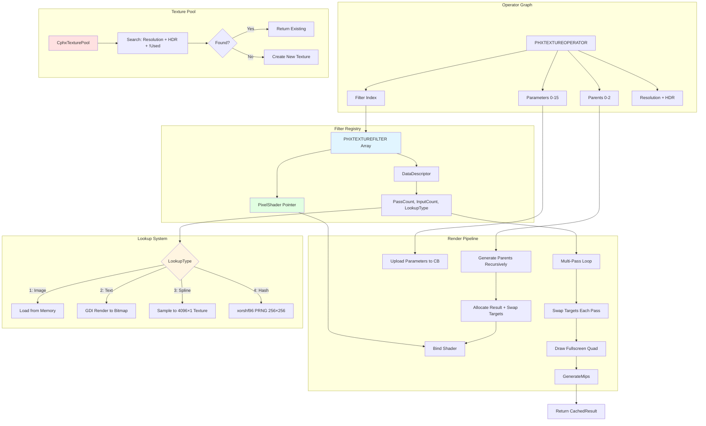

# apEx Texgen (Procedural Texture Generation) Overview

Shipping a 64k demo with photorealistic textures seems impossible. A single uncompressed 2048×2048 texture occupies 16MB of disk space—250 times the entire executable budget. Pre-made textures aren't an option. Yet Clean Slate and other apEx productions feature richly detailed surfaces: worn metal, organic noise patterns, intricate text, color gradients, blurred effects. The solution is procedural texture generation—algorithms that create textures at runtime from compact shader code and parameters.

The Phoenix texgen subsystem implements a complete GPU-accelerated texture pipeline. It organizes generation as a directed acyclic graph (DAG) of operators, each applying a filter shader with specific parameters. Operators reference parent operators as inputs, creating complex textures through composition. The system caches results, reuses render targets through pooling, and supports multi-pass iterative algorithms. A noise operator might compress to 20 bytes of parameters; the resulting 1024×1024 texture would occupy 8MB uncompressed.

The architecture draws from node-based tools like Substance Designer and Filter Forge, but optimizes ruthlessly for executable size. No visual editor bloat, no human-readable serialization formats, no runtime shader compilation overhead. Filters are pre-compiled HLSL pixel shaders. Operators pack into minimal binary structs. The graph evaluates lazily—textures generate only when needed. Memory efficiency comes from a texture pool that reuses render targets as operator evaluation completes.

Think of texgen like a recipe system for cooking. Each operator is a recipe step—"mix these ingredients, apply this technique." Some steps use raw inputs (generate noise from a random seed), others transform previous results (blur an image, adjust colors). The final dish (texture) results from executing steps in dependency order. Just as a recipe compresses a complex meal into text instructions, texgen compresses megabytes of texture data into kilobytes of operators and shader code.

This matters for any framework targeting executable size constraints—not just demos, but also web deployment, mobile apps, or embedded systems. Procedural generation trades disk space and transmission bandwidth for CPU/GPU cycles at runtime. A modern GPU generates a 1024×1024 noise texture in milliseconds. The same texture compressed with PNG requires 500KB+ of bandwidth. Texgen inverts the trade-off: spend cycles to save bytes.

## System Architecture

Phoenix's texgen pipeline flows through operator evaluation, filter application, texture pool management, and special data lookups. The operator graph evaluates recursively with caching to avoid redundant computation.



The flow starts when an operator's `Generate()` method is called. If `CachedResult` exists, it returns immediately—textures generate once and cache. Otherwise, the operator recursively generates its parents, allocates render targets from the pool, and invokes its filter's `Render()` method. The filter binds its pixel shader, uploads parameters, and renders full-screen quads for each pass. After rendering, mipmap generation happens automatically. Parent results mark as unused when no longer needed, returning their textures to the pool.

## Mental Model: Operators as Recipe Steps

Each `PHXTEXTUREOPERATOR` represents a recipe step. It specifies:
- **What technique to use**: The filter index (e.g., "add Perlin noise")
- **What ingredients to mix**: Up to 3 parent operators (e.g., "take the result of step 7 and step 12")
- **How to configure it**: Up to 16 parameter bytes (e.g., "noise frequency = 0.6, amplitude = 0.8")
- **What size to produce**: Resolution packed into a single byte (e.g., 1024×512)

When you call `Generate()`, the system:
1. Checks if this step already executed (cache hit)
2. Prepares ingredients by generating parents (recursive)
3. Grabs two clean bowls from the pool (render targets)
4. Applies the technique (shader) to ingredients (parents) with configuration (parameters)
5. Returns the result and marks ingredients as available for reuse

The graph is a DAG—no cycles allowed. An operator can reference earlier operators as parents, but those parents can't reference descendants. This ensures the graph has a topological order: evaluate roots first, then children, until reaching the final output operator.

## Core Data Structures

The texgen system organizes around four key types that pack data aggressively for serialization and runtime efficiency.

| Structure | Size (Bytes) | Purpose | Key Fields |
|-----------|--------------|---------|------------|
| `PHXFILTERDATADESCRIPTOR` | 2 | Filter metadata bitfield | NeedsRandSeed (1b), InputCount (2b), ParameterCount (5b), PassCount (4b), LookupType (4b) |
| `PHXTEXTUREFILTER` | ~16 | Shader + descriptor | DataDescriptor, PixelShader pointer, Render() method |
| `PHXTEXTUREOPERATOR` | ~48 | Graph node | Resolution (1), Filter (1), RandSeed (1), Parents[3] (6), Parameters[16] (16), NeedsRender (1), CachedResult pointer (8), minimport data (12) |
| `PHXTEXTURESUBROUTINE` | ~12K | Reusable subgraph | DataDescriptor, Operators[256], Output index, Inputs[3], DynamicParameters[16] |

**PHXFILTERDATADESCRIPTOR** (Texgen.h:66-73) packs all filter metadata into 16 bits:
```cpp
struct PHXFILTERDATADESCRIPTOR {
  unsigned int NeedsRandSeed : 1;     // Does filter use randomization?
  unsigned int InputCount : 2;        // 0-3 parent operators required
  unsigned int ParameterCount : 5;    // 0-31 parameter bytes
  unsigned int PassCount : 4;         // 1-16 rendering passes
  unsigned int LookupType : 4;        // 0=none, 1=image, 2=text, 3=spline, 4=hash
};
```

This bitfield compresses filter capabilities into a serializable format. `InputCount` determines how many parent pointers to read during deserialization. `ParameterCount` defines how many bytes follow in the operator stream. `PassCount` controls multi-pass iteration. `LookupType` triggers special data generation.

**PHXTEXTUREFILTER** (Texgen.h:75-92) holds the compiled shader and metadata:
```cpp
class PHXTEXTUREFILTER {
public:
  PHXFILTERDATADESCRIPTOR DataDescriptor;
  ID3D11PixelShader *PixelShader;

  void Render(CphxTexturePoolTexture *&Target,
              CphxTexturePoolTexture *&SwapBuffer,
              CphxTexturePoolTexture *Inputs[3],
              unsigned char RandSeed,
              unsigned char Parameters[16],
              void *ExtraData, int ExtraDataSize);

  virtual CphxTexturePoolTexture *GetLookupTexture(unsigned char Res,
                                                    void *ExtraData,
                                                    int ExtraDataSize);
};
```

The filter array is global (`PHXTEXTUREFILTER *TextureFilters`). Each filter compiles once from compressed shader code during initialization (Project.cpp:350-382). Operators reference filters by index, avoiding shader duplication. The `Render()` method implements the multi-pass loop, parameter upload, and texture binding.

**PHXTEXTUREOPERATOR** (Texgen.h:105-124) defines a graph node:
```cpp
struct PHXTEXTUREOPERATOR {
  unsigned char Resolution;         // Packed X/Y resolution (4 bits each)
  unsigned char Filter;             // Filter index (bit 7 = HDR flag)
  unsigned char RandSeed;           // Random seed for procedural variation
  short Parents[3];                 // Parent operator indices (-1 = none)
  unsigned char Parameters[16];     // Filter-specific parameters (0-255)

  bool NeedsRender;                 // Is this operator referenced?
  CphxTexturePoolTexture *CachedResult;  // Cached output texture

  int minimportData2;               // Size of extra data
  void *minimportData;              // Pointer to image/text/spline data

  CphxTexturePoolTexture *Generate(PHXTEXTUREFILTER *Filters,
                                    PHXTEXTUREOPERATOR *Operators);
};
```

The `Resolution` byte encodes independent X and Y dimensions using high/low nibbles. The `Filter` byte's top bit flags HDR rendering (RGBA16F instead of RGBA16_UNORM). Parent indices use -1 to indicate "no parent." Parameters normalize to 0.0-1.0 in shaders by dividing by 255.

**PHXTEXTURESUBROUTINE** (Texgen.h:135-149) encapsulates reusable operator graphs:
```cpp
struct PHXTEXTURESUBROUTINE {
  PHXFILTERDATADESCRIPTOR DataDescriptor;        // Inputs/parameters like a filter
  PHXTEXTUREOPERATOR Operators[256];             // Embedded operator graph
  unsigned char Output;                          // Which operator produces output
  unsigned char Inputs[3];                       // Which operators receive external inputs
  unsigned char DynamicParameterCount;           // Number of parameter overrides
  PHXTEXTUREPARAMETEROVERRIDE DynamicParameters[16];  // {TargetOp, TargetParam} pairs

  CphxTexturePoolTexture *Generate(PHXTEXTUREFILTER *Filters,
                                    PHXTEXTUREOPERATOR *CallerOperators,
                                    unsigned short *Parents,
                                    unsigned char *Parameters,
                                    unsigned char Resolution);
};
```

Subroutines allow operator graphs to function as filters. The tool can define a complex effect (e.g., "brushed metal": noise + directional blur + color ramp + specular highlights) and reuse it with different parameters. The `Generate()` method (Texgen.cpp:502-527) wires caller operator outputs to input indices, propagates the resolution, overrides parameters, evaluates the embedded graph, and returns the output operator's result.

## Resolution Encoding: Power-of-Two Packing

The `Resolution` byte packs independent X and Y dimensions into 4 bits each, limiting to power-of-two sizes from 16 to 32768:

```cpp
#define GETXRES(x) (1 << (x >> 4))      // High nibble: X dimension
#define GETYRES(y) (1 << (y & 0x0f))    // Low nibble: Y dimension
```

This encoding saves memory while supporting non-square textures. Examples:

| Hex Value | Binary | X Resolution (bits 4-7) | Y Resolution (bits 0-3) | Texture Size |
|-----------|--------|-------------------------|-------------------------|--------------|
| `0x88` | `1000 1000` | 1 << 8 = 256 | 1 << 8 = 256 | 256×256 |
| `0xAA` | `1010 1010` | 1 << 10 = 1024 | 1 << 10 = 1024 | 1024×1024 |
| `0xA8` | `1010 1000` | 1 << 10 = 1024 | 1 << 8 = 256 | 1024×256 |
| `0x66` | `0110 0110` | 1 << 6 = 64 | 1 << 6 = 64 | 64×64 |

This scheme cannot represent arbitrary dimensions like 800×600, but creative coding rarely needs non-power-of-two textures. GPU mipmapping requires power-of-two dimensions for optimal performance. Modern hardware supports NPOT (non-power-of-two) textures, but with restrictions on filtering and wrapping. Phoenix targets maximum compatibility by enforcing POT sizes.

The trade-off is texture memory. A 1280×720 texture (921KB) must round up to 2048×1024 (8MB)—an 8.6x increase. For size-constrained demos, this is acceptable: generate high-resolution textures only where needed, use lower resolutions elsewhere.

## Multi-Pass Ping-Pong Rendering

Filters with `PassCount > 1` enable iterative algorithms that refine results across multiple passes. Each pass reads from the previous pass's output and writes to a new target. Two render targets swap roles—"ping-pong"—to avoid read/write hazards.

The `Render()` method (Texgen.cpp:120-185) implements the loop:

```cpp
for (unsigned int x = 0; x < DataDescriptor.PassCount; x++) {
    // Swap targets: previous output becomes input
    CphxTexturePoolTexture *swapvar = SwapBuffer;
    SwapBuffer = Target;
    Target = swapvar;

    // Set new render target
    phxContext->OMSetRenderTargets(1, &Target->RTView, NULL);

    // Upload pass index to shader
    ShaderData[0] = (float)x;

    // Bind textures: pass 0 uses parent input, later passes use SwapBuffer
    if (Inputs[0] || x)
        Textures[0] = x ? SwapBuffer->View : Inputs[0]->View;

    // Render fullscreen quad
    phxContext->Draw(6, 0);

    // Generate mipmaps for next pass or final output
    phxContext->GenerateMips(Target->View);
}
```

**Pass 0** reads from `Inputs[0]` (the parent operator's texture). **Pass 1+** read from `SwapBuffer` (the previous pass's output). The shader receives the pass index in `ShaderData[0]` to adjust behavior per iteration.

### Use Cases for Multi-Pass Rendering

| Technique | Passes | Strategy |
|-----------|--------|----------|
| **Gaussian blur** | 2 | Pass 0: horizontal blur. Pass 1: vertical blur on pass 0 result. Separable filtering. |
| **Iterative noise** | 4-8 | Each pass adds a noise octave at different frequency/amplitude. Accumulates fractal detail. |
| **Voronoi distance** | 8-16 | Jump flooding algorithm: each pass propagates closest cell center to larger neighborhood. |
| **Reaction-diffusion** | 100+ | Each pass simulates one time step of Gray-Scott or similar PDE. Patterns emerge over iterations. |
| **Blur accumulation** | 4-16 | Each pass applies slight blur and blends with previous result. Creates soft glow effects. |

The shader accesses the pass index to scale parameters:

```hlsl
float4 p(float2 uv : TEXCOORD0) : SV_TARGET {
    float passIndex = ShaderData.x;  // 0, 1, 2, ...
    float frequency = pow(2.0, passIndex);  // Exponential growth per octave
    return texture0.Sample(sampler0, uv) + perlinNoise(uv * frequency) * amplitude;
}
```

Without multi-pass support, these algorithms would require separate operators per iteration, bloating the graph. Multi-pass compresses iteration into a single operator.

## Lookup Texture Types

Some filters need auxiliary data beyond parent textures and parameters. The `LookupType` field (4 bits in `PHXFILTERDATADESCRIPTOR`) defines five modes for generating or loading supplementary textures.

| Type | Value | Description | Use Case | Data Source |
|------|-------|-------------|----------|-------------|
| **None** | 0 | No lookup needed | Pure math filters (gradient, cells) | N/A |
| **Image** | 1 | Load image from memory | Text overlays, logos, decals | Embedded PNG/JPG in `minimportData` |
| **Text** | 2 | Render text using GDI | Dynamic text generation | PHXTEXTDATA struct + string |
| **Spline** | 3 | Sample 4 splines into 1D texture | Color curves, gradient maps | 4× CphxSpline_float16 pointers |
| **Hash** | 4 | Generate 256×256 random texture | Noise basis, dither patterns | xorshf96 PRNG seeded by RandSeed |

### Image Loading (Type 1)

The filter loads a compressed image from `minimportData` using `D3DX11CreateTextureFromMemory()` (Texgen.cpp:220-237). This supports PNG, JPG, DDS, and other DirectX-compatible formats. If D3DX loading fails, a fallback GDI path renders the image using `LoadMetafile()` (348-458), which handles WMF/EMF vector formats.

Use case: A "lens dirt" overlay. Embed a 512×512 PNG (compressed to ~80KB in the executable), load it once, and composite onto rendered scenes.

### Text Rendering (Type 2)

The filter uses Windows GDI to render text to a bitmap (Texgen.cpp:240-299). The `PHXTEXTDATA` structure (Texgen.h:54-64) defines:
```cpp
struct PHXTEXTDATA {
  unsigned char Size;        // Font size (0-255, scaled by texture resolution)
  unsigned char XPos;        // X position offset
  unsigned char YPos;        // Y position offset
  unsigned char CharSpace;   // Character spacing adjustment
  unsigned int Bold : 1;     // Bold flag
  unsigned int Italic : 1;   // Italic flag
  unsigned int Font : 6;     // Font index (0-63)
};
```

The system creates a GDI device context, selects a font from `EngineFontList[]`, calls `TextOut()`, and copies the result to a texture. Text positioning uses `XPos`/`YPos` with wrap-around (`WRAPX`/`WRAPY` macros), enabling tiled text patterns.

Use case: Display "CLEAN SLATE" in a custom font. Render to texture, apply glow and distortion filters, composite onto intro sequence.

### Spline Sampling (Type 3)

The filter evaluates 4 splines (R, G, B, A channels) across 4096 points and stores them in a 4096×1 texture (Texgen.cpp:301-321). Each spline uses `CphxSpline_float16`, a compressed 16-bit float spline format. The shader samples this texture as a lookup table (LUT) for color grading, tonemapping, or gradient generation.

```cpp
for (int x = 0; x < 4096; x++) {
    float t = x / 4095.0f;
    for (int i = 0; i < 4; i++) {
        splines[i]->CalculateValue(t);
        ((unsigned short*)ImageData)[x * 4 + i] =
            (unsigned short)(clamp(splines[i]->Value[0], 0, 1) * 65535);
    }
}
```

Use case: A color curve adjustment. Define a spline in the tool editor (e.g., S-curve for contrast), sample to a 1D LUT, apply in shader: `outputColor = lutTexture.Sample(sampler, inputColor.r)`.

### Hash Texture (Type 4)

The filter generates a 256×256 texture filled with pseudorandom values using the xorshf96 PRNG (Texgen.cpp:323-333):

```cpp
unsigned long xorshf96(void) {  // Period 2^96-1
    unsigned long t;
    rndx ^= rndx << 16;
    rndx ^= rndx >> 5;
    rndx ^= rndx << 1;
    t = rndx;
    rndx = rndy;
    rndy = rndz;
    rndz = t ^ rndx ^ rndy;
    return rndz;
}
```

The seed initializes from `srand(RandSeed)` before calling `GetLookupTexture()`. Each byte in the 256×256×4 buffer comes from `xorshf96()`. This creates a high-frequency random texture for noise basis functions or blue noise patterns.

Use case: Perlin noise implementation. Sample the hash texture at integer lattice points, interpolate between values with smoothstep. The hash texture provides the pseudorandom gradients.

## Shader Parameter Passing

Filters receive parameters through a constant buffer updated per render. The `Render()` method builds a float array (Texgen.cpp:123) and uploads it to `TexgenBufferPS` (127, 156-158):

```cpp
float ShaderData[TEXGEN_MAX_PARAMS + 4];

ShaderData[0] = (float)x;                                   // Pass index (0, 1, 2, ...)
for (int y = 0; y < 3; y++)
    ShaderData[y + 1] = rand() / (float)RAND_MAX;           // Random values per pass
for (int y = 0; y < TEXGEN_MAX_PARAMS; y++)
    ShaderData[y + 4] = Parameters[y] / 255.0f;             // Normalized parameters

phxContext->Map(TexgenBufferPS, 0, D3D11_MAP_WRITE_DISCARD, 0, &map);
memcpy(map.pData, ShaderData, SHADERDATALENGTH);
phxContext->Unmap(TexgenBufferPS, 0);
```

Shaders access this buffer as `cbuffer` slot 0:

```hlsl
cbuffer ShaderData : register(b0) {
    float4 PassData;     // x = pass index, yzw = random values
    float4 Params[4];    // 16 parameters as 4×float4
};

float4 p(float2 uv : TEXCOORD0) : SV_TARGET {
    float frequency = Params[0].x;   // Parameter 0
    float amplitude = Params[0].y;   // Parameter 1
    float octaves = Params[0].z;     // Parameter 2
    // ... use parameters for noise generation
}
```

Parameters compress to unsigned bytes (0-255) for serialization, then normalize to 0.0-1.0 for shader math. This lossy quantization saves space: 16 bytes per operator instead of 64 (if using full floats). For most visual parameters (opacity, frequency, color components), 8-bit precision suffices.

## Texture Pool Management

The texture pool (`CphxTexturePool`, Texgen.h:35-49) manages render target allocation and reuse. GPU textures are expensive to create—each allocation involves driver overhead and video memory allocation. Reusing textures across operator evaluations reduces allocation cost and memory footprint.

**Allocation Strategy** (Texgen.cpp:67-87):

```cpp
CphxTexturePoolTexture *CphxTexturePool::GetTexture(unsigned char Resolution, bool hdr) {
    // Search for matching unused texture
    for (int x = 0; x < poolSize; x++) {
        CphxTexturePoolTexture* p = pool[x];
        if (p->Resolution == Resolution && p->hdr == hdr && !p->Used && !p->Deleted) {
            p->Used = true;
            return p;
        }
    }

    // No match found: create new texture
    CphxTexturePoolTexture *t = new CphxTexturePoolTexture;
    pool[poolSize++] = t;
    t->Resolution = Resolution;
    t->Create(Resolution, hdr);
    t->Used = true;
    return t;
}
```

Each texture tracks three flags:
- **Used**: Currently bound to an operator's evaluation. Prevents reuse mid-computation.
- **Deleted**: Marked for cleanup. Not returned by GetTexture().
- **hdr**: Uses RGBA16F format instead of RGBA16_UNORM. HDR textures support values outside [0,1], necessary for bloom, tone mapping, and physical light units.

**Release Strategy** (Texgen.cpp:488-493):

After an operator finishes rendering, it checks if parent results are still needed:

```cpp
for (int x = 0; x < TEXGEN_MAX_PARENTS; x++)
    if (ParentResults[x] && !Operators[Parents[x]].NeedsRender)
        ParentResults[x]->Used = false;
```

The `NeedsRender` flag indicates whether an operator's output is referenced by the final scene. Operators used only as intermediate steps release their textures immediately after child operators consume them. Operators referenced by materials or saved for later keep their textures allocated.

**Memory Efficiency Example**:

Consider a graph generating a complex texture:
1. Operator 0: Generate Perlin noise (512×512) → Allocates Texture A
2. Operator 1: Generate Voronoi cells (512×512) → Allocates Texture B
3. Operator 2: Blend noise + cells (512×512) → Allocates Texture C, reads A and B
4. After Operator 2 completes: A and B marked `Used = false` (not needed by scene)
5. Operator 3: Blur blended texture (512×512) → Reuses Texture A (same resolution, now available)
6. Operator 4: Colorize blur (512×512) → Reuses Texture B

The pool created 3 textures (A, B, C) to evaluate 5 operators. Without pooling, it would create 5 textures, wasting 40% more VRAM.

## Shader Categories and Filter Count

The texgen filter registry contains ~37 filters across six categories. Each category addresses a specific texture generation need.

| Category | Filter Count | Examples | Primary Purpose |
|----------|--------------|----------|-----------------|
| **Generators** | ~11 | Perlin noise, Voronoi cells, gradient, tile pattern, subplasma | Create base patterns from scratch (no inputs) |
| **Transforms** | ~8 | Rotate+zoom, UV mirror, polar/Cartesian conversion, pixelize, distort | Manipulate UV coordinates to warp textures |
| **Color/Blend** | ~9 | Colorize, blend modes (add/multiply/overlay), HSL adjust, color curves, replace color | Adjust color or combine multiple textures |
| **Filters** | ~5 | Gaussian blur, directional blur, sharpen, contrast/brightness, smooth step | Image processing operations |
| **Normal Generators** | ~2 | Normal map from height, normal blending | Convert grayscale height to surface normals |
| **Special** | ~2 | Text rendering, alpha channel replacement | Unique operations not fitting other categories |

**Generators** initialize the graph with mathematical patterns. Perlin noise uses the hash lookup texture for gradient sampling. Voronoi cells use multi-pass jump flooding to compute distance fields. Gradients interpolate colors along an axis.

**Transforms** apply coordinate transformations before sampling inputs. A rotate+zoom filter manipulates UVs, then samples the parent texture at transformed coordinates. This creates rotated, scaled, or tiled variations without re-rendering.

**Color/Blend** filters combine or adjust colors. Colorize maps grayscale intensity to a color ramp. Blend modes implement Photoshop-style compositing (multiply, screen, overlay). HSL adjustment shifts hue, saturation, or lightness.

**Filters** apply image processing kernels. Blur uses separable Gaussian filtering (horizontal pass, then vertical). Directional blur samples along a vector. Sharpen enhances edges with an unsharp mask.

**Normal Generators** convert height maps to tangent-space normals using Sobel filtering or central differences. Essential for creating bumpy surfaces from procedural heightfields.

**Special** filters implement unique functionality. Text rendering uses GDI lookups. Alpha replacement swaps the alpha channel with a grayscale input, enabling cutout masks.

The total shader code compresses to ~15-25KB in the final executable (depends on filter complexity and compiler optimization). Each filter's pixel shader is small—typically 50-200 instructions—because they operate per-pixel without complex branching.

## Operator Graph Evaluation

The `PHXTEXTUREOPERATOR::Generate()` method (Texgen.cpp:464-497) implements recursive graph evaluation with caching:

```cpp
CphxTexturePoolTexture *PHXTEXTUREOPERATOR::Generate(
    PHXTEXTUREFILTER *Filters,
    PHXTEXTUREOPERATOR *Operators)
{
    // Return cached result if already generated
    if (CachedResult) return CachedResult;

    // Recursively generate parent operators
    CphxTexturePoolTexture *ParentResults[TEXGEN_MAX_PARENTS];
    for (int x = 0; x < TEXGEN_MAX_PARENTS; x++) {
        ParentResults[x] = NULL;
        if (Parents[x] >= 0) {
            ParentResults[x] = Operators[Parents[x]].Generate(Filters, Operators);
        }
    }

    // Allocate render targets from pool
    CphxTexturePoolTexture *Result = TexgenPool->GetTexture(Resolution, (Filter >> 7) != 0);
    CphxTexturePoolTexture *BackBuffer = TexgenPool->GetTexture(Resolution, (Filter >> 7) != 0);

    // Render the filter
    Filters[Filter & 0x7f].Render(Result, BackBuffer, ParentResults,
                                   RandSeed, Parameters, minimportData, minimportData2);

    // Release swap buffer (only Result is cached)
    BackBuffer->Used = false;

    // Release parent results if no longer needed
    for (int x = 0; x < TEXGEN_MAX_PARENTS; x++)
        if (ParentResults[x] && !Operators[Parents[x]].NeedsRender)
            ParentResults[x]->Used = false;

    // Cache and return result
    CachedResult = Result;
    return Result;
}
```

**Caching** prevents redundant computation. If operator 10 depends on operator 5, and operator 12 also depends on operator 5, the system generates operator 5 once and reuses the cached texture.

**Topological Order**: The recursive calls naturally evaluate in dependency order. If the graph is `A → B → D` and `C → D`, calling `D.Generate()` will:
1. Generate B (which generates A first)
2. Generate C
3. Render D using B and C as inputs

**Memory Lifecycle**:
1. Allocate Result and BackBuffer
2. Render filter (may swap targets during multi-pass)
3. Cache Result in operator
4. Release BackBuffer immediately
5. Release parent results if `!NeedsRender`
6. Result remains allocated while `CachedResult` points to it

Materials reference operators by index. When a material binds a texture, it calls `TextureOperators[index].Generate()`, ensuring the texture exists. The cached result persists until the operator resets or the pool clears.

## Subroutine System: Operators as Reusable Functions

Subroutines (`PHXTEXTURESUBROUTINE`, Texgen.h:135-149) encapsulate operator subgraphs as callable filters. This enables abstraction: define a complex effect once, invoke it with different parameters and inputs.

A subroutine contains:
- **Embedded operator array**: Up to 256 operators forming a self-contained graph
- **Input indices**: Which operators in the embedded graph receive external parent textures
- **Output index**: Which operator produces the final result
- **Dynamic parameters**: Parameter overrides applied when calling the subroutine

**Calling Convention** (Texgen.cpp:502-527):

```cpp
CphxTexturePoolTexture *PHXTEXTURESUBROUTINE::Generate(
    PHXTEXTUREFILTER *Filters,
    PHXTEXTUREOPERATOR *CallerOperators,
    unsigned short *Parents,
    unsigned char *Parameters,
    unsigned char Resolution)
{
    // Wire caller's parent outputs to subroutine's input operators
    for (unsigned int x = 0; x < DataDescriptor.InputCount; x++)
        Operators[Inputs[x]].CachedResult =
            CallerOperators[Parents[x]].Generate(Filters, Operators);

    // Propagate resolution to all embedded operators
    for (int x = 0; x < 256; x++)
        Operators[x].Resolution = Resolution;

    // Override parameters
    for (int x = 0; x < DynamicParameterCount; x++)
        Operators[DynamicParameters[x].TargetOperator]
            .Parameters[DynamicParameters[x].TargetParameter] = Parameters[x];

    // Evaluate embedded graph
    CphxTexturePoolTexture *Result = Operators[Output].Generate(Filters, Operators);

    // Release input textures (belong to caller's operators)
    for (unsigned int x = 0; x < DataDescriptor.InputCount; x++) {
        Operators[Inputs[x]].CachedResult->Used = false;
        Operators[Inputs[x]].CachedResult = NULL;
    }

    return Result;
}
```

**Example Use Case**: A "brushed metal" subroutine:
- **Inputs**: None (generates from scratch)
- **Parameters**: Brush angle (0-360°), roughness (0-1), metalness (0-1)
- **Embedded graph**:
  1. Generate anisotropic noise
  2. Rotate noise by brush angle
  3. Apply directional blur along angle
  4. Colorize with metallic tint
  5. Adjust roughness/metalness
  6. Output normal map
- **Output**: Operator 5 (the final composited texture)

The tool can invoke this subroutine with different angles and roughness values to create varied metal surfaces without duplicating the 6-operator graph.

## Implications for Rust Framework

Phoenix's texgen architecture offers valuable patterns for a Rust-based creative coding framework targeting size constraints or procedural asset generation.

**Adopt: Graph-based texture generation**. Representing textures as operator DAGs compresses asset data dramatically. A Rust framework could use:
- `struct Operator { filter: FilterId, parents: [Option<OperatorId>; 3], params: [u8; 16] }`
- `enum Filter { Noise, Blur, Colorize, /* ... */ }`
- `trait Filter { fn render(&self, ctx: &RenderContext, inputs: &[Texture]) -> Texture; }`

**Adopt: Lazy evaluation with caching**. The `CachedResult` pattern ensures operators generate once and reuse. Rust's ownership model simplifies this:
```rust
impl Operator {
    fn generate(&mut self, pool: &mut TexturePool, ops: &mut [Operator]) -> &Texture {
        if let Some(ref cached) = self.cached_result {
            return cached;
        }
        let parents: Vec<&Texture> = self.parents.iter()
            .filter_map(|&p| p.map(|i| ops[i].generate(pool, ops)))
            .collect();
        let result = pool.allocate(self.resolution);
        self.filter.render(&mut result, &parents, &self.params);
        self.cached_result = Some(result);
        self.cached_result.as_ref().unwrap()
    }
}
```

**Adopt: Texture pooling**. Rust's `Vec<Option<Texture>>` or a custom arena allocator can implement pooling. Mark textures as `Some(tex)` when in use, `None` when released. Search for matching resolution/format before allocating.

**Adopt: Multi-pass ping-pong rendering**. Expose `pass_count` in filter metadata. Allocate two render targets, swap each iteration. Rust iterators simplify the loop:
```rust
let mut targets = [pool.allocate(res), pool.allocate(res)];
for pass in 0..filter.pass_count() {
    targets.swap(0, 1);
    render_pass(&targets[0], &targets[1], pass, params);
}
```

**Adopt: Compact parameter encoding**. Store parameters as `[u8; 16]` for serialization, normalize to `f32` in shaders. Rust's `From<u8>` trait can automate conversion:
```rust
impl From<u8> for NormalizedParam {
    fn from(byte: u8) -> Self {
        NormalizedParam(byte as f32 / 255.0)
    }
}
```

**Modify: Use enums instead of bitfields**. Rust's enums are safer than C bitfields:
```rust
struct FilterDescriptor {
    needs_rand_seed: bool,
    input_count: u8,  // 0-3
    param_count: u8,  // 0-31
    pass_count: u8,   // 1-16
    lookup_type: LookupType,
}
enum LookupType { None, Image, Text, Spline, Hash }
```

**Modify: Strongly typed resolution**. Instead of packed bytes, use a struct:
```rust
#[derive(Copy, Clone)]
struct Resolution { width: u32, height: u32 }
impl Resolution {
    fn from_packed(byte: u8) -> Self {
        Resolution {
            width: 1 << (byte >> 4),
            height: 1 << (byte & 0x0f),
        }
    }
}
```

**Modify: Shader management with `wgpu`**. Replace D3D11 pixel shaders with `wgpu` compute shaders or fragment shaders. Use WGSL or SPIR-V for cross-platform compatibility:
```rust
struct Filter {
    descriptor: FilterDescriptor,
    shader_module: wgpu::ShaderModule,
    pipeline: wgpu::RenderPipeline,
}
```

**Avoid: Global mutable state**. Phoenix uses global `TextureOperators` and `TexgenPool` pointers. Rust should encapsulate these in owned structs:
```rust
struct TexgenContext {
    filters: Vec<Filter>,
    operators: Vec<Operator>,
    pool: TexturePool,
}
```

**Avoid: Manual memory management**. Phoenix uses `new`/`delete` and manual `Used` flags. Rust's `Rc<RefCell<Texture>>` or arena allocators handle lifetimes automatically.

**Consider: Subroutines as closures**. Rust closures capture parameters elegantly:
```rust
fn brushed_metal(angle: f32, roughness: f32) -> impl Fn(&mut TexgenContext) -> Texture {
    move |ctx| {
        let noise = ctx.add_operator(Filter::Noise, &[], &[]);
        let rotated = ctx.add_operator(Filter::Rotate, &[noise], &[angle.to_param()]);
        let blurred = ctx.add_operator(Filter::DirBlur, &[rotated], &[roughness.to_param()]);
        ctx.generate(blurred)
    }
}
```

## Related Documents

This overview introduces the texgen system conceptually. For detailed implementations and shader analysis, see:

- **pipeline.md** — Operator graph traversal, cache management, dependency resolution
- **operators.md** — Per-operator parameter layouts, filter assignments, resolution strategies
- **shaders.md** — HLSL shader code patterns, constant buffer usage, texture sampling
- **generators.md** — Noise algorithms (Perlin, Voronoi), gradient generation, tile patterns
- **transforms.md** — UV manipulation (rotate/zoom, mirror, polar transforms, distortion)
- **color-blend.md** — Blend modes, colorize, HSL adjustment, color curves
- **examples.md** — Real-world textures from Clean Slate: metal, organic noise, text overlays

For implementation traces with source references:

- **code-traces/noise-generation.md** — Perlin noise with hash lookup, multi-octave iteration
- **code-traces/operator-evaluation.md** — Full walkthrough of `Generate()` recursion and caching
- **code-traces/multi-pass-blur.md** — Separable Gaussian blur implementation

Cross-system integration:

- **../rendering/materials.md** — How materials reference texgen operators for albedo/normal/roughness maps
- **../rendering/shaders.md** — Material shaders sampling procedural textures

## Source File Reference

All source paths are relative to `demoscene/apex-public/apEx/Phoenix/`.

| File | Lines | Purpose | Key Components |
|------|-------|---------|----------------|
| **Texgen.h** | 157 | Data structures | PHXFILTERDATADESCRIPTOR (66), PHXTEXTUREFILTER (75), PHXTEXTUREOPERATOR (105), PHXTEXTURESUBROUTINE (135), CphxTexturePool (35) |
| **Texgen.cpp** | 528 | Implementation | CphxTexturePoolTexture::Create (18), CphxTexturePool::GetTexture (67), PHXTEXTUREFILTER::Render (120), GetLookupTexture (205), PHXTEXTUREOPERATOR::Generate (464), PHXTEXTURESUBROUTINE::Generate (502) |
| **Project.cpp** | 450-500 | Filter loading | ReadFromStream loops (353-382 for filters, 408-449 for operators), shader compilation, descriptor parsing |
| **RenderTarget.h** | ~50 | Base class | CphxRenderTarget with RTView, View, XRes, YRes (inherited by CphxTexturePoolTexture) |

**Key Line References**:
- **Resolution macros** (Texgen.h:97-98): `GETXRES`, `GETYRES`
- **Filter constants** (Texgen.h:100-103): `FILTER_SUBROUTINECALL`, `FILTER_IMAGELOAD`, `FILTER_TEXTDISPLAY`, `FILTER_SPLINE`
- **Multi-pass loop** (Texgen.cpp:134-184): Target swap (139-141), pass index upload (151), texture binding (163-169), draw call (172), mipmap generation (174)
- **Lookup texture generation** (Texgen.cpp:205-346): Image loading (221-237), text rendering (240-299), spline sampling (301-321), hash generation (323-333)
- **Operator generation** (Texgen.cpp:464-497): Cache check (466), parent recursion (471-479), pool allocation (482-483), filter render (486), cache assignment (496)
- **Pool allocation** (Texgen.cpp:67-87): Search loop (69-77), create new texture (80-86)

Phoenix's texgen subsystem demonstrates how graph-based procedural generation compresses texture assets from megabytes to kilobytes while maintaining real-time performance on GPU hardware. The architecture balances compact serialization, efficient memory reuse, and extensible shader-based filtering.
