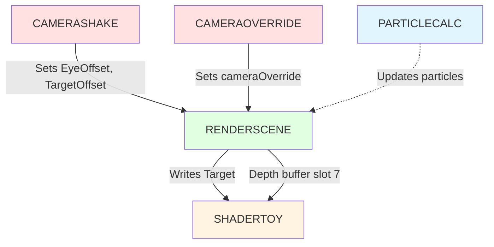

# Phoenix Timeline Events: Implementation Deep Dive

You can think of timeline events as specialized rendering nodes in a compositor—each one takes time as input and produces either pixels, state mutations, or simulation updates. The brilliance lies in their polymorphic design: every event shares the same interface (`Render(t, prevt, aspect, subroutine)`), but under the hood they do wildly different things. Some draw 3D scenes, others run fullscreen shaders, still others just wiggle numbers in global variables to shake the camera.

This architectural choice matters because it decouples temporal control from operational logic. The timeline doesn't care whether an event renders a spaceship or applies bloom—it just knows "from frame 100 to 200, call this event's Render() method with the appropriate time values." The event handles the rest. This separation enables powerful composition: you can layer camera shake over any scene, apply post-processing to any render, or substitute cameras without touching the underlying render code.

What makes Phoenix's implementation particularly interesting for creative coding framework design is its aggressive simplicity. No virtual function tables in the minimal build, no complex dependency graphs, no automatic resource management. Each event type gets exactly the members it needs, nothing more. The conditional compilation system (`#ifdef PHX_EVENT_SHADERTOY`) means unused event types compile to zero bytes. In a 64k environment, every pointer costs.

Let's examine each event type in detail, from simplest to most complex. For each, we'll explore the class structure, walk through the Render() implementation, and identify patterns worth adopting or avoiding in Rust framework design.

## Event Polymorphism Architecture

Before diving into individual events, let's understand the polymorphic structure. Timeline.h:25-40 defines the base class:

```cpp
class CphxEvent {
public:
    bool OnScreenLastFrame;             // Continuity tracking
    CphxRenderTarget *Target;           // Output render target

    unsigned short StartFrame, EndFrame;
    CphxSpline_float16 *Time;           // Optional time remapping spline

    virtual void Render(float t, float prevt, float aspect, bool subroutine) = 0;
};
```

Every derived event must implement `Render()` with this exact signature:

- **t**: Normalized time `[0, 1]` within event's frame range
- **prevt**: Previous frame's normalized time (for motion blur, velocity)
- **aspect**: Width/height ratio for aspect-correct effects
- **subroutine**: Recursion guard for nested timeline rendering

The `OnScreenLastFrame` flag tracks whether the event was active last frame. This enables delta-time calculations for particle systems and prevents initialization spikes when events become active mid-demo.

The virtual destructor at line 38 exists only in full builds (`#ifndef PHX_MINIMAL_BUILD`). The minimal build skips virtual destructors to save vtable bytes—memory management is manual.

## 1. EVENT_ENDDEMO: Demo Termination

The simplest event is pure side-effect. No rendering, no computation, just a flag flip.

### Class Structure

Timeline.h:42-52 defines the class:

```cpp
#ifdef PHX_EVENT_ENDDEMO
class CphxEvent_EndDemo : public CphxEvent {
public:
    virtual void Render(float t, float prevt, float aspect, bool subroutine);
};
#endif
```

No member variables beyond the base class. This event exists solely to signal completion.

### Render() Implementation

Timeline.cpp:13-18 contains the entire implementation:

```cpp
extern bool phxDone;

void CphxEvent_EndDemo::Render(float t, float prevt, float aspect, bool subroutine) {
    phxDone = true;
}
```

The global `phxDone` flag gets checked by the main loop each frame. When true, the demo exits cleanly. In Clean Slate, an ENDDEMO event at frame 18000 (5 minutes at 60fps) ensures the demo doesn't run indefinitely at parties.

### Use Cases

- **Demo completion**: Place at final frame to trigger exit
- **Conditional termination**: Could be extended to check conditions (pressed ESC, error state)
- **Tool mode override**: The main loop might ignore `phxDone` in editor mode

### Design Patterns

This event embodies the "effect-only event" pattern—no pixels produced, just state mutation. For a Rust framework, this suggests a more general pattern:

```rust
trait TimelineEvent {
    fn render(&mut self, context: &mut RenderContext, t: f32, prevt: f32);
}

struct EndDemoEvent;

impl TimelineEvent for EndDemoEvent {
    fn render(&mut self, context: &mut RenderContext, t: f32, prevt: f32) {
        context.signal_completion();
    }
}
```

Instead of mutating global state, the event signals through the context. Rust's ownership prevents the global variable pattern.

## 2. EVENT_RENDERDEMO: Nested Timeline Rendering

This event represents aspirational architecture—the ability to compose timelines recursively. However, the implementation reveals it's not actually used.

### Class Structure

Timeline.h:54-68 defines the class:

```cpp
#ifdef PHX_EVENT_RENDERDEMO
class CphxEvent_RenderDemo : public CphxEvent {
public:
    class CphxTimeline *Timeline;    // Sub-timeline to render
    unsigned short _start, _end;     // Frame range mapping

    virtual void Render(float t, float prevt, float aspect, bool subroutine);
};
#endif
```

The `_start` and `_end` fields would map the event's normalized time `[0, 1]` to a frame range in the sub-timeline. An event spanning frames 100-200 might render frames 500-600 of a different timeline.

### Render() Implementation

Timeline.cpp:20-26 shows a stubbed implementation:

```cpp
void CphxEvent_RenderDemo::Render(float t, float prevt, float aspect, bool subroutine) {
    if (subroutine) return;  // Prevent recursion
    // Timeline->Render(lerp(_start, _end, t), true);
}
```

The recursion guard is present, but the actual render call is commented out. The intended logic would be:

1. Calculate sub-timeline frame: `frame = lerp(_start, _end, t)`
2. Call `Timeline->Render(frame, true, true)`
3. The `subroutine=true` flag prevents infinite recursion if the sub-timeline references the parent

### Why It's Disabled

The commented code suggests this feature was attempted but abandoned. Possible reasons:

**Stack depth**: Deep recursion could overflow in a minimal runtime environment.

**State complexity**: Camera overrides, shake offsets, and render targets would need save/restore logic across timeline boundaries.

**Authoring difficulty**: Nested timelines are conceptually complex. Artists struggled to reason about layered time mappings.

**Diminishing returns**: Copy-pasting events proved easier than managing timeline composition.

### Use Cases (Theoretical)

If implemented, nested timelines would enable:

- **Effect reuse**: Render a common transition sequence at multiple points
- **Recursive visuals**: Droste effect, fractal timelines
- **Modular sequencing**: Separate teams author sub-sequences that compose into final demo

### Design Patterns for Rust

A Rust framework could make nested timelines safer:

```rust
struct RenderTimelineEvent {
    timeline: Arc<Timeline>,
    frame_range: (u32, u32),
    max_depth: usize,
}

impl TimelineEvent for RenderTimelineEvent {
    fn render(&mut self, context: &mut RenderContext, t: f32, prevt: f32) {
        if context.recursion_depth >= self.max_depth {
            return; // Prevent infinite recursion
        }

        let frame = lerp(self.frame_range.0 as f32, self.frame_range.1 as f32, t);
        context.with_increased_depth(|ctx| {
            self.timeline.render(frame, ctx);
        });
    }
}
```

The `Arc<Timeline>` enables sharing without lifetime complexity. The depth counter prevents stack overflow. The closure-based depth tracking ensures proper unwinding.

## 3. EVENT_SHADERTOY: Fullscreen Shader Effects

This is the most complex event type, responsible for all fullscreen post-processing and procedural effects. It's named after Shadertoy.com, the web platform for fragment shader art.

### Class Structure

Timeline.h:70-88 defines the class:

```cpp
#ifdef PHX_EVENT_SHADERTOY
class CphxEvent_Shadertoy : public CphxEvent {
public:
    CphxMaterialSplineBatch *MaterialSplines;      // Animated shader parameters
    CphxMaterialPassConstantState **MaterialState; // Per-pass render state
    CphxMaterialTechnique *Tech;                   // Shader technique (multi-pass)

    virtual void Render(float t, float prevt, float aspect, bool subroutine);
};
#endif
```

Let's break down each member:

**MaterialSplines**: A batch of splines that animate shader parameters over time. A bloom effect might have splines for `intensity`, `threshold`, and `blur_radius`. These evaluate at time `t` to produce current parameter values.

**MaterialState**: An array of render state blocks, one per rendering pass. Each contains:
- Pixel shader
- Rasterizer state (culling, fill mode)
- Blend state (additive, alpha blend)
- Depth-stencil state (depth test enabled/disabled)
- Texture bindings (up to 8 textures)
- Constant buffer data (uniforms)
- Render target assignment

**Tech**: The material technique that orchestrates multiple passes. A separable blur might have two passes (horizontal, then vertical). Each pass has its own shader and state.

### Render() Implementation Walkthrough

Timeline.cpp:33-136 implements the rendering logic. Let's trace it step by step.

#### Step 1: Material Spline Evaluation (lines 37-41)

```cpp
if (!Tech) return;

MaterialSplines->CalculateValues(t);
MaterialSplines->ApplyToParameters(NULL);

for (int y = 0; y < Tech->PassCount; y++)
    Tech->CollectAnimatedData(MaterialState[y], y);
```

First, evaluate all splines at time `t`. Each spline outputs a value (float, vector, color). These values get applied to the material's parameter slots. Then, for each rendering pass, collect the animated data into constant buffers that will upload to the GPU.

This separation—evaluate splines, apply to parameters, collect into buffers—enables spline reuse across multiple materials without redundant evaluation.

#### Step 2: Shader Constant Setup (lines 43-46)

```cpp
float ShaderData[4];
ShaderData[0] = t;
ShaderData[1] = aspect;

Prepare2dRender();
```

Every Shadertoy shader receives basic time and aspect ratio. The `t` parameter enables time-based effects (animated noise, scrolling textures). The `aspect` parameter enables aspect-correct distortions and procedural shapes.

`Prepare2dRender()` sets up a fullscreen triangle or quad with appropriate vertex buffer and shaders. This is infrastructure for 2D post-processing.

#### Step 3: Constant Buffer Binding (lines 49-50)

```cpp
phxContext->PSSetConstantBuffers(0, 1, &SceneDataBuffer);
phxContext->PSSetConstantBuffers(1, 1, &ObjectMatrixBuffer);
```

Two constant buffers bind to the pixel shader:
- **SceneDataBuffer** (slot 0): View matrix, projection matrix, camera position, inverse matrices, previous frame matrices
- **ObjectMatrixBuffer** (slot 1): Material-specific constant and animated data

Even though this is a fullscreen effect (no 3D scene), the buffers remain bound for consistency. Some effects use the view matrix for screen-space calculations.

#### Step 4: Multi-Pass Rendering Loop (lines 54-135)

```cpp
for (int x = 0; x < Tech->PassCount; x++) {
```

Each pass renders independently. A two-pass Gaussian blur would execute this loop twice.

##### Step 4a: Render Target Self-Reference Detection (lines 56-71)

```cpp
if (MaterialState[x]->RenderTarget) {
    bool NeedsRTCopy = false;
    for (int y = 0; y < 7; y++) {
        MaterialState[x]->TextureBackup[y] = MaterialState[x]->Textures[y];
        if (MaterialState[x]->Textures[y] == MaterialState[x]->RenderTarget->View) {
            MaterialState[x]->Textures[y] = phxInternalRenderTarget->View;
            NeedsRTCopy = true;
        }
    }

    if (NeedsRTCopy)
        phxContext->CopyResource(phxInternalRenderTarget->Texture,
                                  MaterialState[x]->RenderTarget->Texture);
```

This solves a tricky problem: what if the shader reads from its own output? Feedback effects, temporal accumulation, and ping-pong filters need to read the previous frame's output while writing the current frame.

Direct3D 11 forbids binding the same texture as both input and output. The solution: detect self-reference, copy the render target to a temporary buffer (`phxInternalRenderTarget`), bind the copy as input, write to the original.

After rendering, lines 132-133 restore the original texture bindings:

```cpp
for (int y = 0; y < 7; y++)
    MaterialState[x]->Textures[y] = MaterialState[x]->TextureBackup[y];
```

##### Step 4b: Render Target Setup (lines 74-76)

```cpp
MaterialState[x]->RenderTarget->SetViewport();
phxContext->OMSetRenderTargets(1, &MaterialState[x]->RenderTarget->RTView, NULL);
```

Set the viewport to match the render target dimensions and bind it as the output. No depth buffer—post-processing doesn't need depth testing.

##### Step 4c: Shader and State Binding (lines 80-86)

```cpp
phxContext->PSSetShader(Tech->RenderPasses[x]->PS, NULL, 0);

phxContext->RSSetState(MaterialState[x]->RasterizerState);
phxContext->OMSetBlendState(MaterialState[x]->BlendState, NULL, 0xffffffff);
phxContext->OMSetDepthStencilState(MaterialState[x]->DepthStencilState, 0);
MaterialState[x]->Textures[7] = phxDepthBufferShaderView;
phxContext->PSSetShaderResources(0, 8, MaterialState[x]->Textures);
```

Bind the pixel shader for this pass. Set rasterizer state (typically culling disabled for fullscreen quads). Set blend state (additive blending for glow effects, alpha blending for overlays). Set depth-stencil state (usually depth test disabled).

Line 85 is particularly interesting—it binds the scene's depth buffer to texture slot 7. This enables depth-aware post-processing: depth-of-field, fog, screen-space ambient occlusion. Even though the Shadertoy event itself doesn't render 3D geometry, it can access depth from a previous RENDERSCENE event.

##### Step 4d: Constant Buffer Upload (lines 88-95)

```cpp
int constdatasize = MaterialState[x]->ConstantDataSize;
int dyndatasize = MaterialState[x]->AnimatedDataSize;

D3D11_MAPPED_SUBRESOURCE map;
phxContext->Map(ObjectMatrixBuffer, 0, D3D11_MAP_WRITE_DISCARD, 0, &map);
memcpy((unsigned char*)map.pData, MaterialState[x]->ConstantData, constdatasize);
memcpy((unsigned char*)map.pData + constdatasize, MaterialState[x]->AnimatedData, dyndatasize);
phxContext->Unmap(ObjectMatrixBuffer, 0);
```

The material has two types of data:
- **ConstantData**: Baked values that don't change (texture indices, flags)
- **AnimatedData**: Values from spline evaluation (bloom intensity, blur radius)

Both concatenate into a single constant buffer. The shader accesses them via structured layout:

```hlsl
cbuffer MaterialData : register(b1) {
    float4 Constants[N];  // ConstantData
    float4 Animated[M];   // AnimatedData
}
```

##### Step 4e: Scene Data Upload (lines 98-116)

```cpp
phxContext->Map(SceneDataBuffer, 0, D3D11_MAP_WRITE_DISCARD, 0, &map);
unsigned char* m = (unsigned char*)map.pData;

if (Target) {
    ShaderData[2] = (float)Target->XRes;
    ShaderData[3] = (float)Target->YRes;
}

memcpy(m, ShaderData, sizeof(ShaderData)); m += sizeof(ShaderData);
memcpy(m, &phxViewMatrix, sizeof(phxViewMatrix)); m += sizeof(phxViewMatrix);
memcpy(m, &phxProjectionMatrix, sizeof(phxProjectionMatrix)); m += sizeof(phxProjectionMatrix);
memcpy(m, &phxCameraPos, sizeof(phxCameraPos)); m += sizeof(phxCameraPos);
memcpy(m, &phxIViewMatrix, sizeof(phxIViewMatrix)); m += sizeof(phxIViewMatrix);
memcpy(m, &phxIProjectionMatrix, sizeof(phxIProjectionMatrix)); m += sizeof(phxIProjectionMatrix);
memcpy(m, &phxPrevFrameViewMatrix, sizeof(phxPrevFrameViewMatrix)); m += sizeof(phxPrevFrameViewMatrix);
memcpy(m, &phxPrevFrameProjectionMatrix, sizeof(phxPrevFrameProjectionMatrix)); m += sizeof(phxPrevFrameProjectionMatrix);

phxContext->Unmap(SceneDataBuffer, 0);
```

The scene data buffer contains a packed layout:
1. **ShaderData[4]**: `[t, aspect, RT_width, RT_height]`
2. **View matrix**: Current frame camera view
3. **Projection matrix**: Current frame projection
4. **Camera position**: Eye position for lighting calculations
5. **Inverse view matrix**: For world-space reconstructions
6. **Inverse projection matrix**: For depth-to-world transformations
7. **Previous frame view matrix**: For motion blur velocity
8. **Previous frame projection matrix**: For temporal effects

Even Shadertoy effects can access camera matrices. This enables effects like screen-space reflections, camera-relative noise, and motion blur.

##### Step 4f: Fullscreen Quad Draw (line 123)

```cpp
phxContext->Draw(6, 0);
```

Draw 6 vertices starting from vertex 0. This renders two triangles forming a fullscreen quad (or one triangle covering the screen, depending on `Prepare2dRender()` setup). The pixel shader executes once per pixel.

No vertex buffer binding visible here—`Prepare2dRender()` handles that setup.

##### Step 4g: Texture Unbinding and Mipmap Generation (lines 127-130)

```cpp
phxContext->PSSetShaderResources(0, 8, rv);

if (Target)
    phxContext->GenerateMips(Target->View);
```

Unbind all textures to prevent resource hazards (a texture bound as input can't be used as output by the next event). The `rv` array (defined at line 28) is initialized to null pointers.

If the render target supports mipmaps, generate them automatically. This enables the next effect to sample at different mip levels for cheap blur or downsampled reads.

### ShaderData Layout

The shader receives a tightly packed constant buffer:

```hlsl
cbuffer SceneData : register(b0) {
    float Time;              // ShaderData[0]
    float Aspect;            // ShaderData[1]
    float ResolutionX;       // ShaderData[2]
    float ResolutionY;       // ShaderData[3]
    float4x4 ViewMatrix;
    float4x4 ProjectionMatrix;
    float4 CameraPosition;
    float4x4 InvViewMatrix;
    float4x4 InvProjectionMatrix;
    float4x4 PrevViewMatrix;
    float4x4 PrevProjectionMatrix;
};
```

A typical Shadertoy shader might use:

```hlsl
float2 uv = input.Position.xy / float2(ResolutionX, ResolutionY);
float2 centeredUV = (uv - 0.5) * float2(Aspect, 1.0);
float noise = sin(centeredUV.x * 10.0 + Time * 2.0);
```

### Use Cases

Shadertoy events power all post-processing and procedural effects:

**Post-processing**: Bloom, blur, depth-of-field, motion blur, color grading, vignette, chromatic aberration
**Procedural generation**: Perlin noise, Voronoi cells, fractal patterns, ray-marched SDFs
**Transitions**: Fades, wipes, dissolves, glitch effects
**Feedback loops**: Temporal accumulation, trail effects, recursion
**Compositing**: Alpha blending multiple render targets, masking

### Design Patterns

The Shadertoy event embodies several patterns worth adopting:

**Material splines for temporal control**: Instead of hardcoding parameter changes in shaders, externalize them as splines. This enables artist-driven timing without shader recompilation.

**Multi-pass techniques**: Separable filters (Gaussian blur, bilateral blur) benefit from horizontal + vertical passes. The technique abstraction makes this natural.

**Automatic self-reference handling**: Detecting texture == render target and inserting a copy prevents API errors. Rust could encode this at compile time via type states.

**Depth buffer forwarding**: Binding the depth buffer to a standard slot (slot 7) enables depth-aware effects without explicit plumbing.

### Rust Framework Adaptation

A Rust version might look like:

```rust
struct ShadertoyEvent {
    technique: MaterialTechnique,
    splines: MaterialSplineBatch,
    target: RenderTargetHandle,
}

impl TimelineEvent for ShadertoyEvent {
    fn render(&mut self, context: &mut RenderContext, t: f32, prevt: f32) {
        // Evaluate splines at time t
        let params = self.splines.evaluate(t);

        for (pass_idx, pass) in self.technique.passes.iter().enumerate() {
            // Detect self-reference at compile time via type states
            let inputs = context.prepare_textures(pass, &self.target)?;

            context.set_render_target(&self.target);
            context.bind_shader(&pass.shader);
            context.update_constants(ShaderData {
                time: t,
                aspect: context.aspect_ratio(),
                resolution: self.target.resolution(),
            });
            context.update_material_params(&params);
            context.draw_fullscreen_quad();

            if self.target.has_mipmaps() {
                context.generate_mipmaps(&self.target);
            }
        }
    }
}
```

The key improvement: `prepare_textures()` returns a guard that ensures textures unbind on drop, preventing resource hazards without manual cleanup.

## 4. EVENT_RENDERSCENE: 3D Scene Rendering

This is the workhorse event—it renders 3D scenes with cameras, lights, meshes, and materials. Most visible content in a demo originates here.

### Class Structure

Timeline.h:91-106 defines the class:

```cpp
#ifdef PHX_EVENT_RENDERSCENE
class CphxEvent_RenderScene : public CphxEvent {
public:
    CphxScene *Scene;         // Scene graph to render
    CphxObject *Camera;       // Camera object
    int Clip;                 // Animation clip index
    bool ClearColor, ClearZ;  // Clear flags

    virtual void Render(float t, float prevt, float aspect, bool subroutine);
};
#endif
```

**Scene**: The scene graph containing all objects (meshes, lights, cameras, particles). Rendering this scene means traversing the graph, updating transforms, and submitting draw calls.

**Camera**: The camera object from which to render. Its world transform determines view matrix. Its spline parameters control FOV.

**Clip**: Animation clip index. Scenes can have multiple animation takes; the clip selects which one to play.

**ClearColor/ClearZ**: Whether to clear the color buffer and depth buffer before rendering. Early events clear to black, later events preserve previous content for compositing.

### Render() Implementation Walkthrough

Timeline.cpp:152-229 implements scene rendering. The logic is surprisingly complex due to camera effects and motion blur support.

#### Step 1: Camera Selection (lines 154-156)

```cpp
if (!Scene || (!Camera && !cameraOverride)) return;

CphxObject* actualCamera = cameraOverride ? cameraOverride : Camera;
```

Check for camera override from an EVENT_CAMERAOVERRIDE. If set, use that camera instead of the event's camera. This enables camera cuts without duplicating scene render events.

#### Step 2: Dual Scene Graph Update (lines 158-163)

```cpp
for (int x = 0; x < 2; x++) {
    phxPrevFrameViewMatrix = phxViewMatrix;
    phxPrevFrameProjectionMatrix = phxProjectionMatrix;

    Scene->UpdateSceneGraph(Clip, x ? t : prevt);
```

The scene updates twice: once at `prevt` (previous frame time), once at `t` (current frame time). This dual update supports motion blur and temporal anti-aliasing.

On the first iteration (`x=0`), update at `prevt` to compute previous frame matrices. Save the current matrices before overwriting them. On the second iteration (`x=1`), update at `t` to compute current frame transforms.

Shaders receive both current and previous frame matrices in the constant buffer. This enables velocity calculation for motion blur:

```hlsl
float4 currPos = mul(float4(worldPos, 1.0), ViewProjection);
float4 prevPos = mul(float4(worldPos, 1.0), PrevViewProjection);
float2 velocity = (currPos.xy / currPos.w) - (prevPos.xy / prevPos.w);
```

#### Step 3: Camera Shake Application (line 164)

```cpp
actualCamera->WorldPosition += EyeOffset;
```

Apply camera shake offset from EVENT_CAMERASHAKE. The `EyeOffset` global variable accumulates shake from all active shake events.

This mutates the camera's world position directly. After view matrix calculation, the original position is preserved (the scene graph update will recalculate it next frame).

#### Step 4: Camera Transform Extraction (lines 165-167)

```cpp
D3DXVECTOR3 eye = actualCamera->WorldPosition;
D3DXVECTOR3 dir = *((D3DXVECTOR3*)&actualCamera->SplineResults[Spot_Direction_X]);
phxCameraPos = D3DXVECTOR4(eye.x, eye.y, eye.z, 1);
```

Extract camera position and direction from the camera object. The direction comes from spline evaluation results (cameras have animated direction splines). Store camera position in a global for shader access.

#### Step 5: Camera Roll Calculation (lines 169-174)

```cpp
D3DXMATRIX RollMat;
D3DXVECTOR4 rolledup;
D3DXVec3Transform(&rolledup, (D3DXVECTOR3*)up,
    D3DXMatrixRotationAxis(&RollMat, &dir,
        actualCamera->SplineResults[Spline_Camera_Roll] * 3.14159265359f * 2.0f));

D3DXMatrixLookAtRH(&phxViewMatrix, &(eye), &(eye + dir + TargetOffset), (D3DXVECTOR3*)&rolledup);
```

Cameras support roll (rotation around view direction). The roll parameter comes from a spline, expressed as `[0, 1]` mapping to `[0, 2π]` radians.

The up vector `[0, 1, 0]` rotates around the direction vector by the roll angle. This produces a "rolled-up" vector for the view matrix. The view matrix is then calculated via look-at:

- **Eye**: Camera position + shake offset
- **Target**: Eye + direction + target shake offset
- **Up**: Rolled-up vector

The `TargetOffset` from camera shake affects the look-at target independently from the eye position, creating more dynamic shake.

#### Step 6: Off-Center Projection (lines 176-186)

```cpp
float fovYper2 = (actualCamera->SplineResults[Spline_Camera_FOV] * 3.14159265359f / 4.0f) / 2.0f;
float zn = 0.01f;
float cotFov = cos(fovYper2) / sin(fovYper2);
float t = zn / cotFov;
float r = zn * aspect / cotFov;
float xOffset = actualCamera->camCenterX / 127.0f * r;
float yOffset = actualCamera->camCenterY / 127.0f * t;

D3DXMatrixPerspectiveOffCenterRH(&phxProjectionMatrix,
    -r + xOffset, r + xOffset, -t + yOffset, t + yOffset, zn, 2000.0f);
```

Instead of standard perspective projection, Phoenix uses off-center projection. This enables camera shift effects without moving the camera physically.

The calculation:
1. Extract FOV from spline (stored as `[0, 1]` mapping to `[0, 90°]`)
2. Calculate near plane half-height `t` and half-width `r` from FOV and aspect
3. Calculate offsets from camera's `camCenterX/Y` parameters (stored as signed bytes `[-127, 127]`)
4. Build asymmetric frustum with shifted center

This technique enables:
- **Tilt-shift effects**: Shift projection without moving camera
- **Parallax scrolling**: Different layers shift at different rates
- **Miniature faking**: Combined with narrow DOF for toy-like appearance

The commented-out line 188 shows the simpler symmetric projection that would normally be used:

```cpp
// D3DXMatrixPerspectiveFovRH(&phxProjectionMatrix,
//     Camera->SplineResults[Spline_Camera_FOV] * 3.14159265359f / 4.0f,
//     aspect, 0.01f, 2000.0f);
```

#### Step 7: Particle Sorting (lines 190-200)

```cpp
#ifdef PHX_OBJ_EMITTERCPU
{
    for (int x = 0; x < Scene->ObjectCount; x++)
        if (Scene->Objects[x]->ObjectType == Object_ParticleEmitterCPU) {
            CphxObject_ParticleEmitter_CPU *p = (CphxObject_ParticleEmitter_CPU*)Scene->Objects[x];
            p->UpdateParticles(0, true); // sort particles
        }
}
#endif
```

After updating the scene graph (which computes camera matrices), sort all particle systems. Particles must sort back-to-front for correct alpha blending.

The call `UpdateParticles(0, true)` passes delta-time = 0 (no simulation update) and `sort=true` (just sort). The sorting uses camera distance calculated from the updated view matrix.

This happens inside the second iteration of the loop (after `t` update), ensuring particles sort based on the current frame's camera position.

#### Step 8: Scene Rendering (line 211)

```cpp
Scene->Render(ClearColor, ClearZ, 0);
```

Finally, render the scene. The scene's Render() method traverses the scene graph, culls invisible objects, batches draw calls, and submits to the GPU.

The clear flags control whether to clear color and depth buffers. Typical patterns:

- **First scene event**: `ClearColor=true, ClearZ=true` (start fresh)
- **Additive effects**: `ClearColor=false, ClearZ=true` (overlay on previous color, reset depth)
- **Depth-preserving overlay**: `ClearColor=false, ClearZ=false` (composite over previous frame)

The third parameter (0) is a size hint for cube map rendering (commented-out code at lines 207-227 shows abandoned cube map support).

### Commented Cube Map Code (lines 207-227)

```cpp
/*
if (!actualCamera->cameraCubeMapTarget) {
*/
    Scene->Render(ClearColor, ClearZ, 0);
/*
} else {
    for (int x = 0; x < 6; x++) {
        // set cube face camera
        Scene->Render(ClearColor, ClearZ, 256);
        // copy target to cube face
        //this->Target
    }
    // build cube mipmap
}
*/
```

The commented code suggests support for environment map rendering was planned. A camera with `cameraCubeMapTarget` set would render 6 views (cube faces) and composite them into a cube map.

This would enable:
- **Real-time reflections**: Render scene from reflective object's position
- **Environment probes**: Capture scene lighting for IBL
- **Surveillance cameras**: Multiple views in-world

The feature wasn't completed, likely due to performance cost (6x rendering) or complexity (cube face orientation setup).

### Use Cases

RENDERSCENE events power all 3D content:

- **Primary scene rendering**: Spaceships, landscapes, characters
- **Multiple viewpoints**: Picture-in-picture, split-screen
- **Reflection rendering**: Render scene to texture for reflective surfaces
- **Shadow mapping**: Render from light's perspective to depth texture
- **Multi-camera cinematics**: Cut between cameras via CAMERAOVERRIDE

### Design Patterns

Several patterns emerge from this implementation:

**Dual scene update for motion blur**: Updating at both `prevt` and `t` provides temporal coherence. Rust frameworks should expose previous frame state similarly.

**Camera override via global state**: Instead of event-level camera selection, the override comes from external events. This compositional approach enables camera cuts without event duplication.

**Off-center projection for effects**: Separating "where the camera is" from "where it's looking" enables subtle effects. Rust frameworks should expose projection matrix customization.

**Particle sorting decoupled from simulation**: Sorting happens during render, not during simulation. This allows particles to render with correct blending even if simulation paused.

### Rust Framework Adaptation

```rust
struct RenderSceneEvent {
    scene: SceneHandle,
    camera: ObjectHandle,
    clip: usize,
    clear_color: bool,
    clear_depth: bool,
}

impl TimelineEvent for RenderSceneEvent {
    fn render(&mut self, context: &mut RenderContext, t: f32, prevt: f32) {
        let scene = context.get_scene(self.scene)?;
        let camera = context.get_camera_override()
            .unwrap_or_else(|| scene.get_object(self.camera)?);

        // Dual update for motion blur support
        context.save_matrices();
        scene.update_scene_graph(self.clip, prevt);
        let prev_matrices = context.get_matrices();

        scene.update_scene_graph(self.clip, t);

        // Apply camera shake
        camera.apply_offset(context.camera_shake_offset());

        // Calculate view matrix with roll support
        let view = camera.calculate_view_matrix_with_roll();
        let proj = camera.calculate_projection_matrix(
            context.aspect_ratio(),
            camera.shift_offset()
        );

        context.set_matrices(view, proj, prev_matrices);

        // Sort particles
        scene.sort_particles_by_depth(&camera);

        // Render
        scene.render(self.clear_color, self.clear_depth);
    }
}
```

Key improvements:
- Type-safe handles prevent dangling references
- `get_camera_override()` returns `Option` instead of checking global null pointer
- Camera effects (shake, roll, shift) encapsulated in camera methods
- Matrix save/restore explicit instead of manual global variable juggling

## 5. EVENT_PARTICLECALC: Particle Simulation

Particle systems require delta-time updates. This event calculates elapsed time since last invocation and updates particle emitters accordingly.

### Class Structure

Timeline.h:110-127 defines the class:

```cpp
#ifdef PHX_EVENT_PARTICLECALC
class CphxEvent_ParticleCalc : public CphxEvent {
public:
    CphxScene *Scene;    // Scene containing particle emitters
    int Clip;            // Animation clip
    int lasttime;        // Previous frame time in milliseconds
    float lastt;         // Previous frame normalized time

    virtual void Render(float t, float prevt, float aspect, bool subroutine);
};
#endif
```

**lasttime/lastt**: Persistent state tracking the previous update time. This enables delta calculation across frames.

Unlike RENDERSCENE which renders particles, PARTICLECALC updates their simulation state (position, velocity, lifetime).

### Render() Implementation Walkthrough

Timeline.cpp:235-269 implements the delta-time update.

#### Step 1: Time Conversion (line 245)

```cpp
int tme = ((EndFrame - StartFrame) * t + StartFrame) * 1000.0f / TimelineFramerate;
```

Convert normalized time `t ∈ [0, 1]` back to absolute milliseconds. The calculation:

1. `(EndFrame - StartFrame) * t` → normalized time to event frame range
2. `+ StartFrame` → event-relative frame to timeline-absolute frame
3. `* 1000.0f / TimelineFramerate` → frame number to milliseconds

For an event spanning frames 100-200 with `FrameRate=60`:
- `t=0.0` → frame 100 → 1666ms
- `t=0.5` → frame 150 → 2500ms
- `t=1.0` → frame 200 → 3333ms

Particles simulate in milliseconds because physical forces (gravity, drag) work in time units, not normalized `[0, 1]`.

#### Step 2: First-Frame Initialization (lines 248-253)

```cpp
if (!OnScreenLastFrame) {
    lastt = t;
    lasttime = tme;
    OnScreenLastFrame = true;
}
```

When the event first activates, initialize the tracking state. This prevents a large delta spike—if the event starts at frame 100 but particles were last updated at frame 0, the delta would be massive, causing particles to "explode" forward.

By initializing `lasttime = tme`, the first frame's delta is zero, smoothly beginning simulation.

#### Step 3: Dual Scene Graph Update (lines 256-257)

```cpp
Scene->UpdateSceneGraph(Clip, lastt);
Scene->UpdateSceneGraph(Clip, t);
```

Update the scene twice: once at previous time, once at current time. This ensures particle emitter transforms are current.

If a particle emitter is attached to a moving object (e.g., spaceship exhaust), the emitter's world position needs updating before particle emission.

#### Step 4: Delta-Time Calculation and Update (lines 259-265)

```cpp
for (int x = 0; x < Scene->ObjectCount; x++)
    if (Scene->Objects[x]->ObjectType == Object_ParticleEmitterCPU) {
        CphxObject_ParticleEmitter_CPU *p = (CphxObject_ParticleEmitter_CPU*)Scene->Objects[x];
        p->UpdateParticles((tme - lasttime) / 1000.0f, false);
    }
```

For each CPU particle emitter:
1. Calculate delta: `tme - lasttime` (milliseconds elapsed)
2. Convert to seconds: `/ 1000.0f`
3. Call `UpdateParticles(deltaSeconds, sort=false)`

The particle update applies physics:
```cpp
particle.velocity += gravity * dt;
particle.velocity *= (1.0 - drag * dt);
particle.position += particle.velocity * dt;
particle.lifetime -= dt;
```

Particles that exceed their lifetime get removed or recycled.

#### Step 5: State Update for Next Frame (lines 267-268)

```cpp
lasttime = tme;
lastt = t;
```

Store current time as previous time for next frame's delta calculation.

### Why Separate from RENDERSCENE?

You might wonder: why not update particles inside RENDERSCENE? Several reasons:

**Temporal control**: PARTICLECALC events can have independent time remapping. You could pause particle simulation (remove PARTICLECALC) while continuing to render the scene.

**Multiple update rates**: High-frequency particle updates (2x per frame for accuracy) without re-rendering the scene each time.

**Decoupled simulation and rendering**: GPU particles render on GPU, CPU particles simulate on CPU. Separating update from render enables parallelism.

**Explicit control**: Artists see exactly when particles update in the timeline. PARTICLECALC at frames 100-200 + RENDERSCENE at frames 100-200 makes the dependency explicit.

### Use Cases

PARTICLECALC events control simulation timing:

- **Standard update**: PARTICLECALC and RENDERSCENE share same frame range
- **Pre-simulation**: PARTICLECALC starts earlier to "warm up" particle systems before visible
- **Slow motion**: Time remapping on PARTICLECALC slows simulation while RENDERSCENE plays at normal speed
- **Pause/resume**: Removing PARTICLECALC freezes particles

### Design Patterns

**Delta-time from normalized time**: Converting `t` back to absolute time enables delta calculation. Rust frameworks need similar conversion utilities.

**First-frame initialization**: The `OnScreenLastFrame` flag prevents delta spikes. Rust can encode this in type state: `ParticleCalcState::Inactive` vs `ParticleCalcState::Active { last_time: f32 }`.

**Separate update and render**: Simulation and rendering as distinct events enables compositional control.

### Rust Framework Adaptation

```rust
struct ParticleCalcEvent {
    scene: SceneHandle,
    clip: usize,
    state: ParticleCalcState,
}

enum ParticleCalcState {
    Inactive,
    Active { last_time_ms: u32 },
}

impl TimelineEvent for ParticleCalcEvent {
    fn render(&mut self, context: &mut RenderContext, t: f32, prevt: f32) {
        let scene = context.get_scene(self.scene)?;

        // Convert normalized time to absolute milliseconds
        let time_ms = context.timeline_time_to_ms(t, self.start_frame, self.end_frame);

        let delta_seconds = match self.state {
            ParticleCalcState::Inactive => {
                self.state = ParticleCalcState::Active { last_time_ms: time_ms };
                0.0 // First frame: zero delta
            }
            ParticleCalcState::Active { last_time_ms } => {
                let delta = (time_ms - last_time_ms) as f32 / 1000.0;
                self.state = ParticleCalcState::Active { last_time_ms: time_ms };
                delta
            }
        };

        // Update scene graph to get current emitter transforms
        scene.update_scene_graph(self.clip, t);

        // Update all particle emitters
        for emitter in scene.particle_emitters() {
            emitter.update(delta_seconds);
        }
    }
}
```

The enum state machine makes the initialization explicit. The compiler prevents using uninitialized `last_time_ms`.

## 6. EVENT_CAMERASHAKE: Procedural Camera Movement

Camera shake creates handheld, impact, or earthquake effects by adding random offsets to camera position and look-at target. The implementation uses deterministic randomness seeded by frame number.

### Class Structure

Timeline.h:129-143 defines the class:

```cpp
#ifdef PHX_EVENT_CAMSHAKE
class CphxEvent_CameraShake : public CphxEvent {
public:
    unsigned char ShakesPerSec;          // Shake frequency
    CphxSpline_float16 *EyeIntensity;    // Eye offset magnitude over time
    CphxSpline_float16 *TargetIntensity; // Target offset magnitude over time

    virtual void Render(float t, float prevt, float aspect, bool subroutine);
};
#endif
```

**ShakesPerSec**: How many times per second to generate new random offsets. At 10 shakes/sec, new offsets generate every 0.1 seconds (6 frames at 60fps). Between keyframes, interpolation smooths the transition.

**EyeIntensity/TargetIntensity**: Splines controlling shake magnitude over time. A gunshot might ramp from 0 to 1 in 5 frames, decay to 0 over 20 frames. These animate the effect without changing shake frequency.

### Custom Random Function (lines 273-278)

```cpp
static long aholdrand = 1L;

int __cdecl arand() {
    return (((aholdrand = aholdrand * 214013L + 2531011L) >> 16) & 0x7fff);
}
```

A custom linear congruential generator (LCG) provides deterministic randomness. This is critical: the same frame number must always produce the same shake, ensuring reproducible rendering.

Standard library `rand()` might use non-deterministic seeds (from system entropy) or thread-local state. `arand()` uses a seedable static variable, ensuring:

```cpp
aholdrand = 100;
int val1 = arand(); // Always returns same value

aholdrand = 100;
int val2 = arand(); // Same as val1
```

The specific constants `214013L` and `2531011L` come from POSIX `rand()` implementation—widely tested, decent randomness for visual effects.

### Render() Implementation Walkthrough

Timeline.cpp:280-312 implements deterministic shake.

#### Step 1: Keyframe Time Calculation (lines 282-287)

```cpp
float dist = 1 / (float)ShakesPerSec;
float currTime = CurrentFrame / (float)TimelineFramerate;
float d1 = fmod(currTime, dist);
float d = d1 / dist;
int t1 = (int)((currTime - d1) * TimelineFramerate);
int t2 = (int)((currTime - d1 + dist) * TimelineFramerate);
```

This calculates keyframe times for interpolation. Let's trace an example with `ShakesPerSec = 10` at frame 125 (60fps):

1. `dist = 1 / 10 = 0.1` (seconds between keyframes)
2. `currTime = 125 / 60 = 2.0833` seconds
3. `d1 = fmod(2.0833, 0.1) = 0.0833` (time since last keyframe)
4. `d = 0.0833 / 0.1 = 0.833` (interpolation factor)
5. `t1 = (2.0833 - 0.0833) * 60 = 120` (previous keyframe)
6. `t2 = (2.0 + 0.1) * 60 = 126` (next keyframe)

Interpolate 83.3% of the way from frame 120's random values to frame 126's random values.

#### Step 2: Previous Keyframe Random Generation (lines 289-298)

```cpp
aholdrand = t1;

D3DXVECTOR3 eo1, eo2, to1, to2;

for (int x = 0; x < 3; x++) {
    eo1[x] = arand() / (float)RAND_MAX - 0.5f;
    to1[x] = arand() / (float)RAND_MAX - 0.5f;
}
```

Seed the RNG with the previous keyframe number `t1 = 120`. Generate 6 random values (3 for eye offset, 3 for target offset). Each value is in `[-0.5, 0.5]`.

The key insight: **seeding with frame number makes randomness deterministic**. Frame 120 always generates the same 6 values.

#### Step 3: Next Keyframe Random Generation (lines 299-305)

```cpp
aholdrand = t2;

for (int x = 0; x < 3; x++) {
    eo2[x] = arand() / (float)RAND_MAX - 0.5f;
    to2[x] = arand() / (float)RAND_MAX - 0.5f;
}
```

Seed with next keyframe `t2 = 126`. Generate another 6 random values. These are the target values for interpolation.

#### Step 4: Intensity Spline Evaluation (lines 307-308)

```cpp
EyeIntensity->CalculateValue(t);
TargetIntensity->CalculateValue(t);
```

Evaluate intensity splines at the event's normalized time `t ∈ [0, 1]`. The spline output is in `Value[0]`, typically in `[0, 1]` range but can exceed for extreme shake.

#### Step 5: Interpolation and Scaling (lines 310-311)

```cpp
EyeOffset = ((eo2 - eo1) * d + eo1) * EyeIntensity->Value[0];
TargetOffset = ((to2 - to1) * d + to1) * TargetIntensity->Value[0];
```

Linear interpolation between keyframes:
```
result = (end - start) * t + start
```

Then scale by intensity from splines. If `EyeIntensity = 0.5`, shake magnitude is halved. If `EyeIntensity = 2.0`, shake magnitude is doubled.

The global `EyeOffset` and `TargetOffset` (declared at Timeline.cpp:9-10) get consumed by RENDERSCENE events:

```cpp
actualCamera->WorldPosition += EyeOffset;  // Line 164
D3DXMatrixLookAtRH(&phxViewMatrix, &eye, &(eye + dir + TargetOffset), ...);  // Line 174
```

### Shake Frequency Examples

**Low frequency (2 shakes/sec)**: Slow, drifting motion. Keyframes 0.5 seconds apart. Smooth, nauseating camera sway.

**Medium frequency (10 shakes/sec)**: Handheld camera effect. Keyframes 0.1 seconds apart (6 frames). Natural human shake.

**High frequency (30 shakes/sec)**: Violent impact shake. Keyframes 0.033 seconds apart (2 frames). Rapid jitter.

### Use Cases

Camera shake events add life to static scenes:

- **Handheld camera**: 5-10 shakes/sec, low intensity, subtle target offset
- **Earthquake**: 2-5 shakes/sec, high intensity ramping up/down, both eye and target
- **Gunshot recoil**: 20-30 shakes/sec, intensity spike then decay, primarily eye offset
- **Vehicle vibration**: 15-20 shakes/sec, constant low intensity, target offset for bumps
- **Explosion impact**: 10-15 shakes/sec, sharp intensity spike, both offsets

### Design Patterns

**Deterministic randomness via frame seeding**: Essential for reproducible rendering. Rust's `rand` crate supports seeded RNGs:

```rust
use rand::{SeedableRng, rngs::SmallRng};

let mut rng = SmallRng::seed_from_u64(frame_number);
let offset: Vec3 = rng.gen();
```

**Keyframe-based interpolation**: Instead of pure random per frame (which would jitter harshly), interpolate between random keyframes. Produces smooth, organic motion.

**Separate intensity control**: Decoupling shake frequency (constant) from shake magnitude (animated via splines) enables temporal control without changing shake character.

**Global state for compositional effects**: Multiple shake events can be active simultaneously. Their offsets would accumulate (though the current code overwrites, not accumulates). Rust could use a shake stack:

```rust
context.push_camera_shake(eye_offset, target_offset);
// Later events read accumulated shake
let total_shake = context.total_camera_shake();
```

### Rust Framework Adaptation

```rust
struct CameraShakeEvent {
    shakes_per_sec: f32,
    eye_intensity: SplineHandle,
    target_intensity: SplineHandle,
}

impl TimelineEvent for CameraShakeEvent {
    fn render(&mut self, context: &mut RenderContext, t: f32, prevt: f32) {
        // Calculate keyframe times
        let dist = 1.0 / self.shakes_per_sec;
        let curr_time = context.current_frame() as f32 / context.framerate();
        let d1 = curr_time % dist;
        let d = d1 / dist;
        let t1 = ((curr_time - d1) * context.framerate()) as u64;
        let t2 = ((curr_time - d1 + dist) * context.framerate()) as u64;

        // Generate deterministic random values
        let mut rng1 = SmallRng::seed_from_u64(t1);
        let eo1: Vec3 = rng1.gen::<[f32; 3]>().into();
        let to1: Vec3 = rng1.gen::<[f32; 3]>().into();

        let mut rng2 = SmallRng::seed_from_u64(t2);
        let eo2: Vec3 = rng2.gen::<[f32; 3]>().into();
        let to2: Vec3 = rng2.gen::<[f32; 3]>().into();

        // Remap from [0, 1] to [-0.5, 0.5]
        let eo1 = eo1 - Vec3::splat(0.5);
        let to1 = to1 - Vec3::splat(0.5);
        let eo2 = eo2 - Vec3::splat(0.5);
        let to2 = to2 - Vec3::splat(0.5);

        // Evaluate intensity splines
        let eye_intensity = context.evaluate_spline(self.eye_intensity, t);
        let target_intensity = context.evaluate_spline(self.target_intensity, t);

        // Interpolate and scale
        let eye_offset = eo1.lerp(eo2, d) * eye_intensity;
        let target_offset = to1.lerp(to2, d) * target_intensity;

        context.add_camera_shake(eye_offset, target_offset);
    }
}
```

Key improvements:
- Type-safe RNG seeding via `SmallRng`
- Explicit remapping from `[0, 1]` to `[-0.5, 0.5]`
- `add_camera_shake()` accumulates instead of overwrites, enabling multiple shake events
- No global state mutation

## 7. EVENT_CAMERAOVERRIDE: Camera Substitution

This event swaps the active camera without duplicating scene render events. It's a compositional technique for camera cuts.

### Class Structure

Timeline.h:146-160 defines the class:

```cpp
#ifdef PHX_EVENT_CAMOVERRIDE
class CphxEvent_CameraOverride : public CphxEvent {
public:
    CphxScene* Scene;     // Scene containing camera
    CphxObject* Camera;   // Camera to activate
    int Clip;             // Animation clip

    virtual void Render(float t, float prevt, float aspect, bool subroutine);
};
#endif
```

The event references a scene and camera object within that scene. It updates the scene graph to compute the camera's current transform, then sets a global override pointer.

### Render() Implementation

Timeline.cpp:141-148 implements the override:

```cpp
void CphxEvent_CameraOverride::Render(float t, float prevt, float aspect, bool subroutine) {
    if (!Scene || (!Camera)) return;

    Scene->UpdateSceneGraph(Clip, t);
    cameraOverride = Camera;
}
```

Two operations:
1. Update scene graph to compute camera transforms at time `t`
2. Set global `cameraOverride` pointer to this camera

The RENDERSCENE event checks this pointer (Timeline.cpp:154-156):

```cpp
if (!Scene || (!Camera && !cameraOverride)) return;

CphxObject* actualCamera = cameraOverride ? cameraOverride : Camera;
```

If an override exists, use it instead of the event's camera.

### Timeline Interaction

The timeline resets the override each frame (Timeline.cpp:320):

```cpp
void CphxTimeline::Render(float Frame, bool tool, bool subroutine) {
    cameraOverride = nullptr;
    // ...
}
```

This means camera overrides only affect the current frame. Each frame starts with no override; CAMERAOVERRIDE events must re-establish it.

### Use Cases

Camera override enables camera cuts without duplicating RENDERSCENE events:

**Without override** (duplicated events):
```
Frame 0-100:   RENDERSCENE (Scene1, Camera1)
Frame 100-200: RENDERSCENE (Scene1, Camera2)  // Same scene, different camera
Frame 200-300: RENDERSCENE (Scene1, Camera3)  // Same scene, different camera
```

**With override** (single render event):
```
Frame 0-300:   RENDERSCENE (Scene1, Camera1)  // Fallback camera
Frame 0-100:   CAMERAOVERRIDE (Scene1, Camera1)
Frame 100-200: CAMERAOVERRIDE (Scene1, Camera2)  // Cuts to Camera2
Frame 200-300: CAMERAOVERRIDE (Scene1, Camera3)  // Cuts to Camera3
```

The RENDERSCENE event spans all frames. The CAMERAOVERRIDE events control which camera is active when.

### Why Separate Scenes?

You might wonder why the override event has its own `Scene` reference. The camera doesn't have to come from the same scene being rendered!

Consider this setup:
```
Frame 0-300: RENDERSCENE (Scene1, Camera1)
Frame 100-200: CAMERAOVERRIDE (Scene2, Camera5)
```

Scene1 renders using Camera5 from Scene2. This enables:

**Shared camera rigs**: One scene contains camera animation paths. Multiple render scenes reference those cameras.

**Multi-scene compositing**: Render Scene1 from Scene2's camera, creating impossible viewpoints.

**Camera libraries**: A dedicated scene contains only cameras, organized and animated centrally.

The scene graph update (line 146) ensures the override camera's transforms are current, even if its parent scene isn't being rendered.

### Design Patterns

**Global state for camera selection**: Instead of passing camera as parameter, CAMERAOVERRIDE modifies global state. This decouples camera selection from rendering.

**Frame-level reset**: Clearing the override each frame prevents stale state. Events must actively maintain overrides each frame.

**Cross-scene references**: Cameras aren't bound to their containing scene. This enables composition across scene boundaries.

### Alternative: Camera Stack

A more robust approach would use a camera stack instead of a single override:

```cpp
std::vector<CphxObject*> cameraStack;

// CAMERAOVERRIDE pushes
cameraStack.push_back(Camera);

// RENDERSCENE pops
CphxObject* actualCamera = cameraStack.empty() ? Camera : cameraStack.back();
cameraStack.pop_back();
```

This enables nested camera overrides:
```
Frame 100-200: CAMERAOVERRIDE (Scene1, Camera2)  // Override to Camera2
Frame 150-175: CAMERAOVERRIDE (Scene1, Camera3)  // Nested override to Camera3
```

Frames 100-149: Camera2
Frames 150-175: Camera3 (nested override)
Frames 176-200: Camera2 (pop back to outer override)

Phoenix uses a single global pointer, so nested overrides would conflict. The last override wins.

### Rust Framework Adaptation

```rust
struct CameraOverrideEvent {
    scene: SceneHandle,
    camera: ObjectHandle,
    clip: usize,
}

impl TimelineEvent for CameraOverrideEvent {
    fn render(&mut self, context: &mut RenderContext, t: f32, prevt: f32) {
        let scene = context.get_scene(self.scene)?;
        let camera = scene.get_object(self.camera)?;

        // Update scene graph to compute camera transforms
        scene.update_scene_graph(self.clip, t);

        // Override camera for this frame
        context.override_camera(camera);
    }
}

// In RenderContext
impl RenderContext {
    pub fn override_camera(&mut self, camera: ObjectRef) {
        self.camera_override = Some(camera);
    }

    pub fn get_camera_override(&self) -> Option<ObjectRef> {
        self.camera_override.clone()
    }

    pub fn reset_camera_override(&mut self) {
        self.camera_override = None;
    }
}
```

The `Option<ObjectRef>` makes the override explicit. No null pointer checks needed—pattern matching handles presence/absence.

For nested overrides:
```rust
impl RenderContext {
    camera_stack: Vec<ObjectRef>,

    pub fn push_camera(&mut self, camera: ObjectRef) {
        self.camera_stack.push(camera);
    }

    pub fn active_camera(&self, default: ObjectRef) -> ObjectRef {
        self.camera_stack.last().cloned().unwrap_or(default)
    }

    pub fn pop_camera(&mut self) {
        self.camera_stack.pop();
    }
}
```

## Event Type Summary

The following table summarizes implementation characteristics:

| Event Type | Lines of Code | Render Target | GPU Commands | Global State |
|------------|---------------|---------------|--------------|--------------|
| **ENDDEMO** | 5 | None | None | Sets `phxDone` |
| **RENDERDEMO** | 5 | Delegates | None (stubbed) | None |
| **SHADERTOY** | 104 | MaterialState RT | PSSetShader, Draw(6,0), GenerateMips | None |
| **RENDERSCENE** | 79 | Event.Target | Scene->Render() | Reads `EyeOffset`, `TargetOffset`, `cameraOverride` |
| **PARTICLECALC** | 35 | None | None | None |
| **CAMERASHAKE** | 40 | None | None | Sets `EyeOffset`, `TargetOffset` |
| **CAMERAOVERRIDE** | 7 | None | None | Sets `cameraOverride` |

### Complexity Ranking

From simplest to most complex:

1. **ENDDEMO**: One line (flag set)
2. **CAMERAOVERRIDE**: Two operations (scene update, pointer set)
3. **RENDERDEMO**: Three lines (recursion guard, commented render call)
4. **CAMERASHAKE**: 40 lines (deterministic random, interpolation, spline eval)
5. **PARTICLECALC**: 35 lines (delta-time calculation, scene update, emitter iteration)
6. **RENDERSCENE**: 79 lines (dual scene update, camera effects, projection, particle sort)
7. **SHADERTOY**: 104 lines (spline eval, multi-pass loop, self-reference detection, constant upload)

### Event Dependencies

Some events depend on others:



**State Events** (red): Modify global state consumed by other events
**Update Events** (blue): Modify object state without rendering
**Render Events** (green): Produce pixels in render targets

Dependencies determine event ordering in the timeline array. State events must execute before the render events that consume their state.

## Event Execution Order

Events execute in array order (Timeline.cpp:340-361):

```cpp
for (int x = 0; x < EventCount; x++) {
    if (Events[x]->StartFrame <= (int)Frame && (int)Frame < Events[x]->EndFrame) {
        // ... calculate t, prevt
        Events[x]->Render(t, prevt, AspectX / (float)AspectY, subroutine);
        Target = Events[x]->Target;
        Events[x]->OnScreenLastFrame = true;
    }
    else Events[x]->OnScreenLastFrame = false;
}
```

For frame 150 with events:
```
[0] CAMERASHAKE (100-200)
[1] CAMERAOVERRIDE (140-160)
[2] RENDERSCENE (0-300)
[3] SHADERTOY (100-300)
```

Execution order:
1. CAMERASHAKE sets `EyeOffset`, `TargetOffset`
2. CAMERAOVERRIDE sets `cameraOverride`
3. RENDERSCENE reads shake offsets and camera override, renders to RT0
4. SHADERTOY reads RT0 as input, renders to RT1
5. Timeline blits RT1 to backbuffer (last event's target)

Reordering would break dependencies. If RENDERSCENE executed before CAMERASHAKE, the shake wouldn't apply that frame.

## Implications for Rust Framework Design

Phoenix's event system reveals several architectural patterns:

### Adopt: Polymorphic Event Interface

The `virtual void Render(t, prevt, aspect, subroutine)` pattern maps cleanly to Rust traits:

```rust
trait TimelineEvent {
    fn render(&mut self, context: &mut RenderContext, t: f32, prevt: f32);
}
```

Different event types implement the trait with wildly different logic. The timeline scheduler doesn't care about implementation details—it just calls `render()` on active events.

### Adopt: Conditional Compilation for Event Types

Phoenix's `#ifdef PHX_EVENT_SHADERTOY` pattern saves bytes by excluding unused events. Rust's feature flags enable similar optimization:

```rust
#[cfg(feature = "shadertoy-events")]
struct ShadertoyEvent { /* ... */ }

#[cfg(feature = "shadertoy-events")]
impl TimelineEvent for ShadertoyEvent { /* ... */ }
```

A minimal demo build could disable expensive events:
```toml
[features]
default = ["scene-rendering", "camera-effects"]
full = ["default", "shadertoy-events", "particle-sim", "nested-timelines"]
```

### Adopt: Deterministic Randomness

Seeded RNGs ensure frame 100 always produces identical shake. Rust's `rand` crate supports this:

```rust
use rand::{SeedableRng, rngs::SmallRng};

fn generate_shake_offset(frame: u64) -> Vec3 {
    let mut rng = SmallRng::seed_from_u64(frame);
    rng.gen()
}
```

Frame numbers as seeds guarantee reproducibility across runs, platforms, and builds.

### Modify: Replace Global State with Context Passing

Phoenix uses global variables (`cameraOverride`, `EyeOffset`, `TargetOffset`) for inter-event communication. Rust's ownership prevents this pattern.

Instead, pass a mutable context:

```rust
struct TimelineContext {
    camera_override: Option<ObjectRef>,
    camera_shake: CameraShake,
    framerate: f32,
    current_frame: u32,
}

impl TimelineContext {
    pub fn override_camera(&mut self, camera: ObjectRef) {
        self.camera_override = Some(camera);
    }

    pub fn add_shake(&mut self, eye: Vec3, target: Vec3) {
        self.camera_shake.eye_offset += eye;
        self.camera_shake.target_offset += target;
    }
}
```

Events receive `&mut TimelineContext`, enabling state mutation without globals. The borrow checker ensures lifetime correctness.

### Modify: Event Dependency Declarations

Phoenix relies on array order for dependency management. Shuffling events breaks rendering. Rust's type system can encode dependencies:

```rust
struct ShadertoyEvent<D> {
    dependencies: D,
    // ...
}

impl<D: ProvidesRenderTarget> TimelineEvent for ShadertoyEvent<D> {
    fn render(&mut self, context: &mut RenderContext, t: f32, prevt: f32) {
        let input_texture = self.dependencies.render_target();
        // Use input_texture
    }
}
```

The type system ensures `ShadertoyEvent` only instantiates when its dependencies satisfy `ProvidesRenderTarget`. Incorrect orderings fail at compile time.

### Modify: Type-Safe Render Target Management

Phoenix detects self-referential textures at runtime (Timeline.cpp:59-71). Rust can prevent this at compile time via type states:

```rust
struct RenderTarget<State> {
    texture: Texture,
    _state: PhantomData<State>,
}

struct Readable;
struct Writable;

impl RenderTarget<Writable> {
    fn bind_as_output(&mut self) { /* ... */ }
}

impl RenderTarget<Readable> {
    fn bind_as_input(&self) { /* ... */ }
}

// Attempting to bind same RT as input and output:
rt.bind_as_output();
rt.bind_as_input(); // Compile error: cannot borrow as immutable when mutable borrow exists
```

The type state machine prevents invalid usage patterns without runtime checks.

### Avoid: Fixed Event Type Enum

Phoenix's `PHXEVENTTYPE` enum requires engine recompilation for new events. Rust's trait objects enable user-defined events:

```rust
struct Timeline {
    events: Vec<Box<dyn TimelineEvent>>,
}

// Users define custom events
struct MyCustomEvent { /* ... */ }

impl TimelineEvent for MyCustomEvent {
    fn render(&mut self, context: &mut RenderContext, t: f32, prevt: f32) {
        // Custom logic
    }
}

timeline.events.push(Box::new(MyCustomEvent { /* ... */ }));
```

`Box<dyn TimelineEvent>` enables extensibility without modifying engine code. The virtual dispatch cost is negligible compared to rendering work.

### Avoid: Manual Memory Management

Phoenix's minimal build skips virtual destructors, requiring manual cleanup. Rust's ownership ensures automatic cleanup:

```rust
struct Timeline {
    events: Vec<Box<dyn TimelineEvent>>,  // Automatically dropped
    render_targets: Vec<RenderTarget>,     // Automatically dropped
}

// No manual `delete[]` needed—Drop trait handles cleanup
```

Zero-cost abstraction: no overhead compared to manual `delete`, but compiler-verified correctness.

## Related Documents

For broader timeline context and implementation traces:

- **[overview.md](overview.md)** — Timeline architecture, frame-to-time mapping, render target management
- **[sequencing.md](sequencing.md)** — Authoring timelines, spline-based animation, temporal patterns
- **[render-targets.md](render-targets.md)** — Render target creation, formats, pooling strategies
- **[examples.md](examples.md)** — Clean Slate timeline analysis, effect chains, production patterns

For rendering system integration:

- **[../rendering/overview.md](../rendering/overview.md)** — PBR rendering invoked by RENDERSCENE events
- **[../rendering/post-processing.md](../rendering/post-processing.md)** — Post-effects implemented as SHADERTOY events
- **[../rendering/materials.md](../rendering/materials.md)** — Material system used by both RENDERSCENE and SHADERTOY

For implementation deep dives:

- **[../code-traces/timeline-to-pixels.md](../code-traces/timeline-to-pixels.md)** — Frame → Event → Pixels walkthrough
- **[../code-traces/camera-shake.md](../code-traces/camera-shake.md)** — Deterministic random shake implementation
- **[../code-traces/particle-delta-time.md](../code-traces/particle-delta-time.md)** — Delta-time calculation in PARTICLECALC

## Source File Reference

All implementations are in two files:

**Timeline.h** (188 lines):
- `PHXEVENTTYPE` enum (12-23)
- `CphxEvent` base class (25-40)
- `CphxEvent_EndDemo` (42-52)
- `CphxEvent_RenderDemo` (54-68)
- `CphxEvent_Shadertoy` (70-88)
- `CphxEvent_RenderScene` (91-106)
- `CphxEvent_ParticleCalc` (110-127)
- `CphxEvent_CameraShake` (129-143)
- `CphxEvent_CameraOverride` (146-160)
- `CphxTimeline` (163-188)

**Timeline.cpp** (379 lines):
- Global state declarations (8-11)
- `CphxEvent_EndDemo::Render()` (13-18)
- `CphxEvent_RenderDemo::Render()` (20-26)
- `CphxEvent_Shadertoy::Render()` (32-136)
- `CphxEvent_CameraOverride::Render()` (141-148)
- `CphxEvent_RenderScene::Render()` (151-229)
- `CphxEvent_ParticleCalc::Render()` (235-269)
- `arand()` deterministic RNG (273-278)
- `CphxEvent_CameraShake::Render()` (280-312)
- `CphxTimeline::Render()` (318-376)

All paths relative to `demoscene/apex-public/apEx/Phoenix/`.

---

The event system is polymorphism distilled to its essence—a single interface, seven implementations, boundless combinations. By separating temporal control (when) from operational logic (what), Phoenix achieves compositional flexibility in minimal code. Each event type solves a specific problem: end the demo, apply post-processing, render 3D, simulate particles, shake cameras, override cameras. Together, orchestrated by the timeline, they transform frame numbers into narrative.
