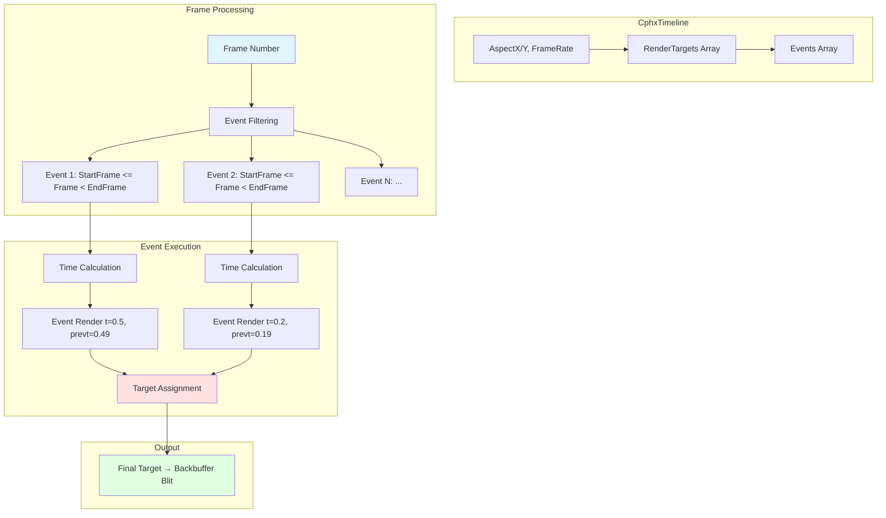
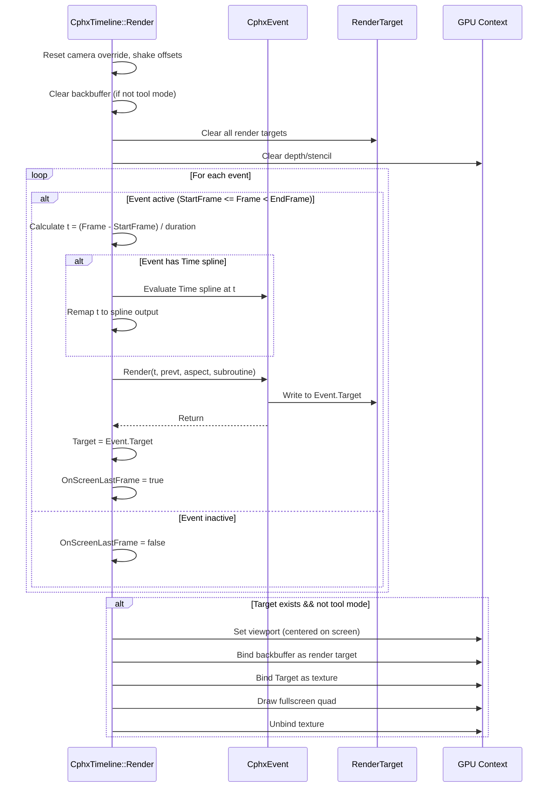

# Phoenix Timeline System Overview

When you watch a 64k demo, you're experiencing orchestrated chaos—dozens of scenes, effects, and camera moves flowing seamlessly from one to the next. Behind this choreography sits the timeline: a frame-by-frame sequencer that triggers events, renders scenes, applies post-processing, and knows exactly when to fade to black. The timeline is the conductor that transforms individual systems (rendering, particles, shaders) into narrative.

Phoenix's timeline architecture solves a fundamental problem: how do you author complex time-based sequences without a multi-gigabyte video editor? The answer lies in event abstraction. Each event represents an operation—render this scene, run that shader, shake the camera—with a start frame, end frame, and optional time remapping. The timeline iterates frames, activates matching events, and passes control to specialized renderers. No heavyweight middleware, just a clean separation between "when things happen" and "what things do."

This architecture matters because most creative coding frameworks treat time as a monotonic counter. You get `elapsed_time` and you're expected to manually orchestrate everything. Phoenix recognizes that sequencing is a distinct concern from rendering. By encoding the timeline as data—a list of events with temporal bounds—the system gains enormous flexibility. You can preview individual events, jump to arbitrary frames, render non-linearly, and remix event sequences without touching render code.

Think of the timeline like a film editing timeline. Each track contains clips (events) that activate during specific frame ranges. Some clips render 3D scenes, others apply fullscreen effects, still others control cameras or trigger particle systems. The timeline's job is straightforward: for the current frame, find all active clips and execute them in order. Each clip writes to render targets; the last clip's output goes to the screen. Simple abstraction, powerful results.

This document explores the timeline system's architecture, event types, frame-to-time mapping, and implications for creative coding framework design. We'll trace how a single frame number cascades through events to produce final pixels.

## Timeline Architecture

A timeline consists of a configuration block and an array of events. The configuration specifies output dimensions, framerate, and render resources. Events define temporal operations.



The flow begins with `CphxTimeline::Render(Frame)` at Timeline.cpp:318-376. The method clears render targets, iterates events, filters by frame range, calculates normalized time values, invokes each event's `Render()` method, and finally blits the last event's target to the backbuffer.

### CphxTimeline Class

Timeline.h:163-188 defines the timeline structure:

```cpp
class CphxTimeline {
public:
    unsigned char AspectX;              // Aspect ratio numerator
    unsigned char AspectY;              // Aspect ratio denominator
    unsigned char FrameRate;            // Frames per second (typically 60)
    unsigned char RenderTargetCount;    // Number of render targets

    CphxRenderTarget **RenderTargets;   // Shared render target pool
    CphxRenderTarget *Target;           // Last rendered target

    int ScreenX, ScreenY;               // Output dimensions

    unsigned short EventCount;
    CphxEvent **Events;                 // Event array

    void Render(float Frame, bool tool, bool subroutine = false);
};
```

These four bytes (AspectX, AspectY, FrameRate, RenderTargetCount) pack into a single 32-bit word during project load—a typical size optimization for minimal builds. The aspect ratio provides pixel dimensions for shader effects that need aspect-correct coordinates. The framerate converts between frame numbers and millisecond timestamps for particle simulation.

RenderTargets is a pool of shared textures. Events reference targets by index rather than creating new allocations. An 8-event timeline might use only 3 render targets, with events ping-ponging between them.

### CphxEvent Base Class

Timeline.h:25-40 defines the event interface:

```cpp
class CphxEvent {
public:
    bool OnScreenLastFrame;             // Continuity tracking
    CphxRenderTarget *Target;           // Output render target

    unsigned short StartFrame, EndFrame;
    CphxSpline_float16 *Time;           // Optional time remapping spline

    virtual void Render(float t, float prevt, float aspect, bool subroutine) = 0;
};
```

Every event must specify a frame range `[StartFrame, EndFrame)` using half-open interval semantics. An event with StartFrame=100 and EndFrame=200 is active for frames 100–199, deactivating at frame 200. This convention simplifies boundary logic—no off-by-one errors.

The `Time` spline is optional. If null, the event receives linear time progression: 0.0 at StartFrame, 1.0 at EndFrame-1. If present, the spline remaps time non-linearly. You can slow down, speed up, reverse, or even loop time within an event without duplicating render code. More on this in the next section.

The `Target` field stores the event's output render target. The timeline tracks the most recent target written; after all events execute, that target blits to the backbuffer. This allows effects to compose—Event A renders to RT0, Event B reads RT0 and writes RT1, Event C reads RT1 and applies post-processing to RT2, which becomes the final output.

## Event Types

Phoenix defines seven event types, each specialized for a temporal operation. The enum at Timeline.h:12-23 establishes the vocabulary:

```cpp
enum PHXEVENTTYPE {
    EVENT_ENDDEMO = 0,
    EVENT_RENDERDEMO = 1,
    EVENT_SHADERTOY = 2,
    EVENT_RENDERSCENE = 3,
    EVENT_PARTICLECALC = 4,
    EVENT_CAMERASHAKE = 5,
    EVENT_CAMERAOVERRIDE = 6,
    Event_Count
};
```

Each type corresponds to a concrete class deriving from `CphxEvent`. Minimal builds use conditional compilation (`#ifdef PHX_EVENT_RENDERSCENE`) to exclude unused event types, saving bytes. Let's examine each type's purpose and implementation.

### EVENT_ENDDEMO: Demo Termination

Timeline.cpp:13-18 implements the simplest event:

```cpp
void CphxEvent_EndDemo::Render(float t, float prevt, float aspect, bool subroutine) {
    phxDone = true;
}
```

This event sets a global flag signaling the demo has finished. The main loop checks `phxDone` each frame; when true, it exits cleanly. In Clean Slate, an EVENT_ENDDEMO placed at frame 18000 (5 minutes at 60fps) ensures the demo doesn't run indefinitely.

No render target, no shader, just state mutation. Sometimes an "event" is just a side effect.

### EVENT_RENDERDEMO: Nested Timeline

Timeline.h:54-68 and Timeline.cpp:20-26 handle nested timelines:

```cpp
class CphxEvent_RenderDemo : public CphxEvent {
public:
    class CphxTimeline *Timeline;
    unsigned short _start, _end;

    virtual void Render(float t, float prevt, float aspect, bool subroutine);
};

void CphxEvent_RenderDemo::Render(float t, float prevt, float aspect, bool subroutine) {
    if (subroutine) return;  // Prevent recursion
    // Timeline->Render(lerp(_start, _end, t), true);
}
```

This event would recursively render another timeline, useful for reusing sequences. However, the actual render call is commented out, and the recursion guard suggests it was problematic. The `subroutine` flag prevents infinite recursion if Event A triggers Timeline B which contains an Event that triggers Timeline A.

In practice, Clean Slate doesn't use nested timelines—complexity cost exceeded benefits. The feature remains as aspirational architecture.

### EVENT_SHADERTOY: Fullscreen Shader Effects

Timeline.h:70-88 and Timeline.cpp:32-136 implement shader-based effects:

```cpp
class CphxEvent_Shadertoy : public CphxEvent {
public:
    CphxMaterialSplineBatch *MaterialSplines;      // Animated parameters
    CphxMaterialPassConstantState **MaterialState; // Per-pass state
    CphxMaterialTechnique *Tech;                   // Shader technique

    virtual void Render(float t, float prevt, float aspect, bool subroutine);
};
```

Shadertoy events render fullscreen quads with pixel shaders. The name references Shadertoy.com, the web platform for sharing fragment shaders. These events drive post-processing effects (bloom, blur, DOF), procedural textures, and transitional effects.

The implementation at Timeline.cpp:33-136 follows this sequence:

1. Evaluate material splines at time `t` (line 37-38)
2. Collect animated data for each pass (line 40-41)
3. Set up constant buffers with time, aspect, resolution (line 43-116)
4. For each rendering pass:
   - Handle render target copy if shader reads from its own output (line 56-71)
   - Bind pixel shader, rasterizer, blend, depth-stencil states (line 80-84)
   - Bind textures, including depth buffer at slot 7 (line 85-86)
   - Upload constant data (line 91-95)
   - Draw fullscreen quad (6 vertices, line 123)
   - Generate mipmaps for next pass (line 130)

Material splines animate shader parameters over time. A bloom effect might animate intensity from 0.0 to 1.0 during a flash. A blur effect might animate kernel size based on depth-of-field focus distance. The spline system provides temporal control without shader recompilation.

### EVENT_RENDERSCENE: 3D Scene Rendering

Timeline.h:91-106 and Timeline.cpp:151-229 handle 3D geometry:

```cpp
class CphxEvent_RenderScene : public CphxEvent {
public:
    CphxScene *Scene;
    CphxObject *Camera;
    int Clip;
    bool ClearColor, ClearZ;

    virtual void Render(float t, float prevt, float aspect, bool subroutine);
};
```

This event renders a scene graph from a camera's perspective. It's the workhorse of the demo—most visual content originates here.

Timeline.cpp:152-229 executes this flow:

1. Check for camera override or fallback to event's camera (line 154-156)
2. Update scene graph twice: once at `prevt` for previous frame data, once at `t` for current (line 158-163)
3. Apply camera shake offset to eye position (line 164)
4. Compute view matrix with camera roll (line 169-174)
5. Calculate off-center projection for camera shift effects (line 176-186)
6. Sort particles for alpha blending (line 191-201)
7. Render scene with clear flags (line 211)

The dual scene graph update supports motion blur and temporal effects. Shaders can access both current and previous frame matrices to compute velocity vectors. The off-center projection enables subtle camera shifts without moving the actual camera object, useful for dolly zoom effects.

Camera shake and camera override are separate events that modify global state (`EyeOffset`, `TargetOffset`, `cameraOverride`). This compositional approach means you can apply camera shake to any scene without editing that scene's event.

### EVENT_PARTICLECALC: Particle Simulation

Timeline.h:110-127 and Timeline.cpp:235-269 handle CPU particle updates:

```cpp
class CphxEvent_ParticleCalc : public CphxEvent {
public:
    CphxScene *Scene;
    int Clip;
    int lasttime;
    float lastt;

    virtual void Render(float t, float prevt, float aspect, bool subroutine);
};
```

Particle systems need delta-time updates. This event calculates the time elapsed since last invocation and updates particle emitters accordingly.

Timeline.cpp:236-269 implements the delta-time calculation:

```cpp
int tme = ((EndFrame - StartFrame) * t + StartFrame) * 1000.0f / TimelineFramerate;

if (!OnScreenLastFrame) {
    lastt = t;
    lasttime = tme;
    OnScreenLastFrame = true;
}

Scene->UpdateSceneGraph(Clip, lastt);
Scene->UpdateSceneGraph(Clip, t);

for (int x = 0; x < Scene->ObjectCount; x++)
    if (Scene->Objects[x]->ObjectType == Object_ParticleEmitterCPU) {
        CphxObject_ParticleEmitter_CPU *p = (CphxObject_ParticleEmitter_CPU*)Scene->Objects[x];
        p->UpdateParticles((tme - lasttime) / 1000.0f, false);
    }

lasttime = tme;
lastt = t;
```

The formula converts normalized time `t` back to milliseconds for delta calculation. If the event just became active (`OnScreenLastFrame == false`), it initializes state to avoid a large delta spike. Each particle emitter receives the delta-time in seconds.

This separation—particle calculation as an event—allows precise temporal control. You can run particles at half-speed, pause them, or skip updates entirely by removing the event. The particle state persists; the event controls update frequency.

### EVENT_CAMERASHAKE: Procedural Camera Movement

Timeline.h:129-143 and Timeline.cpp:272-312 implement camera shake:

```cpp
class CphxEvent_CameraShake : public CphxEvent {
public:
    unsigned char ShakesPerSec;
    CphxSpline_float16 *EyeIntensity;
    CphxSpline_float16 *TargetIntensity;

    virtual void Render(float t, float prevt, float aspect, bool subroutine);
};
```

Camera shake creates handheld or impact effects by adding random offsets to camera position and look-at target. The implementation uses deterministic randomness seeded by frame number.

Timeline.cpp:280-312 calculates shake offsets:

```cpp
float dist = 1 / (float)ShakesPerSec;
float currTime = CurrentFrame / (float)TimelineFramerate;
float d1 = fmod(currTime, dist);
float d = d1 / dist;
int t1 = (int)((currTime - d1) * TimelineFramerate);
int t2 = (int)((currTime - d1 + dist) * TimelineFramerate);

aholdrand = t1;
for (int x = 0; x < 3; x++) {
    eo1[x] = arand() / (float)RAND_MAX - 0.5f;
    to1[x] = arand() / (float)RAND_MAX - 0.5f;
}

aholdrand = t2;
for (int x = 0; x < 3; x++) {
    eo2[x] = arand() / (float)RAND_MAX - 0.5f;
    to2[x] = arand() / (float)RAND_MAX - 0.5f;
}

EyeIntensity->CalculateValue(t);
TargetIntensity->CalculateValue(t);

EyeOffset = ((eo2 - eo1) * d + eo1) * EyeIntensity->Value[0];
TargetOffset = ((to2 - to1) * d + to1) * TargetIntensity->Value[0];
```

`ShakesPerSec` defines shake frequency. At 10 shakes/sec, the camera generates new random offsets every 0.1 seconds. Between keyframes, it interpolates smoothly. The custom `arand()` function at line 275-278 ensures reproducibility—same frame always produces same shake.

Intensity splines animate shake magnitude over time. A gunshot might ramp intensity from 0 to 1 over 5 frames, then decay back to 0 over 20 frames. The splines provide temporal control over procedural motion.

The global `EyeOffset` and `TargetOffset` variables (Timeline.cpp:9-10) accumulate from all active shake events. The RENDERSCENE event reads these offsets at line 164 and 174, applying them to camera transforms.

### EVENT_CAMERAOVERRIDE: Camera Substitution

Timeline.h:146-160 and Timeline.cpp:141-148 allow swapping cameras:

```cpp
class CphxEvent_CameraOverride : public CphxEvent {
public:
    CphxScene* Scene;
    CphxObject* Camera;
    int Clip;

    virtual void Render(float t, float prevt, float aspect, bool subroutine);
};

void CphxEvent_CameraOverride::Render(float t, float prevt, float aspect, bool subroutine) {
    if (!Scene || (!Camera)) return;
    Scene->UpdateSceneGraph(Clip, t);
    cameraOverride = Camera;
}
```

This event updates scene graph to compute the override camera's transforms, then sets the global `cameraOverride` pointer. Subsequent RENDERSCENE events check this pointer (Timeline.cpp:156):

```cpp
CphxObject* actualCamera = cameraOverride ? cameraOverride : Camera;
```

This pattern enables camera cuts without duplicating scene render events. One RENDERSCENE event, multiple CAMERAOVERRIDE events that swap cameras at different times. The override persists until cleared (Timeline.cpp:320 resets it each frame).

## Event Type Summary

The following table summarizes event characteristics:

| Event Type | Primary Purpose | Render Target Usage | Key Parameters | Output |
|------------|-----------------|---------------------|----------------|--------|
| **ENDDEMO** | Signal demo completion | None | — | Sets global `phxDone` flag |
| **RENDERDEMO** | Nested timeline rendering | Delegates to sub-timeline | Timeline, frame range | Sub-timeline output (unused) |
| **SHADERTOY** | Fullscreen shader effects | Writes to MaterialState RTs | Material, splines, technique | Processed fullscreen quad |
| **RENDERSCENE** | 3D scene rendering | Writes to Event.Target | Scene, camera, clear flags | Rendered 3D scene |
| **PARTICLECALC** | Particle simulation update | None (updates scene state) | Scene, clip | Modified particle buffers |
| **CAMERASHAKE** | Procedural camera offset | None (modifies global state) | Intensity splines, frequency | Camera offset vectors |
| **CAMERAOVERRIDE** | Camera substitution | None (updates global pointer) | Scene, camera | Global camera pointer |

Three patterns emerge:

**Render events** (SHADERTOY, RENDERSCENE) produce pixels in render targets. These compose visually—later events read earlier outputs.

**State events** (CAMERASHAKE, CAMERAOVERRIDE) modify global state without rendering. They affect subsequent render events.

**Update events** (PARTICLECALC) modify object state over time. They ensure simulation matches visual output.

## Frame-to-Time Mapping

Events operate on normalized time `t ∈ [0, 1]`, not frame numbers. The timeline converts frames to normalized time, allowing events to operate independently of framerate.

Timeline.cpp:344-353 implements the conversion:

```cpp
if (Events[x]->StartFrame <= (int)Frame && (int)Frame < Events[x]->EndFrame) {
    float t = (Frame - Events[x]->StartFrame) / (Events[x]->EndFrame - Events[x]->StartFrame);
    float prevt = (Frame - 1 - Events[x]->StartFrame) / (Events[x]->EndFrame - Events[x]->StartFrame);

    if (Events[x]->Time) {
        Events[x]->Time->CalculateValue(prevt);
        prevt = Events[x]->Time->Value[0];
        Events[x]->Time->CalculateValue(t);
        t = Events[x]->Time->Value[0];
    }

    Events[x]->Render(t, prevt, AspectX / (float)AspectY, subroutine);
```

The basic formula is linear interpolation:

```
t = (Frame - StartFrame) / (EndFrame - StartFrame)
```

For an event spanning frames 100–200:
- Frame 100 → t = 0.0
- Frame 150 → t = 0.5
- Frame 199 → t = 0.99

The `prevt` calculation uses `Frame - 1` to provide previous frame's time value. Shaders and effects can compute derivatives: `dt = t - prevt`. For motion blur or velocity-based effects, this temporal delta is essential.

### Time Remapping via Splines

If the event has a `Time` spline, it remaps normalized time non-linearly. The spline takes linear time as input and produces remapped time as output.

Consider a spline with these keyframes:
- (0.0, 0.0) — Start matches
- (0.5, 0.9) — Halfway through, 90% complete
- (1.0, 1.0) — End matches

This spline causes the event to "ease in"—it spends 50% of its duration completing 90% of its action, then slowly finishes. The render code remains unchanged; the spline controls temporal mapping.

More extreme examples:
- **Slow motion**: Input 0.0–1.0, output 0.0–0.3 (event plays at 1/3 speed, freezing at 30% complete)
- **Reverse**: Input 0.0–1.0, output 1.0–0.0 (event plays backward)
- **Loop**: Input 0.0–1.0, output 0.0→1.0→0.0 (event loops once)

This abstraction separates "what happens" from "when it happens." An artist can adjust timing by editing splines without touching event code.

## Render Target Management

Events write to render targets specified in their `Target` field. The timeline tracks the most recent target; after all events execute, it becomes the final output.

Timeline.cpp:363-375 handles the final blit:

```cpp
if (Target && !tool) {
    Prepare2dRender();
    phxContext->PSSetShader(RenderPixelShader, NULL, 0);

    D3D11_VIEWPORT v = {(ScreenX - Target->XRes) / 2.0f, (ScreenY - Target->YRes) / 2.0f,
                        (float)Target->XRes, (float)Target->YRes, 0, 1};
    phxContext->RSSetViewports(1, &v);
    phxContext->OMSetRenderTargets(1, &phxBackBufferView, NULL);
    phxContext->PSSetShaderResources(0, 1, &Target->View);
    phxContext->Draw(6, 0);
    phxContext->PSSetShaderResources(0, 1, rv);
}
```

The viewport calculation centers the render target on screen. If the target is 1280×720 and the backbuffer is 1920×1080, the viewport offsets by (320, 180) to center horizontally and vertically. This allows demos to render at lower internal resolution for performance.

The `tool` flag skips this blit when rendering from the editor. The editor has its own presentation logic.

### Render Target Sharing

Events share render targets from the timeline's pool. Consider this sequence:

1. **Event A** (frames 0–100): SHADERTOY, Target = RT0
2. **Event B** (frames 50–150): RENDERSCENE, Target = RT1
3. **Event C** (frames 100–200): SHADERTOY, Target = RT0

Event A and C share RT0. During frames 50–99, both events are active:
- Event A writes to RT0
- Event B writes to RT1
- Final output is RT1 (last assigned)

During frames 100–149:
- Event B writes to RT1
- Event C writes to RT0 (potentially reading RT1)
- Final output is RT0

The last event to execute (highest index in array among active events) determines final output. This enables effect chains: render scene → blur → color grade → output.

### Self-Referential Rendering

Sometimes a shader needs to read from its own output—feedback effects, ping-pong blurs, temporal accumulation. Timeline.cpp:59-71 handles this:

```cpp
bool NeedsRTCopy = false;
for (int y = 0; y < 7; y++) {
    MaterialState[x]->TextureBackup[y] = MaterialState[x]->Textures[y];
    if (MaterialState[x]->Textures[y] == MaterialState[x]->RenderTarget->View) {
        MaterialState[x]->Textures[y] = phxInternalRenderTarget->View;
        NeedsRTCopy = true;
    }
}

if (NeedsRTCopy)
    phxContext->CopyResource(phxInternalRenderTarget->Texture, MaterialState[x]->RenderTarget->Texture);
```

If any texture slot references the event's output target, the system copies the target to a temporary internal buffer and binds that instead. The shader reads from the copy while writing to the original. After rendering, texture slots restore from backup (line 132-133).

This enables single-pass feedback effects without explicit ping-pong management. The cost is an extra texture copy per self-referential pass.

## Timeline Rendering Flow

The complete timeline rendering sequence at Timeline.cpp:318-376:



Key observations:

**State reset per frame**: Camera override and shake offsets clear at the start. Events must re-establish state each frame.

**Sequential event execution**: Events execute in array order. Order matters for compositional effects.

**Target accumulation**: Each event updates the `Target` pointer. The last active event's target becomes final output.

**Conditional final blit**: Tool mode skips the blit, allowing the editor to display targets differently.

## Performance Characteristics

The timeline system makes specific trade-offs:

**No hierarchical event structures**: Events are flat array, not tree. Searching is O(n) over all events every frame. For Clean Slate's ~100 events, this is negligible. Thousands of events would need spatial or temporal acceleration.

**Frame-based, not time-based**: The system operates on integer frame numbers, not floating-point time. This ensures deterministic playback—frame 1000 always produces identical output. Time-based systems accumulate floating-point error.

**No event dependencies**: Events don't declare dependencies. If Event B needs Event A's output, you must ensure Event A executes first by placing it earlier in the array. Explicit dependency graphs would add complexity.

**Minimal state management**: Global variables (`cameraOverride`, `EyeOffset`, `TargetOffset`) handle inter-event communication. This trades safety for simplicity. Rust's ownership would prevent this pattern, requiring explicit message passing.

**Render target aliasing**: Multiple events can write to the same target sequentially. No automatic versioning or history tracking. Feedback effects need explicit copies.

These choices optimize for 64k demo constraints: simple code, minimal memory, deterministic output. General-purpose timeline systems need more sophistication.

## Implications for Rust Framework

Phoenix's timeline architecture reveals patterns worth adopting, modifying, or avoiding.

**Adopt: Event abstraction with normalized time**. Separating "when" from "what" via `t ∈ [0, 1]` makes events reusable and compositor-friendly. Rust's trait system maps naturally: `trait TimelineEvent { fn render(&mut self, t: f32, context: &RenderContext); }`.

**Adopt: Time remapping splines**. Artist control over temporal progression without code changes is powerful. Rust's `f32` precision matches Phoenix's `CphxSpline_float16` accuracy for most uses.

**Adopt: Render target pooling**. Explicit target assignment prevents allocation churn. Rust's ownership makes this safer—each event borrows its target mutably, preventing concurrent writes.

**Modify: Replace global state with context passing**. Instead of global `cameraOverride`, pass `&mut TimelineContext` with camera stack, shake offsets, etc. Rust's borrow checker enforces lifetime correctness.

**Modify: Add event dependency declarations**. Rust's type system can encode dependencies: `Event<Deps = (SceneRender, Blur)>`. The timeline scheduler can topologically sort events, enabling parallel execution where safe.

**Modify: Support non-integer frame numbers**. For variable refresh rate displays or time manipulation, `f32` frame values enable sub-frame precision without accumulation error.

**Avoid: Fixed event type enum**. Phoenix's `PHXEVENTTYPE` requires recompiling the engine for new event types. Rust's trait objects (`Box<dyn TimelineEvent>`) or enum with generic payload enable user-defined events.

**Avoid: Manual render target copy for feedback**. Phoenix's `NeedsRTCopy` check (Timeline.cpp:59-71) is error-prone. Rust can statically enforce feedback via type state: `RT::ReadOnly` vs `RT::WriteOnly` states prevent self-referential binding at compile time.

## Related Documents

This overview introduces the timeline system. For detailed implementations and context, see:

- **[events.md](events.md)** — Deep dive into each event type's implementation, shader setup, state management
- **[sequencing.md](sequencing.md)** — Authoring timelines, spline-based animation, temporal patterns in Clean Slate
- **[render-targets.md](render-targets.md)** — Render target creation, formats, pooling, ping-pong techniques
- **[examples.md](examples.md)** — Clean Slate production timeline structure, effect chains, timing analysis
- **[../rendering/overview.md](../rendering/overview.md)** — PBR rendering system that RENDERSCENE events invoke
- **[../rendering/post-processing.md](../rendering/post-processing.md)** — Post-effects implemented as SHADERTOY events

For implementation traces with source references:

- **[../code-traces/timeline-to-pixels.md](../code-traces/timeline-to-pixels.md)** — Complete walkthrough from Frame → Event → Pixels
- **[../code-traces/camera-shake.md](../code-traces/camera-shake.md)** — Deterministic random shake implementation
- **[../code-traces/time-remapping.md](../code-traces/time-remapping.md)** — Spline-based time curves and use cases

## Source File Reference

| File | Purpose | Key Components (with line numbers) |
|------|---------|-------------------------------------|
| Timeline.h | Timeline and event definitions | PHXEVENTTYPE enum (12-23), CphxEvent (25-40), CphxTimeline (163-188) |
| Timeline.cpp | Event implementations and renderer | Event Render() methods (13-312), CphxTimeline::Render() (318-376) |
| phxSpline.h | Time remapping splines | CphxSpline_float16 definition, CalculateValue() |
| Scene.h/cpp | Scene graph for RENDERSCENE | CphxScene::UpdateSceneGraph(), Render() |
| Material.h/cpp | Materials for SHADERTOY | CphxMaterialSplineBatch, CphxMaterialTechnique |
| RenderTarget.h/cpp | Render target abstraction | CphxRenderTarget, SetViewport(), View/RTView accessors |

All source paths are relative to `demoscene/apex-public/apEx/Phoenix/`.

---

The timeline is the narrative spine of a 64k demo. By abstracting temporal operations as events with normalized time, Phoenix achieves flexibility without complexity. Events compose, splines animate, and render targets flow from one effect to the next. The result: orchestrated chaos, precisely sequenced, delivered in minimal code.
