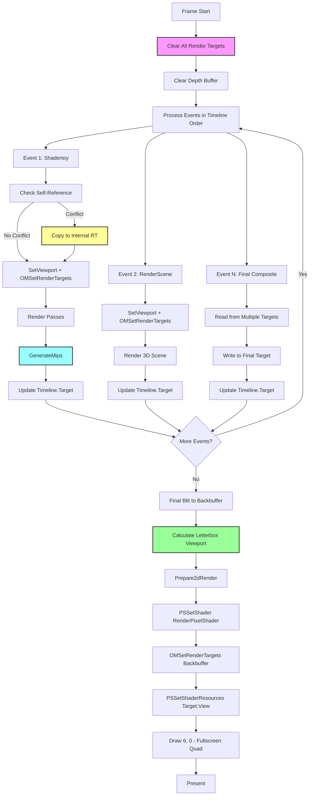
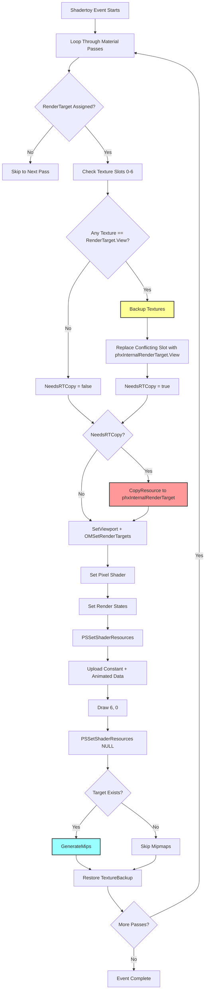

# Phoenix Timeline Render Targets

You've built a demo engine. Events generate visual content—particle systems, shader effects, 3D scenes. But where does that content go? If every event draws directly to the screen, you lose composability. You can't layer effects, can't reuse intermediate results, can't build complex pipelines.

Phoenix solves this with render targets: offscreen canvases that events write to. Think of them like layers in Photoshop, except they're active throughout the frame. An event writes to Target 0, another reads from Target 0 and writes to Target 1, and at the end of the frame, the final target gets letterboxed onto the screen. The render target system is the plumbing that makes visual composition possible.

But this plumbing has edge cases. What if a shader needs to read from the same target it's writing to? What if you want mipmaps for blur effects? What about aspect ratio handling when the screen resolution doesn't match your target? Phoenix's Timeline manages all of this, and understanding it reveals the hidden complexity of real-time compositing.

## The Problem: From Events to Pixels

In a typical demo, you might have:
- A shadertoy effect generating fractal noise
- A 3D scene rendering geometry
- Another shader reading both results and applying bloom
- A final composition blitting to screen

Each step needs a canvas. Without render targets, you're stuck with a linear pipeline where each event overwrites the previous one. With render targets, you get a directed acyclic graph where events can reference arbitrary previous results.

The Timeline owns this graph. It allocates render targets at initialization, routes events to appropriate targets, handles frame-boundary operations (clearing, mipmap generation), and performs the final blit to the backbuffer. The render target system is what transforms a collection of independent events into a coherent visual output.

## Mental Model: Canvas Array with Smart Routing

Phoenix's render target system is conceptually simple: an array of offscreen textures that events write to. But the devil is in the details—viewport management, self-referential rendering, letterboxing, mipmap chains. The Timeline acts as a switchboard, routing each event to its designated canvas and ensuring the GPU state matches the target's requirements.

The key insight is that render targets aren't just memory allocations. They're stateful objects that know their resolution, can configure viewports, and maintain both render target views (for writing) and shader resource views (for reading). This dual nature—writable canvas and readable texture—is what enables composition.

## CphxTimeline: Render Target Ownership

The Timeline owns the render target array and manages the final output target:

```cpp
// Timeline.h:168-178
class CphxTimeline
{
public:
  // these 4 values are read as a single dword during project load
  unsigned char AspectX;
  unsigned char AspectY;
  unsigned char FrameRate;
  unsigned char RenderTargetCount;

  CphxRenderTarget **RenderTargets;  // array of all targets
  CphxRenderTarget *Target;          // current/final target for frame
  int ScreenX, ScreenY;              // display resolution

  // ... events, rendering methods
};
```

*Reference: Timeline.h:168-178*

**RenderTargetCount** determines how many offscreen canvases are allocated. This is a project-level decision—more targets mean more composition flexibility but higher memory cost.

**RenderTargets** is the array of canvas pointers. Events reference these by index.

**Target** tracks the final render target for the current frame. After all events execute, this is the texture that gets blitted to the screen. Think of it like "which layer is on top at the end."

**ScreenX/ScreenY** are the actual display dimensions. These differ from target resolution when aspect ratios don't match, requiring letterboxing.

**AspectX/AspectY** define the intended aspect ratio (e.g., 16:9 encoded as 16, 9). This drives the letterbox calculation during the final blit.

## CphxEvent: Per-Event Target Assignment

Each event knows which render target it writes to:

```cpp
// Timeline.h:25-40
class CphxEvent
{
public:
  bool OnScreenLastFrame;
  CphxRenderTarget *Target;  // where this event renders

  unsigned short StartFrame, EndFrame;
  CphxSpline_float16 *Time;

  virtual void Render( float t, float prevt, float aspect, bool subroutine ) = 0;
};
```

*Reference: Timeline.h:25-40*

The **Target** pointer routes the event's output. When a shadertoy effect renders, it uses `Target->SetViewport()` and `OMSetRenderTargets(1, &Target->RTView, ...)` to make the GPU write to this canvas instead of the backbuffer.

Multiple events can share the same target. If two events write to Target 0 with additive blending enabled, they compose naturally. The Timeline doesn't enforce mutual exclusion—it's up to the project author to decide whether targets are overwritten or accumulated.

## CphxRenderTarget: The Canvas Abstraction

A render target encapsulates the D3D11 resources needed for a writable, readable texture:

```cpp
// RenderTarget.h:4-22
class CphxRenderTarget
{
public:
  enum PixelFormat : unsigned char
  {
    RGBA16Float = 0,
    R32Float = 1,
  };

  bool cubeMap;
  int XRes, YRes;
  ID3D11RenderTargetView *RTView;       // for writing
  ID3D11ShaderResourceView *View;       // for reading
  ID3D11Texture2D *Texture;             // underlying storage

  void SetViewport();
};
```

*Reference: RenderTarget.h:4-22*

**RTView** is what you bind with `OMSetRenderTargets()` to make the GPU write to this texture.

**View** is what you bind with `PSSetShaderResources()` to let shaders sample from this texture.

**Texture** is the underlying ID3D11Texture2D. When you need to copy a render target (for self-referential rendering), you use `CopyResource()` on the Texture.

**XRes/YRes** define the canvas dimensions. These may differ from the screen resolution. A demo might render to 1920x1080 targets and display on a 2560x1440 screen with letterboxing.

**SetViewport()** configures the D3D11 viewport to match the target resolution:

```cpp
// RenderTarget.cpp:4-14
void CphxRenderTarget::SetViewport()
{
  D3D11_VIEWPORT v;
  v.TopLeftX = 0;
  v.TopLeftY = 0;
  v.Width = (float)XRes;
  v.Height = (float)YRes;
  v.MinDepth = 0;
  v.MaxDepth = 1;
  phxContext->RSSetViewports( 1, &v );
}
```

*Reference: RenderTarget.cpp:4-14*

This is called before rendering to ensure pixel coordinates map correctly to the target dimensions.

## Frame Initialization: Clearing the Slate

At the start of each frame, the Timeline clears all render targets and the depth buffer:

```cpp
// Timeline.cpp:325-338 (in CphxTimeline::Render)
if ( !subroutine )
{
  Target = NULL;

  //clear rendertargets at the beginning of the frame
  if ( !tool )
    phxContext->ClearRenderTargetView( phxBackBufferView, (float*)rv ); //clean up after precalcbar

  for ( int x = 0; x < RenderTargetCount; x++ )
    phxContext->ClearRenderTargetView( RenderTargets[ x ]->RTView, (float*)rv );
  phxContext->ClearDepthStencilView( phxDepthBufferView, D3D10_CLEAR_DEPTH | D3D10_CLEAR_STENCIL, 1, 0 );
}
```

*Reference: Timeline.cpp:325-338*

The `rv` array is a static `{0, 0, 0, 0}`, so this clears all targets to black. The `subroutine` check prevents recursion when one timeline renders another (via RENDERDEMO events).

Why clear every target every frame? Because Phoenix doesn't track which targets are written to. Unconditional clearing is simpler than dependency analysis, and the cost is negligible (a few GPU cycles vs. the complexity of tracking "dirty" targets).

The depth buffer clear is critical—leftover depth values from the previous frame would cause incorrect occlusion.

## Viewport Setup: Matching Target Dimensions

Before rendering to a target, events configure the viewport:

```cpp
// Timeline.cpp:73-75 (in CphxEvent_Shadertoy::Render)
MaterialState[ x ]->RenderTarget->SetViewport();
phxContext->OMSetRenderTargets( 1, &MaterialState[ x ]->RenderTarget->RTView, NULL );
```

*Reference: Timeline.cpp:73-75*

This pairs the viewport dimensions with the render target. Without this, a 1280x720 target bound to a 1920x1080 viewport would render incorrectly—only the top-left 1280x720 pixels would be valid.

The sequence is always:
1. `SetViewport()` to configure rasterizer dimensions
2. `OMSetRenderTargets()` to bind the writable view
3. Draw calls that write to the bound target

Think of the viewport as the camera's sensor size and the render target as the film. They must match, or you get cropping or undefined behavior.

## Self-Referential Rendering: The Copy Dance

Shadertoy events may read and write the same render target—imagine a feedback effect where each frame blends the previous result. But D3D11 doesn't allow simultaneous read/write on the same resource. Phoenix solves this by detecting the conflict and copying to an internal staging target:

```cpp
// Timeline.cpp:56-71 (in CphxEvent_Shadertoy::Render)
extern CphxRenderTarget *phxInternalRenderTarget;

for ( int x = 0; x < Tech->PassCount; x++ )
{
  if ( MaterialState[ x ]->RenderTarget )
  {
    //copy rendertarget if needed
    bool NeedsRTCopy = false;
    for ( int y = 0; y < 7; y++ )
    {
      MaterialState[ x ]->TextureBackup[ y ] = MaterialState[ x ]->Textures[ y ];
      if ( MaterialState[ x ]->Textures[ y ] == MaterialState[ x ]->RenderTarget->View )
      {
        MaterialState[ x ]->Textures[ y ] = phxInternalRenderTarget->View;
        NeedsRTCopy = true;
      }
    }

    if ( NeedsRTCopy )
      phxContext->CopyResource( phxInternalRenderTarget->Texture, MaterialState[ x ]->RenderTarget->Texture );
```

*Reference: Timeline.cpp:56-71*

The detection loop checks all 7 texture slots. If any texture matches the render target's shader resource view, it means "this shader wants to read from where it's writing."

The fix is elegant:
1. Back up all texture bindings to `TextureBackup`
2. Replace the conflicting texture slot with `phxInternalRenderTarget->View`
3. Copy the render target to the internal target
4. Proceed with rendering (shader reads from internal target, writes to original target)
5. Restore original texture bindings after the pass

The internal render target is allocated at project initialization and persists for the entire runtime. It's a scratch space specifically for this edge case.

Here's where it gets interesting: Phoenix doesn't prevent self-referential rendering. It embraces it as a feature. Feedback effects are common in demos, and manually managing double-buffering would bloat project data. By detecting the conflict at runtime and copying transparently, Phoenix makes feedback "just work."

## Mipmap Generation: Enabling Multi-Scale Effects

After rendering to a target, Phoenix generates mipmaps:

```cpp
// Timeline.cpp:129-130 (in CphxEvent_Shadertoy::Render)
if ( Target )
  phxContext->GenerateMips(Target->View);
```

*Reference: Timeline.cpp:129-130*

Why generate mipmaps for a render target? Because subsequent shaders may sample at different scales. A bloom effect reads progressively coarser mips to simulate light scatter. A depth-of-field shader samples mipmaps based on distance. Without `GenerateMips()`, you'd get the base mip at all scales—sharp and aliased.

D3D11's `GenerateMips()` uses a box filter to downsample each mip level. It's fast (GPU-accelerated) but not high-quality (no Lanczos or Gaussian). For demo purposes, the quality trade-off is acceptable—60fps rendering matters more than perfect downsampling.

Mipmap generation happens per-pass for shadertoy events, not per-frame. If a material has 3 passes writing to the same target, each pass regenerates mipmaps. This ensures subsequent passes see the updated mipchain, though it's wasteful if no pass reads mipmaps. Phoenix prioritizes correctness over microoptimization.

## Final Blit: Target to Backbuffer

After all events render, the Timeline blits the final target to the screen:

```cpp
// Timeline.cpp:363-375 (in CphxTimeline::Render)
if ( Target && !tool )
{
  //display frame
  Prepare2dRender();
  phxContext->PSSetShader( RenderPixelShader, NULL, 0 );

  D3D11_VIEWPORT v = { ( ScreenX - Target->XRes ) / 2.0f, ( ScreenY - Target->YRes ) / 2.0f,
                        (float)Target->XRes, (float)Target->YRes, 0, 1 };
  phxContext->RSSetViewports( 1, &v );
  phxContext->OMSetRenderTargets( 1, &phxBackBufferView, NULL );
  phxContext->PSSetShaderResources( 0, 1, &Target->View );
  phxContext->Draw( 6, 0 );
  phxContext->PSSetShaderResources( 0, 1, rv );
}
```

*Reference: Timeline.cpp:363-375*

**Prepare2dRender()** sets up the GPU state for fullscreen quad rendering—vertex shader, sampler states, blend/depth disabled, triangle topology. It's defined in Texgen.cpp and used throughout Phoenix for 2D operations.

**RenderPixelShader** is a simple passthrough shader that samples texture 0 and outputs the color. It's compiled at engine initialization and lives in phxEngine.cpp.

The **viewport calculation** handles letterboxing. If the target is 1920x1080 and the screen is 2560x1440:
- `TopLeftX = (2560 - 1920) / 2 = 320` (center horizontally)
- `TopLeftY = (1440 - 1080) / 2 = 180` (center vertically)
- `Width = 1920`, `Height = 1080` (maintain target dimensions)

This centers the target on screen with black bars, preserving aspect ratio. The alternative—stretching to fill—would distort the image.

**Draw(6, 0)** renders two triangles forming a fullscreen quad. The vertex shader generates positions from vertex IDs (no vertex buffer needed for the quad itself, just UVs).

After the blit, `PSSetShaderResources(0, 1, rv)` unbinds the target. This prevents D3D11 validation errors if the next frame tries to write to the same target (you can't have a texture both bound as SRV and RTV simultaneously).

## Render Target Sharing: Composition Through Blending

Multiple events can write to the same render target with different blend modes. Phoenix doesn't enforce exclusivity—render targets are shared resources.

Consider a project with:
- Event A writes to Target 0 with `BlendState = REPLACE` (opaque geometry)
- Event B writes to Target 0 with `BlendState = ADDITIVE` (particle effects)
- Event C reads from Target 0 and writes to Target 1 (post-processing)

Event A overwrites the cleared target. Event B adds to the existing content. Event C consumes the composite. This is standard render target choreography, but it's entirely implicit in Phoenix—the Timeline doesn't mediate or validate the sharing.

The risk is that conflicting writes produce garbage. If two events write to the same target with incompatible blend modes, the result is undefined (though technically deterministic based on event order). Phoenix assumes the project author understands render target semantics. In a size-constrained demo environment, explicit validation would bloat the runtime.

## Aspect Ratio Handling: AspectX/AspectY

The Timeline stores the intended aspect ratio as two bytes:

```cpp
// Timeline.h:168-171
unsigned char AspectX;
unsigned char AspectY;
unsigned char FrameRate;
unsigned char RenderTargetCount;
```

*Reference: Timeline.h:168-171*

These are "read as a single dword during project load"—meaning Phoenix packs 4 configuration bytes into one 32-bit integer for compact storage. For a 16:9 project, `AspectX = 16`, `AspectY = 9`.

The aspect ratio is passed to event `Render()` methods:

```cpp
// Timeline.cpp:355 (in CphxTimeline::Render)
Events[ x ]->Render( t, prevt, AspectX / (float)AspectY, subroutine );
```

*Reference: Timeline.cpp:355*

This `aspect` parameter (e.g., 1.777 for 16:9) is used when constructing projection matrices, ensuring that rendered content isn't stretched regardless of screen resolution.

The final blit letterboxes if `ScreenX/ScreenY` doesn't match `AspectX/AspectY`. A 16:9 demo on a 4:3 monitor gets horizontal black bars. A 4:3 demo on a 16:9 monitor gets vertical black bars. The render targets themselves are authored with specific resolutions (e.g., 1920x1080), and the aspect ratio ensures they're displayed correctly.

## Render Target Flow Diagram

Here's how render targets flow through a typical frame:



The key stages are:
1. **Frame initialization** clears all targets to black
2. **Event processing** writes to designated targets, handling self-reference and generating mipmaps
3. **Final blit** letterboxes the last target onto the screen

## Self-Referential Copy Mechanism

Here's the detailed flow for handling self-referential rendering:



The copy happens before any rendering, ensuring the shader reads stale content while writing fresh content. This is the only way to achieve feedback without manual double-buffering.

## Implications for Rust Framework Design

Phoenix's render target system offers several lessons for a Rust-based creative coding framework:

### 1. Render Targets as First-Class Resources

Don't hide render targets behind a scene graph or renderer abstraction. Make them explicit, nameable resources that users can reference. Phoenix's `CphxRenderTarget**` array is essentially a symbol table—events reference targets by index (which maps to user-defined names in the tool).

In Rust, this could be:

```rust
pub struct Timeline {
    render_targets: HashMap<String, RenderTarget>,
    final_target: Option<String>,
    screen_resolution: (u32, u32),
    aspect_ratio: (u32, u32),
}
```

Users would write `event.render_to("bloom_target")`, making data flow explicit.

### 2. Automatic Self-Reference Detection

Phoenix's self-reference check (loop through 7 texture slots, compare pointers) is efficient and foolproof. In Rust, wgpu's explicit resource barriers make this even cleaner—attempting to bind the same texture as both render target and input would panic at the `begin_render_pass()` call.

Consider offering an opt-in `feedback()` method that handles the copy transparently:

```rust
impl Event {
    pub fn feedback_on(&mut self, target_name: &str) {
        self.feedback_target = Some(target_name.to_string());
        // Framework copies target to scratch buffer before render
    }
}
```

### 3. Mipmap Generation as Opt-In

Phoenix calls `GenerateMips()` unconditionally. This is wasteful if no downstream shader reads mipmaps. In Rust, make it explicit:

```rust
impl RenderTarget {
    pub fn with_mipmaps(mut self, enabled: bool) -> Self {
        self.generate_mipmaps = enabled;
        self
    }
}
```

wgpu's `TextureView` can specify mip levels, so the framework can skip generation if `max_mip_level == 0`.

### 4. Letterboxing as a Built-In Feature

Phoenix's letterbox calculation is 3 lines of arithmetic, yet it's critical for aspect ratio correctness. Abstract this behind a `LetterboxMode` enum:

```rust
pub enum LetterboxMode {
    Center,       // Black bars to preserve aspect
    Stretch,      // Fill screen, distort if needed
    Crop,         // Zoom to fill, clip edges
}
```

The final blit can then handle all cases without user intervention.

### 5. Clear Policy: Explicit vs. Automatic

Phoenix clears all render targets every frame. For a user-facing framework, consider making this configurable:

```rust
pub struct RenderTarget {
    clear_policy: ClearPolicy,
}

pub enum ClearPolicy {
    EveryFrame(Color),  // Phoenix's approach
    OnFirstWrite,       // Clear only when target changes
    Manual,             // User calls clear() explicitly
}
```

Automatic clearing prevents stale data but costs GPU cycles. Power users might want manual control for persistent buffers (e.g., trail effects that accumulate over multiple frames).

### 6. Viewport Management: Hidden Complexity

Phoenix pairs `SetViewport()` with `OMSetRenderTargets()` in every event. In wgpu, the viewport is part of the `RenderPassDescriptor`, so the pairing is enforced by the API. This is an example where modern graphics APIs prevent footguns that D3D11 allowed.

When designing Rust abstractions, lean on wgpu's safety—don't expose raw viewport configuration unless there's a compelling use case.

### 7. Render Target Sharing: Trust the User

Phoenix doesn't validate that events use render targets correctly. Two events writing to the same target with incompatible blend modes will produce garbage, but Phoenix assumes this is intentional (or at least, a user error to fix).

A Rust framework could enforce exclusivity with borrow checking:

```rust
impl Timeline {
    pub fn event_mut(&mut self, target: &str) -> EventGuard<'_> {
        // Mutable borrow ensures no other event writes to this target
    }
}
```

But this prevents legitimate sharing (additive blending, multi-pass rendering). Phoenix's approach—trust the user, provide tools for debugging—scales better for creative coding where unconventional pipelines are common.

### 8. Internal Resources: Hidden Scratch Buffers

`phxInternalRenderTarget` is allocated once and reused for all self-referential copies. This is a size-code optimization—allocating per-event would bloat the runtime. In Rust, this maps to a `OnceCell<RenderTarget>`:

```rust
static SCRATCH_TARGET: OnceCell<RenderTarget> = OnceCell::new();

impl Timeline {
    fn get_scratch_target(&self) -> &RenderTarget {
        SCRATCH_TARGET.get_or_init(|| {
            RenderTarget::new(self.max_target_resolution)
        })
    }
}
```

The cost is one extra render target worth of VRAM (e.g., 8MB for 1920x1080 RGBA16F). The benefit is zero allocation overhead during rendering.

### 9. Separation of Concerns: Timeline vs. Renderer

Phoenix's Timeline owns render targets but delegates rendering to events. This separation is clean—the Timeline is the sequencer, events are the operators. In Rust, this maps to:

```rust
trait Event {
    fn render(&mut self, ctx: &RenderContext, target: &RenderTarget);
}

struct Timeline {
    events: Vec<Box<dyn Event>>,
    render_targets: HashMap<String, RenderTarget>,
}
```

The Timeline calls `event.render(&ctx, &target)`, passing borrowed resources. Events can't reassign targets or reorder themselves—they're pure functions over GPU state.

### 10. Aspect Ratio as Metadata

Phoenix packs AspectX/AspectY into a single dword with FrameRate and RenderTargetCount. This is a size-code trick, but it reveals that aspect ratio is project-level metadata, not per-target configuration.

In Rust, store this in the project descriptor:

```rust
pub struct ProjectConfig {
    pub aspect_ratio: (u32, u32),
    pub framerate: u32,
    pub target_count: usize,
}
```

Render targets inherit the project's aspect ratio unless explicitly overridden (e.g., for cubemap faces or shadow maps).

## Cross-References

- **[Timeline Events](events.md)** — How events use render targets during their Render() calls
- **[Material System](../rendering/materials.md)** — How MaterialState binds textures and render targets
- **[Texture Generation](../texgen/overview.md)** — Similar render-to-texture patterns for procedural content
- **[Shader Pipeline](../rendering/shader-pipeline.md)** — How RenderPixelShader performs the final blit

## Open Questions

1. **Mipmap quality**: Phoenix uses D3D11's box filter. Would users notice Lanczos or Gaussian filtering? What's the performance cost?

2. **HDR render targets**: Phoenix uses RGBA16Float. Should a Rust framework offer 32-bit float or integer targets?

3. **Cubemap render targets**: The `cubeMap` field exists but isn't used in Timeline.cpp. How would cubemap rendering integrate with the event system?

4. **Depth buffer sharing**: All events share a single depth buffer. Should events be able to allocate per-target depth buffers?

5. **Multi-target rendering (MRT)**: Phoenix renders to one target at a time. Would MRT support (writing to multiple targets in one pass) simplify certain effects?

## Conclusion

Phoenix's render target system is deceptively simple: an array of offscreen textures, a final blit to screen, and some edge-case handling. But this simplicity enables composition. Events don't coordinate—they write to targets, and the Timeline stitches the results together.

The key insights are:
- Render targets are both writable (RTView) and readable (View), enabling use-then-reuse patterns
- Self-referential rendering is detected and fixed at runtime with a copy
- Mipmap generation happens eagerly, enabling multi-scale sampling without user intervention
- The final blit handles aspect ratio mismatch with letterboxing
- Viewport management pairs with render target binding to ensure correct rasterization

For a Rust framework, the lessons are about trade-offs: automatic vs. explicit, validation vs. trust, safety vs. performance. Phoenix leans toward "make it work, trust the user, optimize for size." A modern framework can use Rust's type system and wgpu's safety to prevent footguns while retaining Phoenix's compositional elegance.

Render targets are the canvas system that makes visual composition possible. Phoenix's implementation proves that a few hundred lines of C++ can coordinate complex multi-pass rendering—and a well-designed Rust API can make it even safer and more expressive.
