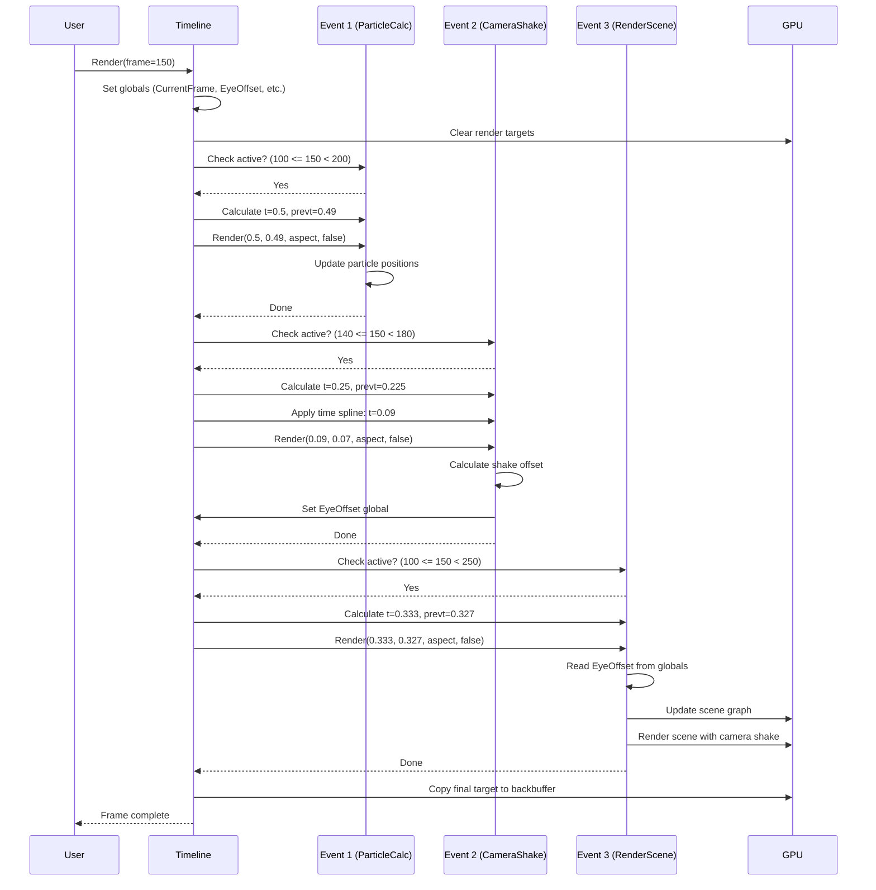
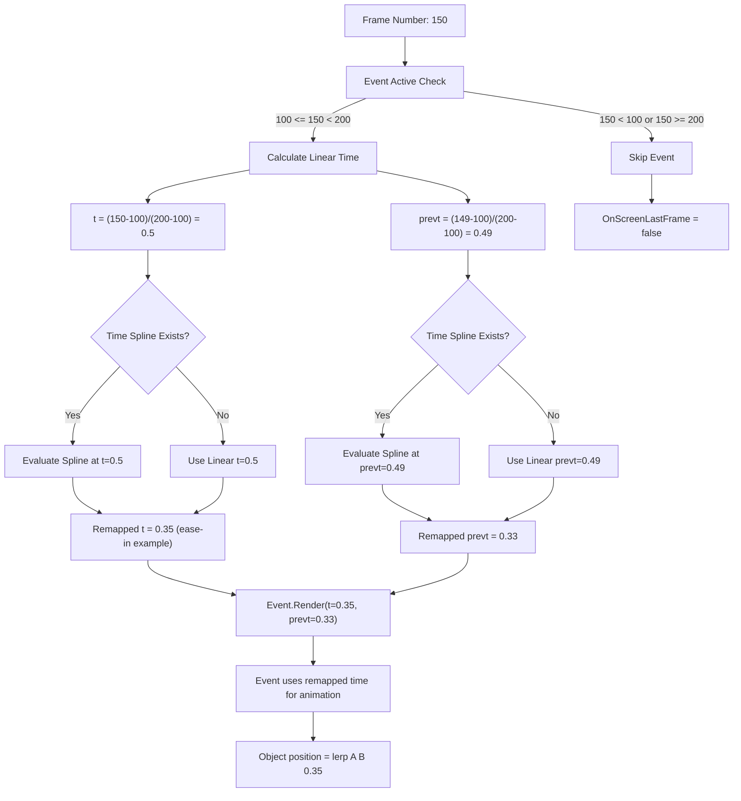
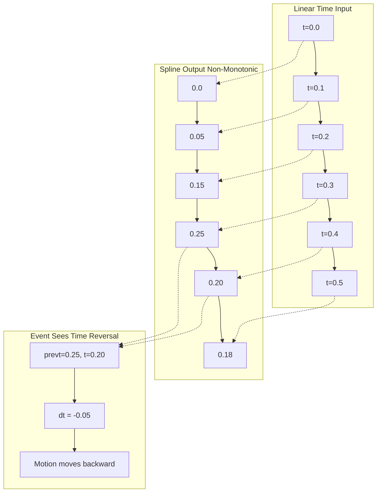

# Timeline Sequencing: Frame-Based Timing and Time Remapping

Every frame of a demoscene production is a precisely orchestrated moment. The timeline system is the conductor—it takes a single input number (the current frame) and transforms it into a symphony of events, each with their own sense of time. This is where artistic control meets mathematical precision.

The Phoenix timeline doesn't think in seconds or milliseconds. It thinks in frames. When you scrub to frame 1847, the system finds every event that should be active at that exact moment, calculates where you are within each event's lifespan, and optionally warps that linear progression through time splines. This frame-based architecture gives demo artists pixel-perfect control over when things happen and how time flows within those moments.

What makes this system powerful isn't just scheduling—it's the separation between *when* an event happens and *how* it experiences time. An event might span frames 100-200, but its internal time can ease in slowly, hold still for dramatic effect, then rush forward. The timeline handles both the scheduling and the time remapping, keeping event implementations blissfully unaware of these temporal manipulations.

## The Problem: Artistic Control Over Time

Real-time demos run at a fixed framerate—typically 60fps—but artists don't think in frames per second. They think in beats, transitions, and emotional pacing. A camera movement needs to ease out smoothly. A scene needs to hold on a key frame. A particle burst needs to accelerate to the beat drop.

Linear time is the enemy of artistic expression. If you schedule an event from frame 100 to 200, you get a boring, constant-speed progression from 0.0 to 1.0. But what if you want the first quarter to move slowly, establishing the scene, then accelerate into the main action? What if you want to freeze time entirely for a few frames?

The traditional solution—baking timing curves into every effect's code—creates a maintenance nightmare. Change the duration of a scene and suddenly all your carefully tuned ease-in/out curves are wrong. Move an event earlier and its timing feels different because it's no longer synced to the music beat grid.

Phoenix solves this by making time itself a first-class resource. Every event has an optional time spline that warps its internal clock. The event receives normalized time values (0.0 to 1.0) but has no idea whether it's been remapped. This separation of concerns means artists can adjust timing curves in the editor without touching code, and programmers can write effects that work with simple linear time.

## Frame-Based Architecture

The timeline system revolves around a single type: `CphxTimeline`, which contains a collection of events and metadata about how to render them.

At its core, a timeline knows:
- Its **framerate** (Timeline.h:171): typically 60fps, stored as `unsigned char FrameRate`
- Its **aspect ratio** (Timeline.h:169-170): `AspectX` and `AspectY` for calculating viewport proportions
- Its **render targets** (Timeline.h:174): array of `CphxRenderTarget**` for off-screen rendering
- Its **events** (Timeline.h:181): array of `CphxEvent**`, each representing a schedulable action

Every event, regardless of type, inherits from `CphxEvent` (Timeline.h:25-40) and carries:

```cpp
unsigned short StartFrame, EndFrame;  // Timeline.h:32
CphxSpline_float16 *Time;             // Timeline.h:33
CphxRenderTarget *Target;             // Timeline.h:30
bool OnScreenLastFrame;               // Timeline.h:29
```

These four fields define the event's relationship with time. `StartFrame` and `EndFrame` create an inclusive-exclusive range—an event starting at frame 100 and ending at 200 is active for frames [100, 200). The `Time` spline pointer is optional; if NULL, the event experiences linear time progression.

The mental model here is a piano roll in a music sequencer. Each event is a note or clip on the timeline. The horizontal position and length determine when it plays, but the Time spline is like automation curves that modulate parameters within that clip. The event itself is the sound source; the timeline just schedules when it speaks.

## The Main Render Loop: From Frame to Rendered Pixels

When you call `CphxTimeline::Render(float Frame, bool tool, bool subroutine)` (Timeline.cpp:318), you're asking: "What should be happening at this exact frame?" The function doesn't care whether you're playing forward, scrubbing backward, or jumping randomly. It's stateless—give it a frame number, get the correct output.

The render loop follows this sequence:

**1. Global initialization** (Timeline.cpp:320-323):

```cpp
cameraOverride = nullptr;
TimelineFramerate = FrameRate;
CurrentFrame = (int)Frame;
EyeOffset = TargetOffset = D3DXVECTOR3(0, 0, 0);
```

These globals (`TimelineFramerate`, `CurrentFrame`, `EyeOffset`, `TargetOffset`) are declared at Timeline.cpp:232-234 and act as thread-local state for the current frame. Events can read `CurrentFrame` to know their absolute position on the timeline, which matters for particle systems and camera shake that need deterministic random seeds based on frame number.

**2. Render target clearing** (Timeline.cpp:325-338):

If this isn't a subroutine call (more on that later), the system clears all render targets to black and resets the depth buffer. This ensures each frame starts with a clean slate. The `tool` parameter controls whether to clear the backbuffer—the external tool viewer handles its own clearing.

**3. Event iteration and activation** (Timeline.cpp:340-361):

This is where the magic happens. The loop examines every event in the timeline:

```cpp
for (int x = 0; x < EventCount; x++)
{
    if (Events[x]->StartFrame <= (int)Frame && (int)Frame < Events[x]->EndFrame)
    {
        // Event is active at this frame
    }
    else
        Events[x]->OnScreenLastFrame = false;
}
```

The condition `StartFrame <= Frame && Frame < EndFrame` (Timeline.cpp:342) creates that inclusive-exclusive range. Frame 100 activates an event starting at 100, but frame 200 does *not* activate an event ending at 200. This off-by-one choice prevents double-rendering on boundaries when events are back-to-back.

**4. Time calculation** (Timeline.cpp:344-345):

For active events, the system calculates normalized time within the event's duration:

```cpp
float t = (Frame - Events[x]->StartFrame) /
          (Events[x]->EndFrame - Events[x]->StartFrame);
```

At the event's StartFrame, `t = 0.0`. One frame before EndFrame, `t` approaches but never reaches 1.0. For a 100-frame event, frame 0 gives t=0.0, frame 50 gives t=0.5, frame 99 gives t=0.99.

The system also calculates the *previous frame's time* (Timeline.cpp:345):

```cpp
float prevt = (Frame - 1 - Events[x]->StartFrame) /
              (Events[x]->EndFrame - Events[x]->StartFrame);
```

This might seem redundant—why not just cache the previous `t` value? But the timeline is stateless. You might render frame 500, then jump to frame 200, then back to 501. The system can't rely on sequential playback, so it recalculates `prevt` every time. This value is crucial for motion blur and particle velocity calculations that need to know the delta between frames.

**5. Time spline remapping** (Timeline.cpp:347-353):

Here's where linear time gets warped:

```cpp
if (Events[x]->Time)  // If time spline exists
{
    Events[x]->Time->CalculateValue(prevt);
    prevt = Events[x]->Time->Value[0];
    Events[x]->Time->CalculateValue(t);
    t = Events[x]->Time->Value[0];
}
```

The spline's input is the linear time `t` (0.0 to 1.0), and its output is the remapped time stored in `Value[0]`. This output *usually* ranges from 0.0 to 1.0, but it doesn't have to. You could map to -0.2 at the start for anticipation, or to 1.5 at the end for overshoot. The event receives whatever the spline outputs.

Let's trace a concrete example. An event runs from frame 100 to 200 with a time spline that implements an ease-in-out curve:
- At frame 150 (midpoint), `t = (150-100)/(200-100) = 0.5`
- The time spline evaluates at input 0.5, returning output ~0.5 (midpoint of ease curve)
- At frame 120 (early), `t = 0.2`, spline might return 0.08 (slow start)
- At frame 180 (late), `t = 0.8`, spline might return 0.92 (slow end)

The effect sees smooth time values but experiences slow-fast-slow motion.

**6. Event rendering** (Timeline.cpp:355):

```cpp
Events[x]->Render(t, prevt, AspectX / (float)AspectY, subroutine);
```

Every event type implements this virtual method. The event receives:
- `t`: current remapped time (0.0 to ~1.0)
- `prevt`: previous frame's remapped time
- `aspect`: width/height ratio for projection calculations
- `subroutine`: recursion guard (explained shortly)

The event does its thing—renders a scene, runs a shader, updates particles—and returns control to the timeline.

**7. Post-render bookkeeping** (Timeline.cpp:357-360):

```cpp
Target = Events[x]->Target;
Events[x]->OnScreenLastFrame = true;
```

The timeline remembers which render target was used by this event (for final display) and marks the event as having been active this frame. Events that weren't active get `OnScreenLastFrame = false` (Timeline.cpp:360).

**8. Final display** (Timeline.cpp:363-375):

If there's a valid Target and we're not in tool mode, the system copies the final render target to the backbuffer, centered and scaled to fit the screen dimensions.

## Time Splines: Nonlinear Time Without Code Changes

The Time spline pointer on each event is optional, but its presence transforms what's possible. Consider a camera movement from position A to B. Without time remapping, you'd write:

```cpp
position = lerp(A, B, t);
```

With a Time spline, you still write the same code, but `t` can follow any curve. An ease-in cubic gives you:

```
t_input:    0.0  0.1  0.2  0.3  0.4  0.5  0.6  0.7  0.8  0.9  1.0
t_output:   0.0  0.03 0.08 0.14 0.22 0.32 0.43 0.56 0.70 0.85 1.0
```

The camera still lerps from A to B, but the motion feels natural—accelerating out of A, decelerating into B—because time itself is warped.

The spline type is `CphxSpline_float16`, which uses 16-bit floats for compact storage. The `CalculateValue(float t)` method evaluates the spline at input `t` and stores the result in `Value[0]`. This design supports multi-channel splines (RGB colors, XYZ positions), though time splines only use the first channel.

What happens if the time spline isn't monotonic? If at t=0.3 it outputs 0.5, then at t=0.4 it outputs 0.4? Time flows backward. The event sees prevt=0.5 and t=0.4, and if it's doing velocity-based motion (`position += velocity * (t - prevt)`), things move in reverse. This is a feature, not a bug—it enables time-rewind effects without special case code.

Edge case: What if the time spline outputs values outside [0, 1]? The event handles whatever it receives. Most events interpolate between start and end states, so negative time is extrapolation before the start, and time > 1.0 is extrapolation beyond the end. For a position lerp, this creates anticipation (pulling back before moving forward) or overshoot (bouncing past the target).

## Event Nesting: Timelines Within Timelines

One event type breaks the simple render-and-return pattern: `CphxEvent_RenderDemo` (Timeline.h:55-67). This event contains a pointer to another `CphxTimeline`:

```cpp
class CphxEvent_RenderDemo : public CphxEvent
{
    CphxTimeline *Timeline;
    unsigned short _start, _end;
};
```

The intent is to render a sub-timeline with remapped frame ranges. If an event spans frames 100-200 with `_start=0` and `_end=600`, at frame 150 (midpoint, t=0.5), it should render the nested timeline at frame 300 (midpoint of 0-600).

However, the implementation is commented out (Timeline.cpp:24):

```cpp
void CphxEvent_RenderDemo::Render(float t, float prevt, float aspect, bool subroutine)
{
    if (subroutine) return;  // No recursion thank you
    //Timeline->Render(lerp(_start,_end,t), true);
}
```

The recursion guard (`if (subroutine) return`) prevents infinite nesting. The `subroutine` parameter passed to `Render()` comes from the top-level call (Timeline.cpp:355). When `Render()` is called with `subroutine=false`, events are free to trigger nested renders. Those nested calls pass `subroutine=true`, preventing further nesting.

Why is this commented out? Likely because nested timelines introduce complexity around render target management and global state (camera overrides, shader resources). The architecture supports it conceptually—the recursion guard is there—but the feature wasn't needed or was causing issues.

The key insight for framework designers: nesting timelines is conceptually simple (just another Render call) but practically complex due to global state. If your timeline system relies on globals (like `CurrentFrame`, `EyeOffset`), nested calls clobber parent state. A fully stateless design would pass all context as parameters, but that has ergonomic costs for simple cases.

## OnScreenLastFrame: Stateful Particle Initialization

Most of the timeline is stateless—render frame 500, get the same output every time. But particle systems are inherently stateful. Particles have positions, velocities, ages. When you scrub the timeline backward or jump to a random frame, particles can't just teleport; they need to know their state at that exact frame.

The `OnScreenLastFrame` boolean (Timeline.h:29) tracks whether an event was active on the previous `Render()` call. It's set to `true` when the event renders (Timeline.cpp:358) and `false` when it's inactive (Timeline.cpp:360).

`CphxEvent_ParticleCalc` uses this for initialization (Timeline.cpp:248-253):

```cpp
if (!OnScreenLastFrame)
{
    lastt = t;
    lasttime = tme;
    OnScreenLastFrame = true;
}
```

When the event becomes active for the first time (or becomes active again after being off), it resets its internal state (`lastt`, `lasttime`). This prevents particle systems from suddenly spawning a burst of particles that *should* have been created during the frames you skipped.

Consider this scenario:
1. Particle event runs from frame 100-200, spawning 10 particles per frame
2. You're scrubbing: frame 80 → 90 → 110 → 150
3. At frame 110, the event just became active (wasn't active at frame 90)
4. Without `OnScreenLastFrame` check, the particle system sees `lasttime=90, time=110` and spawns 200 particles instantly (20 frames × 10/frame)
5. With the check, it resets to `lasttime=110`, spawning only 10 particles

This creates a discontinuity—particles don't have their full history—but it's better than a visible pop. For smooth playback, this never matters. For scrubbing, it's the right trade-off between correctness and visual glitches.

The key constraint: this only works because the timeline maintains event instances across frames. The `Events` array and each event's `OnScreenLastFrame` field persist between `Render()` calls. If you recreated events each frame, this optimization wouldn't be possible.

## Global State: Shared Context Between Events

Three global variables provide cross-event communication (Timeline.cpp:232-234, 9-11):

```cpp
unsigned int TimelineFramerate;
int CurrentFrame;
D3DXVECTOR3 EyeOffset;
D3DXVECTOR3 TargetOffset;
CphxObject* cameraOverride;
```

These are set at the start of `Render()` (Timeline.cpp:320-323) and read by events during their render.

**TimelineFramerate** lets events convert time values to absolute milliseconds. `CphxEvent_ParticleCalc` needs this (Timeline.cpp:245):

```cpp
int tme = ((EndFrame - StartFrame) * t + StartFrame) * 1000.0f / TimelineFramerate;
```

This converts the current frame (relative time) to milliseconds (absolute time) for particle simulation. At 60fps, frame 120 is 2000ms. The particle system uses delta-time in seconds (Timeline.cpp:264) to update positions and ages.

**CurrentFrame** provides the absolute frame number on the timeline. `CphxEvent_CameraShake` uses this for deterministic random number generation (Timeline.cpp:283-287):

```cpp
float currTime = CurrentFrame / (float)TimelineFramerate;
int t1 = (int)((currTime - d1) * TimelineFramerate);
aholdrand = t1;  // Seed RNG with frame number
```

By seeding the random generator with the frame number, camera shake produces the same random values every time you render that frame. This makes shake reproducible—crucial for recording video or debugging.

**EyeOffset and TargetOffset** are written by `CphxEvent_CameraShake` (Timeline.cpp:310-311) and read by `CphxEvent_RenderScene` (Timeline.cpp:164, 174):

```cpp
// In CameraShake:
EyeOffset = ((eo2 - eo1) * d + eo1) * EyeIntensity->Value[0];

// In RenderScene:
actualCamera->WorldPosition += EyeOffset;
```

This allows camera shake to affect all scene renders that follow it on the timeline. The shake event doesn't render anything itself—it just modifies global state. Subsequent render events apply the offset to their cameras.

**cameraOverride** works similarly (Timeline.cpp:11, 147, 156). `CphxEvent_CameraOverride` sets it, `CphxEvent_RenderScene` checks it before using the event's own camera. This lets one event say "all scenes should use this camera" without modifying every scene event.

The pattern: events early in the frame set global state, events later in the frame read it. The timeline guarantees event order matches array order (Timeline.cpp:340), so event 0 always runs before event 1.

This is elegant but fragile. If you reorder events in the editor, behavior changes. If you have multiple camera shake events, the last one wins (state is overwritten, not accumulated). For a small, controlled demo project, this works. For a general-purpose framework, you'd want explicit dependency graphs or capability passing.

## Sequence of Execution: A Worked Example

Let's trace what happens when you render frame 150 of a timeline with:
- Framerate: 60fps
- Event 0: ParticleCalc, frames 100-200
- Event 1: CameraShake, frames 140-180, Time spline with ease-in
- Event 2: RenderScene, frames 100-250

**Timeline.Render(150.0, false, false)**

1. **Globals initialized** (Timeline.cpp:320-323):
   - `TimelineFramerate = 60`
   - `CurrentFrame = 150`
   - `EyeOffset = (0,0,0)`
   - `TargetOffset = (0,0,0)`

2. **Render targets cleared** (Timeline.cpp:329-337):
   - Backbuffer cleared to black
   - All off-screen render targets cleared
   - Depth buffer cleared

3. **Event 0 (ParticleCalc) processed**:
   - **Active?** `100 <= 150 < 200` → Yes
   - **Time calc**: `t = (150-100)/(200-100) = 0.5`
   - **Time calc**: `prevt = (149-100)/(200-100) = 0.49`
   - **Time spline**: None, so t and prevt unchanged
   - **OnScreenLastFrame check**: Assuming it was active last frame, no reset
   - **Render call**: `ParticleCalc->Render(0.5, 0.49, 1.333, false)`
     - Converts to milliseconds: `tme = (100 * 0.5 + 100) * 1000/60 = 2500ms`
     - Updates particles with `delta = (2500 - 2483) / 1000.0 = 0.0167s`
   - **Post-render**: `OnScreenLastFrame = true`

4. **Event 1 (CameraShake) processed**:
   - **Active?** `140 <= 150 < 180` → Yes
   - **Time calc**: `t = (150-140)/(180-140) = 0.25`
   - **Time calc**: `prevt = (149-140)/(180-140) = 0.225`
   - **Time spline**: Ease-in curve applied
     - Input 0.25 → Output ~0.09 (slow at start)
     - Input 0.225 → Output ~0.07
   - **Render call**: `CameraShake->Render(0.09, 0.07, 1.333, false)`
     - Calculates shake offset based on frame 150 seed
     - Sets `EyeOffset = (0.02, -0.03, 0.01)` (example values)
   - **Post-render**: `OnScreenLastFrame = true`

5. **Event 2 (RenderScene) processed**:
   - **Active?** `100 <= 150 < 250` → Yes
   - **Time calc**: `t = (150-100)/(250-100) = 0.333`
   - **Time calc**: `prevt = (149-100)/(250-100) = 0.327`
   - **Time spline**: None
   - **Render call**: `RenderScene->Render(0.333, 0.327, 1.333, false)`
     - Updates scene graph at t=0.327 (for prevt pass)
     - Updates scene graph at t=0.333 (for current pass)
     - Applies `EyeOffset` to camera position (inherits shake from Event 1)
     - Builds view and projection matrices
     - Renders all objects in the scene
   - **Post-render**: `OnScreenLastFrame = true`, `Target = RenderScene->Target`

6. **Final display** (Timeline.cpp:363-375):
   - Copies `Target` (Event 2's render target) to backbuffer
   - Centers and scales to screen dimensions

Result: At frame 150, particles are halfway through their lifecycle, camera is shaking gently (ease-in curve means only slight movement at t=0.25), and the scene is 1/3 of the way through its animation with the shake applied.

## Edge Cases and Boundary Conditions

**Event starts exactly at current frame**:
`StartFrame <= Frame` is inclusive, so an event starting at frame 100 activates when you render frame 100. At that moment, `t = 0.0` exactly. This is correct—the event has just begun.

**Event ends at current frame**:
`Frame < EndFrame` is exclusive, so an event ending at frame 200 does *not* activate at frame 200. The last frame it's active is 199, where `t = (199-100)/(200-100) = 0.99`. It never reaches exactly 1.0. This prevents overlap when events are back-to-back.

If you need an event to render at its end state, you must extend EndFrame by one. For a 100-frame event (frames 100-199 active), set `EndFrame = 200`.

**Previous time at event start**:
At `Frame = StartFrame`, `prevt = (StartFrame - 1 - StartFrame) / duration = -1.0 / duration`. This negative value is mathematically correct for motion blur, but events should clamp it to 0.0 to avoid extrapolation before the event begins.

**Time spline outputs negative values**:
If the time spline returns t=-0.2 at some input, the event receives that negative time. For lerp-based animations (`position = start + (end - start) * t`), this extrapolates backward. Visual effect: anticipation or wind-up before the motion begins. The timeline doesn't clamp time spline outputs.

**Time spline outputs > 1.0**:
Similarly, outputting 1.5 causes overshoot. Position lerps go past the target, particle emissions spawn extra particles. This is useful for bounce or overshoot effects.

**Non-monotonic time splines**:
If the spline curve goes up then down (e.g., at t=0.4 outputs 0.6, at t=0.5 outputs 0.5), time flows backward. The event sees `prevt=0.6, t=0.5`, and `dt = t - prevt = -0.1`. Velocity-based motion reverses. Particle ages decrease. This enables time-rewind effects but requires careful event implementation to handle negative deltas.

**Scrubbing backward**:
`prevt` is calculated as `Frame - 1`, which assumes forward playback. If you render frame 200 then frame 100, at frame 100 the system calculates `prevt` as if you came from frame 99, not frame 200. This is correct for scrubbing—each frame is independent, and "previous" means the conceptual previous frame in playback order, not the last rendered frame.

**Events with identical StartFrame**:
Processed in array order. Event 0 runs before Event 1. If both set global state (like camera override), Event 1 overwrites Event 0's values. The timeline provides no conflict resolution.

**Zero-duration events**:
`StartFrame == EndFrame` creates division by zero in the time calculation (Timeline.cpp:344). The system doesn't guard against this. Result: `t = NaN`, which propagates through time splines and event rendering, likely causing crashes or invisible events. The editor should prevent zero-duration events.

**Fractional frame numbers**:
The `Frame` parameter is a `float` (Timeline.h:183), but `StartFrame` and `EndFrame` are `unsigned short` integers (Timeline.h:32). When you render frame 150.5 (between frames for motion blur or subframe accuracy), the activation test still uses integer comparison: `150 <= 150.5 < 200` → true. The time calculation becomes `t = (150.5 - 150) / 100 = 0.005`, which is slightly ahead of frame 150's `t = 0.0`. This enables subframe rendering for smooth motion blur without special case code.

## Time Calculation: The Math Behind Normalized Time

The formula `t = (Frame - StartFrame) / (EndFrame - StartFrame)` maps a frame number to [0, 1). Let's break down why this works and what it means geometrically.

**What are we calculating?** We want to know: "How far through this event are we?" At the start, the answer is 0%. At the end, it's 100%. In the middle, it's 50%.

**Step 1: Offset to zero**
`Frame - StartFrame` shifts the frame number so the event's start is at frame 0. If the event runs frames 100-200 and we're at frame 150, `150 - 100 = 50`. We're 50 frames into the event.

**Step 2: Normalize to duration**
`EndFrame - StartFrame` is the event's duration. For our 100-200 event, that's `100` frames. Dividing by duration gives us a fraction: `50 / 100 = 0.5`. We're halfway through.

**Step 3: Inclusive-exclusive range**
The condition `StartFrame <= Frame < EndFrame` means:
- At `Frame = StartFrame`, `t = (StartFrame - StartFrame) / duration = 0 / duration = 0.0` ✓
- At `Frame = EndFrame - 1`, `t = (EndFrame - 1 - StartFrame) / duration = (duration - 1) / duration` ≈ 1.0 but not exactly ✓
- At `Frame = EndFrame`, the event isn't active, so we never calculate this time

The range is [0, 1) because we want to use `t` directly for interpolation. If `t` could reach exactly 1.0, then at a boundary between two back-to-back events, both might try to render the same content.

**Previous time calculation**:
`prevt = (Frame - 1 - StartFrame) / duration` assumes we came from the previous frame. The `-1` offsets by one frame. For frame 150, `prevt = (149 - 100) / 100 = 0.49`. The delta is `t - prevt = 0.5 - 0.49 = 0.01`, which is exactly `1.0 / duration` (one frame's worth of progress in normalized time).

This delta is crucial for motion blur. When rendering frame 150, objects should be slightly blurred between their positions at t=0.49 and t=0.5. The renderer needs both values to draw the motion trail.

**Example with fractional frames**:
For subframe accuracy, you might render frame 150.3:
- `t = (150.3 - 100) / 100 = 0.503`
- `prevt = (149.3 - 100) / 100 = 0.493`
- `dt = 0.503 - 0.493 = 0.01` (still one frame's worth)

The math naturally handles fractional frames without special case logic.

**Time spline transformation**:
After calculating linear time, the spline transforms it: `t_remapped = spline(t_linear)`. This is function composition: `animation(spline(linear(Frame)))`. The event receives the final composed value.

For a quadratic ease-in spline (`y = x²`):
- `t_linear = 0.5` → `t_remapped = 0.25` (slower than linear)
- `t_linear = 0.707` → `t_remapped = 0.5` (need to go 70.7% through linear time to reach 50% of eased time)
- `t_linear = 1.0` → `t_remapped = 1.0` (endpoints match)

The event's animation sees the remapped time, so it moves slowly at first, then accelerates.

## Implications for Rust Framework Design

The Phoenix timeline offers several design lessons for a modern creative coding framework:

**1. Frame-based vs. time-based sequencing**

Phoenix uses frames as the fundamental unit. Artists scrub to "frame 1847" not "30.78 seconds". This matches video editing software (Premiere, After Effects) and gives precise control.

For a Rust framework targeting live performances or interactive installations, you'd want both:
- **Frame-based** for offline rendering and precise synchronization
- **Time-based** for real-time playback where framerate varies

Implementation: Store events with both representations. `Event { start_frame: u32, end_frame: u32, start_time: Duration, end_time: Duration }`. The timeline converts between them based on framerate.

**2. Stateless rendering**

`Render(Frame)` is pure—no reliance on previous frame state. This enables random access for scrubbing, but complicates stateful systems (particles).

Rust improvement: Use a separate state management layer:

```rust
struct Timeline {
    events: Vec<Box<dyn Event>>,
    event_states: HashMap<EventId, Box<dyn EventState>>,
}

impl Timeline {
    fn render(&mut self, frame: f32) {
        for event in &self.events {
            let state = self.event_states.get_mut(&event.id());
            event.render(frame, state);
        }
    }
}
```

Events receive mutable state references. The timeline manages state lifecycle (create on first activate, preserve between frames, clear when event ends).

**3. Time remapping as first-class feature**

Separating "when" from "how time flows" is powerful. Every event gets an optional time curve.

Rust API:

```rust
struct Event {
    span: FrameRange,
    time_curve: Option<Curve>,
    action: Box<dyn EventAction>,
}

impl Event {
    fn render(&self, frame: f32) {
        let t = self.normalized_time(frame);
        let t_remapped = self.time_curve
            .as_ref()
            .map_or(t, |curve| curve.eval(t));
        self.action.render(t_remapped);
    }
}
```

The time curve is an optional feature, not baked into every event type.

**4. Global state vs. explicit passing**

Phoenix uses globals (`CurrentFrame`, `EyeOffset`) for cross-event communication. This is simple but fragile.

Rust alternative: Thread-local context:

```rust
thread_local! {
    static FRAME_CONTEXT: RefCell<FrameContext> = RefCell::new(FrameContext::default());
}

struct FrameContext {
    current_frame: u32,
    eye_offset: Vec3,
    target_offset: Vec3,
}

impl Timeline {
    fn render(&self, frame: f32) {
        FRAME_CONTEXT.with(|ctx| {
            ctx.borrow_mut().current_frame = frame as u32;
            // ... render events ...
        });
    }
}
```

Or pass context explicitly:

```rust
trait Event {
    fn render(&self, t: f32, ctx: &mut FrameContext);
}
```

Explicit passing is more verbose but prevents hidden dependencies. Thread-local is a middle ground—contextual access without threading parameters through every call.

**5. Event dependencies**

Phoenix events run in array order with implicit dependencies (early events set state, later ones read it). This is simple but non-obvious.

Rust improvement: Explicit dependency graph:

```rust
struct Timeline {
    events: Vec<Event>,
    dependencies: Graph<EventId, DependencyType>,
}

enum DependencyType {
    SetsCameraOverride,
    UsesCameraOverride,
    SetsShakeOffset,
    UsesShakeOffset,
}
```

The timeline sorts events topologically before rendering. If Event A sets camera override and Event B uses it, the graph ensures A runs first, regardless of their positions in the array.

**6. Subroutine protection**

The `subroutine` parameter prevents infinite recursion for nested timelines. This is crude—it blocks *all* nesting beyond one level.

Better design: Recursion depth limit or timeline ID tracking:

```rust
impl Timeline {
    fn render(&self, frame: f32, context: &mut RenderContext) {
        context.recursion_depth += 1;
        if context.recursion_depth > MAX_DEPTH {
            eprintln!("Timeline nesting too deep, skipping");
            return;
        }
        // ... render events ...
        context.recursion_depth -= 1;
    }
}
```

Or track visited timelines to detect cycles:

```rust
if context.visited_timelines.contains(&self.id) {
    eprintln!("Cycle detected: timeline {} already rendering", self.id);
    return;
}
context.visited_timelines.insert(self.id);
```

**7. OnScreenLastFrame pattern**

Tracking whether an event was active last frame is useful, but it's global state (stored on the event). For multi-threaded rendering or multiple timeline instances, this breaks.

Rust alternative: Store per-frame state externally:

```rust
struct RenderState {
    active_events: HashSet<EventId>,
}

impl Timeline {
    fn render(&self, frame: f32, prev_state: &RenderState) -> RenderState {
        let mut new_state = RenderState::default();
        for event in &self.events {
            let was_active = prev_state.active_events.contains(&event.id());
            let is_active = event.is_active(frame);
            if is_active {
                event.render(frame, was_active);
                new_state.active_events.insert(event.id());
            }
        }
        new_state
    }
}
```

The caller maintains the state chain: `state2 = timeline.render(frame2, &state1)`. This is pure and thread-safe.

**8. Inclusive-exclusive frame ranges**

`[StartFrame, EndFrame)` prevents double-activation at boundaries but feels unintuitive (events never reach t=1.0).

Alternative: Store duration instead of end frame:

```rust
struct Event {
    start_frame: u32,
    duration: u32,
}

impl Event {
    fn is_active(&self, frame: f32) -> bool {
        frame >= self.start_frame as f32 &&
        frame < (self.start_frame + self.duration) as f32
    }

    fn normalized_time(&self, frame: f32) -> f32 {
        ((frame - self.start_frame as f32) / self.duration as f32)
            .clamp(0.0, 1.0)
    }
}
```

The clamping in `normalized_time` ensures `t` stays in [0, 1] even at boundaries. The `duration` representation makes event length obvious.

**9. Type-safe event dispatch**

Phoenix uses virtual methods for event rendering. In Rust, this translates to trait objects:

```rust
trait Event {
    fn render(&self, t: f32, prevt: f32, aspect: f32);
}

struct Timeline {
    events: Vec<Box<dyn Event>>,
}
```

But this erases type information. For specific event types, you want downcasting:

```rust
enum EventType {
    RenderScene(RenderSceneEvent),
    ParticleCalc(ParticleCalcEvent),
    CameraShake(CameraShakeEvent),
}

impl EventType {
    fn render(&self, t: f32, ctx: &mut FrameContext) {
        match self {
            Self::RenderScene(e) => e.render(t, ctx),
            Self::ParticleCalc(e) => e.render(t, ctx),
            Self::CameraShake(e) => e.render(t, ctx),
        }
    }
}
```

The enum allows exhaustive matching and avoids heap allocation for trait objects. Trade-off: Adding new event types requires modifying the enum, but this is acceptable for a closed set of event types in a framework.

**10. Error handling**

Phoenix uses no error handling—null pointers, divide-by-zero, and invalid state cause crashes. For a demo that runs once and exits, this is fine. For a robust framework, events should return `Result`:

```rust
trait Event {
    fn render(&self, t: f32, ctx: &mut FrameContext) -> Result<(), RenderError>;
}

impl Timeline {
    fn render(&self, frame: f32) -> Result<(), TimelineError> {
        for event in &self.events {
            if let Err(e) = event.render(t, &mut ctx) {
                eprintln!("Event {:?} failed: {}", event.id(), e);
                // Continue or abort depending on policy
            }
        }
        Ok(())
    }
}
```

Errors can be logged, displayed in a UI, or trigger fallback behaviors (skip event, pause timeline, etc.).

## Visualizing Timeline Execution

Here's how frame-based sequencing flows through the system:



The key observation: events are isolated computations that communicate through shared context (globals or explicit parameters). The timeline orchestrates when they run, what time they experience, and in what order they execute.

## Time Remapping Flow

Here's how time flows from frame number to event rendering with spline remapping:



The spline acts as a pure function `f(t_linear) -> t_remapped`. Events never know whether their time has been remapped—they just animate with the value they receive.

## When Time Isn't Monotonic

What happens when time splines create non-monotonic time? Here's a visualization of time flowing backward:



Between input t=0.3 and t=0.4, the spline output decreases from 0.25 to 0.20. The event calculates `dt = t - prevt = 0.20 - 0.25 = -0.05` and moves backward in time. This is a feature—it allows anticipation effects where objects wind up before moving forward.

For particle systems, negative `dt` can cause particles to de-age or spawn in reverse, which may or may not be desirable. Events that assume monotonic time need to handle this case:

```rust
fn render(&mut self, t: f32, prevt: f32) {
    let dt = (t - prevt).abs();  // Take absolute value
    // Or:
    let dt = (t - prevt).max(0.0);  // Clamp to forward-only
}
```

## Performance Characteristics

The timeline render loop is `O(n)` where `n` is the number of events. Every event is checked for activation, even if it's nowhere near the current frame. For a 5-minute demo at 60fps (18,000 frames) with 200 events, you're doing 200 checks per frame.

Optimization: Store events in a spatial data structure (interval tree, segment tree) to query only events overlapping the current frame:

```rust
struct TimelineIndex {
    events: IntervalTree<u32, EventId>,
}

impl TimelineIndex {
    fn events_at_frame(&self, frame: u32) -> Vec<EventId> {
        self.events.query(frame..frame+1).collect()
    }
}
```

This reduces checks from `O(n)` to `O(log n + k)` where `k` is the number of active events (typically small).

Time spline evaluation is `O(1)` for linear interpolation or `O(log m)` for m keyframes with binary search. Phoenix uses 16-bit floats for spline data, which saves memory (important for 64KB demos) but limits precision to ~3 decimal places.

## Conclusion: Time as a Material

The Phoenix timeline treats time as a malleable resource. Frame numbers are just addresses—what matters is how events experience duration. By separating scheduling (when events run) from time flow (how they perceive progress), the system gives artists and programmers independent control over two orthogonal concerns.

For framework designers, the key insight is that *time remapping should be a first-class feature, not an afterthought*. Don't bake linear time into your APIs. Design events to receive normalized time [0, 1] and let the timeline (or a higher-level sequencing system) control how that value is produced.

The stateless render design—`Render(frame) -> output`—is elegant but complicates stateful systems. Modern frameworks should embrace state management explicitly, giving events controlled access to persistent state while maintaining the ability to render arbitrary frames on demand.

Global state for cross-event communication works at demo scale but doesn't generalize. Consider explicit context passing, thread-local state with clear scoping, or dependency graphs to make interactions visible and debuggable.

Frame-based sequencing aligns with video editing workflows and gives artists precise control. Combine it with time-based fallbacks for real-time scenarios where framerate varies. Store both representations and convert as needed.

Finally, the inclusive-exclusive range pattern `[start, end)` is mathematically convenient but unintuitive. Consider storing duration explicitly and providing helper methods that make boundary behavior obvious.

The timeline is the heartbeat of a demo—every frame's rhythm flows through it. Design it well, and everything else falls into place.

## References

- **Timeline.h** — Timeline and event class definitions (188 lines)
  - `CphxEvent` base class: lines 25-40
  - `CphxTimeline` class: lines 163-188
  - Event type enum: lines 12-23

- **Timeline.cpp** — Timeline rendering implementation (378 lines)
  - Main render loop: lines 318-376
  - Time calculation: lines 344-353
  - Event iteration: lines 340-361
  - Global state: lines 232-234, 9-11
  - `ParticleCalc` OnScreenLastFrame usage: lines 248-253
  - `CameraShake` deterministic RNG: lines 280-311

- **See also:**
  - Spline system documentation for time curve implementation
  - Event system documentation for event type details
  - Particle system documentation for OnScreenLastFrame pattern
