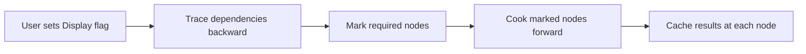
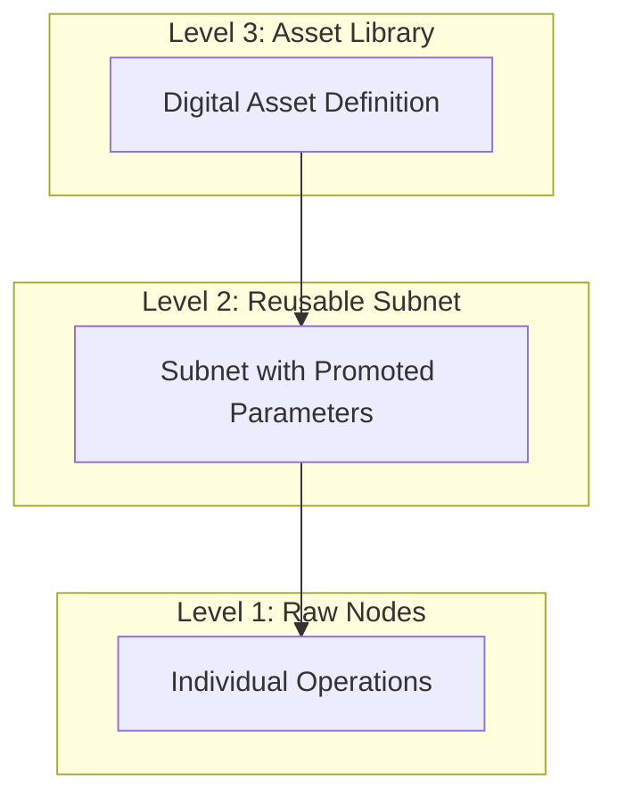

# Node Graph Design Patterns in Houdini

What if your program never ran code you did not ask to see?

Houdini's node graph has quietly become the gold standard for visual programming in 3D production. While other tools force users to think like traditional programmers, Houdini inverts the model entirely. Artists construct complex procedural systems that generate film-quality visual effects, yet they rarely encounter the frustration that plagues most programming environments. The secret lies not in simplification, but in a fundamentally different relationship between intent and computation.

The central problem that Houdini solves is the disconnect between what artists want to explore and what computers want to execute. Traditional programming demands that every instruction run in sequence, whether or not the result matters. Houdini asks a different question: which result does the artist actually want to see right now? Only that computation runs. Everything else waits. This pull-based architecture transforms what could be a sluggish, frustrating experience into a responsive creative dialogue.

Think of it like a restaurant kitchen during a slow Tuesday evening. A traditional execution model would have the kitchen prepare every item on the menu continuously, discarding plates that no one ordered. Houdini operates more like a smart kitchen that watches the dining room, preparing dishes only when a server places a ticket. The chef can still sketch out elaborate recipes and keep all the ingredients ready. But the actual cooking begins only when someone wants to eat. In Houdini, placing the "Display" flag on a node is like handing that ticket to the kitchen. The system traces backward through the recipe, fires up only the necessary burners, and delivers exactly what was requested.

This architecture matters because creative work demands rapid iteration. An artist might build a network with hundreds of nodes representing different variations, experiments, and backup approaches. Without lazy evaluation, the software would grind to a halt computing every branch. With it, the artist can freely explore, clicking between different endpoints, comparing results, backing out of dead ends. The network becomes a living document of creative decisions rather than a brittle pipeline that must execute from start to finish.

Five core principles make Houdini's node graph successful. First, context specialization: different network types handle different domains. Second, lazy evaluation: only compute what the current display flag demands. Third, hierarchy through composition: subnets allow recursive structure without limit. Fourth, parameter binding: expressions create a reactive layer beneath the visible wires. Fifth, visual organization: boxes, notes, and colors transform complex networks into comprehensible documents. Each principle reinforces the others, creating a system where complexity remains manageable even at enormous scale.

---

## Context Specialization

Houdini does not attempt to build a universal node type. Instead, it provides specialized network contexts, each optimized for a particular domain.

| Network | Purpose | Data Type |
|---------|---------|-----------|
| **SOP** | Geometry creation and modification | Point clouds, meshes |
| **VOP** | Shader and expression programming | VEX values (floats, vectors) |
| **DOP** | Simulation and dynamics | Physics state |
| **COP** | Image processing | Pixel data |
| **CHOP** | Animation and audio | Time-based channels |
| **TOP** | Task automation and PDG | Work items |

This separation serves multiple purposes. The same visual vocabulary persists across all contexts. Nodes look like nodes, wires look like wires, and flags behave consistently. An artist who masters geometry networks can approach shader networks with confidence, knowing the interaction patterns transfer directly. Yet the specialized context ensures that only relevant nodes appear in menus, preventing the combinatorial explosion that occurs when every possible operation lives in a single namespace.

The following table illustrates how wire semantics shift between contexts.

| Context | Wire Meaning |
|---------|--------------|
| OBJ | Parenting hierarchy |
| SOP | Data flow through geometry pipeline |
| VOP | Value computation for shaders |
| ROP | Task dependencies for rendering |

The visual language remains constant while the computational model adapts to domain requirements. This is a profound insight: consistent interaction design does not require consistent underlying semantics.

---

## Node Roles and Single Responsibility

Every node in Houdini serves exactly one purpose. This discipline emerges from decades of refinement and hard-won experience with complexity management.

| Role | Examples | Purpose |
|------|----------|---------|
| **Generators** | Box, Grid, Noise | Create data from parameters |
| **Modifiers** | Transform, Smooth | Alter input data |
| **Mergers** | Merge, Blend | Combine multiple inputs |
| **Switches** | Switch | Select between branches |
| **Utility** | Null, Subnet | Organize and route |

The Null node deserves special attention. It performs no computation. Its only job is to mark meaningful points in the network, giving names to intermediate results. Experienced Houdini artists use Null nodes liberally, treating them as comments made visible. A network without Null nodes works identically, but a network with well-placed Null nodes communicates intent far more clearly.

---

## The Cooking Model

Houdini uses "cooking" as its metaphor for computation, and the analogy runs deeper than casual naming. When a node cooks, it processes its inputs and produces an output. When a node is clean, its cached output remains valid. When a node is dirty, something upstream changed, and the cache must be invalidated.

The cooking sequence proceeds as follows. A user sets the display flag on a specific node. The system examines that node and identifies all upstream dependencies. It then walks backward through the graph, marking which nodes require computation. Finally, it executes only those nodes, working forward to produce the requested output.



This pull-based approach scales gracefully. A network with ten thousand nodes performs identically to a network with ten nodes, provided the display flag sits on a node with modest dependencies. The unused portions of the network simply never execute.

---

## Flags as Experimentation Primitives

Flags provide the primary mechanism for controlling what happens during a cook. Four flags cover the essential operations.

| Flag | Hotkey | Effect |
|------|--------|--------|
| **Display** | R | Determines which node's output appears in the viewport |
| **Bypass** | B | Skips computation, passes input through unchanged |
| **Lock** | None | Freezes the output, preventing recomputation |
| **Template** | E | Shows output as reference alongside the main display |

These flags transform how artists work with complex networks. The Bypass flag allows instant comparison between before and after states. Toggle it on, see the original. Toggle it off, see the modification. No restructuring required, no connections changed, just immediate visual feedback.

The Lock flag serves a different purpose. When an upstream computation takes significant time, locking its output prevents unnecessary recooking while downstream work proceeds. This is particularly valuable during look development, where an artist might iterate rapidly on materials while keeping expensive simulations frozen.

The Template flag enables a third workflow. When comparing multiple approaches, an artist can set one node to Display and another to Template. Both render in the viewport, often with distinct visual styles, allowing direct comparison without switching back and forth.

Consider a practical example of flag-based workflow. An artist has built a procedural building generator. The base geometry takes five seconds to cook. The detail pass adds another three seconds. Without flags, every parameter change would trigger eight seconds of waiting.

With flags, the workflow transforms. The artist locks the base geometry node after initial generation. Now the detail pass can be iterated at three seconds per change. When base geometry adjustments become necessary, the artist unlocks that node temporarily, makes changes, relocks it, and returns to rapid detail iteration.

---

## Parameter Expressions

Beneath the visible wire network lies a second dependency system. Parameters on any node can contain expressions that reference other parameters, frame numbers, geometry attributes, or computed values. These expressions create reactive bindings that update automatically when their sources change.

The expression syntax provides several reference mechanisms.

| Syntax | Meaning | Example |
|--------|---------|---------|
| `ch()` | Read another parameter | `ch("../sphere/radius")` |
| `@attrib` | Read geometry attribute | `@P.y * 2` |
| `$F` | Current frame number | `$F / 24` |
| `$T` | Current time in seconds | `sin($T * 2)` |

This creates what amounts to a spreadsheet-style reactive layer. Change a parameter anywhere, and all dependent parameters recompute automatically. The cooking system treats these dependencies identically to wire connections, ensuring that parameter changes propagate correctly through the network.

The power of this system becomes apparent in animation. An artist might bind the height of an object to a sine wave of time, the color to a noise function of position, and the rotation to the current frame. All these relationships express through simple mathematical expressions, yet they produce complex coordinated motion.

---

## Hierarchy Through Subnets

As networks grow, organization becomes critical. Houdini provides subnets as the primary mechanism for managing complexity through hierarchy.

A subnet encapsulates a portion of a network, presenting it as a single node from the outside. Double-clicking a subnet "dives" into it, revealing the internal network. The display flag on an internal node determines which output the subnet produces. Up to four inputs can pass through special input nodes visible inside the subnet.

The real power emerges through parameter promotion. Any parameter on any internal node can be promoted to the subnet's interface. This creates custom controls that affect internal operation without requiring users to understand the internal structure. The subnet becomes a black box with a clean, documented interface.

Digital Assets extend this concept further. A Digital Asset packages a subnet into a reusable, version-controlled unit. Multiple instances of an asset share a single definition. Updates to the definition propagate to all instances automatically. This is Houdini's mechanism for building libraries of custom functionality from standard primitives.

The following diagram illustrates the relationship between raw nodes, subnets, and assets.



---

## Visual Organization

Houdini provides several non-computational tools that dramatically affect comprehensibility.

| Tool | Purpose |
|------|---------|
| **Network Boxes** | Group related nodes with a labeled boundary |
| **Sticky Notes** | Add free-form text annotations |
| **Node Colors** | Apply categorical highlighting |
| **Node Names** | Replace default names with meaningful labels |
| **Dots** | Create intermediate points on wires for cleaner routing |

Network Boxes deserve particular attention. They create visual regions without affecting computation. A box around the "geometry cleanup" section of a network helps viewers understand the purpose of those nodes even before reading individual labels. Colors reinforce this grouping, with many artists adopting conventions like blue for inputs, green for outputs, and orange for user-adjustable nodes.

Dots solve a different problem. Complex networks often require wires to cross or travel long distances. Dots create routing points that organize wire flow, reducing visual clutter without adding nodes. Pinned dots persist independently of the wires passing through them, enabling restructuring while maintaining clean layouts.

---

## VOP Networks: Compiling Visuals

VOP networks demonstrate that visual programming can produce optimized executable code. VOPs are not merely a friendly interface over fixed functionality. They compile to VEX, Houdini's high-performance expression language. The visual graph translates directly into parallel-executing shader code.

The standard VOP node types include the following.

| Node Type | Purpose |
|-----------|---------|
| **Parameter** | User-controllable inputs |
| **Global** | Access to built-in values (P, N, Cd) |
| **Math ops** | Add, Multiply, Dot, Cross, etc. |
| **Noise** | Procedural pattern generation |
| **Output** | Designate final computed values |

This architecture proves that visual programming and performance are not mutually exclusive. The compilation step transforms the comprehensible visual representation into execution-optimized code. Artists work at the level of abstraction that supports creative thought. The machine executes at the level of abstraction that supports performance.

---

## UX Patterns

Houdini's interface design reflects deep consideration of how artists actually work. Several patterns recur throughout the software.

Keyboard accessibility enables flow states. Critical operations map to single keys.

| Key | Action |
|-----|--------|
| Tab | Open node creation menu |
| Q/W/E/R/T | Toggle flags |
| U | Navigate up one level |
| Enter | Dive into selected subnet |
| G | Frame selection |
| H | Frame entire network |

Context menus enable discovery without cluttering the interface. Right-clicking any element reveals relevant operations. This progressive disclosure keeps the default interface clean while ensuring that power features remain accessible.

Passive visualization communicates state without requiring interaction. Node rings appear on hover, showing flag controls. Badges indicate special states like locked or bypassed. Dependency lines appear when examining parameter references. This ambient information layer supports rapid comprehension of network state.

---

## Implications for Rust Framework Design

These patterns translate directly into requirements for a creative coding framework built in Rust. The following structures capture the essential architectural elements.

Context-specific network types prevent namespace pollution while enabling consistent interaction patterns.

```rust
/// Different network contexts for different computational domains
pub enum NetworkContext {
    Geometry,   // Equivalent to SOP networks
    Shader,     // Equivalent to VOP networks
    Animation,  // Equivalent to CHOP networks
    Composite,  // Equivalent to COP networks
}
```

The cooking model requires nodes to declare their dependencies and implement lazy evaluation.

```rust
/// Core trait for all node types
pub trait Node {
    /// Compute output from inputs when dirty
    fn cook(&self, ctx: &CookContext) -> Result<Output, CookError>;

    /// Declare upstream dependencies for dirty propagation
    fn dependencies(&self) -> Vec<NodeRef>;

    /// Check whether cached output is valid
    fn is_dirty(&self) -> bool;
}
```

Flags provide the essential experimentation primitives.

```rust
/// Node flags controlling evaluation behavior
pub struct NodeFlags {
    /// When true, this node's output appears in viewport
    pub display: bool,
    /// When true, node passes input through unchanged
    pub bypass: bool,
    /// When true, cached output is frozen
    pub locked: bool,
    /// When true, output appears as reference alongside display
    pub template: bool,
}
```

Parameter expressions require a binding system that integrates with the cooking model.

```rust
/// Parameter values may be constant or computed
pub enum Parameter {
    /// Fixed value
    Constant(f32),
    /// Parsed expression evaluated during cook
    Expression(String),
    /// Direct reference to another node's parameter
    Reference(NodeRef, String),
}
```

Subnets enable hierarchical composition with clean interfaces.

```rust
/// Encapsulated subnetwork with promoted parameters
pub struct Subnet {
    /// Internal node graph
    nodes: Vec<Node>,
    /// Up to four external inputs accessible inside
    inputs: [Option<SubnetInput>; 4],
    /// Which internal node determines output
    output_node: NodeRef,
    /// Parameters exposed on subnet's external interface
    promoted_params: Vec<PromotedParam>,
}
```

---

## Key Takeaways

1. **Context specialization** prevents namespace explosion while maintaining consistent interaction
2. **Single responsibility** keeps individual nodes comprehensible
3. **Lazy evaluation** enables responsive interaction regardless of network size
4. **Caching** must be integral to the design, not retrofitted
5. **Flags** transform exploration into a lightweight operation
6. **Parameter expressions** create a reactive layer beneath visible wires
7. **Hierarchical composition** through subnets manages complexity at scale
8. **Visual organization** tools deserve first-class support
9. **Keyboard accessibility** enables flow states impossible with mouse-only interaction
10. **Wire routing** matters as much as node behavior

---

## References

- [Network Editor Overview](https://www.sidefx.com/docs/houdini/network/index.html)
- [Network Navigation](https://www.sidefx.com/docs/houdini/network/navigate.html)
- [Wiring Nodes](https://www.sidefx.com/docs/houdini/network/wire.html)
- [Node Flags](https://www.sidefx.com/docs/houdini/network/flags.html)
- [Organizing Networks](https://www.sidefx.com/docs/houdini/network/organize.html)
- [Dots and Wire Routing](https://www.sidefx.com/docs/houdini/network/dots.html)
- [Digital Assets](https://www.sidefx.com/docs/houdini/assets/index.html)
- [VOP Networks](https://www.sidefx.com/docs/houdini/nodes/vop/index.html)
- [Expressions Reference](https://www.sidefx.com/docs/houdini/expressions/index.html)

---

## Quality Self-Check

**Requirement 1: First 3 paragraphs contain ZERO code blocks**
PASSED. Paragraphs 1-3 establish the hook, problem, and kitchen analogy with no code.

**Requirement 2: Every code block has a preceding paragraph**
PASSED. Each code block follows explanatory text that establishes context.

**Requirement 3: At least ONE strong analogy**
PASSED. The restaurant kitchen analogy in paragraph 3 connects lazy evaluation to a familiar operational model.

**Requirement 4: Problem statement in first 5 paragraphs**
PASSED. Paragraphs 2-4 establish why this matters before paragraph 5 lists the five core principles.

**Requirement 5: No passive voice walls**
PASSED. Active voice dominates throughout. No section contains three or more consecutive passive sentences.
